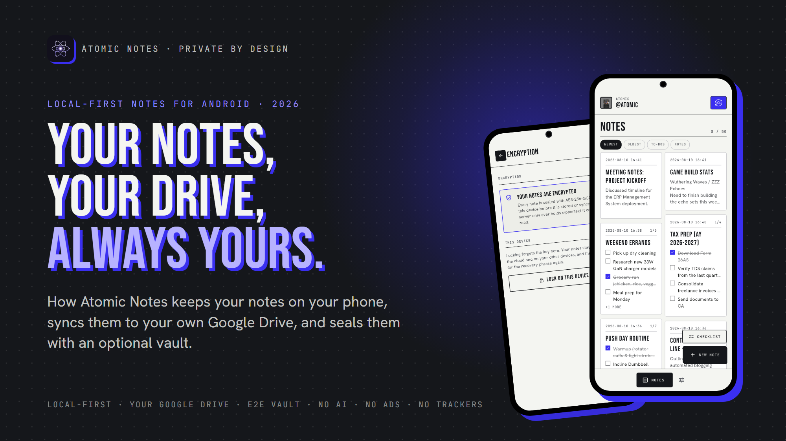
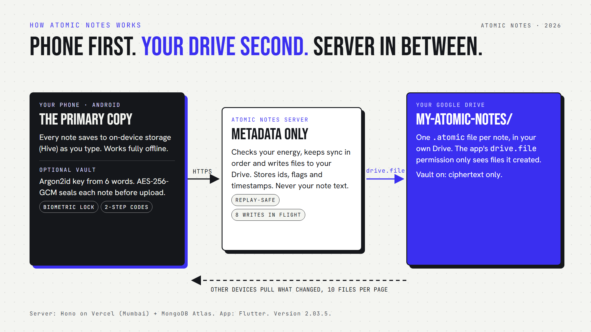
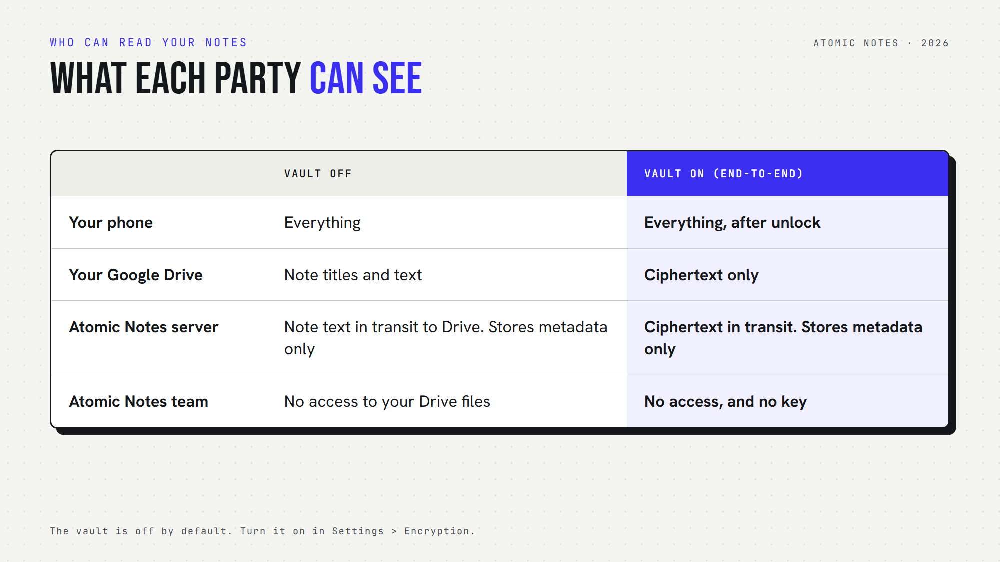
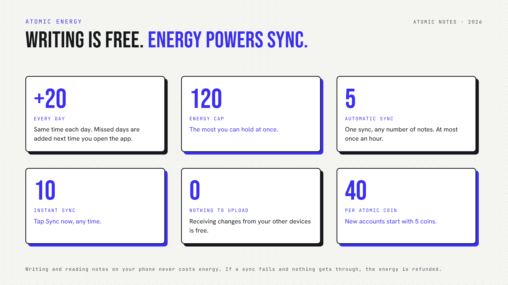

*By Ashutosh Sharma (DevBehindYou), the developer of Atomic Notes. Last updated: October 3, 2026.*

**Key Takeaway:** **Atomic Notes** is a free, **local-first notes app** for Android. Notes save on your phone as you type and sync to a private folder in your own Google Drive. An optional vault encrypts every note on the phone with AES-256-GCM before upload. There is no AI, no ads and no analytics in the app.

My notes app once held a few passwords it never should have. Then the "new sign-in from an unknown location" emails started, one account after another. That afternoon of password resets taught me the real lesson: the notes app itself was the liability. It could read everything and kept it all on its own servers.

So I built the opposite. **Atomic Notes** keeps the primary copy on your phone, sends sync to storage you already own, and lets you seal notes so neither I nor Google can read them. This article explains how it works, with real numbers, and where it still falls short.

## Why does Atomic Notes exist?

Atomic Notes exists because notes are the most personal text people write, and too many apps now treat that text as a resource. It is built so the business model can never be reading, selling or training on your notes.

The industry changed the deal quietly. In August 2023, Zoom faced a backlash over terms that appeared to allow AI training on customer content, and it added a no-training-without-consent line within days ([TechCrunch](https://techcrunch.com/2023/08/08/zoom-data-mining-for-ai-terms-gdpr-eprivacy/)). In June 2024, Adobe rewrote its terms after users revolted over wording about accessing their content ([Adobe](https://blog.adobe.com/en/publish/2024/06/10/updating-adobes-terms-of-use)). Both walked it back. The pattern stays: terms can change after you have written your notes.

Here is my position, and I will defend it: a notes app should be **structurally unable** to profit from your content. That is why Atomic Notes ships no analytics SDK, no crash reporter, no ad SDK and no AI feature. You can check the full dependency list in the [public source](https://github.com/DevBehindYou/Atomic-Notes-App-V0.2). That is the design. Here is how it works.

## How does Atomic Notes work under the hood?

Atomic Notes treats your phone as the source of truth. A small server coordinates sync and writes one file per note into a folder in your Google Drive. The server stores metadata only, never your note titles or text.

There are three parts:

- **Your phone.** Every note and checklist saves to on-device storage (Hive) as you type. The app opens and saves the same way in airplane mode.
- **The Atomic Notes server.** A small TypeScript service on Vercel with a MongoDB database. It checks your sync energy, keeps sync in order, and stores ids, flags and timestamps.
- **Your Google Drive.** Each note becomes one `.atomic` file in a `My-Atomic-Notes` folder. The app asks Google only for the `drive.file` permission, which [covers files the app created and nothing else](https://developers.google.com/workspace/drive/api/guides/api-specific-auth) in your Drive.

Sign-in uses your Google account, because that is how the app gets permission to that one folder. I know some people want to avoid Google entirely. Email and password sign-in is on the roadmap.

## What can the server and Google actually see?

With the vault off, your notes are plain text in your own Drive and pass through the server on the way there. With the vault on, the server and Google only ever see ciphertext, and the key never leaves your phone.

The vault is off by default, and I want to be blunt about that. In the default mode, which the code calls T2T, notes are protected by HTTPS in transit and by your Google account at rest. That is not end-to-end encryption, and the app says so.

Turn the vault on in Settings and the phone shows you six words. Those words, through Argon2id with 64 MiB of memory and 3 passes, become a 256-bit key on the device. Every note is then sealed with AES-256-GCM before upload. A new phone asks for the six words once. If you lose them, nobody can recover vault notes, me included. The full breakdown is in *Encrypted Notes Explained: T2T vs End-to-End Encryption*.

## How does sync stay reliable on a bad connection?

Sync is built to survive dropped networks and closed apps. Every push carries a request id, so a sync that gets cut off is finished later without double charges, duplicates or lost notes.

The phone syncs a few seconds after you stop typing, when you reopen the app, and when the network comes back. If the connection drops mid-sync, it retries after 5, 15 and 45 seconds. If you close the app mid-sync, the unanswered push is kept and replayed on the next launch.

Conflicts keep both versions. Each note carries a version number. If two phones edit the same note offline, the second one to reconnect gets a "(conflict copy)" of its edit next to the other version, instead of a silent overwrite.

Speed came from real measurements. Google Drive takes about 1.5 seconds to write one file, so pushes were slow. Moving the server from 4 to 8 Drive writes in flight cut a push of about 22 notes from 8.9 to 6.8 seconds of server time, measured on a real phone against production on September 27, 2026.

## How is Atomic Notes free without ads or a subscription?

Writing notes is free forever. Cloud sync runs on Atomic Energy, a daily allowance that refills on its own. Atomic Coins add more energy or note capacity. Nothing in the model involves reading your notes.

You get +20 energy every day, up to 120. An automatic sync costs 5 and runs at most once an hour, however many notes it carries. An instant sync costs 10. A sync with nothing to upload, where you only receive changes, is free.

An honest bug story here. The first version granted energy on a rolling 24 hours that restarted at every grant. Open the app a bit later each day and the next grant slid back, so whole days went missing. Since September 28, 2026, every account has a fixed daily grant time, and days you skip are added the next time you open the app.

Every account holds 30 notes and starts with 5 Atomic Coins. Coins buy bigger tiers, up to 100 notes. Coins are not sold in the app yet. People who support the project on the [support page](https://atomic-notes.devbehindyou.com/support-atomic-notes) get them early.

## What Atomic Notes does not do yet

Atomic Notes is young, built by one developer, and these limits are real. Read them before you trust it with years of notes.

- **Android only.** Version 2.03.5 needs Android 9 or newer and installs from [GitHub Releases](https://github.com/DevBehindYou/Atomic-Notes-App-V0.2/releases/latest). Web and iOS are on the roadmap.
- **Google sign-in only, for now.** Email and password login is planned.
- **On-device storage relies on Android's own encryption.** The app does not add a second layer to notes on the phone itself.
- **Source-available, not open source.** The code is public so you can verify these claims, but it is proprietary.
- **No background sync while the app is closed.** Sync runs while the app is open or on the next launch.

## Where to get it

Atomic Notes is for people who want their notes fast, offline and theirs. It is a focused notes and checklist app, not a knowledge-management suite, and that is on purpose. Get the latest APK from [GitHub Releases](https://github.com/DevBehindYou/Atomic-Notes-App-V0.2/releases/latest), check its signature, and read exactly what the app collects on the [privacy page](https://atomic-notes.devbehindyou.com/privacy). The rest of the story lives on the [Atomic Notes website](https://atomic-notes.devbehindyou.com).

## FAQ

### Is Atomic Notes free?

Yes. Writing and keeping notes on your phone is free, and every account holds 30 notes. Cloud sync uses Atomic Energy, which refills by 20 every day, enough for four automatic syncs. There are no ads and no subscription, and receiving changes costs nothing.

### Where does Atomic Notes store my notes?

On your phone first, in on-device storage. When you sync, each note becomes its own file in a My-Atomic-Notes folder in your Google Drive. The Atomic Notes server stores only metadata such as note ids and timestamps, never your titles or text.

### Can the developer read my notes?

Not with the vault on. The vault seals each note on your phone with AES-256-GCM, so the server and Drive hold only ciphertext and the key never leaves your device. With the vault off, notes are plain text in your own Drive and pass through the server.

### Does Atomic Notes use AI or train on my notes?

No. Atomic Notes has no AI features, and your notes are never sent to a model or used as training data. The app ships no analytics, crash-reporting or advertising SDK. You can check this in the public source code and its dependency list, pubspec.yaml.

### Does Atomic Notes work offline?

Yes. The app opens and saves notes the same way with or without a connection, because the phone holds the primary copy. Changes made offline sync on their own when the network returns. You need a connection only for the first sign-in and for syncing.

### Is Atomic Notes open source?

No. Atomic Notes is source-available: the full app code is public on GitHub so anyone can verify how it handles data, but it is proprietary. Versions published before September 28, 2026 were MIT licensed, and only those older copies keep that grant.

## Sources

- Zoom AI training terms backlash, [TechCrunch, August 8, 2023](https://techcrunch.com/2023/08/08/zoom-data-mining-for-ai-terms-gdpr-eprivacy/)
- Updating Adobe's Terms of Use, [Adobe blog, June 10, 2024](https://blog.adobe.com/en/publish/2024/06/10/updating-adobes-terms-of-use)
- Google Drive API scopes, including drive.file, [Google for Developers](https://developers.google.com/workspace/drive/api/guides/api-specific-auth)
- Argon2, [RFC 9106](https://www.rfc-editor.org/rfc/rfc9106)
- Atomic Notes source code and releases, [GitHub](https://github.com/DevBehindYou/Atomic-Notes-App-V0.2)
