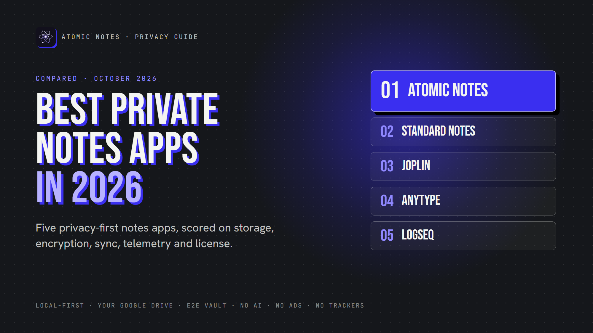
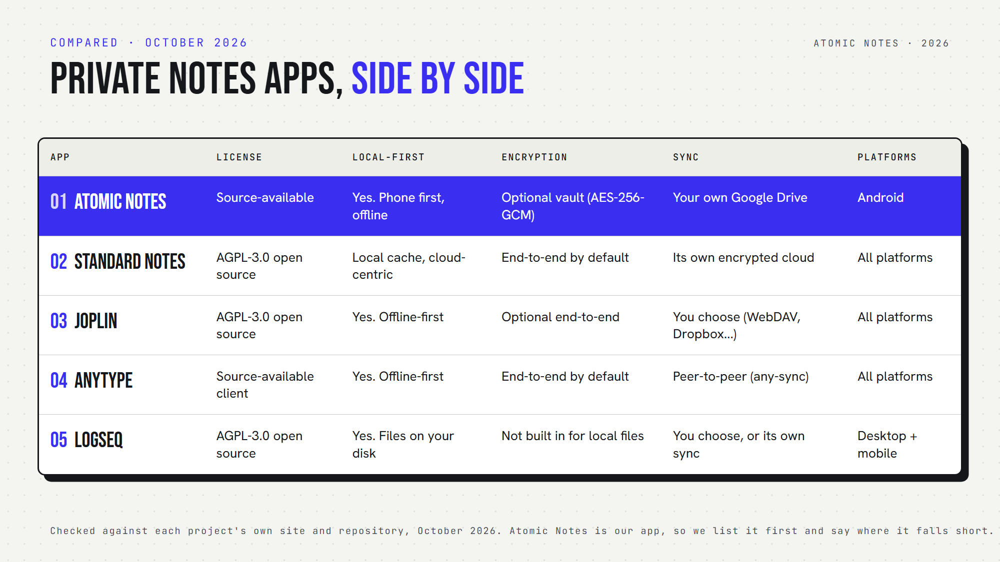

*By Ashutosh Sharma (DevBehindYou), the developer of Atomic Notes. Last updated: October 3, 2026.*

**Key Takeaway:** The best **private notes app** keeps your notes on your device, encrypts them so the operator cannot read them, and sends nothing about you to anyone. In 2026, the strongest picks are Atomic Notes, Standard Notes, Joplin, Anytype and Logseq. Each wins on different trade-offs, so match the app to what you store.

Every notes app says it respects your privacy. The marketing page is not the product. An app can promise encryption and still ship your writing to an analytics service, and from the outside you would never know.

So this list scores five apps on the same six checks. A disclosure up front: I build Atomic Notes, which is why it sits at number one. I hold it to the same checklist, and I name its weak spots as plainly as everyone else's.

## How do you judge whether a notes app is private?

Six things decide whether a notes app is private: where notes are stored, who holds the encryption key, how sync works, what the app reports about you, the license, and how the company makes money. Encryption alone is one line.

- **Storage.** Is the primary copy on your device, or only on a server?
- **Encryption.** Can the operator read your notes at rest? End-to-end means no.
- **Sync.** What does the sync server see, and can you choose where data goes?
- **Telemetry.** Does the app ship analytics, crash reporters or ad SDKs?
- **License.** Can you read the code and check the claims?
- **Business model.** Does the company earn more by protecting your data, or by using it?

A quick test you can run today: put your phone in airplane mode, open your notes app cold, and write a line. If it stalls, the server was the real home of your notes all along.

## The 5 best private notes apps in 2026

These five take privacy seriously, and each makes a different trade-off between control, convenience and openness. They are ranked by how well they fit someone who wants private notes on a phone.

### 1. Atomic Notes: local-first, synced to your own Google Drive

**Atomic Notes** is a free Android app that saves every note on the phone first and syncs to a `My-Atomic-Notes` folder in your own Google Drive. Its server stores metadata only (ids, flags, timestamps) and never your note text.

Encryption is opt-in. Turn on the vault and six words become a key on your phone through Argon2id, then every note is sealed with AES-256-GCM before upload, so the server and Google hold ciphertext. Conflicting offline edits keep both versions as a "(conflict copy)" instead of overwriting. There is no AI feature and no analytics, crash or ad SDK.

The honest limits: it is Android only, sign-in is Google only for now, the vault is off by default, and sync runs on a free daily allowance (+20 energy a day, enough for four automatic syncs). The code is public on [GitHub](https://github.com/DevBehindYou/Atomic-Notes-App-V0.2) but source-available, not open source.

**Best for:** Android users who want offline-first notes stored in storage they already own.

### 2. Standard Notes: end-to-end encrypted by default

**Standard Notes** encrypts every note on your device before upload, with no switch to forget. Its code is open source under AGPL-3.0, and it was acquired by Proton, the company behind Proton Mail, in April 2024 ([TechCrunch](https://techcrunch.com/2024/04/10/proton-standard-notes/)).

Its [free plan](https://standardnotes.com/plans) includes end-to-end encryption, sync across unlimited devices and offline access for plain-text notes. Richer editors sit behind a paid plan. Sync goes through its own encrypted cloud, though the server can be self-hosted.

**Best for:** people who want encryption on by default and a privacy company behind it.

### 3. Joplin: Markdown, and you pick the sync backend

**Joplin** stores notes as Markdown, works offline-first, and syncs through the backend you choose: Joplin Cloud, Nextcloud, WebDAV, Dropbox or OneDrive. End-to-end encryption is available as an option.

Joplin moved to the AGPL-3.0 license in December 2022 ([Joplin](https://joplinapp.org/news/20221221-agpl/)). The trade-off is setup. Sync and encryption take more configuration than a consumer app, and the interface is built for people who like control.

**Best for:** technical users who want to own the whole stack, including the server.

### 4. Anytype: a private workspace, source-available like Atomic Notes

**Anytype** is a local-first, Notion-style workspace with databases and linked objects. Data is end-to-end encrypted and syncs peer to peer through its any-sync protocol.

Read the license closely. The any-sync protocol is MIT licensed, but the apps use the Any Source Available License, which is not an OSI-approved open-source license ([anytype-ts](https://github.com/anyproto/anytype-ts)). You can read the code, with limits on how you use it. That is the same category Atomic Notes is in.

**Best for:** people who want a rich, encrypted workspace rather than a simple notes app.

### 5. Logseq: plain files for networked thinking

**Logseq** is an outliner for linked notes, open source under AGPL-3.0, and its classic version stores everything as Markdown files on your own disk. It does not encrypt those local files itself, so privacy rests on your device and your sync choice.

The project is mid-transition. Logseq 2.0, the new database version, entered beta in July 2026, and the team warns that data loss is possible and recommends regular backups ([Logseq releases](https://github.com/logseq/logseq/releases)).

**Best for:** researchers and writers who think in linked outlines and want plain files.

## How do these private notes apps compare side by side?

Three of the five are OSI open source, two are source-available, and only Standard Notes and Anytype encrypt everything by default. Atomic Notes syncs into your own Google Drive with no setup, and Joplin can sync to cloud storage you already use once you configure it.

- **Atomic Notes:** source-available, local-first, optional AES-256-GCM vault, syncs to your Google Drive, Android.
- **Standard Notes:** AGPL-3.0, end-to-end by default, its own encrypted cloud, all platforms.
- **Joplin:** AGPL-3.0, offline-first, optional end-to-end, sync backend of your choice, all platforms.
- **Anytype:** source-available apps (MIT sync protocol), end-to-end by default, peer to peer, all platforms.
- **Logseq:** AGPL-3.0, plain local files, no built-in encryption for local files, desktop and mobile.

## Which private notes app should you choose?

Pick by what you store and how much setup you accept. If you want offline-first notes on Android synced to your own Drive, choose Atomic Notes. For encryption with zero decisions, choose Standard Notes.

- **Choose Atomic Notes** if you write on Android, want notes that work in airplane mode, and like sync landing in your own Google Drive.
- **Choose Standard Notes** if you want every note encrypted by default on every platform, with no settings to get wrong.
- **Choose Joplin** if you want Markdown and your own server.
- **Choose Anytype** if you want a Notion-like workspace and accept a source-available client.
- **Choose Logseq** if you think in linked outlines and you keep good backups through its 2.0 transition.

Whichever you pick, turn on encryption for anything you would not email to the company behind the app. Privacy is the sum of storage, encryption, sync, telemetry, license and incentives. A single green checkmark never covers all six.

The best private notes app is the one whose trade-offs match your notes. I put Atomic Notes first because local-first storage in your own Drive, an optional vault and zero telemetry fit how most people write on a phone. If you need iOS, every-note encryption by default or self-hosting today, the others serve you better right now. Try the airplane-mode test on whatever you use.

## FAQ

### What is the most private notes app in 2026?

It depends on your platform and setup tolerance. For Android with notes stored in your own Google Drive, Atomic Notes. For encryption on by default across every platform, Standard Notes. For full control with your own server, Joplin. All three keep tracking out of your notes.

### Is Atomic Notes open source?

No. Atomic Notes is source-available: the full app code is public on GitHub so anyone can check how it handles data, but it is proprietary. Anytype's apps follow a similar model. Standard Notes, Joplin and Logseq are open source under AGPL-3.0.

### Which notes apps encrypt notes by default?

Standard Notes and Anytype encrypt everything end to end by default. Joplin and Atomic Notes offer end-to-end encryption as an option you turn on. Logseq does not encrypt its local files itself, so protection depends on your device and your chosen sync method.

### Do private notes apps work offline?

Most do. Atomic Notes, Joplin, Anytype and Logseq keep the primary copy on your device and work fully offline. Standard Notes keeps a local copy and offers offline access, then syncs through its cloud. Test any app by opening it in airplane mode.

### Is a source-available app less private than open source?

Not automatically. Both let you read the code and verify privacy claims. The difference is legal: open source lets you reuse and redistribute the code, while source-available restricts that. For checking what an app does with your notes, readable code is what matters.

### Can I move my notes between these apps?

Joplin and Logseq use Markdown, so export is easy. Standard Notes exports plain text or encrypted backups. Anytype exports Markdown and other formats. Atomic Notes stores each note as its own file in your Drive, and a full export feature is not built yet.

## Sources

- Proton acquires Standard Notes, [TechCrunch, April 10, 2024](https://techcrunch.com/2024/04/10/proton-standard-notes/)
- Standard Notes plans, [standardnotes.com](https://standardnotes.com/plans)
- Joplin moves to AGPL-3.0, [Joplin news, December 2022](https://joplinapp.org/news/20221221-agpl/)
- Anytype desktop client and license, [anyproto/anytype-ts](https://github.com/anyproto/anytype-ts)
- Logseq 2.0 beta release notes, [logseq/logseq releases](https://github.com/logseq/logseq/releases)
- Atomic Notes source code and releases, [GitHub](https://github.com/DevBehindYou/Atomic-Notes-App-V0.2)
