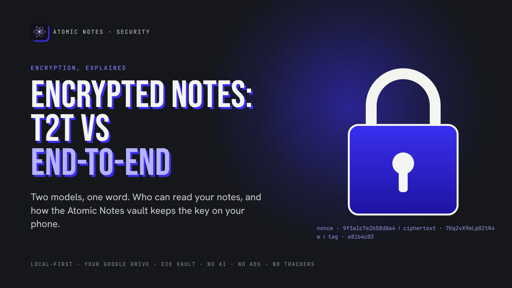
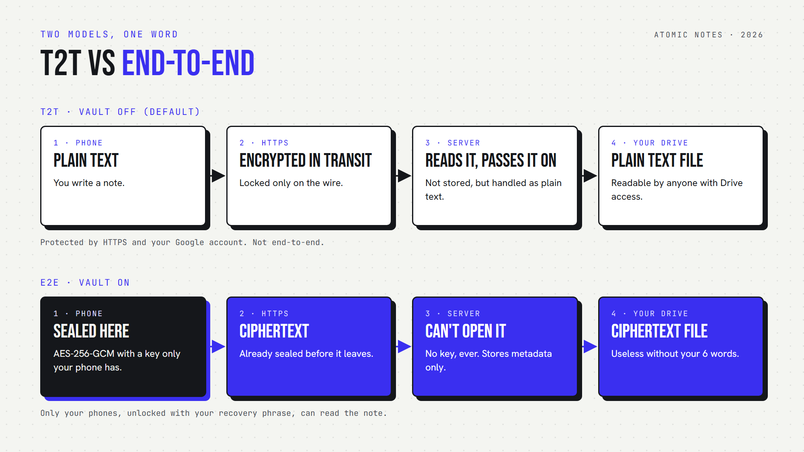
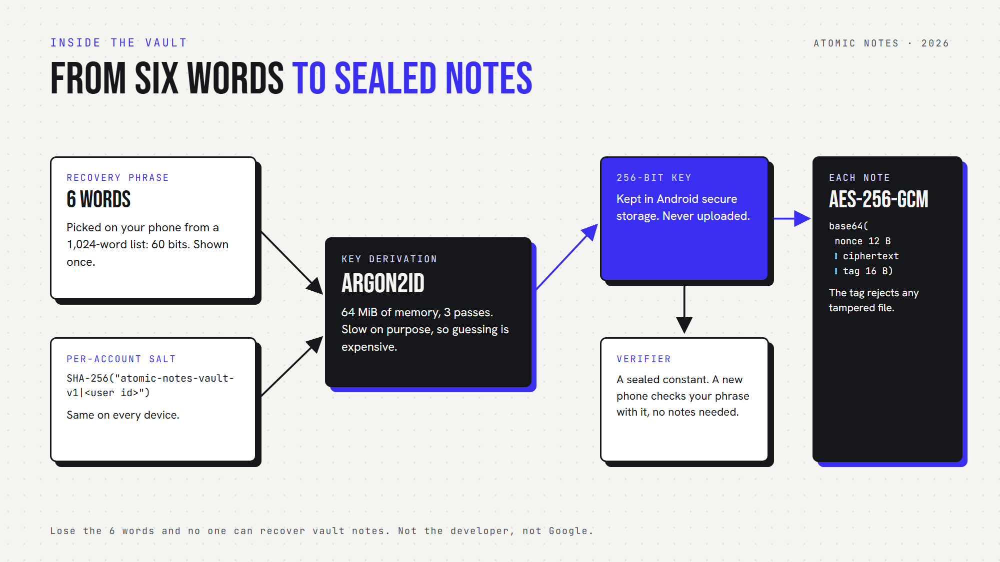

*By Ashutosh Sharma (DevBehindYou), the developer of Atomic Notes. Last updated: October 3, 2026.*

**Key Takeaway:** "Encrypted" can mean two opposite things. **Transport encryption** (T2T) locks notes only while they travel, so whoever stores them can read them. **End-to-end encryption** seals notes on your device with a key only you hold, so the storage provider sees ciphertext. Atomic Notes offers both, and end-to-end is opt-in.

Two apps can print "encrypted" on the same download page and make opposite promises. In one, the company can read every word you write. In the other, it could hand over its whole database and nothing would be readable without a key only you hold.

The difference decides who, besides you, can read your notes. This article separates the two models in plain language, shows how end-to-end encryption works under the hood, and explains exactly which model Atomic Notes uses, and when.

## What does "encrypted" actually mean for a notes app?

"Encrypted" covers three different promises: encryption in transit, encryption at rest, and end-to-end encryption. Only the last one stops the service that stores your notes from reading them.

- **In transit.** HTTPS locks data while it travels between your phone and a server. It stops someone on the same wifi, nothing more.
- **At rest.** Data is scrambled on the provider's disks. The provider holds the keys, so its running systems still read your notes in the clear.
- **End to end.** Notes are sealed on your device and opened only on your devices. The provider stores bytes it cannot open.

Here is the question that cuts through the marketing: *can you read my notes?* If the honest answer is yes, it is transport and at-rest protection. Useful, but not private.

## What does T2T protect in Atomic Notes, and what not?

T2T is the default mode in Atomic Notes: notes travel over HTTPS and are stored as plain text in your own Google Drive. That keeps strangers out, but your notes stay readable to anyone who can open that Drive.



In T2T mode, the phone sends your note over HTTPS to the Atomic Notes server. The server does not store note content. It passes it straight to a `.atomic` file in the `My-Atomic-Notes` folder of your Drive. On the way, it handles the text in the clear.

So I state it plainly: in T2T mode, the server sees note text in transit, and the file in your Drive is readable by you, by Google, and by anyone who gets into your Google account. For a shopping list, that is fine. For passwords or health notes, it is not, and that is what the vault is for.

## How does end-to-end encryption work in the Atomic Notes vault?

The vault turns six words into a 256-bit key on your phone with Argon2id, then seals each note with AES-256-GCM before it leaves the device. The key is never uploaded, so the server and Drive store only ciphertext.



There are three ingredients:

- **A recovery phrase.** Six words picked on your phone from a 1,024-word list, which is 60 bits of entropy. You see it once and write it down.
- **A slow key derivation.** Argon2id with 64 MiB of memory and 3 passes turns the phrase into the key. Argon2 won the 2015 Password Hashing Competition and is specified in [RFC 9106](https://www.rfc-editor.org/rfc/rfc9106). The [OWASP Password Storage Cheat Sheet](https://cheatsheetseries.owasp.org/cheatsheets/Password_Storage_Cheat_Sheet.html) recommends it.
- **An authenticated cipher.** AES-256-GCM ([NIST SP 800-38D](https://csrc.nist.gov/pubs/sp/800/38/d/final)) hides the content and adds a tag, so a tampered file fails to open instead of decrypting into garbage.

This is the real shape of the code, trimmed from `lib/security/vault_crypto.dart`:

```dart
// Same phrase + same account = same key on every device. No key is uploaded.
final salt = await Sha256().hash(utf8.encode('atomic-notes-vault-v1|$userId'));

final key = await Argon2id(
  memory: 65536,   // KiB, 64 MiB: slow on purpose
  iterations: 3,
  parallelism: 1,
  hashLength: 32,  // 256-bit key
).deriveKeyFromPassword(password: phrase, nonce: salt.bytes);

// Each note: base64( nonce 12 B ++ ciphertext ++ tag 16 B )
final box = await AesGcm.with256bits().encrypt(noteBytes, secretKey: key);
final sealed = base64Encode(box.concatenation());
```

The server keeps a **verifier**, a known constant sealed with your key. A new phone checks the six words by trying to open it, so a wrong phrase is rejected without touching any note. The derived key itself is kept in Android's secure storage on the phone.

## What does end-to-end encryption cost you?

End-to-end encryption moves responsibility to you. Lose the six words and nobody can recover vault notes, not the developer, not Google. A server that cannot read notes also cannot search them for you.

The recovery phrase is the whole design, so there is no support desk reset. Atomic Notes shows the phrase once and asks you to confirm it before turning the vault on. Write it on paper. A password manager also works, as long as it is not the same notes app.

There is a first-hand lesson in how this got built. An early vault design wrapped a random key, and a second phone could end up with a different key than the first. The current design derives the key deterministically from the phrase and a per-account salt, so every device reaches the same notes with no key to keep in sync.

Two smaller costs. Unlocking takes a moment of computation, because Argon2id is slow on purpose. And notes on the phone itself rely on Android's device encryption. The app does not add a second layer there.

## Which model do you actually need?

Match the model to what you store. T2T is fine for lists and drafts you would not mind your storage provider seeing. Turn on end-to-end encryption for passwords, health, money and anything you would never email to a company.

- **Keep T2T** for groceries, reminders, public links and quick drafts.
- **Turn on the vault** for credentials, recovery codes, medical notes, financial details and private writing.

In Atomic Notes, the vault is a setting: Settings, then Encryption. Notes written while the vault is off or locked are converted to vault notes when you unlock, so nothing is left behind. And **Lock on this device** forgets the key on one phone while your notes stay encrypted everywhere else.

My view, after building both modes: the word "encrypted" should never appear without the word "who". An app that cannot tell you who holds the key is asking for trust it has not earned. The full picture of how Atomic Notes is built, from local-first storage to its no-tracking promise, is in *Atomic Notes: Local-First and Private by Design*, and the vault code is public on [GitHub](https://github.com/DevBehindYou/Atomic-Notes-App-V0.2).

## FAQ

### What is the difference between T2T and end-to-end encryption?

T2T, or transport encryption, protects notes only while they travel, so whoever stores them can read them. End-to-end encryption seals notes on your device with a key only you hold, so the storage provider sees ciphertext. Only end-to-end stops the provider from reading your notes.

### Are Atomic Notes notes encrypted by default?

No. By default, Atomic Notes uses T2T: notes travel over HTTPS and are stored as plain text in your own Google Drive. End-to-end encryption is opt-in. Turn on the vault in Settings, then Encryption, and every note is sealed on your phone before upload.

### What happens if I lose my recovery phrase?

Notes on a phone that is still unlocked stay readable there. But no one can decrypt your vault notes on a new device without the six words, because the key is derived from them on your phone and never uploaded. Write the phrase down and keep it safe.

### Can Google read my encrypted notes in Drive?

Not vault notes. With the vault on, each file in your Drive holds only AES-256-GCM ciphertext, and the key never leaves your phone. With the vault off, the files are plain text, so anyone with access to your Google account, including Google, could read them.

### Why does Atomic Notes use Argon2id?

Argon2id is a memory-hard key derivation function. It makes every guess at your phrase cost real memory and time, which slows brute-force attacks. It won the 2015 Password Hashing Competition, is specified in RFC 9106, and OWASP recommends it for deriving keys from secrets.

### Is end-to-end encryption slower?

Barely, for notes. Sealing a note with AES-256-GCM is fast. The noticeable cost is unlocking: Argon2id is slow on purpose, so opening the vault on a new phone takes a moment. After that, writing and reading feel the same as without the vault.

## Sources

- Argon2 memory-hard function, [RFC 9106](https://www.rfc-editor.org/rfc/rfc9106)
- Password Storage Cheat Sheet, [OWASP](https://cheatsheetseries.owasp.org/cheatsheets/Password_Storage_Cheat_Sheet.html)
- Galois/Counter Mode (GCM), [NIST SP 800-38D](https://csrc.nist.gov/pubs/sp/800/38/d/final)
- Advanced Encryption Standard, [NIST FIPS 197](https://csrc.nist.gov/pubs/fips/197/final)
- Atomic Notes vault source code, [GitHub](https://github.com/DevBehindYou/Atomic-Notes-App-V0.2)
