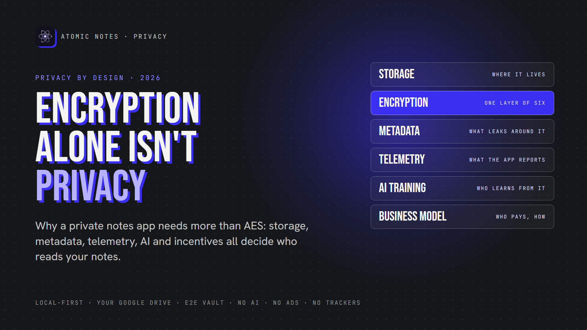
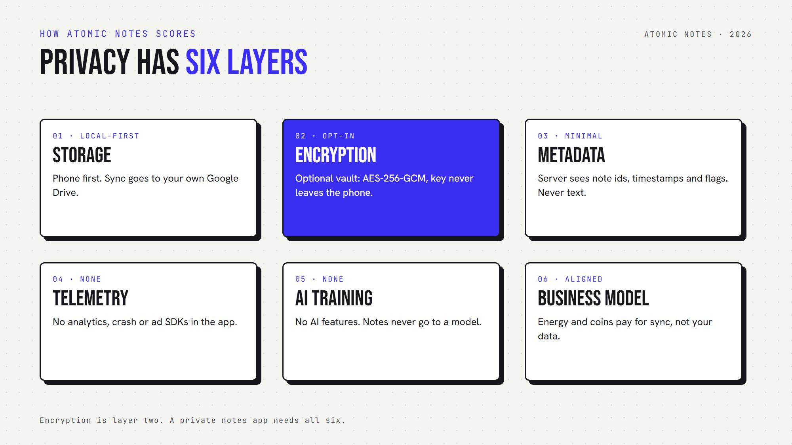

*By Ashutosh Sharma (DevBehindYou), the developer of Atomic Notes. Last updated: October 3, 2026.*

**Key Takeaway:** A **private notes app** needs more than encryption. Real notes privacy depends on six things: where notes live, how they are encrypted, what metadata leaks, what the app reports about you, whether AI reads your notes, and how the company makes money. Encryption covers only one of those six, and a private notes app needs all of them.

Every encrypted notes app on the market waves the same flag: "We use AES-256." It sounds like a private notes app. It also tells you surprisingly little.

Encryption answers one question: can someone read your note while it sits on a server? That matters. But a private notes app has to answer five more questions, and most marketing pages skip all of them.

I build Atomic Notes, a private notes app for Android, so I think about this every day. Let me walk you through the six layers of notes privacy, and how to check any private notes app yourself.

## Why isn't encryption enough for a private notes app?

Encryption protects the content of a note. A private notes app also has to protect everything around that content: your habits, your metadata, your device, and the company's reasons for keeping your data.

Think of a locked diary. The lock works, but the shop logs every time you open it and sells the list of dates. Your words stay secret. Your life does not.

That's the gap between an encrypted notes app and a private notes app. An encrypted notes app can still track you, profile you and sell what it learns. So let's go layer by layer.

## Layer 1: Where does a private notes app keep your notes?

A private notes app should keep the primary copy of your notes on your own device. If the only copy lives on a company server, your notes privacy depends on that company forever.

Most cloud apps treat your phone as a viewer for data that lives somewhere else. A local first design flips that. Your phone holds the real copy, and any cloud copy just helps you sync.

In Atomic Notes, every note saves to the phone as you type. When you sync, each note becomes a file in a folder in your own Google Drive. Our server keeps only metadata. That's privacy by design at the storage layer: we can't leak what we never store.

## Layer 2: Does your private notes app use end to end encryption?

End to end encryption means your device seals the note and only your devices can open it. Anything less, and the provider holds a key it can use.

Here's the honest bit about the typical encrypted notes app. Plenty of apps that market themselves as a private notes app encrypt "in transit" and "at rest" and call it a day. The provider still holds the keys. That's not real notes privacy.

The Atomic Notes vault uses end to end encryption. Six words you write down become a key on your phone, and AES-256-GCM seals each note before upload. The vault is opt-in, though, and off by default.

## Layer 3: What metadata leaks around your notes?

Metadata is data about your data: when you write, how often, how many notes you keep. Even a private notes app with strong encryption usually exposes some of it.

End to end encryption hides what a note says. It rarely hides when you wrote it. Even in a private notes app, the server that syncs your notes has to know which note changed and when.

A private notes app should keep this small, and Atomic Notes does. The server sees note ids, timestamps, and flags like "pinned" or "deleted". It never sees or stores titles or text. Data minimization is part of privacy by design, and it applies to metadata too.

## Layer 4: What does the app report about you?

Telemetry is the usage data an app sends home: screens, taps, crashes, device details. A private notes app should send none of it.

This layer trips up many apps that call themselves a private notes app. In 2023, the FTC fined GoodRx $1.5 million for passing users' health information to advertising platforms through tracking code. The content wasn't "breached". The tracking was the leak.

Atomic Notes ships no analytics SDK, no crash reporter and no advertising SDK. You can check the dependency list in the public code. Strong notes privacy starts with a private notes app that simply doesn't watch you.

## Layer 5: Is anyone training AI on your notes?

Your notes might be the most personal text you write. A private notes app should never feed that text to an AI model, for training or for "smart" features.

Zoom faced a backlash in 2023 over terms that seemed to allow AI training on customer content. Adobe rewrote its terms in 2024 after users revolted over content access. Both backed down, but the lesson stuck: terms can change after you've already written your notes.

Atomic Notes is a private notes app with no AI features. Your notes never go to a model.

## Layer 6: Who pays, and how?

A business model is a notes privacy promise in disguise. If an app earns money from your data, it has a reason to collect more of it. A private notes app should earn money in a way that never needs your notes.

"Free" often means ads, and ads mean tracking. Subscriptions are cleaner, but they can lock your own notes behind a paywall.

Atomic Notes keeps writing free. Cloud sync runs on a free daily energy allowance, and optional coins add more. Supporters get coins early. Nothing in that loop needs to look at your notes, which is privacy by design applied to money.

## How does Atomic Notes score on all six layers?

Atomic Notes is a private notes app built so all six layers point the same way: local first storage, an optional end to end encryption vault, minimal metadata, zero telemetry, no AI, and a business model that doesn't touch your notes. That's privacy by design, top to bottom.

Here's the scorecard, honestly:

- **Storage:** your phone first, your own Drive second.
- **Encryption:** an opt-in AES-256-GCM vault, zero knowledge on the server.
- **Metadata:** ids, timestamps and flags only.
- **Telemetry:** none in the app.
- **AI training:** none. No AI features at all.
- **Business model:** energy and coins for sync convenience.

And the limits: Atomic Notes is Android only, sign-in needs a Google account for now, and the vault is off until you turn it on. A private notes app should show you its weak spots too.

## A quick checklist before you trust a private notes app

Before you move your notes anywhere, ask six questions. If a private notes app can't answer one clearly, treat that as your answer.

1. Does the primary copy of my notes live on my device?
2. Is the encryption end to end, and who holds the key?
3. What metadata does the server see?
4. Does the app ship analytics, crash or ad SDKs?
5. Will my notes ever train an AI model?
6. How does the company make money?

An encrypted notes app that answers all six well earns your trust. One that only says "AES-256" hasn't earned it yet.

So here's my take: encryption is the lock, but privacy is the whole house. Pick a private notes app built on privacy by design, and check the code if you can. Atomic Notes 2.03.5 for Android is on GitHub Releases, and its code is public for you to read.

## FAQ

### Is an encrypted notes app automatically private?

No. An encrypted notes app protects note content, but it can still track you with analytics, leak metadata, train AI on your writing or earn money from your data. Real notes privacy needs local storage, end to end encryption, zero telemetry and an honest business model.

### What is the difference between encryption and end to end encryption?

Regular encryption often protects data in transit or on a server, but the provider keeps the keys. End to end encryption seals notes on your device with a key only you hold. Only that model stops the provider from reading your notes.

### What does privacy by design mean for a private notes app?

Privacy by design means the app protects you through its architecture, not just its policy. That looks like storing notes on your device, collecting minimal metadata, shipping no trackers and choosing a business model that never needs your notes.

### Does Atomic Notes collect any data?

The Atomic Notes server keeps what sync needs: your account email, note ids, timestamps, flags and energy balance. It never stores note titles or text. As a private notes app, it ships no analytics, crash-reporting or advertising SDK, and it has no AI features.

## Sources

- [FTC enforcement action against GoodRx, February 2023](https://www.ftc.gov/news-events/news/press-releases/2023/02/ftc-enforcement-action-bar-goodrx-sharing-consumers-sensitive-health-info-advertising)
- [Zoom's AI training terms, TechCrunch, August 8, 2023](https://techcrunch.com/2023/08/08/zoom-data-mining-for-ai-terms-gdpr-eprivacy/)
- [Updating Adobe's Terms of Use, Adobe, June 10, 2024](https://blog.adobe.com/en/publish/2024/06/10/updating-adobes-terms-of-use)
- [Atomic Notes source code and releases](https://github.com/DevBehindYou/Atomic-Notes-App-V0.2)
