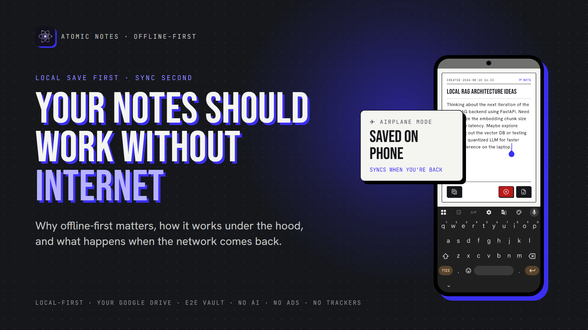
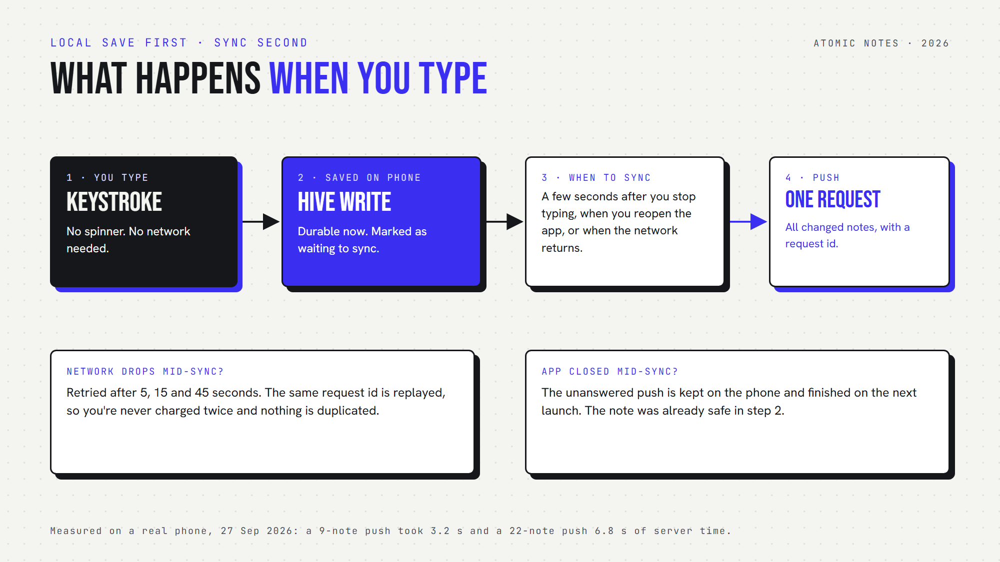

*By Ashutosh Sharma (DevBehindYou), the developer of Atomic Notes. Last updated: October 3, 2026.*

**Key Takeaway:** An **offline notes app** saves every note on your device the moment you type, with or without a connection, and syncs to the cloud later. The rule is local save first, cloud sync second. It keeps capture working on planes and in dead zones, and it keeps your notes readable during cloud outages.

The idea arrives on a flight, in an elevator, or in a basement meeting room with one bar of signal. You open your notes app, and it spins, waiting for a server it cannot reach. By the time the connection returns, the thought is gone.

An **offline notes app** never puts you there. It treats the network as a bonus, not a requirement. This article covers what offline really means, how it works under the hood, and what happens when the network comes back, using Atomic Notes as the worked example.

## What does "offline" really mean for a notes app?

A true offline notes app stores every note on the device, lets you create and edit anything with no network, and uses the cloud only to copy notes between devices later. Reading cached notes offline is not the same thing.

Plenty of apps half-deliver. They show recent notes offline but gray out the editor, or refuse to create a note until the server answers. That is a cloud app with a cache.

The test takes ten seconds. Turn on airplane mode, open the app cold, write a new note and edit an old one. If both work instantly, the app is offline-first. If anything stalls, your notes were only ever visiting your phone.

## How does an offline-first notes app work under the hood?

The app writes every change to a database on the phone first, marks it as waiting to sync, and only then thinks about the network. Sync is a separate background step that can fail without losing anything.

In Atomic Notes, the on-device database is Hive. A keystroke lands there in milliseconds and needs no network at all. The note is now durable, even if the battery dies the next second.

Sync then follows its own schedule. The app pushes changes a few seconds after you stop typing, when you reopen it, and when the network returns. All changed notes go up in one request, so ten edits across five notes cost one sync, not ten.

## What happens when the network drops mid-sync?

Nothing is lost. Atomic Notes retries a dropped sync after 5, 15 and 45 seconds, and replays the same request id, so the server finishes the job once, without duplicate notes or a second charge.

This part came from breaking it on purpose. During a device test on September 27, 2026, I cut the network in the middle of a push. The server had already written all 20 notes, but the app never found out and sat waiting. The fix keeps every unanswered push on the phone and replays it, either on the retry schedule or on the next launch.

Conflicts get the same care. If you edit the same note on two offline devices, the second one to reconnect saves its version as a "(conflict copy)" next to the other. Nothing is silently overwritten.

## Is the cloud really less reliable than your phone?

Your phone is always reachable from your phone. The cloud is not. In late 2025 alone, major outages at AWS and Cloudflare took popular apps down for hours, and cloud-first notes went down with them.

On October 20, 2025, a race condition in DynamoDB's DNS automation knocked out AWS's us-east-1 region and a long list of services and apps built on it ([ThousandEyes analysis](https://www.thousandeyes.com/blog/aws-outage-analysis-october-20-2025)). On November 18, 2025, a database permission change at Cloudflare produced an oversized configuration file and crashed part of its network ([Cloudflare](https://blog.cloudflare.com/18-november-2025-outage/)).

These were the best-run infrastructure providers on earth. My stance: a notes app that assumes the cloud is always up has picked a foundation history keeps disproving. In an offline-first app, an outage turns into a sync delay, not a lockout.

## Where does offline matter most?

Offline matters in ordinary life, not edge cases: flights, tunnels, roaming abroad with data off, elevators, basements, rural dead zones, and crowded venues where the network is technically present but useless.

- **Travel.** Planes, trains and border crossings mean long stretches without data.
- **Dead zones.** Elevators, parking garages and thick-walled buildings drop signal without warning.
- **Focus.** Airplane mode saves battery and cuts distractions. An offline app rewards that habit.
- **Speed.** Local reads and writes return in milliseconds on any connection. The network is never on the path of a keystroke.

## What offline-first does not mean

Offline-first does not mean "never online". Moving notes between a phone and a laptop still needs a server. It means the server is optional and secondary, so the app works without it and gets better with it.

Atomic Notes has honest limits here. It syncs while the app is open or on the next launch, with no background sync while the app is closed yet. Automatic sync runs at most once an hour on a free daily energy allowance, and Sync now works any time. And it is Android only for now, from version 2.03.5 on [GitHub Releases](https://github.com/DevBehindYou/Atomic-Notes-App-V0.2/releases/latest).

Run the airplane-mode test on whatever you use today. If your notes app saves without a flicker, it is offline-first. If it stalls, the next outage will show you whose server your notes really live on. For the theory behind this design, read *What Is a Local-First Notes App and Why Does It Matter?*, and for the details of Atomic Notes, visit the [Atomic Notes website](https://atomic-notes.devbehindyou.com).

## FAQ

### What is an offline notes app?

An offline notes app stores every note on your device and lets you create and edit notes with no internet connection. It syncs to the cloud later, when a network is available. Reading cached notes offline is not enough. Creating and editing must work too.

### Does Atomic Notes work without internet?

Yes. Atomic Notes saves every note to on-device storage as you type, and it opens and edits notes the same way in airplane mode. Changes made offline sync on their own a few seconds after the network returns, or when you next open the app.

### What happens to my offline edits when I reconnect?

They are pushed to the server in one sync request with a request id. If the connection drops again, the app retries after 5, 15 and 45 seconds and replays the same request, so nothing is duplicated, charged twice or lost along the way.

### What if I edit the same note on two devices offline?

Atomic Notes keeps both versions. Each note carries a version number, and the server refuses an edit based on an outdated version. The second device then saves its edit as a separate "(conflict copy)" next to the original, and you merge them yourself.

### Do offline notes apps still need the cloud?

Only to move notes between devices. On a single phone, an offline-first app works fully without any server. The cloud becomes a secondary copy that helps your phone and laptop stay in step, not the place your notes actually live.

### How do I test if my notes app works offline?

Turn on airplane mode, close the app fully, then open it and write a new note and edit an old one. If both work instantly, the app is offline-first. If it spins, refuses to save, or grays out the editor, it depends on the cloud.

## Sources

- AWS us-east-1 outage, October 20, 2025, [ThousandEyes analysis](https://www.thousandeyes.com/blog/aws-outage-analysis-october-20-2025)
- Cloudflare outage on November 18, 2025, [Cloudflare blog](https://blog.cloudflare.com/18-november-2025-outage/)
- Local-first software: you own your data, in spite of the cloud, [Ink & Switch](https://www.inkandswitch.com/essay/local-first/)
- Atomic Notes source code and releases, [GitHub](https://github.com/DevBehindYou/Atomic-Notes-App-V0.2)
