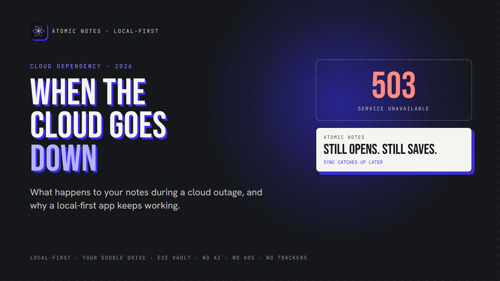
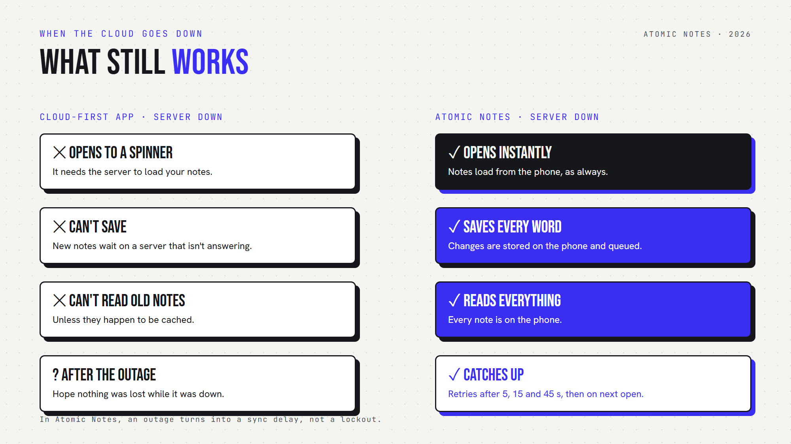

*By Ashutosh Sharma (DevBehindYou), the developer of Atomic Notes. Last updated: October 3, 2026.*

**Key Takeaway:** During a cloud outage, notes in a cloud-first app can freeze, refuse to save, or vanish behind a spinner. Local first software keeps the primary copy on your device, so during a cloud outage, notes still open and still save. Sync waits, then catches up when the servers return.

Picture this. You open your notes app to grab an address, and you get a spinner. Then an error. A data center three time zones away is having a bad day.

That's cloud dependency in action. It happens more often than you'd think.

So what really happens during a cloud outage? Notes either keep working or they freeze, and the difference comes down to one design choice. Let's look at what breaks, why it breaks, and how offline first apps avoid it.

## Why do cloud outage notes matter so much?

Think about what lives in your notes. Door codes, a packing list, a talk you give in ten minutes, the address you're driving to. During a cloud outage, notes like these turn from handy to urgent.

Most people never plan for a cloud outage. Notes just feel like they'll always be there, right up until the morning the spinner never stops. Sooner or later, you'll hit a cloud outage. Notes need to work when it does.

## What happens to cloud outage notes in a typical app?

When you hit a cloud outage, notes in a cloud-first app stall because the app treats the server as the real copy. No server, no notes, except a few cached ones.

Here's what usually breaks:

- **Opening the app.** It waits for the server to load your list.
- **Saving.** New notes wait on a server that isn't answering.
- **Search.** Server-side search goes dark with the server.

This is the hidden cost of cloud dependency. Your offline notes aren't really offline. They're borrowed from a server, and the server calls in the loan the moment it goes down.

Worse, you're left guessing during a cloud outage. Notes you just wrote may or may not have saved, and the app can't tell you.

## Do big cloud outages really happen?

Yes, and they hit the largest providers on earth. Late 2025 alone brought two outages that knocked popular apps offline for hours.

On October 20, 2025, a race condition in the DNS automation behind DynamoDB took down AWS's us-east-1 region. Dozens of AWS services failed, and apps built on them followed. During that cloud outage, notes apps built on that region could leave their users staring at errors.

Less than a month later, on November 18, 2025, a database permission change at Cloudflare produced an oversized configuration file and crashed part of its network. Sites across the internet broke at once. When a provider that big has a cloud outage, notes, chats and to-do lists can all freeze together.

Neither company was careless. My takeaway: if the best can fail, each one is a single point of failure for every app that leans on it. So after any cloud outage, notes should be the one thing you never lose.

## Why do offline first apps keep working?

Offline first apps save every change on your device before they touch the network. During a cloud outage, notes in an offline first app stay readable and writable, because the device never needed the server for that.

The idea comes from local first software. Your device holds the primary copy. Servers hold backup copies for syncing. Flip that order, and an outage stops being an emergency.

Here's the practical difference:

- A cloud-first app asks the server before it saves.
- Local first software saves first and asks the server later.

That second order changes everything. Through a cloud outage, notes keep landing on your phone in milliseconds. Your offline notes stay complete. The only thing that pauses is sync, and sync can wait.

Offline first apps also feel faster on a good day, because reads and writes never wait on a round trip. You get two wins: cloud outage notes that keep working, and a snappier app every other day.

## How does Atomic Notes handle cloud outage notes?

Atomic Notes keeps every note on your phone first. During a cloud outage, notes in Atomic Notes open instantly, save every word, and queue changes for later. When the servers return, sync finishes on its own.

Here's the sequence:

1. **You open the app.** Notes load from the phone, as always.
2. **You write.** Offline notes save to on-device storage as you type.
3. **Sync hits the cloud outage.** Notes stay saved, and the app tells you plainly that it kept your changes on this device and will finish syncing when you're back online.
4. **It retries.** The app tries again after 5, 15 and 45 seconds. After that, your next reconnect, edit or return to the app starts a fresh round.
5. **It catches up.** Each push carries a request id, so the app replays a cut-off sync exactly once. No duplicates, no double charge.

That covers a short cloud outage. Notes also survive a permanent one. What if the Atomic Notes server disappeared for good? Your notes would still sit on your phone. Each synced note also lives as a file in your own Google Drive. Without the vault, those files are plain JSON you can open. With the vault on, you'd need your six-word recovery phrase to read them.

And if Google Drive itself has a cloud outage? Notes stay on your phone, and the Drive copy catches up later.

That's the point of cutting cloud dependency. After a cloud outage, notes in Atomic Notes don't need rescuing. Your offline notes were never in danger.

## How can you reduce cloud dependency in your notes setup?

Pick local first software, keep a copy of your notes in storage you control, and test your app offline before you need it. A few minutes of checking now saves a panicked afternoon during the next cloud outage. Notes you can't open are notes you don't really have.

Run this quick test today:

1. Turn on airplane mode.
2. Close your notes app completely.
3. Open it, write a new note, and edit an old one.

If both work instantly, you're using one of the offline first apps. If the app spins or blocks the editor, your offline notes depend on someone else's server. Treat that test as a preview of your next cloud outage. Notes behave the same way when the real thing hits.

A few more habits help:

- **Prefer apps that store notes where you can reach them.** Your device, or a cloud folder you own.
- **Check how sync recovers.** After a cloud outage, notes should sync once, with no duplicates.
- **Keep your recovery phrase safe** if you use end-to-end encryption. An outage is a bad time to discover you lost it.
- **Don't lean on a status page.** It can't hand your notes back.

My view is simple: during a cloud outage, notes should be the last thing you worry about. The cloud should be a convenience for moving notes between devices, never the only place they live.

Cloud dependency feels invisible until the day it isn't. Local first software turns an outage into a sync delay instead of a lockout. Want proof? Try Atomic Notes 2.03.5 for Android from GitHub Releases, switch on airplane mode, and keep writing.

## FAQ

### What happens to my notes during a cloud outage?

It depends on the app. A cloud-first app can lock you out during a cloud outage. Notes come back only when the servers do. In local first software like Atomic Notes, your cloud outage notes stay on your device, so you can still open, read and write them. Sync catches up afterwards.

### Are offline notes safe if the app's servers shut down?

In local first software, yes. Your device keeps the primary copy, so a server shutdown doesn't delete your offline notes. Atomic Notes also stores synced notes as files in your own Google Drive, which keeps them reachable without its server.

### What is cloud dependency?

Cloud dependency means an app needs a remote server to do basic work, like opening or saving your notes. High cloud dependency turns any server problem into your problem. Offline first apps reduce it by doing that work on your device.

### How do offline first apps sync after an outage?

They queue changes on your device and send them when the network or servers return. Atomic Notes retries after 5, 15 and 45 seconds, starts a fresh round on your next reconnect or edit, and replays the same request. So after a cloud outage, notes catch up once, with no double charge.

## Sources

- [AWS us-east-1 outage, October 20, 2025, ThousandEyes analysis](https://www.thousandeyes.com/blog/aws-outage-analysis-october-20-2025)
- [Cloudflare outage on November 18, 2025, Cloudflare blog](https://blog.cloudflare.com/18-november-2025-outage/)
- [Local-first software, Ink & Switch](https://www.inkandswitch.com/essay/local-first/)
- [Atomic Notes source code and releases](https://github.com/DevBehindYou/Atomic-Notes-App-V0.2)
