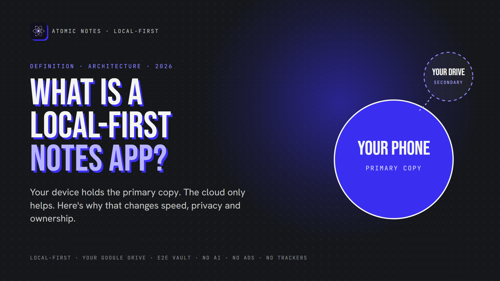
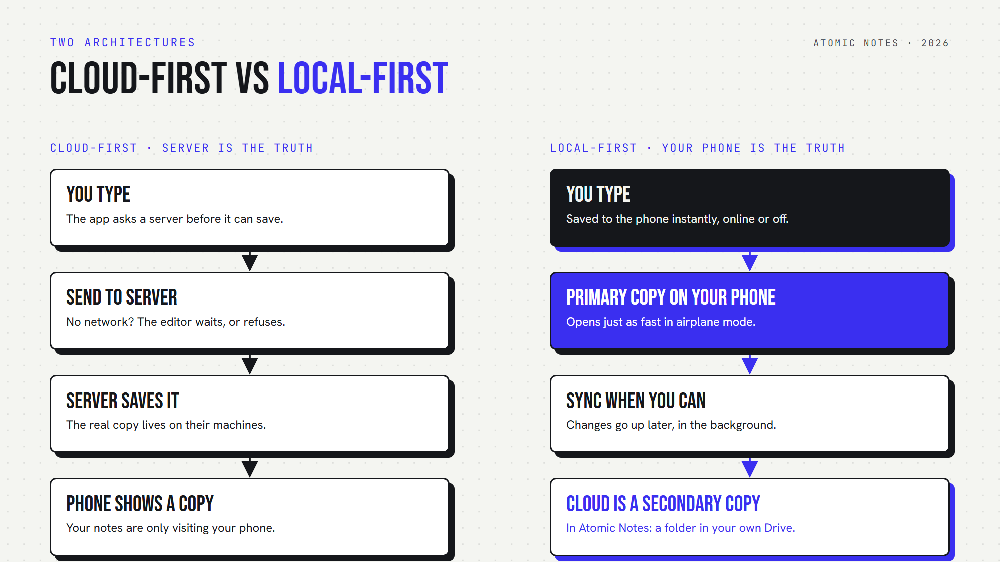
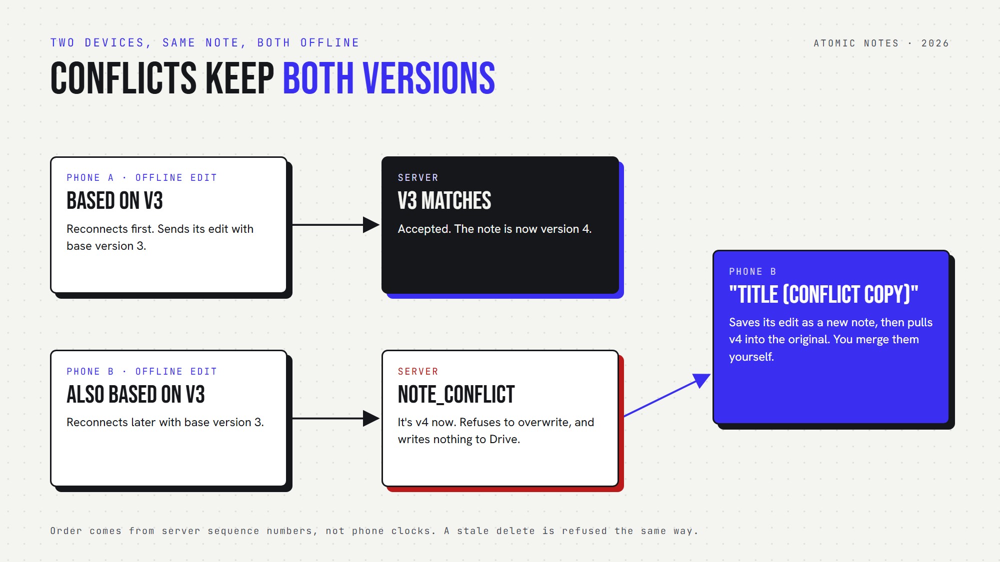

*By Ashutosh Sharma (DevBehindYou), the developer of Atomic Notes. Last updated: October 3, 2026.*

**Key Takeaway:** A **local-first notes app** keeps the primary copy of your notes on your device. Notes save instantly, work offline, and stay yours if the company disappears. The cloud holds only a secondary copy to move notes between devices. The idea comes from a 2019 Ink & Switch essay on local-first software.

You open your notes app on a train. No signal in the tunnel. The spinner turns, and the idea you wanted to keep is gone by the next stop. That small failure is the whole case for local-first software. Your notes lived on someone else's server, so a dead connection meant a dead app.

A **local-first notes app** flips that. This article explains the definition, the architecture behind it, how sync and conflicts work when your phone is in charge, and how Atomic Notes applies the idea, including where it still falls short.

## What does local-first actually mean?

Local-first means your device holds the primary copy of your data and servers hold secondary copies. The term comes from a 2019 essay by Martin Kleppmann and colleagues at the research lab Ink & Switch.

The essay states the rule directly:

> "In local-first applications we treat the copy of the data on your local device (...) as the primary copy. Servers still exist, but they hold secondary copies of your data in order to assist with access from multiple devices."

That comes from [Local-first software: You own your data, in spite of the cloud](https://www.inkandswitch.com/essay/local-first/). In a cloud-first app, the server holds the truth and your phone shows a temporary view of it. Local-first reverses that, and the reversal changes speed, privacy, and what happens when a company shuts its servers down.

The essay lists seven ideals: fast, multi-device, offline, collaborative, long-lived, private and user-controlled. Most cloud notes apps meet two or three. A local-first app treats the list as its spec.

## How is local-first different from cloud-first?

In a cloud-first app, every save waits on a server. In a local-first app, the save lands on your phone first and the network becomes a background helper. A dead connection stops a cloud app and barely touches a local-first one.

With the cloud-first shape, typing, searching and reordering all wait on a round trip. On a good connection you barely notice. On a bad one, the app stalls exactly when you need to capture something.

With the local-first shape, reads and writes hit a database on the device. In Atomic Notes that database is Hive, and the app opens in about half a second to under a second after a force stop, measured on a real phone in September 2026. The network is never on the path of a keystroke.

## How does a local-first app sync without losing edits?

Each change is saved on the device, marked as waiting to sync, and pushed later. Pulls fetch only what changed since the last sync. When two devices edit the same note, the app keeps both versions instead of guessing.

Atomic Notes pushes all changed notes in one request a few seconds after you stop typing, when you reopen the app, and when the network returns. Pulling works in reverse: the phone asks for anything newer than the last sequence number it saw, 10 files per page, so a long trip offline does not mean re-downloading everything.

Conflicts are where many apps quietly drop data. A common shortcut is last-write-wins: the newer timestamp replaces the other edit. It is simple, and it can silently erase a change made offline on another device.

Atomic Notes uses versions instead. Every note carries a version number, and each push says which version it was based on. If another device got there first, the server refuses the stale edit, and the phone keeps it as a "(conflict copy)" next to the newer version. You merge them yourself. Ordering comes from server sequence numbers, so a phone with the wrong clock cannot win.

## Why does local-first matter in real life?

Local-first matters on commutes without signal, during cloud outages, and when apps shut down. In each case, a local-first app keeps working because your device already holds the real copy of your notes.

- **The commute.** Underground or in the air, a local-first app opens and saves as usual, then syncs when you surface.
- **The outage.** When a big provider goes down, cloud-first users stare at a status page. Local-first users keep writing.
- **The shutdown.** When an app is acquired or closed, a cloud-first app can take your notes with it. A local-first app leaves them on your phone.

Atomic Notes adds one more layer of ownership. Its secondary copy is not on my servers at all. Each note is a file in a `My-Atomic-Notes` folder in your own Google Drive, and my server keeps only metadata like ids and timestamps.

## Is local-first the same as private?

No. Local-first is the foundation for privacy, not the whole house. A local-first app can still send analytics, ship your text to an AI model, or store readable copies in the cloud.

Atomic Notes builds the rest on that foundation: no analytics, crash or ad SDKs, no AI features, and an optional end-to-end vault that seals notes with AES-256-GCM on your phone, so your Drive and my server only see ciphertext. The details are in *Encrypted Notes Explained: T2T vs End-to-End*.

There are honest limits too. The vault is off by default. Sync needs a Google sign-in for now, with email and password login planned. There is no background sync while the app is closed. And real-time co-editing by several people, which the essay's CRDTs solve, is not something Atomic Notes does. It is built for one person across their own devices.

Local-first is the difference between notes that visit your phone and notes that live there. If you want to see it in practice, the airplane-mode test takes ten seconds: open your notes app cold with no connection and write a line. Atomic Notes 2.03.5 for Android is on [GitHub Releases](https://github.com/DevBehindYou/Atomic-Notes-App-V0.2/releases/latest), and the [Atomic Notes website](https://atomic-notes.devbehindyou.com) explains how it works.

## FAQ

### What is a local-first notes app?

A local-first notes app stores the primary copy of your notes on your device. It saves instantly, works fully offline, and uses the cloud only as a secondary copy to sync between devices. The term comes from a 2019 Ink & Switch essay on local-first software.

### Is local-first the same as offline-first?

They overlap. Offline-first means an app works without a network. Local-first goes further: your device holds the primary copy, the server holds secondary copies, and you keep ownership if the service disappears. Every local-first app is offline-first, but not the other way round.

### How does a local-first app handle sync conflicts?

Approaches differ. Some use last-write-wins, which can silently lose an edit. Some use CRDTs, which merge edits automatically. Atomic Notes uses versions: if two devices edit the same note offline, the second edit is kept as a separate conflict copy for you to merge.

### Do local-first apps still use the cloud?

Yes, for sync between devices. The difference is that the cloud holds a secondary copy. In Atomic Notes, that secondary copy is a folder in your own Google Drive, and the Atomic Notes server stores only metadata, never your note titles or text.

### Are local-first apps more private?

They make privacy easier, not automatic. Keeping the primary copy on your device means less of your data has to sit on servers. But the app can still send analytics or readable copies. Look for no trackers and end-to-end encryption as well.

### Which notes apps are local-first?

Atomic Notes, Joplin, Anytype and Logseq all keep the primary copy on your device. Many popular cloud notes apps cache notes for offline reading but treat the server as the source of truth. Test any app by opening it in airplane mode.

## Sources

- Martin Kleppmann, Adam Wiggins, Peter van Hardenberg, Mark McGranaghan, [Local-first software: You own your data, in spite of the cloud](https://www.inkandswitch.com/essay/local-first/), Ink & Switch, 2019
- Atomic Notes source code and releases, [GitHub](https://github.com/DevBehindYou/Atomic-Notes-App-V0.2)
