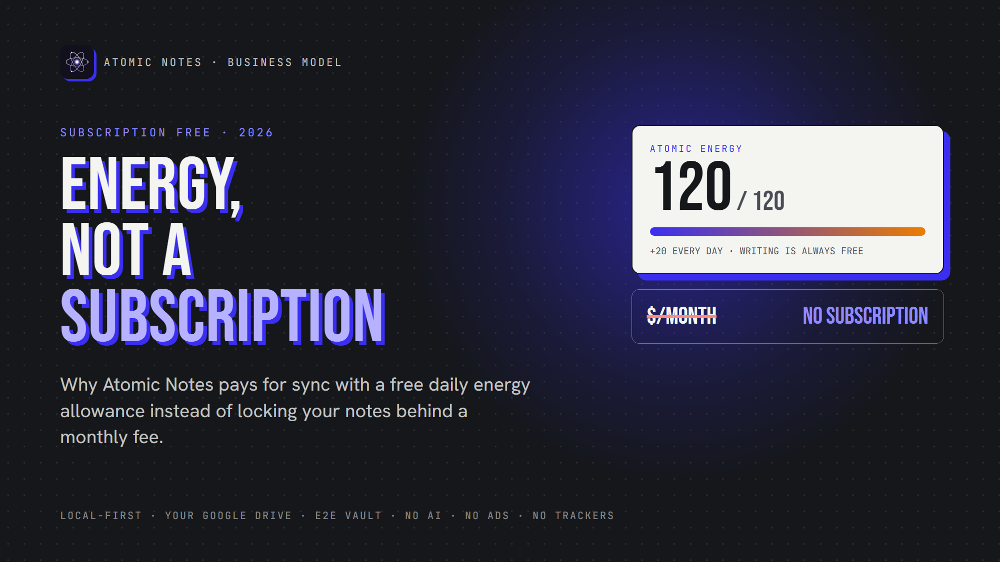
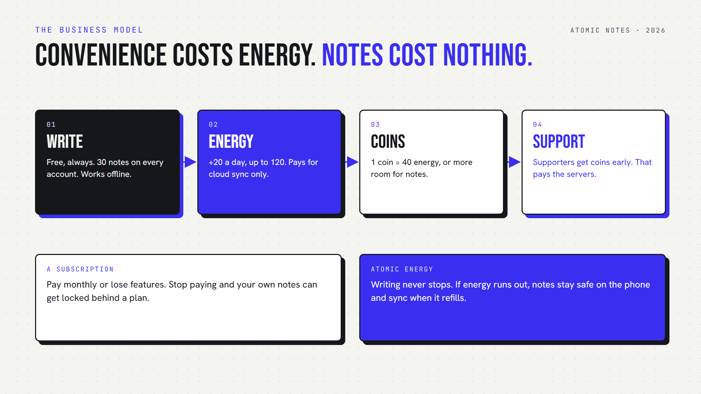

*By Ashutosh Sharma (DevBehindYou), the developer of Atomic Notes. Last updated: October 4, 2026.*

**Key Takeaway:** Atomic Notes is a subscription free notes app. Writing, reading and editing on your phone cost nothing. Only cloud sync uses energy, which refills by 20 every day for free. Coins add extra energy or room for more notes. It's a privacy friendly business model: nothing in it needs ads or your data.

Count your subscriptions. Music, video, storage, maybe a password manager. Each one is small, but together they make a real monthly bill.

Your notes app shouldn't be one more line on it. A subscription free notes app keeps it off the list.

That's why I built Atomic Notes as a subscription free notes app. Instead of a monthly plan, it runs on Atomic Energy for sync and Atomic Coins for extras. Here's how it works, what stays free, and why I picked this privacy friendly business model over ads or a subscription.

## Why do so many notes apps charge a subscription?

Servers cost money every month, and a subscription matches that cost. The trouble starts when the plan covers basic note taking too. A subscription free notes app has to pay its server bill some other way.

Sync really does cost something, since every upload hits a server. A subscription free notes app has to be honest about that.

But writing a note on your own phone costs the developer nothing. So why should it cost you anything? A subscription free notes app can split the two: free writing, and a fair price only for the parts that use servers.

## What's wrong with a subscription for your notes?

Nothing, until you stop paying. Then features vanish, limits drop, and your own notes can end up behind a plan. A notes app without subscription removes that risk.

What bothers people:

- **You pay forever.** A small monthly fee becomes a big yearly one.
- **Prices change.** The plan you picked can cost more next year.
- **Stopping hurts.** Cancel, and sync, devices or features can disappear. A notes app without subscription has nothing to cancel.
- **Your notes become a hostage.** The more you write, the harder it gets to leave. A subscription free notes app never holds them that way.

Notes are a long-term habit, often for years. A subscription free notes app lets that habit grow without a meter running every month.

## Why not just make it free with ads?

Because ads need tracking, and tracking breaks privacy. An ad-funded app earns more when it knows more about you. A subscription free notes app shouldn't fix one problem by creating a worse one.

I wanted a privacy friendly business model, one where earning money never depends on watching you. Ads fail that test, and so does selling data or training AI on your notes.

That left one honest option: charge a little for sync, which actually costs money, and keep everything else free. That's the whole idea behind a subscription free notes app with energy.

## How does Atomic Energy work?

Atomic Energy pays for cloud sync, and nothing else. In a subscription free notes app, that's the only meter. Every account gets 20 energy a day for free, at the same time each day, up to a cap of 120. Writing offline never touches it.

Here's what sync costs in this subscription free notes app:

1. **Standard sync: 5 energy.** It runs automatically, at most once an hour.
2. **Instant sync: 10 energy.** You tap it when you want changes up now.
3. **Nothing to upload: free.** If no note changed, the app doesn't charge.
4. **Failed sync: refunded.** If nothing got through, you get the energy back.

So the free daily 20 covers four standard syncs a day. Miss a few days, and the app adds their energy next time you open it, up to the cap.

And if energy runs out? Your notes stay safe on your phone, and you keep writing. Sync simply waits until energy refills. That's the core promise of this subscription free notes app: the meter touches convenience, never your notes.

## What does a normal week look like?

Say you write in the morning, add a few items at lunch, and tidy a list at night. That's three standard syncs, or 15 Atomic Energy, under the free daily 20. A subscription free notes app should cover that kind of day without a second thought.

On a quiet weekend with no edits, a subscription free notes app shouldn't charge you, and this one doesn't. The unused energy keeps building toward the 120 cap. A busy Monday with instant syncs barely dents it.

That's the rhythm of a notes app without subscription: the free refill covers everyday use, and in a subscription free notes app like this, many weeks you won't think about energy at all.

## What are Atomic Coins for?

Atomic Coins are the extras in this subscription free notes app. One coin turns into 40 energy, or buys room for more notes. Every new account gets 5 coins as a welcome gift.

Here's what Atomic Coins can do:

- **Top up energy.** Handy on busy days.
- **Get room for more notes.** Every account starts with 30 notes. Ten coins raise that to 40, twenty more reach 50, and thirty more reach 100.

Each step is a one-time upgrade, not a monthly fee. That's the key difference between a subscription free notes app and a plan: you pay once, and the room stays yours.

One honest detail: the app doesn't sell coins yet. If you support Atomic Notes through the support page on its website, I send coins to your account early, as a thank-you. That support pays the server bill today, and it keeps Atomic Notes a subscription free notes app.

## What's free in this subscription free notes app?

Writing, reading, editing, the vault, the biometric lock and 30 notes are all free. A subscription free notes app should say its limits out loud:

- **The 30-note limit.** Notes and checklists share it. At the limit, you can still open and edit every note. To add more, delete one or upgrade with coins.
- **Sync uses energy.** The free daily refill covers normal use. Heavy instant syncing may need coins.
- **Android only, for now.** Sign-in uses a Google account.

Any subscription free notes app has edges. I'd rather show you mine than hide them. A notes app without subscription still needs a privacy friendly business model. Mine keeps your writing out of it.

## Why is this a privacy friendly business model?

Because nothing in it needs your data. Atomic Energy counts syncs, not words. Atomic Coins come from supporters, not advertisers. The server never stores your note text, and the app ships zero telemetry. A subscription free notes app can afford that, because it never needs to sell anything about you.

Compare the three common models:

- **Ads:** you pay with your attention and your data.
- **Subscription:** you pay monthly, and your notes can become a hostage.
- **A subscription free notes app with energy:** you pay only for sync convenience, if at all.

A privacy friendly business model should line up the developer's interests with yours. For a notes app without subscription, that alignment is everything. Mine earns from supporters, never from watching you. That's why I think a subscription free notes app with energy beats both alternatives.

If that sounds like your kind of notes app without subscription, Atomic Notes 2.03.5 for Android is on GitHub Releases. Install it, write freely, and see how far a subscription free notes app gets you on the daily refill alone. Your 5 welcome coins are waiting.

## FAQ

### Is Atomic Notes really a subscription free notes app?

Yes. There's no monthly plan. Writing, reading and editing are free, and every account gets 20 Atomic Energy a day for cloud sync. Atomic Coins add extra energy or note capacity as one-time upgrades, never as a recurring charge.

### What happens if I run out of Atomic Energy?

Nothing bad. Your notes stay on your phone, and you keep writing as usual. Sync pauses until energy refills or you add some with coins. You never lose a note because energy ran out. That's the point of a subscription free notes app.

### How do I get Atomic Coins?

Every new account gets 5 coins as a welcome gift. The app doesn't sell coins yet. Supporters who back the project through the support page on the Atomic Notes website get coins early, as a thank-you.

### Why does a notes app without subscription still need money?

Sync runs on real servers that cost money every month. A subscription free notes app still pays for them. Atomic Notes charges only for sync, through energy, and keeps writing free. Supporters pay the server bill. That's a privacy friendly business model, with no ads or tracking.

## Sources

- [Atomic Notes support page](https://atomic-notes.devbehindyou.com/support-atomic-notes)
- [Atomic Notes 2.03.5 release notes (energy and coins changes)](https://github.com/DevBehindYou/Atomic-Notes-App-V0.2/releases/tag/v2.03.5)
- [Atomic Notes privacy policy](https://atomic-notes.devbehindyou.com/privacy)
- [Atomic Notes terms](https://atomic-notes.devbehindyou.com/terms)
