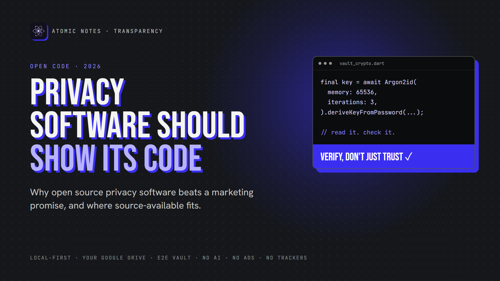
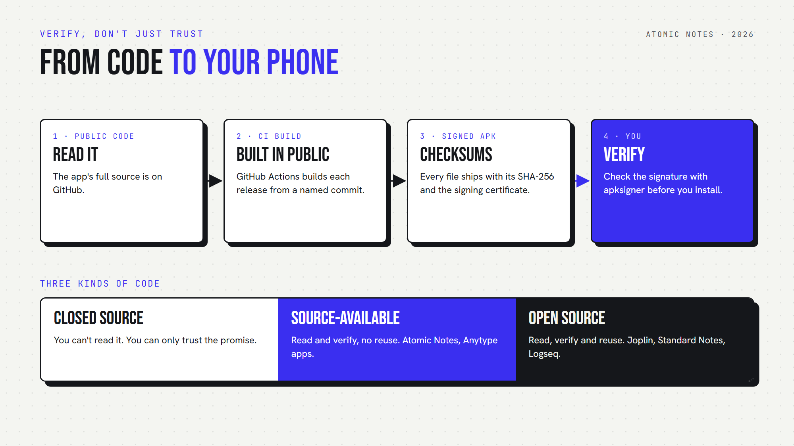

*By Ashutosh Sharma (DevBehindYou), the developer of Atomic Notes. Last updated: October 3, 2026.*

**Key Takeaway:** Open source privacy software lets anyone read the code behind a privacy promise, so you can check the promise instead of trusting it. Open source privacy software doesn't guarantee safety, but it makes problems findable. One honest note: Atomic Notes is source-available, not open source. Its full app code is public to read and verify, but not to reuse.

Every privacy app says the same things. "We never read your data." "Your notes stay private." "We don't track you."

Nice words. But how would you know?

With closed code, you can't. You get a promise and a privacy policy. That's why I believe in open source privacy software, or at least privacy software that shows its code. Let's look at why open source privacy software earns more trust, where it falls short, and where my own app stands.

## Why can't you trust closed privacy software?

Closed privacy software asks for blind trust. You can't see what it collects, where it sends data, or whether the code matches the policy. Open source privacy software replaces that trust with evidence anyone can check.

A privacy policy is a legal promise written by the company. It can't show you what the app does.

Code can. Open source privacy software lets you test every line of the privacy policy against what the app really does. That's the whole case for open source privacy software, and for software transparency in general.

## What makes open source privacy software more trustworthy?

Open source privacy software puts its code in public, so anyone can see how it handles your data. Nobody has to take the company's word for anything.

Here's what open source privacy software lets people check:

- **What leaves the device.** Every network call sits in plain view.
- **How encryption works.** The algorithm, the key handling, and the mistakes.
- **What ships inside.** Hidden analytics or ad SDKs show up in the dependency list.
- **Whether claims hold up.** "No tracking" becomes something you can search for.

Fans of open source privacy software didn't invent this idea. Cryptographers have argued it since 1883. Auguste Kerckhoffs wrote that a cipher should stay secure even if everything about it, except the key, becomes public. Good open source security follows the same rule. If privacy software only works while its code stays hidden, it doesn't really work.

## Does open source security really work?

Mostly, yes. Open source privacy software gets more eyes, and more eyes find more problems. But open source security isn't automatic. Someone still has to look, and two famous stories show both sides.

In 2014, researchers found Heartbleed, a bug in OpenSSL that had sat in public code for about two years. Open code didn't prevent it, but once spotted, everyone could patch it fast.

In March 2024, Andres Freund, an engineer at Microsoft, noticed slow SSH logins. He dug in and found a backdoor in xz Utils, a compression library used across Linux. The attacker had spent about two years earning trust as a maintainer. The open process let one curious person catch it before it reached most stable Linux releases. That's open source security at its best: one person, one public codebase, one catch.

So open source privacy software isn't magic. It makes problems findable. Closed code hides them from everyone.

## Why does open source privacy software matter for notes?

Notes hold your most private writing: passwords you shouldn't store but do, health worries, journal entries, half-formed ideas. Open source privacy software lets you check exactly how a notes app treats that text.

An open source notes app like Joplin or Standard Notes lets anyone read how it syncs, encrypts and stores notes. If an open source notes app claims end-to-end encryption, the code shows whether that's true.

That's software transparency doing real work in an open source notes app. You don't need to audit open source privacy software yourself. You just need to know someone can.

## Is Atomic Notes open source privacy software?

No, and I want to be clear about it. Atomic Notes is source-available, not an open source notes app. The full app code is public on GitHub, so you can read it, audit it, and build it on your own device to check it. The license doesn't allow reuse in other apps or products.

Why that choice? I built this privacy software from scratch, alone. A permissive license would let anyone copy, rename and ship it. Source-available keeps the project sustainable while keeping the software transparency you need to verify it.

Here's how the three models compare:

- **Closed source.** You can't read it. You can only trust the promise.
- **Source-available.** You can read and verify, but not reuse. Atomic Notes works this way.
- **Open source.** You can read, verify and reuse. That's the full freedom of open source privacy software.

So Atomic Notes isn't open source privacy software by the Open Source Initiative's definition, and I won't pretend otherwise. For privacy, though, the reading and checking matter most, and source-available covers both.

## How can you verify what you install?

Open source privacy software only helps if the app on your phone really came from that code. Software transparency has to cover the build, too.

Here's the chain Atomic Notes uses for every release:

1. **Public code.** The full app source lives on GitHub.
2. **Public build.** GitHub Actions builds each release from a named commit, and the run log is public.
3. **Signed files.** The release notes list each APK's SHA-256 checksum and the signing certificate fingerprint.
4. **Your check.** You compare the checksum, or run apksigner, before you install.

One honest gap: Atomic Notes doesn't offer reproducible builds yet, so you can't prove byte for byte that the official APK came from that commit. The public build log is the evidence for now.

The xz story shows why this step matters. Its backdoor hid in release files and test data, away from the code most people read. Checking the path from source to install is part of open source security too.

## What should you look for in open source privacy software?

Look for complete public code, a clear license, signed releases, a short dependency list and bugs fixed in the open. Open source privacy software that skips any of these asks for trust it hasn't earned.

Run any open source privacy software through this quick checklist:

1. Is the full app code public, or only a small part?
2. Does the license say what you can do with it?
3. Do releases list checksums and signing details?
4. Does the dependency list include analytics or ad SDKs?
5. Do people report and fix bugs in public, where open source security happens?

Any privacy software that passes all five deserves a serious look. An open source notes app that passes them earns even more, because anyone can fork it if the company changes course.

My take is simple: privacy software should show its work. Open source privacy software is the strongest form of that. Source-available is a solid second, as long as the code is complete and the builds are traceable.

Want to check my work? The Atomic Notes code is on GitHub, and version 2.03.5 for Android sits on GitHub Releases with its checksums. It isn't open source privacy software, but every line is there to read. Question it, and open an issue if something looks wrong. That's software transparency at work.

## FAQ

### Is open source privacy software always safer?

Not automatically. Open source privacy software lets anyone inspect the code, so bugs and backdoors are easier to find. Someone still has to look, though. Real open source security comes from active maintainers, signed releases and public bug tracking, not just a public repository.

### What is the difference between open source and source-available?

Open source licenses let you read, change and reuse code, including in your own products. Source-available licenses let you read and verify the code but limit reuse. Joplin is an open source notes app. Atomic Notes is source-available. Both support software transparency.

### Is Atomic Notes an open source notes app?

No. Atomic Notes is source-available, so it isn't open source privacy software in the strict sense. Its full app code is public on GitHub to read and audit, but the license doesn't allow reuse. Each release lists SHA-256 checksums so you can verify your download.

### How can I check open source privacy software myself?

Start with software transparency: read its code if it's public, check the dependency list for analytics or ad SDKs, and review the permissions it requests. Before you install, compare the published SHA-256 checksum with your download, or check the signature with apksigner.

## Sources

- [Auguste Kerckhoffs, "La cryptographie militaire" (1883), via Fabien Petitcolas](https://www.petitcolas.net/kerckhoffs/)
- [The Heartbleed Bug (CVE-2014-0160)](https://heartbleed.com/)
- [CVE-2024-3094 (xz Utils backdoor), NIST National Vulnerability Database](https://nvd.nist.gov/vuln/detail/CVE-2024-3094)
- [Andres Freund's original xz report, oss-security, March 29, 2024](https://www.openwall.com/lists/oss-security/2024/03/29/4)
- [The Open Source Definition, Open Source Initiative](https://opensource.org/osd)
- [apksigner, Android Developers](https://developer.android.com/tools/apksigner)
- [Atomic Notes source code, license and releases](https://github.com/DevBehindYou/Atomic-Notes-App-V0.2)
