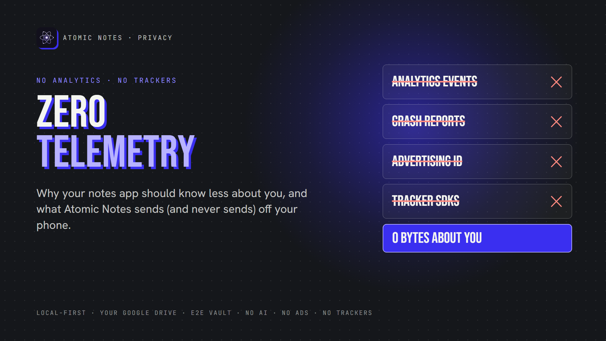
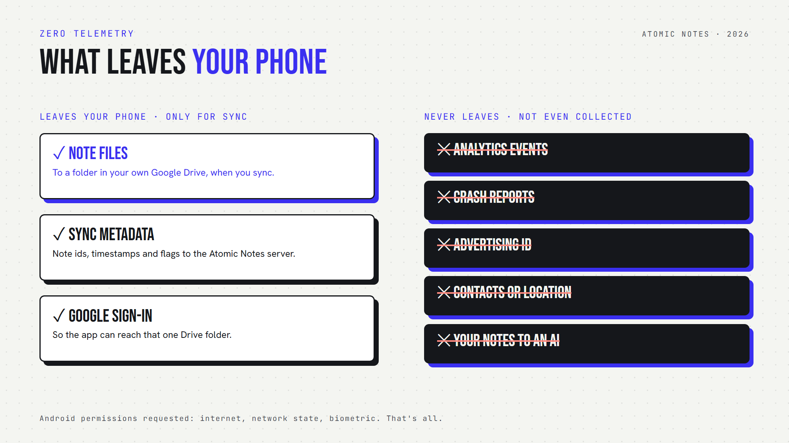

*By Ashutosh Sharma (DevBehindYou), the developer of Atomic Notes. Last updated: October 3, 2026.*

**Key Takeaway:** Zero telemetry means an app sends no usage data, crash reports or tracking events back to its maker. For private note taking, that matters as much as encryption, because usage patterns reveal your habits, health and routines. Atomic Notes ships zero telemetry: no analytics, crash-reporting or advertising SDK, and only three Android permissions.

Your notes app probably knows when you wake up. It knows how often you open it, how long you stay, which screens you tap, and your phone model.

None of that is your notes. All of it is about you, and it can undo private note taking without touching a single word.

That's telemetry, and most apps collect it by default. Let's look at what it is, why a notes app should skip it, and what zero telemetry looks like in practice.

## What does zero telemetry mean?

Zero telemetry means the app never phones home with data about how you use it. No analytics events, no crash reports, no device fingerprints. The app talks to a server only for features you asked for, like sync. That's the standard data privacy apps should meet.

Telemetry is the automatic usage data an app sends to its developer. It often runs through third-party SDKs, small libraries the developer drops in to count users, log crashes or show ads. Zero telemetry means none of those SDKs make it into the app.

Here's what a typical app reports:

- **Screens and taps.** Which features you use.
- **Session data.** When you open the app and how long you stay.
- **Device details.** Phone model, OS version, language, sometimes location.
- **Advertising ID.** A tag that links your activity across apps.
- **Crash logs.** What you were doing when the app broke.

Zero telemetry removes all five. A truly no tracking notes app sends none of them, ever.

## Why does telemetry matter in a notes app?

Telemetry matters because usage patterns tell a story, even when nobody reads your notes. Zero telemetry protects private note taking at the level of habits, not just content.

Think about what patterns reveal. Opening your notes at 3 a.m. every night. A sudden burst of checklist activity before a hospital visit. A journal you write in daily, then stop. Encryption hides the words. Telemetry still leaks the rhythm of your life. Zero telemetry keeps that rhythm on your phone.

This isn't a theory. In 2023, the FTC took action against GoodRx for sharing users' health information with advertising platforms through tracking code. Nobody hacked GoodRx. The tracking itself did the damage. With zero telemetry, there would have been nothing to share.

So a privacy focused notes app has to care about more than encryption. Zero telemetry closes the gap that encryption leaves open.

## Is "anonymous" telemetry really harmless?

Not always. Many apps call their telemetry anonymous, but usage data rarely stays that way. Zero telemetry avoids the question entirely.

In 2000, researcher Latanya Sweeney found that ZIP code, birth date and sex alone could likely single out about 87% of Americans. App telemetry carries far more detail than that: device model, time zone, language, and a timeline of every session.

Strip the name, and the pattern can still point to one person. That's why data privacy apps shouldn't lean on "we anonymize it". The safest data is data an app never collects. For private note taking, zero telemetry is the only kind of anonymous you never have to trust.

## Why do developers add analytics anyway?

Analytics helps developers find bugs, spot slow screens and see which features people use. Those are fair goals. The problem is the cost: every SDK you add ships someone else's code, and someone else's data rules, inside your app.

I get it. As a solo developer, I'd love to know which screen crashes on which phone.

But each analytics SDK sends data to a third party, follows its own privacy policy, and can change behavior in an update you never see. For data privacy apps, that's a bad deal. Zero telemetry means I find bugs the slower way: real-device testing, bug reports, and users telling me what broke.

Zero telemetry is slower for me. It's also honest. A privacy focused notes app shouldn't buy convenience with your data.

## How does Atomic Notes practice zero telemetry?

Atomic Notes ships zero telemetry by design. As a no tracking notes app, it contains no analytics SDK, no crash reporter and no advertising SDK, and it asks Android for only three permissions: internet, network state and biometric.

Here's everything that leaves your phone, and why:

1. **Note files**, to a folder in your own Google Drive, when you sync.
2. **Sync metadata**, to the Atomic Notes server: note ids, timestamps and flags like pinned or deleted.
3. **Google sign-in**, so the app can reach that one Drive folder.

And here's what never leaves, because the app never collects it: analytics events, crash reports, advertising ID, contacts, location, and your notes for any AI.

Honesty time, because zero telemetry shouldn't mean zero detail:

- The server keeps a short security log of events like sign-ins, for 30 days.
- Our hosting provider processes standard request data, such as IP addresses.
- With the vault off, note text passes through the server on its way to your Drive, and the server doesn't store it. Turn on the vault, and only ciphertext travels.

That's the full list for a no tracking notes app that still syncs. For private note taking, you deserve to see it in plain words, so the privacy policy says it too.

## What should a privacy focused notes app collect?

As little as possible. That idea has a name, and data privacy apps live by it: data minimization. A privacy focused notes app should collect only what its features need.

For private note taking with sync, that list is short:

- An account, to link your devices.
- Sync metadata, so the server knows which note changed and when.
- A place to store files, ideally somewhere you control.

Everything else is optional, and zero telemetry says no to all of it. A no tracking notes app doesn't need your location to save a grocery list, or your contacts to sync a journal.

## How can you check if an app tracks you?

To confirm a no tracking notes app, check its trackers, permissions and privacy policy. You don't need to read any code. Zero telemetry claims are easy to test.

Here's a quick routine:

1. **Scan it with Exodus Privacy.** This free service lists the trackers and permissions inside Android apps.
2. **Read the permissions.** A no tracking notes app has no reason to ask for contacts, location or your phone state.
3. **Search the privacy policy** for "analytics", "advertising" and "third parties".
4. **Check the code** if it's public. Dependency lists show every SDK the app ships.

Atomic Notes' code is public on GitHub, so you can check the zero telemetry claim yourself.

Many data privacy apps pass this test. Plenty of popular apps don't, and zero telemetry is the clearest way to tell them apart.

My view is simple: a notes app should know your notes are safe, and almost nothing else about you. Zero telemetry is how an app proves it. If you care about private note taking, treat zero telemetry as a hard requirement, the same way you treat encryption. Good data privacy apps clear that bar easily.

Want to try it? Atomic Notes 2.03.5 for Android is on GitHub Releases. It's a privacy focused notes app with zero telemetry, local first storage and an optional encrypted vault. Its manifest and dependency list are public, so check them yourself.

## FAQ

### What is zero telemetry?

Zero telemetry means an app sends no usage data, crash reports, device details or tracking events to its developer or to third parties. The app contacts a server only for features you choose, like sync. Atomic Notes, a privacy focused notes app, works this way.

### Do notes apps track you?

Many do. Lots of apps include analytics or crash-reporting SDKs that record screens and sessions. A no tracking notes app ships none of these. Tools like Exodus Privacy show which trackers an Android app contains, which makes comparing data privacy apps easy.

### Is zero telemetry the same as encryption?

No. Encryption hides what your notes say. Zero telemetry stops the app from reporting how and when you use it. A privacy focused notes app needs both, because usage patterns can reveal your habits even when every note stays encrypted.

### What data does Atomic Notes collect?

The server keeps your account email, note ids, timestamps, flags, energy balance, and a 30-day security log of events like sign-ins. Note text lives on your phone and in your own Google Drive. Zero telemetry means none of it describes how you use the app.

## Sources

- [FTC enforcement action against GoodRx, February 2023](https://www.ftc.gov/news-events/news/press-releases/2023/02/ftc-enforcement-action-bar-goodrx-sharing-consumers-sensitive-health-info-advertising)
- [Latanya Sweeney, "Simple Demographics Often Identify People Uniquely", Carnegie Mellon University, 2000](https://dataprivacylab.org/projects/identifiability/)
- [What Exodus Privacy does, Exodus Privacy](https://exodus-privacy.eu.org/en/page/what/)
- [Atomic Notes privacy policy](https://atomic-notes.devbehindyou.com/privacy)
- [Atomic Notes source code, including the Android manifest and dependency list](https://github.com/DevBehindYou/Atomic-Notes-App-V0.2)
