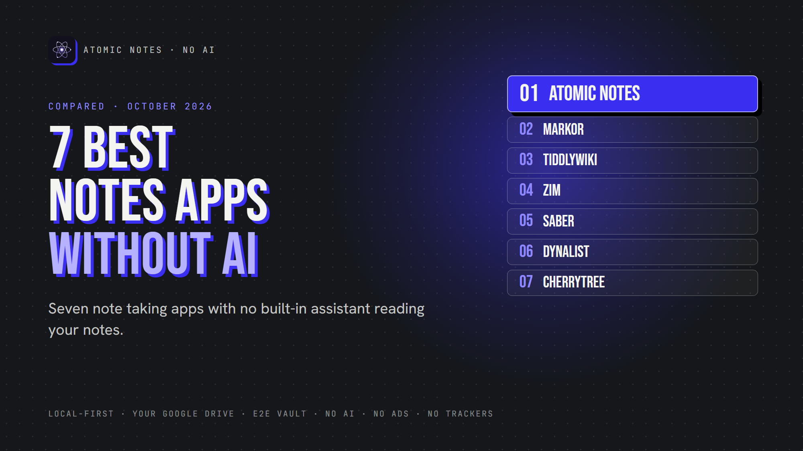
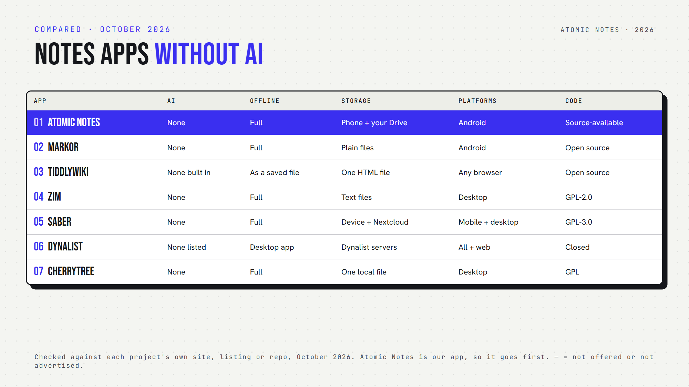

*By Ashutosh Sharma (DevBehindYou), the developer of Atomic Notes. Last updated: October 4, 2026.*

**Key Takeaway:** The best note taking app without AI depends on how you write. Atomic Notes suits private Android notes, Markor suits plain text, TiddlyWiki and Zim suit personal wikis, Saber suits handwriting, Dynalist suits outlines and CherryTree suits deep hierarchies. None of them ships an assistant that reads your notes.

Your calculator doesn't need an AI assistant. Neither does your flashlight. So does your private notebook need one?

For some people, yes. Summaries and smart search can save real time. For others, a notebook should stay a notebook: you write, it saves, and nobody reads along. If that's you, you want a note taking app without AI.

This list isn't anti AI. It's about choice. Here are my seven picks for the best note taking app without AI, each with no assistant in the loop.

## What counts as a note taking app without AI?

Here, a note taking app without AI means one with no built-in, first-party assistant that reads, summarizes, rewrites or chats with your notes. Plugins can change that, so I judged each app as it ships.

I checked every app against its own website, repository or app listing in October 2026. Atomic Notes is my app, so it sits first, and I list its limits too.

## Quick answers

- **Which work fully offline?** Atomic Notes, Markor, Zim, Saber, CherryTree, and TiddlyWiki as a saved file. Dynalist works offline in its desktop app.
- **Which are open source?** Markor, TiddlyWiki, Zim, Saber and CherryTree. Atomic Notes is source-available. Dynalist is closed source.
- **Which run on Android?** Atomic Notes, Markor, Saber and Dynalist.
- **Which need an account?** Atomic Notes and Dynalist. Saber needs one only for sync.
- **Which note taking app without AI is most private?** Atomic Notes, Markor, Zim, Saber and CherryTree keep notes on your device by default. Dynalist keeps them on its servers.

## 1. Atomic Notes

**Best for:** a private notes app on Android with no AI anywhere in it.

- **Platforms:** Android 9 and newer
- **Storage:** your phone first, then your own Google Drive when you sync
- **Encryption:** optional end-to-end vault (AES-256-GCM)
- **Offline:** full, including search
- **Open source:** no, source-available
- **AI:** none, and no analytics or ad SDKs
- **Watch out for:** Android only, Google sign-in required, 30 notes on the free tier

Atomic Notes doesn't need AI to organize, search, sync or encrypt anything. It's a simple notes app and an offline notes app in one: it saves locally and syncs later.

## 2. Markor

**Best for:** plain text and Markdown fans on Android.

- **Platforms:** Android
- **Storage:** plain files in a folder you choose
- **Encryption:** optional AES-256 for text files
- **Offline:** full
- **Open source:** yes
- **AI:** none
- **Watch out for:** no sync of its own, so you pair it with a sync app

Markor treats notes as files, which makes it a great no AI notes app for people who like owning every byte. Pair it with any sync app, and this note taking app without AI follows you everywhere.

## 3. TiddlyWiki

**Best for:** a personal wiki you can carry in one file.

- **Platforms:** any modern browser, or Node.js
- **Storage:** a single HTML file, or a folder on a server
- **Encryption:** optional AES-256 for single-file wikis
- **Offline:** yes, as a saved file
- **Open source:** yes
- **AI:** none built in
- **Watch out for:** saving takes some setup in certain browsers

TiddlyWiki dates back to 2004 and still works the same way: your notebook is one file you own. For a note taking app without AI that lasts decades, that's hard to beat.

## 4. Zim

**Best for:** a desktop wiki made of plain text pages.

- **Platforms:** Linux, Windows, macOS
- **Storage:** plain text files in folders
- **Encryption:** none built in
- **Offline:** full
- **Open source:** yes
- **AI:** none
- **Watch out for:** desktop only, with no mobile app

It's a calm note taking app without AI that saves every page as a text file.

## 5. Saber

**Best for:** handwritten notes with a stylus.

- **Platforms:** Android, iOS, Windows, macOS, Linux
- **Storage:** your device, with optional Nextcloud sync
- **Encryption:** encrypts notes before upload
- **Offline:** full
- **Open source:** yes
- **AI:** none
- **Watch out for:** built for handwriting, so typing is secondary

If your notes start with a pen, this is your note taking app without AI.

## 6. Dynalist

**Best for:** outliners who think in bullet points.

- **Platforms:** web, Windows, macOS, Linux, iOS, Android
- **Storage:** Dynalist's servers
- **Encryption:** no end-to-end encryption
- **Offline:** desktop app
- **Open source:** no
- **AI:** none on its feature list
- **Watch out for:** your outlines live on someone else's server

It's a fine note taking app without AI, but not a privacy tool.

## 7. CherryTree

**Best for:** deep, nested notes with code and tables.

- **Platforms:** Windows, Linux, macOS
- **Storage:** one local file (SQLite or XML), or folders
- **Encryption:** password protection for single-file documents
- **Offline:** full
- **Open source:** yes
- **AI:** none
- **Watch out for:** an open protected file extracts a temporary unprotected copy

## How do you pick the right note taking app without AI?

Start with your device and your writing style. A note taking app without AI should still fit how you think. Want private note taking on a phone? Pick Atomic Notes or Markor. Love wikis? Try TiddlyWiki or Zim. Write by hand? Saber.

Then check one thing every few months. Apps add features fast, and an AI free note taking app today might ship an assistant next year. Read the release notes before you update.

My take: privacy focused note taking starts with knowing who reads your notes. With a note taking app without AI, the answer stays simple: just you.

## FAQ

### Is there a notes app without AI for Android?

Yes. Atomic Notes, Markor, Saber and Dynalist each work as a note taking app without AI on Android. Atomic Notes and Markor also work fully offline, and Atomic Notes ships no analytics or advertising SDKs, so nothing about your writing leaves your phone except sync.

### Why choose a no AI productivity app?

Some people want fewer moving parts, fewer data flows and no chance of notes reaching an AI provider. A no AI productivity app keeps your writing between you and your device, and it often feels faster and calmer to use.

### Will these apps stay AI free?

Nobody can promise that. Any note taking app without AI could add an assistant later. Read release notes before you update, and favor open code, since anyone can spot a new AI feature in the source before it ships.

## Sources

- [Atomic Notes source code and releases](https://github.com/DevBehindYou/Atomic-Notes-App-V0.2)
- [Markor on GitHub](https://github.com/gsantner/markor)
- [TiddlyWiki encryption documentation](https://tiddlywiki.com/static/Encryption.html)
- [Zim desktop wiki](https://zim-wiki.org/manual/About.html)
- [Saber on GitHub](https://github.com/saber-notes/saber)
- [Saber privacy policy](https://github.com/saber-notes/saber/blob/main/privacy_policy.md)
- [Dynalist full feature list](https://dynalist.io/features/full)
- [CherryTree on GitHub](https://github.com/giuspen/cherrytree)
- [CherryTree changelog](https://github.com/giuspen/cherrytree/blob/master/changelog.txt)
