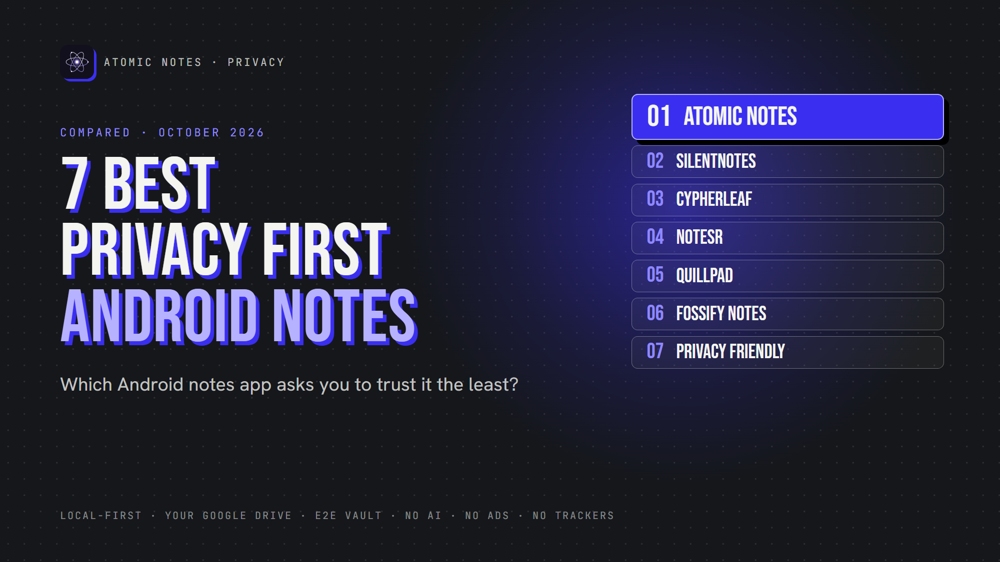
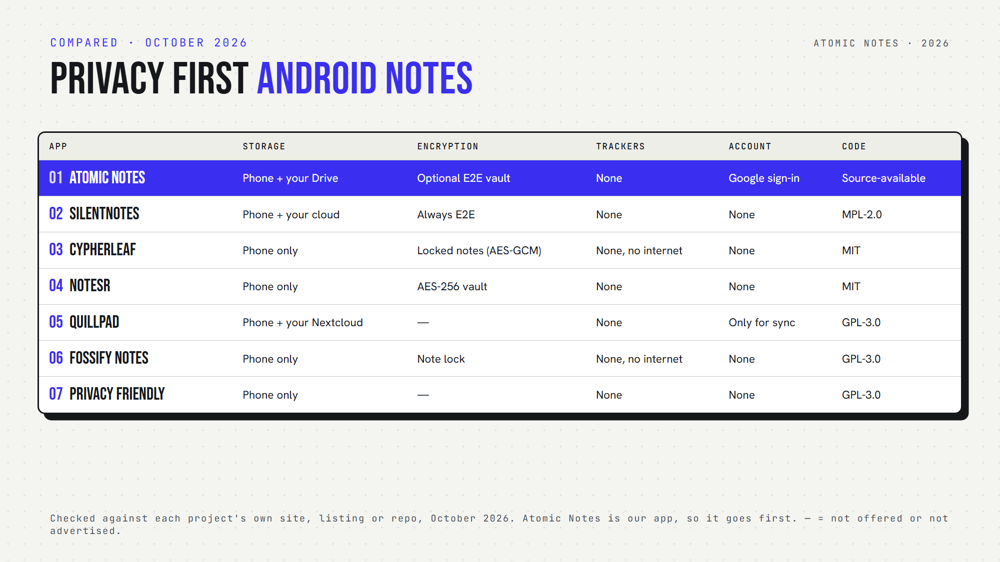

*By Ashutosh Sharma (DevBehindYou), the developer of Atomic Notes. Last updated: October 4, 2026.*

**Key Takeaway:** The best private notes app Android users can pick depends on whether they want sync. Atomic Notes and SilentNotes sync to storage you control. CypherLeaf, NoteSR, Fossify Notes and Privacy Friendly Notes stay fully on your phone. Quillpad syncs only with your own Nextcloud.

Most notes app comparisons ask which app has the most features. This one asks a different question: which app needs the least trust from you?

A private notes app Android users can rely on should keep notes on the phone, avoid trackers, and give you a say over where any cloud copy lives. Encryption and open code help too.

I checked each app's own listing, repository or policy in October 2026. Atomic Notes is my app, so it goes first, and I list its limits like everyone else's.

## Quick answers: which private notes app Android fits you?

- **Which sync without a company server holding your notes?** Atomic Notes (your Google Drive), SilentNotes (your cloud or server) and Quillpad (your Nextcloud).
- **Which never go online?** CypherLeaf and Fossify Notes request no internet permission. NoteSR and Privacy Friendly Notes have no sync at all.
- **Which offer encrypted notes Android users can turn on?** Atomic Notes, SilentNotes, CypherLeaf and NoteSR.
- **Which is an open source notes app Android users can audit?** All six others. Atomic Notes is source-available.
- **Which need an account?** Only Atomic Notes, which uses Google sign-in.
- **Which private notes app Android users can start with zero setup?** Fossify Notes and Privacy Friendly Notes: install and write.

## 1. Atomic Notes

**Best for:** a private notes app Android users can sync into their own Google Drive.

- **Storage:** phone first, then a folder in your own Drive. The server keeps only metadata.
- **Encryption:** optional end-to-end vault (AES-256-GCM), off by default
- **Tracking:** no analytics, crash or ad SDKs. Three Android permissions.
- **Open source:** no, source-available
- **AI:** none
- **Watch out for:** Google sign-in required, 30 notes on the free tier

Atomic Notes is a privacy first notes app built around one rule: your phone holds the real copy. Sync is a convenience, not a requirement. That makes it a private notes app Android users can keep using even if the server disappears.

## 2. SilentNotes

**Best for:** end-to-end encrypted sync across Android and Windows.

- **Storage:** your device, synced to FTP, WebDAV, Dropbox, Google Drive or OneDrive
- **Encryption:** always end to end. Notes never leave the device unencrypted.
- **Tracking:** collects no user information, per the project
- **Open source:** yes (MPL-2.0)
- **AI:** none
- **Watch out for:** Android and Windows only

SilentNotes is the private notes app Android users should try first if they want encryption that's always on.

## 3. CypherLeaf

**Best for:** a fully offline phone notebook with locked notes.

- **Storage:** on your phone only, no account
- **Encryption:** protected notes use AES-GCM with keys in the Android Keystore, plus encrypted backups
- **Tracking:** no ads, no trackers, no internet permission
- **Open source:** yes (MIT)
- **AI:** none
- **Watch out for:** brand new (version 1.0.1, September 2026), and no sync

CypherLeaf is the newest private notes app Android users have on this list, yet it already offers folders, tags, reminders and encrypted backups.

## 4. NoteSR

**Best for:** encrypted notes and file attachments in one vault.

- **Storage:** on your phone, no account, no cloud sync
- **Encryption:** AES-256 for notes and attachments, with encrypted export
- **Tracking:** none, per its listing
- **Open source:** yes (MIT)
- **AI:** none
- **Watch out for:** needs Android 10 or newer

NoteSR works like a secure notes app Android users can treat as a locked drawer for journals and sensitive files.

## 5. Quillpad

**Best for:** Markdown notes with optional Nextcloud sync.

- **Storage:** your phone, with optional sync to your own Nextcloud
- **Encryption:** no built-in note encryption, and you can hide notes
- **Tracking:** no ads, and it never uploads notes without you knowing
- **Open source:** yes (GPL-3.0)
- **AI:** none
- **Watch out for:** sync needs the Nextcloud Notes server app

If you already run Nextcloud, Quillpad turns it into a private notes app Android setup you fully control.

## 6. Fossify Notes

**Best for:** quick notes, checklists and home screen widgets.

- **Storage:** on your phone only
- **Encryption:** none, but you can lock notes
- **Tracking:** no ads and no internet permission
- **Open source:** yes (GPL-3.0)
- **AI:** none
- **Watch out for:** simple by design, with no sync

Fossify Notes is the private notes app Android users reach for when they want a fast list on the home screen.

## 7. Notes (Privacy Friendly)

**Best for:** text, checklist, audio and sketch notes with minimal permissions.

- **Storage:** on your phone, with export to device storage
- **Encryption:** none built in
- **Tracking:** no ads, and only a few permissions
- **Open source:** yes (GPL-3.0)
- **AI:** none
- **Watch out for:** no sync and no encryption

A research group at the Karlsruhe Institute of Technology builds this no tracking notes app as part of its Privacy Friendly Apps series.

## How do you choose the right private notes app Android users trust?

Start with sync. Need your notes on two devices? Pick Atomic Notes, SilentNotes or Quillpad. Happy with one phone? CypherLeaf, NoteSR, Fossify Notes and Privacy Friendly Notes keep everything local.

Then decide on encryption. A privacy focused notes app without encryption still protects you from trackers, but encryption protects you if a cloud copy or backup leaks.

There's no single best private notes app for everyone. The right private notes app Android owners pick should match how far their notes travel.

Finally, check permissions. Any private notes app Android offers should explain every permission it asks for.

## FAQ

### What is the most private notes app for Android?

For notes that never leave the phone, CypherLeaf and Fossify Notes request no internet permission. For synced notes, SilentNotes encrypts everything end to end, and Atomic Notes offers an optional end-to-end vault with sync into your own Google Drive.

### Is a private note taking app Android users find on F-Droid always private?

Usually safer, not automatic. F-Droid builds apps from public source and flags anti-features like tracking. Still, read each app's permissions and sync options. An open source app can still send notes to a cloud you didn't choose.

### Does a private notes app Android users choose need encryption?

Not always. If notes never leave the phone, the app lock and Android's own device encryption cover most risks. Once notes sync or land in a backup, a private notes app Android users trust should encrypt them before they leave.

## Sources

- [Atomic Notes privacy policy](https://atomic-notes.devbehindyou.com/privacy)
- [Atomic Notes source code and releases](https://github.com/DevBehindYou/Atomic-Notes-App-V0.2)
- [SilentNotes on GitHub](https://github.com/martinstoeckli/SilentNotes)
- [CypherLeaf on F-Droid](https://f-droid.org/en/packages/io.gitlab.jrock902.cypherleaf/)
- [NoteSR on F-Droid](https://f-droid.org/en/packages/app.notesr/)
- [Quillpad on F-Droid](https://f-droid.org/en/packages/io.github.quillpad/)
- [Fossify Notes on F-Droid](https://f-droid.org/en/packages/org.fossify.notes/)
- [Fossify Notes privacy policy](https://www.fossify.org/policy/notes/)
- [Notes (Privacy Friendly) on F-Droid](https://f-droid.org/en/packages/org.secuso.privacyfriendlynotes/)
