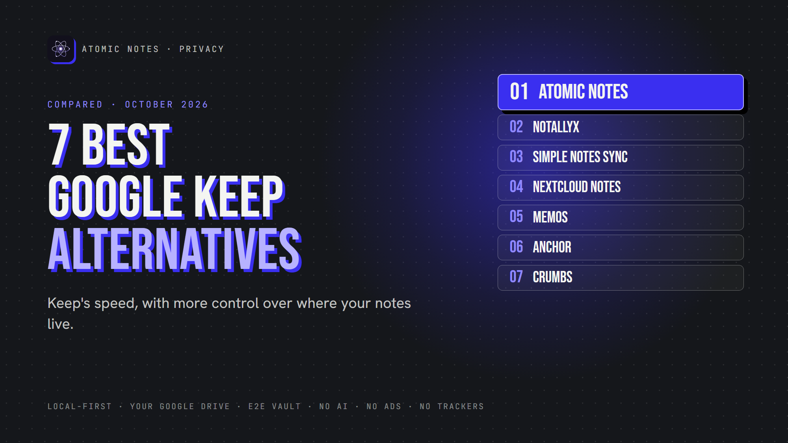
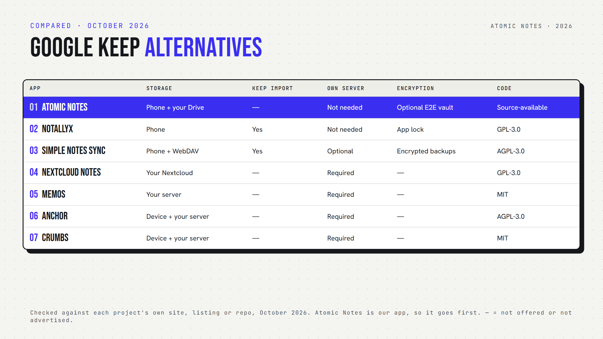

*By Ashutosh Sharma (DevBehindYou), the developer of Atomic Notes. Last updated: October 4, 2026.*

**Key Takeaway:** The best Google Keep alternatives keep Keep's speed while giving you control over storage. Atomic Notes syncs into your own Drive folder. NotallyX and Simple Notes Sync live on your phone. Nextcloud Notes, Memos, Anchor and Crumbs run on a server you host yourself.

Google Keep is popular for good reasons. It opens fast, it's free, and checklists take two taps. Colored cards make a messy brain feel organized.

So why look at Google Keep alternatives at all? Because Keep stores every note on Google's servers, with no end-to-end encryption, inside the same account as your email, photos and search history. If you like Keep's simplicity but want more say over where your notes live, read on.

I checked each app's own listing or repository in October 2026. Atomic Notes is my app, so it goes first, with its trade-offs. Here are the Google Keep alternatives that made the cut.

## Why do people look for Google Keep alternatives?

Most people who search for Google Keep alternatives want one of these:

- **Privacy:** notes stored on the device or a server they control
- **Encryption:** protection the provider can't open
- **Open source:** code anyone can check
- **Offline:** an app that works with no connection
- **Less lock-in:** easier export and import

## Quick answers about Google Keep alternatives

- **Which import your Keep notes?** NotallyX and Simple Notes Sync.
- **Which is an offline Google Keep alternative with no server?** NotallyX and Simple Notes Sync, plus Atomic Notes after sign-in.
- **Which is a self hosted Google Keep alternative?** Nextcloud Notes, Memos, Anchor and Crumbs.
- **Which is an encrypted Google Keep alternative?** Atomic Notes, with its optional end-to-end vault.
- **Which are open source?** All except Atomic Notes, which is source-available.

## 1. Atomic Notes

**Best for:** Keep-style notes and checklists on Android, synced into your own Drive.

- **Storage:** phone first, then a folder in your own Google Drive. The app can only see files it created.
- **Encryption:** optional end-to-end vault
- **Offline:** full
- **Open source:** no, source-available
- **Watch out for:** Android only, and you still sign in with Google

Atomic Notes suits people who trust Google's storage but don't want any notes app reading their writing. With the vault on, even your Drive copy is ciphertext. Among Google Keep alternatives, it's the gentlest switch for Android users who already live in Google's world.

## 2. NotallyX

**Best for:** the closest look and feel to Keep, without the cloud.

- **Storage:** on your phone. It uploads nothing unless you back up to a cloud yourself.
- **Keep features:** colors, pins, labels, reminders, list or grid
- **Privacy:** biometric or PIN lock, and no data collection
- **Import:** Google Keep, Evernote and Quillpad
- **Open source:** yes (GPL-3.0)
- **Watch out for:** after reports of data loss, the developer pulled it from Google Play for now. Turn on daily auto-backups.

NotallyX is the most familiar Google Keep alternative Android users will find, as long as backups stay on.

## 3. Simple Notes Sync

**Best for:** Keep users who want optional sync to their own server.

- **Storage:** on your phone, with optional WebDAV sync (Nextcloud, ownCloud and more)
- **Keep features:** notes, checklists, colored folders, pins, grid or list
- **Import:** your Google Keep archive, including labels
- **Account:** none
- **Open source:** yes (AGPL-3.0)

Simple Notes Sync makes a gentle Google Keep replacement: import, keep writing, and add sync when you're ready.

## 4. Nextcloud Notes

**Best for:** people who already run Nextcloud.

- **Storage:** your Nextcloud server
- **Features:** Markdown, checkboxes, favorites, widgets and an app lock
- **Requires:** a Nextcloud server with the Notes app
- **Open source:** yes (GPL-3.0)

If your family already shares a Nextcloud server, it's one of the easiest Google Keep alternatives to roll out.

## 5. Memos

**Best for:** quick thoughts on a timeline, self-hosted.

- **Storage:** a database on your own server
- **Privacy:** private by default, with zero telemetry
- **Export:** a full ZIP archive
- **Open source:** yes (MIT)
- **Watch out for:** a web app first, so you need Docker and a server

Memos has the biggest GitHub following of the self-hosted Google Keep alternatives here.

## 6. Anchor

**Best for:** offline first notes with your own sync server.

- **Storage:** a local database on each device, synced to your server
- **Platforms:** web and Android, with a home screen widget
- **Export:** plain Markdown in and out
- **Open source:** yes (AGPL-3.0)

Anchor stands out among self-hosted Google Keep alternatives with a native Android app and an offline first design.

## 7. Crumbs

**Best for:** Keep-style cards in a self-hosted web app.

- **Storage:** your device (works offline), synced to your server
- **Features:** Markdown, checklists, images, tags, pins and version history
- **Open source:** yes (MIT)
- **Watch out for:** it includes an MCP server that lets AI assistants manage notes, so check that setup if you don't want AI access

Crumbs is the smallest project among these Google Keep alternatives, so check its activity before you commit.

## How do you choose among Google Keep alternatives?

Start with servers. Don't want to run one? Atomic Notes, NotallyX and Simple Notes Sync work without your own server. Love self-hosting? Nextcloud Notes, Memos, Anchor and Crumbs give you full control.

Next, think about migration. NotallyX and Simple Notes Sync import Keep exports directly, which makes switching painless.

Finally, test the basics: a checklist, a pinned note, a quick search. Good Google Keep alternatives should feel just as fast.

My take: the best Google Keep alternatives keep the speed and ask for less trust. A privacy focused notes app should feel just as easy as Keep.

## FAQ

### What is the best private Google Keep alternative?

For notes that stay on your phone, NotallyX looks most like Keep. For sync with no server to run, Atomic Notes stores notes in your own Drive, with an optional end-to-end vault. For full control, self-host Memos or Nextcloud Notes.

### Is there an open source Google Keep alternative for Android?

Yes. NotallyX, Simple Notes Sync, Nextcloud Notes and Anchor all have open source Android apps. Memos and Crumbs run in any browser. Atomic Notes publishes its code too, under a source-available license.

### Can I move my notes out of Google Keep?

Yes. Export your notes with Google Takeout, then import the archive into NotallyX or Simple Notes Sync. Check the import options of other Google Keep alternatives before you switch. Atomic Notes doesn't import Keep archives yet.

## Sources

- [Atomic Notes privacy policy](https://atomic-notes-community.vercel.app/privacy)
- [Atomic Notes source code and releases](https://github.com/DevBehindYou/Atomic-Notes-App-V0.2)
- [NotallyX on GitHub](https://github.com/Crustack/NotallyX)
- [NotallyX FAQ](https://github.com/Crustack/NotallyX/blob/main/documentation/docs/faq.md)
- [Simple Notes Sync on F-Droid](https://f-droid.org/en/packages/dev.dettmer.simplenotes/)
- [Nextcloud Notes for Android on F-Droid](https://f-droid.org/en/packages/it.niedermann.owncloud.notes/)
- [Memos on GitHub](https://github.com/usememos/memos)
- [Memos data ownership](https://usememos.com/features/data-ownership)
- [Anchor on GitHub](https://github.com/ZhFahim/anchor)
- [Crumbs on GitHub](https://github.com/bretzel-app/crumbs)
