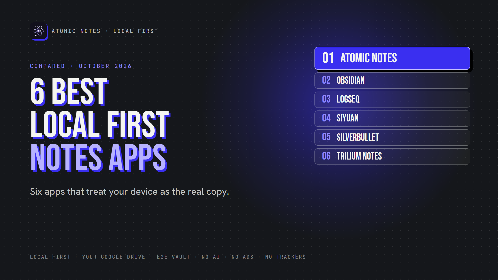
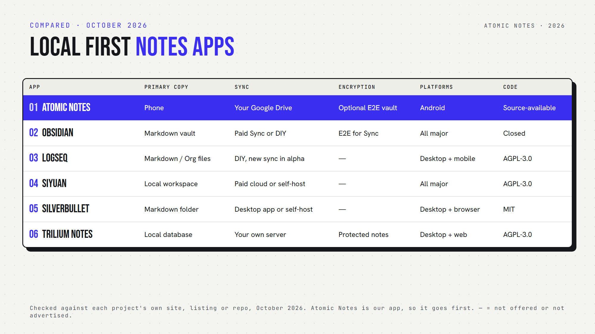

*By Ashutosh Sharma (DevBehindYou), the developer of Atomic Notes. Last updated: October 4, 2026.*

**Key Takeaway:** The best local first note taking apps keep the primary copy on your device and treat sync as optional. Atomic Notes does this on Android with your own Google Drive. Obsidian, Logseq, SiYuan, SilverBullet and Trilium do it on the desktop, each with a different sync story.

Lots of apps say they work offline. Many just cache notes that really live on a server, and the cache runs thin fast when that server has a bad day.

Local first software flips that. Your device holds the real copy, and the cloud only helps you move notes between devices. So the question for every app here is simple: which copy is the primary one? That's how I sorted the best local first note taking apps for this list.

I checked each app's docs or repository in October 2026. Atomic Notes is my app, so it goes first, limits included.

## What makes the best local first note taking apps different?

The best local first note taking apps pass four tests:

1. You can create and open notes with no internet.
2. Changes save on the device before any sync.
3. Sync is optional, and you choose where it goes.
4. If the company's server disappears, your notes stay usable.

An offline cache passes the first test at best. True local first note taking passes all four, and so does every pick on this list of the best local first note taking apps.

## Quick answers about the best local first note taking apps

- **Which keep notes stored locally as plain files?** Obsidian, Logseq (file graphs) and SilverBullet use Markdown files.
- **Which let you self-host sync?** SiYuan, SilverBullet and Trilium.
- **Which sync to storage you already own?** Atomic Notes (your Google Drive) and Obsidian (any folder sync tool).
- **Which are open source?** Logseq, SiYuan, SilverBullet and Trilium. Atomic Notes is source-available. Obsidian is closed source.

## 1. Atomic Notes

**Best for:** a local first notes app on Android with sync into your own Drive.

- **Primary copy:** your phone. Every keystroke saves locally first.
- **Sync:** optional, to a folder in your own Google Drive
- **If the server vanishes:** notes stay on the phone and in your Drive
- **Conflicts:** an edit that collides becomes a separate "conflict copy", never a silent overwrite
- **Encryption:** optional end-to-end vault
- **Watch out for:** Android only, Google sign-in required

Atomic Notes shows what local first means in practice: save locally, sync second. It's the only Android-first entry among the best local first note taking apps here, so think of it as a local notes app with a cloud copy you own.

## 2. Obsidian

**Best for:** Markdown power users on every platform.

- **Primary copy:** a vault folder of Markdown files on your device
- **Sync:** optional paid Obsidian Sync (end-to-end encrypted by default), or any folder sync tool
- **If the company vanishes:** you keep plain Markdown files
- **Encryption:** Sync uses AES-256-GCM, but local vaults stay unencrypted
- **Open source:** no
- **Watch out for:** closed source, and official sync costs extra

Obsidian proves that user owned notes and a polished app can live together.

## 3. Logseq

**Best for:** outliners and daily journaling.

- **Primary copy:** Markdown or Org files on your disk (file graphs)
- **Sync:** your own tools, or Logseq's newer sync
- **Encryption:** not built in for local files
- **Open source:** yes (AGPL-3.0)
- **Watch out for:** the new database version is in beta, and its mobile app and sync are in alpha, so Logseq itself recommends backups

Logseq stays one of the best local first note taking apps for journaling, as long as you stick to file graphs until the database version matures.

## 4. SiYuan

**Best for:** structured, block-based knowledge with self-hosting.

- **Primary copy:** a local workspace on your device
- **Sync:** paid cloud sync, or a self-hosted Docker server
- **Platforms:** Windows, macOS, Linux, Android, iOS, HarmonyOS
- **Open source:** yes (AGPL-3.0)
- **AI:** built-in AI writing and Q&A through the OpenAI API, if you add a key
- **Watch out for:** it doesn't support folder-sync tools, and third-party cloud storage is a paid feature

SiYuan earns its place among the best local first note taking apps with its block editor and self-hosting.

## 5. SilverBullet

**Best for:** tinkerers who want a programmable Markdown wiki.

- **Primary copy:** Markdown pages in an ordinary folder
- **Sync:** a desktop app for macOS, Windows and Linux, or a self-hosted server that keeps working offline in the browser
- **Open source:** yes (MIT)
- **Watch out for:** you get the most from it once you learn its Lua scripting

Few of the best local first note taking apps are this hackable.

## 6. Trilium Notes

**Best for:** a large personal knowledge base with deep hierarchies.

- **Primary copy:** a local database in the desktop app
- **Sync:** optional, to your own self-hosted Trilium server
- **Encryption:** per-note "protected notes"
- **Open source:** yes (AGPL-3.0)
- **AI:** optional assistant, off by default
- **Watch out for:** on mobile, you use the server's web interface or a community app

Trilium rounds out the best local first note taking apps for people who think in note trees.

## How do you choose a local first notes app?

Start with your devices. Phone first? Atomic Notes is the only Android-first pick here. Desktop first? The other five all shine.

Next, decide who runs sync. Want zero servers to manage? Pick Atomic Notes or Obsidian. Happy to self-host? SiYuan, SilverBullet and Trilium give you full control.

Finally, test it: turn off Wi-Fi, create a note, and edit an old one. An offline first notes app passes without a blink. Among the best local first note taking apps, every one here does.

My take: privacy first note taking starts with owning the primary copy. The best local first note taking apps make sure the cloud stays a helper, never a landlord.

## FAQ

### What is the difference between local first and offline mode?

An offline mode caches a copy of notes that live on a server. A local first app keeps the real copy on your device and syncs later. If the server vanishes, a local first app keeps working, while an offline cache slowly goes stale.

### Which of the best local first note taking apps works on Android?

Atomic Notes is built for Android. Obsidian, Logseq and SiYuan also have Android apps, and Trilium works on mobile through its web interface. For a phone-first offline note taking app with sync into your own Drive, Atomic Notes fits best.

## Sources

- [Atomic Notes source code and releases](https://github.com/DevBehindYou/Atomic-Notes-App-V0.2)
- [Obsidian Sync security and privacy](https://obsidian.md/help/sync/security)
- [Logseq on GitHub](https://github.com/logseq/logseq)
- [SiYuan on GitHub](https://github.com/siyuan-note/siyuan)
- [SilverBullet](https://silverbullet.md/)
- [Trilium Notes on GitHub](https://github.com/TriliumNext/Trilium)
- [Trilium AI documentation](https://github.com/TriliumNext/Trilium/blob/main/docs/User%20Guide/User%20Guide/AI.md)
- [Local-first software, Ink & Switch](https://www.inkandswitch.com/essay/local-first/)
