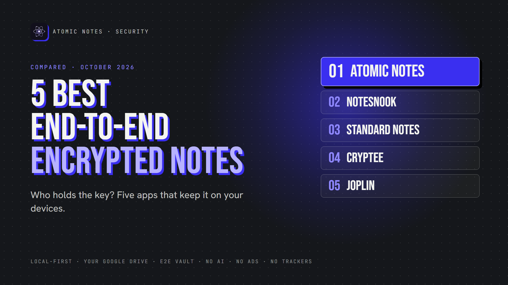
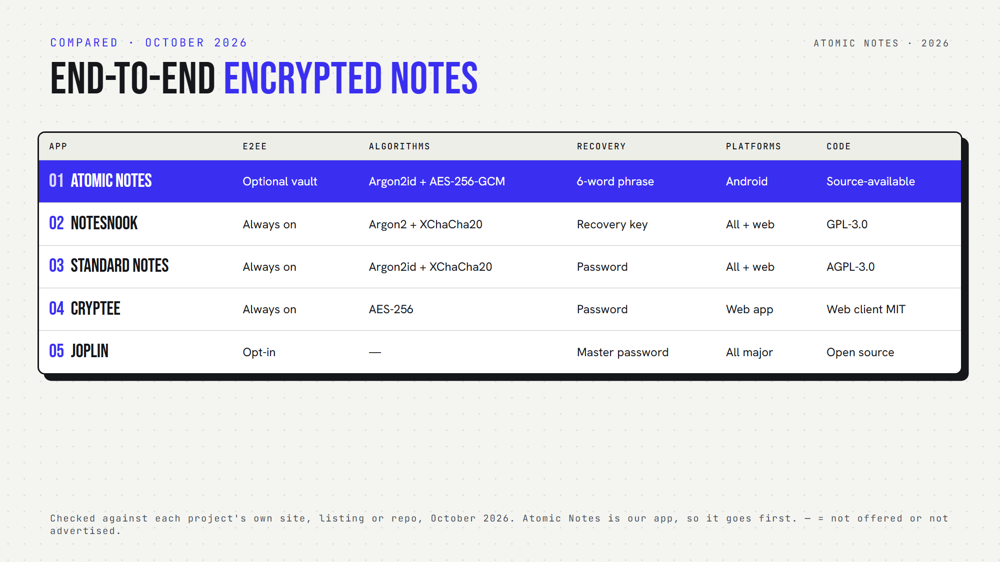

*By Ashutosh Sharma (DevBehindYou), the developer of Atomic Notes. Last updated: October 4, 2026.*

**Key Takeaway:** The best encrypted notes apps encrypt on your device and never hand the server a key. Notesnook, Standard Notes and Cryptee do this by default. Joplin and Atomic Notes offer it as an option you switch on. In every case, lose your password or recovery phrase and nobody can open your notes.

Almost every notes app says it's "encrypted". That word hides a lot. An app might encrypt your notes on the wire, on the server's disk, or on your phone, and the company might still read them.

So this list asks one question that matters more than any cipher name: who controls the key? With the best encrypted notes apps, the answer is always you.

I checked each app's own security docs in October 2026. Atomic Notes is my app, so it goes first, and I'm precise about its limits.

## What does "encrypted" really mean?

Here are five common meanings, from weakest to strongest:

1. **HTTPS:** locked while traveling, readable on the server.
2. **Encrypted server storage:** locked on disk, but the company holds the key.
3. **Encrypted local database:** locked on your phone only.
4. **Client-side encryption:** locked before upload.
5. **End to end encryption:** locked on your device, opened only on your devices.

Compare the two flows:

- **Transport encryption:** Device → HTTPS → Server reads your note
- **End to end encryption:** Device → encrypt → ciphertext → Server → ciphertext → Device → decrypt

Only the second keeps the server blind. That's the bar for the best encrypted notes apps on this list.

The best encrypted notes apps also protect the key itself. They derive it from your password with a slow function like Argon2, so guessing gets expensive.

## Quick answers about the best encrypted notes apps

- **Which encrypt everything by default?** Notesnook, Standard Notes and Cryptee.
- **Which make encryption optional?** Atomic Notes and Joplin.
- **Which offer encrypted notes Android apps can sync?** All five, with Cryptee running as a web app.
- **Which are open source?** Notesnook, Standard Notes and Joplin. Cryptee publishes its web client. Atomic Notes is source-available.

## 1. Atomic Notes

**Best for:** private encrypted notes on Android, synced into your own Google Drive.

- **Encryption:** optional end-to-end vault, off by default
- **Key:** six words you write down become a key on your phone through Argon2id (64 MiB). AES-256-GCM seals each note before upload.
- **Server sees:** note ids, timestamps and flags, never text
- **Recovery:** your six-word phrase. Lose it, and vault notes stay locked.
- **Platforms:** Android
- **Watch out for:** with the vault off, HTTPS and your Google account protect your notes, not end-to-end encryption

Atomic Notes counts among the best encrypted notes apps only when you switch the vault on. I'd rather say that plainly.

## 2. Notesnook

**Best for:** a polished E2EE notes app with encryption always on.

- **Encryption:** everything, on your device, by default
- **Algorithms:** XChaCha20-Poly1305 with Argon2 key derivation
- **Server sees:** ciphertext only
- **Recovery:** a recovery key. Lose both password and key, and the data is gone.
- **Platforms:** Android, iOS, Windows, macOS, Linux, web
- **Open source:** yes (GPL-3.0)

Notesnook is a zero knowledge notes app that feels like a mainstream one, and one of the best encrypted notes apps for people who never want to touch a setting.

## 3. Standard Notes

**Best for:** long-term, simple, encrypted writing.

- **Encryption:** client-side, by default
- **Algorithms:** Argon2id and XChaCha20-Poly1305, with a random key for each note
- **Server sees:** encrypted payloads only
- **Platforms:** web, Windows, macOS, Linux, Android, iOS
- **Open source:** yes (AGPL-3.0)
- **Watch out for:** many editors and extras need a paid plan

Standard Notes joined Proton in April 2024 and kept its open code and encryption. That track record keeps it among the best encrypted notes apps for writing you plan to keep for decades.

## 4. Cryptee

**Best for:** encrypted documents, notes and photos in one place.

- **Encryption:** AES-256, in the browser, before anything leaves your device
- **Server sees:** encrypted files
- **Platforms:** a web app you can install on any device
- **Open source:** the web client is public (MIT)
- **Watch out for:** no native apps, and more storage costs money

Cryptee is built by a small team in Estonia. It's one of the best encrypted notes apps if your notes include photos and files, not just text.

## 5. Joplin

**Best for:** a free, open source, secure note taking app with your choice of sync.

- **Encryption:** end to end, but off until you enable it on each device
- **Covers:** notes, notebooks, tags and attachments
- **Sync targets:** Joplin Cloud, Dropbox, OneDrive, Nextcloud, WebDAV and more
- **Recovery:** none for a lost master password
- **AI:** optional desktop AI chat, off by default
- **Watch out for:** setup takes a few careful steps across devices

Joplin earns its spot among the best encrypted notes apps once you turn encryption on. Its docs advise enabling it on one device, syncing, then moving to the next.

## How do you choose among the best encrypted notes apps?

First, decide whether you want encryption by default. Notesnook, Standard Notes and Cryptee remove the decision. Joplin and Atomic Notes let you choose.

Next, look at recovery. Every one of the best encrypted notes apps will lose your data if you lose the key. Write your password or phrase down offline.

Finally, check metadata. End to end encrypted notes still leave a trail of timestamps and sizes. The best encrypted notes apps keep that trail short.

My take: a private notes app earns the word "encrypted" only when the server can't read your notes. Everything else is marketing.

## FAQ

### What is the most secure encrypted notes app?

There's no single winner. Notesnook and Standard Notes encrypt everything by default with modern algorithms and open code. For Android notes synced to your own Drive, Atomic Notes offers an optional vault. Your password habits matter as much as the app.

### Can the company read my end to end encrypted notes?

No, not if the app is truly end to end encrypted. Your device encrypts each note before upload, and only your devices hold the key. The company can still see some metadata, like when notes change.

### Are the best encrypted notes apps slower?

Barely. Modern phones encrypt a note in a blink. The real cost shows up in setup and recovery, since you must keep a password or phrase safe. Joplin notes that its first encrypted sync can take a while.

## Sources

- [Atomic Notes privacy policy](https://atomic-notes-community.vercel.app/privacy)
- [Atomic Notes source code and releases](https://github.com/DevBehindYou/Atomic-Notes-App-V0.2)
- [How Notesnook encrypts your data](https://notesnook.com/help/how-is-my-data-encrypted)
- [Standard Notes encryption whitepaper](https://standardnotes.com/help/security/encryption)
- [Proton and Standard Notes join forces, April 2024](https://proton.me/blog/proton-standard-notes-join-forces)
- [Cryptee press kit](https://beta.crypt.ee/press-kit)
- [Cryptee web client on GitHub](https://github.com/cryptee/web-client)
- [Joplin end-to-end encryption](https://joplinapp.org/help/apps/sync/e2ee/)
- [Joplin AI chat](https://github.com/laurent22/joplin/blob/dev/readme/apps/ai_chat.md)
