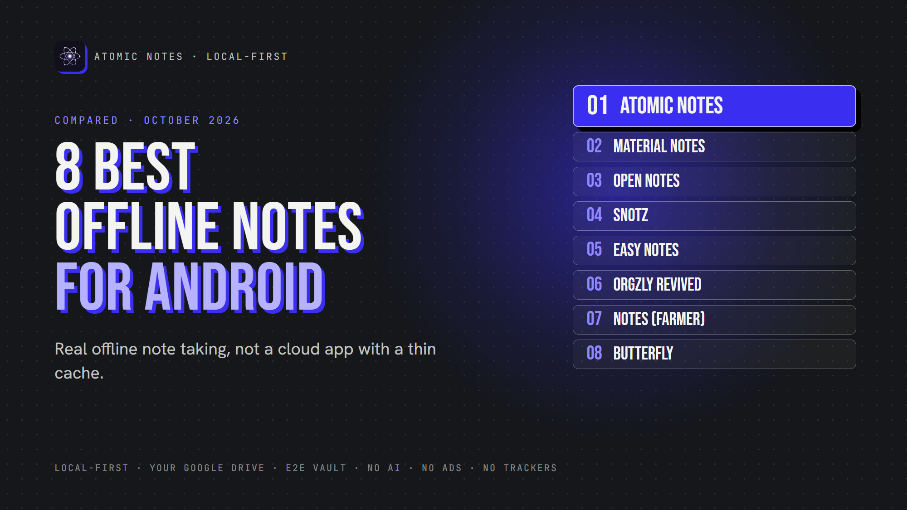
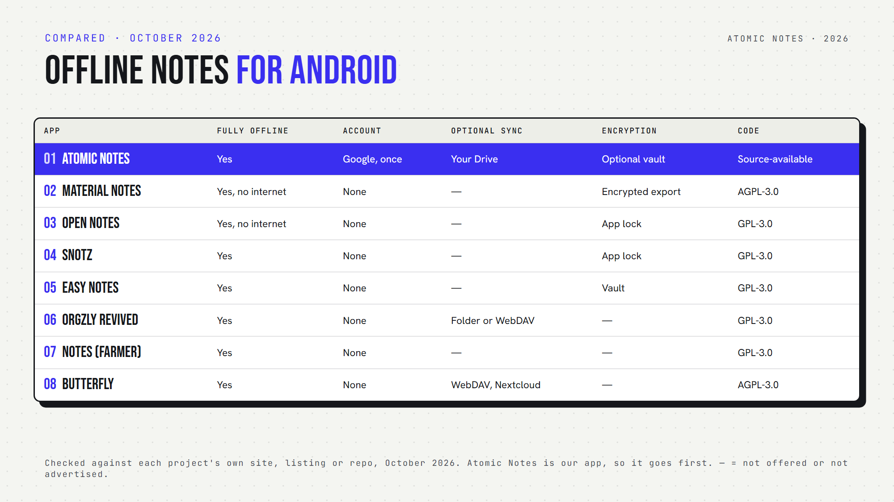

*By Ashutosh Sharma (DevBehindYou), the developer of Atomic Notes. Last updated: October 4, 2026.*

**Key Takeaway:** The best offline notes app Android users can install depends on whether they want sync. Atomic Notes works offline and syncs to your own Google Drive. Material Notes, Open Notes, sNotz and Easy Notes never need the internet. Orgzly Revived, Notes and Butterfly keep plain files you can sync yourself.

Plenty of apps claim offline support. Open one on a plane, though, and you'll often find a cloud app with a thin cache. New notes wait, old notes go missing, and search breaks.

This list separates real offline note taking from cloud-first apps with offline mode. Every pick here lets you create, edit and find notes with no connection at all. That's my bar for the best offline notes app Android users deserve.

I checked each app's own listing or repository in October 2026. Atomic Notes is my app, so it goes first, and I list where it falls short.

## Quick answers: the best offline notes app Android picks at a glance

- **Which never need the internet?** Material Notes, Open Notes, sNotz and Easy Notes.
- **Which is a notes app without account?** All of them except Atomic Notes, which needs a one-time Google sign-in.
- **Which offer optional sync?** Atomic Notes (your Google Drive), Orgzly Revived (folders or WebDAV) and Butterfly (WebDAV or Nextcloud).
- **Which encrypt notes?** Atomic Notes (optional vault), Easy Notes (vault) and Material Notes (encrypted exports).
- **Which are open source?** All except Atomic Notes, which is source-available.

## What makes the best offline notes app Android users can trust?

The best offline notes app Android offers should pass four checks:

1. It opens normally in airplane mode.
2. You can create and edit notes offline.
3. Edits made offline sync safely later, or never need to.
4. You can back up or export your notes.

## 1. Atomic Notes

**Best for:** Android notes offline with optional sync into your own Drive.

- **Offline:** create, edit, read, search and delete with no connection
- **Account:** Google sign-in, once
- **Sync:** optional, queued offline and retried when you reconnect
- **Encryption:** optional end-to-end vault
- **Watch out for:** you need internet for the first sign-in, and 30 notes are free

Atomic Notes is the best offline notes app Android users can pick if they want sync without a company database holding their notes.

## 2. Material Notes

**Best for:** a clean notebook that can't go online even if it tried.

- **Offline:** full. The app has no internet permission.
- **Notes:** plain text, Markdown, rich text and checklists
- **Privacy:** lock the app, single notes or tags
- **Backup:** JSON export (encryption optional) and Markdown export
- **Open source:** yes (AGPL-3.0)

Want the best offline notes app Android can offer with zero network risk? Start here.

## 3. Open Notes

**Best for:** Markdown notes with images and a biometric lock.

- **Offline:** full. It requests no internet access.
- **Tracking:** no trackers or analytics
- **Privacy:** biometric lock and screenshot blocking
- **Backup:** your whole library as one ZIP file
- **Open source:** yes (GPL-3.0)

For Markdown behind a biometric lock, Open Notes is the best offline notes app Android users will find on this list.

## 4. sNotz

**Best for:** simple notes and checklists with secret, hidden notes.

- **Offline:** full, with no cloud or login
- **Privacy:** biometric or PIN lock, plus hidden secret notes
- **Extras:** reminders and home screen widgets
- **Backup:** built-in backup and restore
- **Watch out for:** its last F-Droid release dates from August 2025

sNotz still earns a place on any best offline notes app Android shortlist for quick checklists.

## 5. Easy Notes

**Best for:** Markdown fans who want an encrypted vault.

- **Offline:** full, with zero permissions
- **Notes:** full Markdown, including images
- **Encryption:** a secure, encrypted notes vault
- **Open source:** yes (GPL-3.0)

Easy Notes suits anyone hunting for the best offline notes app Android has when privacy and Markdown both matter.

## 6. Orgzly Revived

**Best for:** Org mode users who plan tasks in plain text.

- **Offline:** full
- **Storage:** plain-text notebooks in Org format
- **Sync:** a device folder, SD card or WebDAV
- **Extras:** schedules, deadlines, priorities, tags and saved searches
- **Open source:** yes (GPL-3.0)

Orgzly Revived works like an offline notebook app for people who love outlines.

## 7. Notes (by Bill Farmer)

**Best for:** Markdown notes saved as ordinary text files.

- **Offline:** full for writing and search
- **Storage:** text files on your phone
- **Backup:** ZIP backups
- **Watch out for:** it requests network access for extras like maps
- **Open source:** yes (GPL-3.0)

## 8. Butterfly

**Best for:** handwriting, sketches and notes on an endless canvas.

- **Offline:** full, with files stored locally
- **Account:** none required
- **Sync:** optional WebDAV or Nextcloud
- **Platforms:** phones, tablets, desktops and the web
- **Open source:** yes (AGPL-3.0)

If you think with a pen, Butterfly is the best offline notes app Android tablets can run.

## How do you pick the best offline notes app Android owners need?

Start with sync. One phone only? Material Notes, Open Notes, sNotz or Easy Notes keep everything local. More than one device? Atomic Notes, Orgzly Revived and Butterfly let you sync on your terms.

Then think about format. Plain files (Orgzly Revived, Notes) age well. App databases (Material Notes, sNotz) need exports for backup.

Finally, try the airplane mode test before you commit. The best offline notes app Android users rely on passes it on day one, and it should keep passing after every update.

My take: the best notes app without internet is the one that never makes you wait. Any notes app without internet should treat the network as optional, not required.

## FAQ

### Which is the best offline notes app for Android?

It depends on sync. For notes that never leave the phone, Material Notes and Open Notes have no internet access at all. For offline writing with sync into your own Google Drive, Atomic Notes fits. Orgzly Revived suits plain-text planners.

### Can I use an offline note taking app Android without an account?

Yes. Seven of the eight apps here need no account at all. Atomic Notes is the exception: it asks for a one-time Google sign-in, then works offline. For local notes Android only, with no sign-in ever, try Material Notes or sNotz.

### Does the best offline notes app Android users pick still need backups?

Yes. Offline means your phone may hold the only copy. If the phone breaks, the notes go with it. Use the app's backup or export, or pick one with optional sync, like Atomic Notes, Orgzly Revived or Butterfly.

## Sources

- [Atomic Notes source code and releases](https://github.com/DevBehindYou/Atomic-Notes-App-V0.2)
- [Material Notes on F-Droid](https://f-droid.org/en/packages/com.maelchiotti.localmaterialnotes/)
- [Open Notes on F-Droid](https://f-droid.org/en/packages/com.opennotes/)
- [sNotz on F-Droid](https://f-droid.org/en/packages/com.sunilpaulmathew.snotz/)
- [Easy Notes on F-Droid](https://f-droid.org/en/packages/com.kin.easynotes/)
- [Orgzly Revived on F-Droid](https://f-droid.org/en/packages/com.orgzlyrevived/)
- [Notes by Bill Farmer on F-Droid](https://f-droid.org/en/packages/org.billthefarmer.notes/)
- [Butterfly on GitHub](https://github.com/LinwoodDev/Butterfly)
