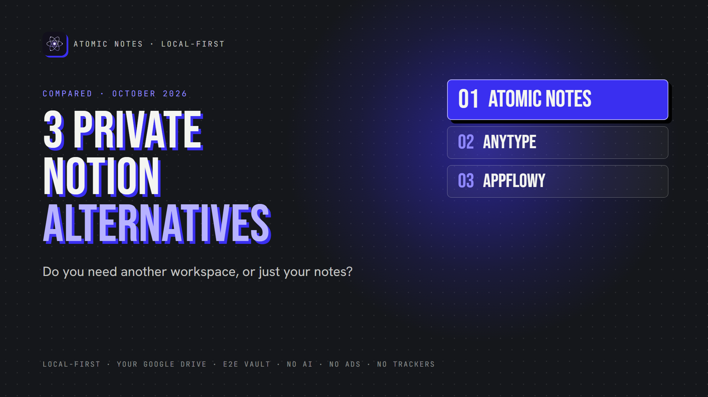
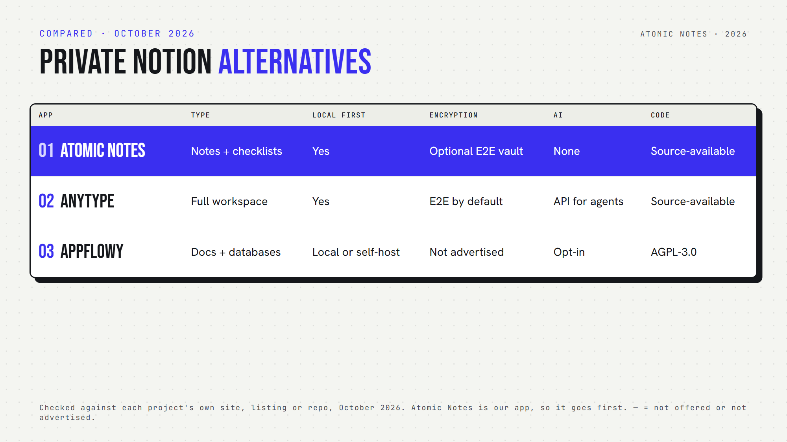

*By Ashutosh Sharma (DevBehindYou), the developer of Atomic Notes. Last updated: October 4, 2026.*

**Key Takeaway:** The best private Notion alternatives depend on how much workspace you need. Anytype is a full local first workspace with end-to-end encryption. AppFlowy is the closest open source match to Notion's docs and databases. Atomic Notes is for people who discover they only need fast, private notes.

Notion is a remarkable product. Docs, databases, wikis, team spaces and AI live in one place, and plenty of companies run on it.

But it's cloud first. Your workspace lives on Notion's servers, without end-to-end encryption, and its AI features sit one click away from your pages. If that bothers you, you're probably searching for private Notion alternatives.

Here's the twist: you might not need another workspace at all. You might just need your notes. So this list covers three different answers, from the most Notion-like to the most minimal.

I checked each app's own repository or docs in October 2026. Atomic Notes is my app, so it goes first, and I'm clear about what it doesn't do.

## What should private Notion alternatives get right?

Good private Notion alternatives get four things right:

- **Ownership:** the primary copy lives with you, and any vendor server is just a backup.
- **Encryption:** the provider can't read your pages.
- **Offline use:** you can open and edit with no connection.
- **Export:** you can leave with your data in a usable format.

Notion's strengths are collaboration and breadth. These private Notion alternatives trade some of that for control.

## Quick answers about private Notion alternatives

- **Which is a local first Notion alternative?** Anytype and Atomic Notes keep the primary copy on your device. AppFlowy runs locally or on a server you host.
- **Which is an encrypted Notion alternative?** Anytype encrypts end to end by default. Atomic Notes offers an optional vault.
- **Which is an open source Notion alternative?** AppFlowy (AGPL-3.0). Anytype and Atomic Notes are source-available.
- **Which has databases and kanban boards?** AppFlowy and Anytype. Atomic Notes doesn't.
- **Which is a Notion alternative without AI?** Atomic Notes. Anytype and AppFlowy both connect to AI.
- **Which private Notion alternatives run on Android?** All three.

## 1. Atomic Notes

**Best for:** people who realize they don't need a workspace, just a private place for notes.

- **Type:** a lightweight notes and checklists app
- **Storage:** your phone first, then your own Google Drive when you sync
- **Encryption:** optional end-to-end vault
- **Offline:** full
- **Collaboration, databases, AI:** none, by design
- **Open source:** no, source-available
- **Watch out for:** Android only. It doesn't try to replace Notion's databases or team spaces.

Atomic Notes is the most minimal of these private Notion alternatives. If your Notion account is mostly lists, drafts and ideas, it may be all you need: a local notes alternative to Notion that opens instantly and never sends a page to an AI. Sometimes the best private Notion alternatives simply do less.

## 2. Anytype

**Best for:** a full, local first knowledge workspace with encryption built in.

- **Type:** pages, tasks, wikis and your own data types, with database-style views
- **Storage:** local first on each device, with optional peer-to-peer sync
- **Encryption:** end to end, zero knowledge, through its any-sync protocol
- **Platforms:** macOS, Windows, Linux, Android, iOS
- **Self-hosting:** yes, you can run your own sync network
- **Open source:** source-available (Any Source Available License 1.0), not OSI open source
- **AI:** an API that AI agents can connect to
- **Watch out for:** its Android build setup includes Amplitude analytics and Sentry crash reporting keys, so read its privacy policy on telemetry

Anytype is the strongest local first Notion alternative for people who want structure. Of all the private Notion alternatives here, it does the most while keeping encryption on by default.

## 3. AppFlowy

**Best for:** teams and individuals who want Notion's layout with control over hosting.

- **Type:** docs, wikis, databases, kanban boards and calendars
- **Storage:** local, AppFlowy's cloud, or your own self-hosted server
- **Encryption:** no end-to-end encryption advertised
- **Platforms:** desktop and mobile, built with Flutter and Rust
- **Open source:** yes (AGPL-3.0)
- **AI:** built in, as opt-in features
- **Watch out for:** it calls itself an AI workspace, so AI sits close to your pages

AppFlowy is one of the most popular open source Notion alternative projects on GitHub, with more than 70,000 stars. Among private Notion alternatives, it's the easiest move if you rely on Notion-style databases.

## How do you choose among private Notion alternatives?

Ask yourself one honest question: what do I actually use in Notion?

- **Databases, boards and team spaces?** AppFlowy feels most familiar.
- **Linked knowledge with strong encryption?** Anytype fits.
- **Mostly notes, lists and drafts?** Atomic Notes may be all you need.

Then check AI. If you want a Notion alternative without AI anywhere in the product, only Atomic Notes qualifies here. Anytype and AppFlowy keep AI optional, but present.

Finally, check offline behavior. Each offline Notion alternative here keeps working without a connection, and Anytype and Atomic Notes are built local first from the ground up.

All three private Notion alternatives have a free way in, so test each with one real project before you move everything.

My take: the best private Notion alternatives match the size of your real needs. A privacy focused productivity app should never make you trade ownership for features you don't use.

## FAQ

### What is the most private alternative to Notion?

On this list, Anytype is the most private alternative to Notion for full workspaces, with local first storage and end-to-end encryption by default. If you only need notes, Atomic Notes keeps them on your phone, syncs to your own Drive, and has no AI.

### Is there an open source Notion alternative that works offline?

Yes. AppFlowy is open source under AGPL-3.0 and can run locally or on your own server. Anytype also works offline, but it uses a source-available license, which lets you read the code without the full freedoms of open source.

### Are private Notion alternatives good for teams?

Some are. AppFlowy and Anytype both support shared workspaces. Atomic Notes is personal only. For a team, check sharing permissions, and whether sync runs on a server you control or on the vendor's cloud.

## Sources

- [Atomic Notes source code and releases](https://github.com/DevBehindYou/Atomic-Notes-App-V0.2)
- [Atomic Notes privacy policy](https://atomic-notes.devbehindyou.com/privacy)
- [Anytype desktop client on GitHub](https://github.com/anyproto/anytype-ts)
- [Anytype Android client on GitHub](https://github.com/anyproto/anytype-kotlin)
- [any-sync protocol on GitHub](https://github.com/anyproto/any-sync)
- [Self-host Anytype with any-sync-dockercompose](https://github.com/anyproto/any-sync-dockercompose)
- [AppFlowy on GitHub](https://github.com/AppFlowy-IO/AppFlowy)
- [AppFlowy documentation](https://docs.appflowy.io/docs/appflowy/readme/welcome-to-appflowy)
