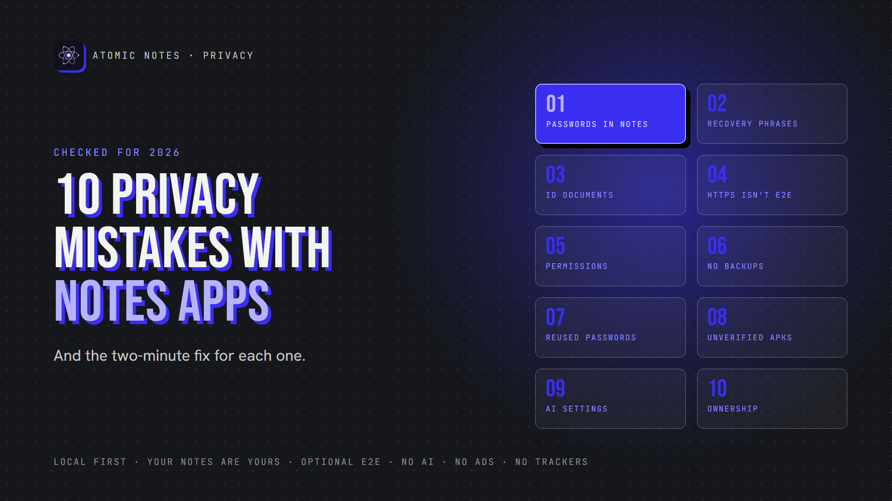
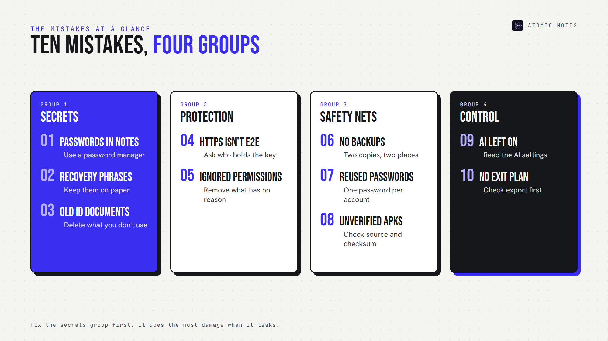
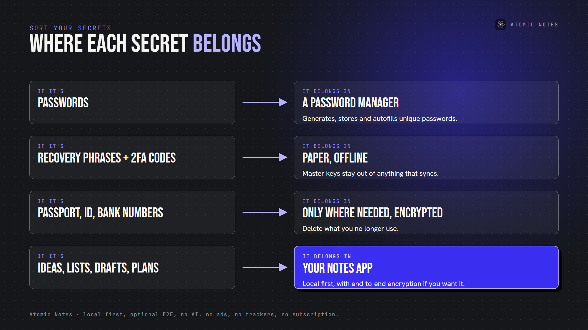
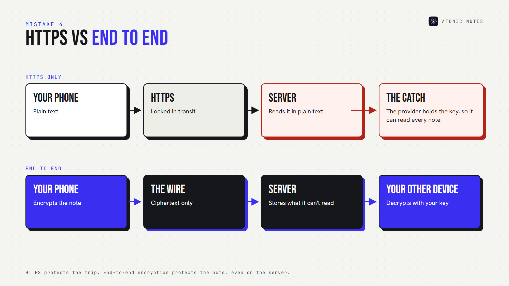
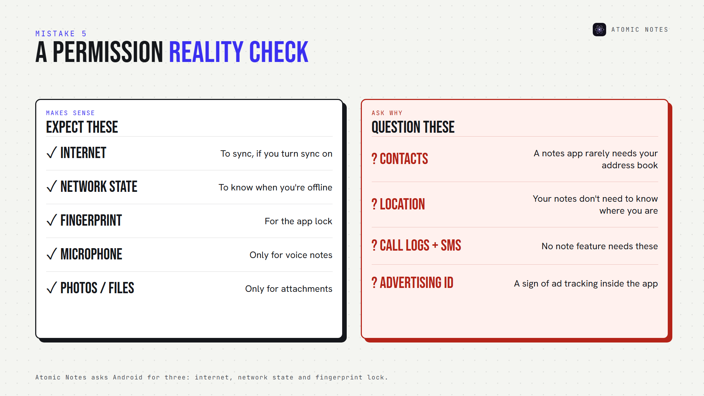

*By Ashutosh Sharma (DevBehindYou), the developer of Atomic Notes. Last updated: October 5, 2026.*

**Key Takeaway:** Most notes app privacy mistakes come from treating a notes app like a safe, a password manager, or a backup, when it may be none of those. Fix the big ten notes app privacy mistakes below, and your note taking privacy improves more than any single setting could.

Your notes app probably knows more about you than your email does. Plans, health worries, bank details, half-finished ideas. That's exactly why small notes app privacy mistakes matter so much.

None of these notes app privacy mistakes make you careless. Developers build notes apps for speed, and speed invites shortcuts. Let's go through the ten notes app privacy mistakes I see most, and the quick fix for each.

## Why do notes app privacy mistakes happen so often?

A notes app feels private because it lives on your phone. Many still sync everything to a company server, run analytics, or connect to AI. That gap between how private an app feels and how private it is causes most notes app privacy mistakes. It also hides plenty of notes app security mistakes, like reused passwords and unverified downloads.

The ten notes app privacy mistakes fall into four groups: secrets (1 to 3), protection (4 and 5), safety nets (6 to 8) and control (9 and 10).

## Mistake 1: Saving passwords in ordinary notes

This is the most common of all notes app privacy mistakes. Note taking privacy starts with keeping credentials out. A note called "logins" feels handy until someone picks up your open phone, or your notes sync to a cloud you never secured.

An ordinary note has no autofill protection, no password generator, and often no encryption on the server. The password storage risk grows with every login you add.

**Fix:** move passwords into a dedicated password manager. CISA recommends one for exactly this job.

## Mistake 2: Storing recovery phrases in notes

Crypto wallet seed phrases, two-factor backup codes and encryption vault phrases are master keys. Whoever holds them holds everything behind them, which makes this one of the notes app privacy mistakes with the biggest blast radius.

Recovery phrase security works best offline: write the phrase on paper and keep it out of anything that syncs.

Atomic Notes shows its six-word vault phrase once and asks you to write it down, on purpose.

**Fix:** keep recovery phrases offline, or in a password manager built for secrets.

## Mistake 3: Keeping identity documents you don't need

Passport numbers, government IDs, banking details and tax records turn a notes app into an identity theft kit. Among notes app privacy mistakes, this one hurts the longest, because you can't easily change your passport number. Note taking privacy also means writing down less of what you don't need.

**Fix:** store only what you actively need, and delete the rest. Keep the must-haves in an encrypted vault.

## Mistake 4: Assuming HTTPS means end to end encryption

HTTPS locks a note while it travels. Once it reaches the server, the provider can usually read it. End-to-end protection locks the note on your device, so the server only ever sees ciphertext.

Treating the two as the same is one of the costliest notes app privacy mistakes. Of all notes app security mistakes, it's also the one marketing pages encourage most.

**Fix:** look for the words "end to end" and ask who holds the key. If the provider holds it, the provider can read your notes.

## Mistake 5: Ignoring notes app permissions

A notes app needs very little, so contacts, location or call logs rarely belong.

Some notes app permissions have honest reasons: a microphone for voice notes, photos for attachments. The point is to know why each one exists. Ignoring them is one of the easiest notes app privacy mistakes to fix. Atomic Notes, for example, asks Android for three: internet, network state and fingerprint lock.

**Fix:** remove any permission without a clear reason.

## Mistake 6: Never creating a data backup

Skipping backups counts among notes app privacy mistakes too. Privacy without recoverability just loses notes another way, and good note taking privacy includes getting them back. A phone dies, a sync breaks, an account locks, and years of writing vanish.

**Fix:** keep at least two copies in two places. Atomic Notes keeps the real copy on your phone and a synced copy in your own Google Drive, so one failure never takes both.

## Mistake 7: Reusing the same account password

If your notes account shares a password with a shopping site, a breach there becomes a breach here. Attackers replay leaked email and password pairs across other sites, which OWASP calls credential stuffing.

It's one of the quieter notes app security mistakes, because nothing looks wrong until someone logs in as you. Reuse turns small notes app privacy mistakes into big ones.

**Fix:** use a unique password for every account, and turn on two-factor sign-in wherever you can.

## Mistake 8: Installing unknown or unverified APKs

Sideloading isn't one of the notes app privacy mistakes by itself. Atomic Notes ships its APKs on GitHub Releases. But APK security depends on the file's source and whether you checked it.

Public code doesn't make every APK safe either: a modified copy can look identical. That makes it one of the notes app security mistakes that can undo every other setting, and one of the notes app privacy mistakes that's hardest to spot.

**Fix:** download only from the official source, compare the published SHA-256 checksum, and check the signature with apksigner.

## Mistake 9: Giving AI access without checking the settings

AI settings are the newest entry on any list of notes app privacy mistakes. AI features summarize, rewrite and search your notes by sending them somewhere. AI notes privacy depends on four answers: what content leaves, whether processing is optional, which provider receives it, and how long they keep it.

The FTC warned in 2024 that quietly rewriting privacy terms to use customer data for AI can be unfair or deceptive. Read the settings before you flip the switch. Your note taking privacy depends on it.

**Fix:** keep AI off for private notes, or choose a notes app that has no AI reading your notes at all.

## Mistake 10: Choosing convenience without checking ownership

This is the mistake that makes all the other notes app privacy mistakes harder to undo. Before you commit years of writing, ask five questions:

- Can you export your notes?
- Can you use them offline?
- Who stores them?
- Can the provider read them?
- What happens if the service shuts down?

Data ownership decides whether you can leave. Cloud notes privacy is only as strong as your answer to "who holds the copy?"

**Fix:** avoid the biggest of all notes app privacy mistakes: pick an app where you can answer all five without guessing.

## How do you avoid notes app privacy mistakes for good?

Run this checklist once to catch notes app privacy mistakes and notes app security mistakes, then repeat it every few months:

1. Know where your notes are stored.
2. Understand the encryption model.
3. Keep backups.
4. Review permissions.
5. Keep critical credentials out of notes.
6. Check AI settings.
7. Use unique account passwords.
8. Verify app download sources.
9. Prefer portable data formats.
10. Know how to leave before you commit.

I built Atomic Notes to make these notes app privacy mistakes harder to make. Your notes live on your phone first. Sync goes to your own Google Drive. An optional encrypted vault seals notes before they leave. There's no AI, no ads, no trackers and no subscription. It's a notes app, and your notes stay yours. Good note taking privacy should be the default, not a setting.

## FAQ

### What are the biggest notes app privacy mistakes?

The biggest notes app privacy mistakes are saving passwords and recovery phrases in ordinary notes. One open phone or one weak cloud account can expose every login at once. Use a password manager for credentials and keep recovery phrases offline.

### Is HTTPS enough to keep my notes private?

No. HTTPS protects notes while they travel, but the provider can usually read them on its servers. For private notes security, look for end to end encryption, where your device encrypts each note and only your devices hold the key.

### How often should I check for notes app privacy mistakes?

Every few months, and after every major app update. For solid note taking privacy, check permissions, AI settings, sync targets and backups. Updates can quietly bring back notes app privacy mistakes, like new AI features that change what leaves your phone.

### Are notes app security mistakes different from notes app privacy mistakes?

Slightly. Notes app security mistakes let someone break in, like reused passwords or unverified APKs. Notes app privacy mistakes let data leak by design, through trackers, AI processing or provider-held keys. The same checklist catches both.

## Sources

- [Use strong passwords, CISA](https://www.cisa.gov/secure-our-world/use-strong-passwords)
- [Credential stuffing, OWASP](https://community.owasp.org/attacks/Credential_stuffing)
- [AI (and other) companies: quietly changing your terms of service could be unfair or deceptive, FTC, February 13, 2024](https://www.ftc.gov/policy/advocacy-research/tech-at-ftc/2024/02/ai-other-companies-quietly-changing-your-terms-service-could-be-unfair-or-deceptive)
- [Install unknown apps, Android Developers](https://developer.android.com/distribute/marketing-tools/alternative-distribution)
- [apksigner, Android Developers](https://developer.android.com/tools/apksigner)
- [Atomic Notes privacy policy](https://atomic-notes-community.vercel.app/privacy)
