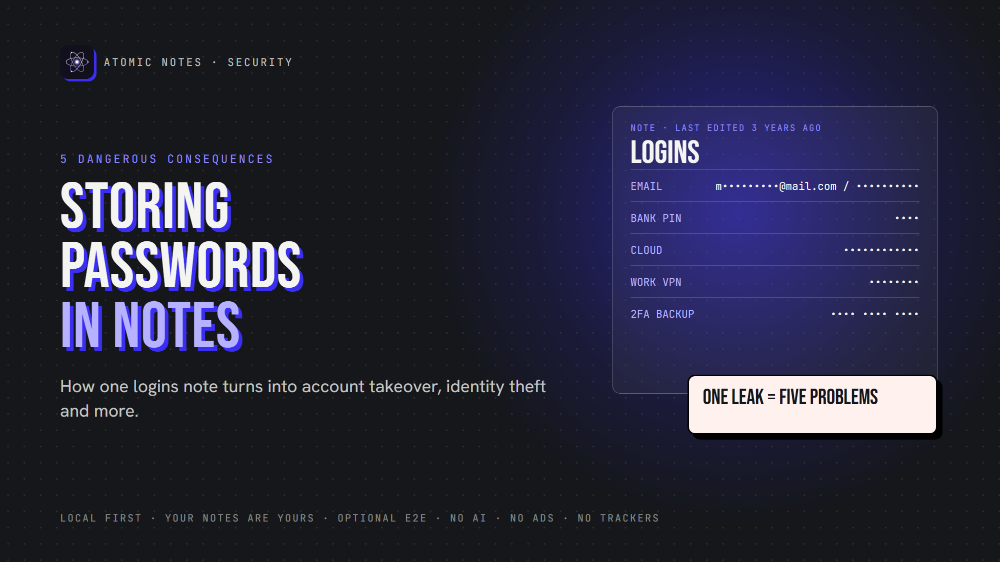
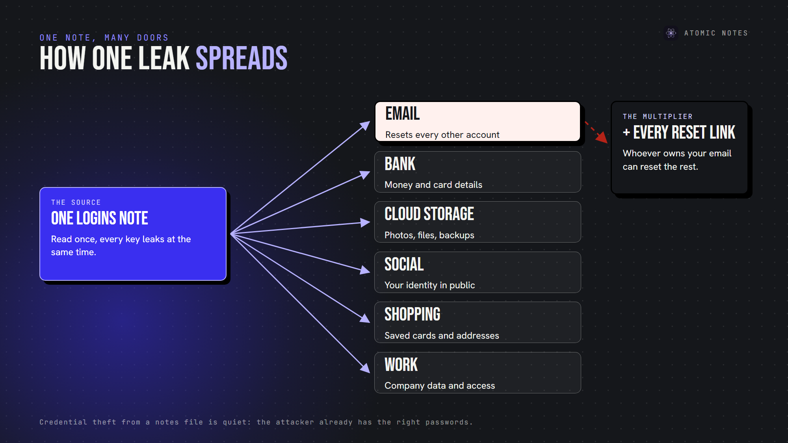
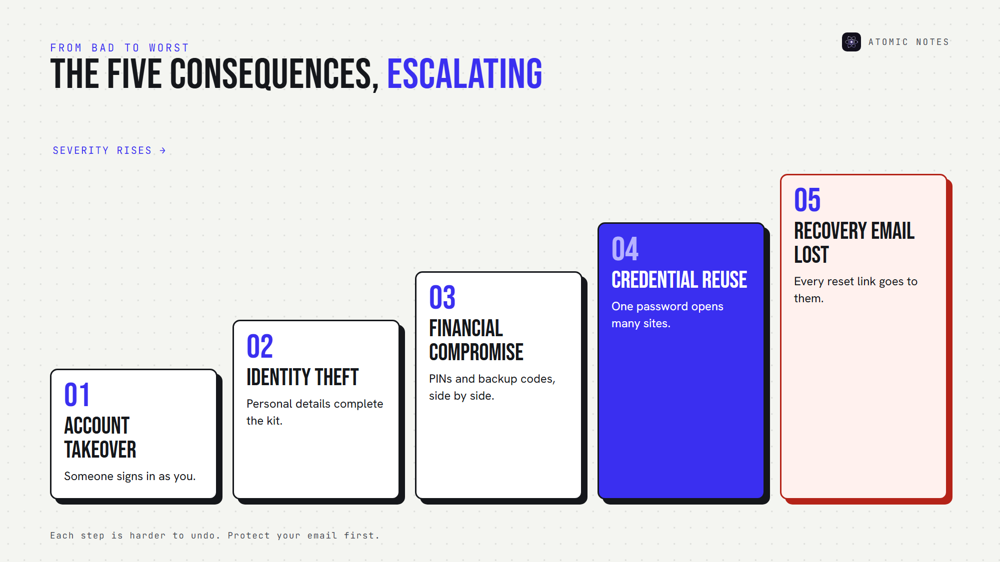
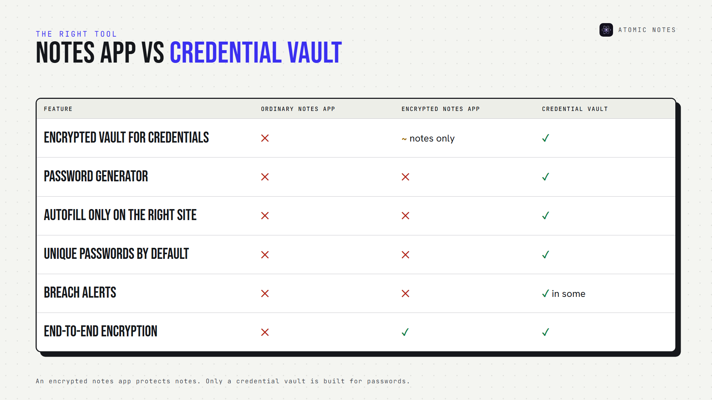
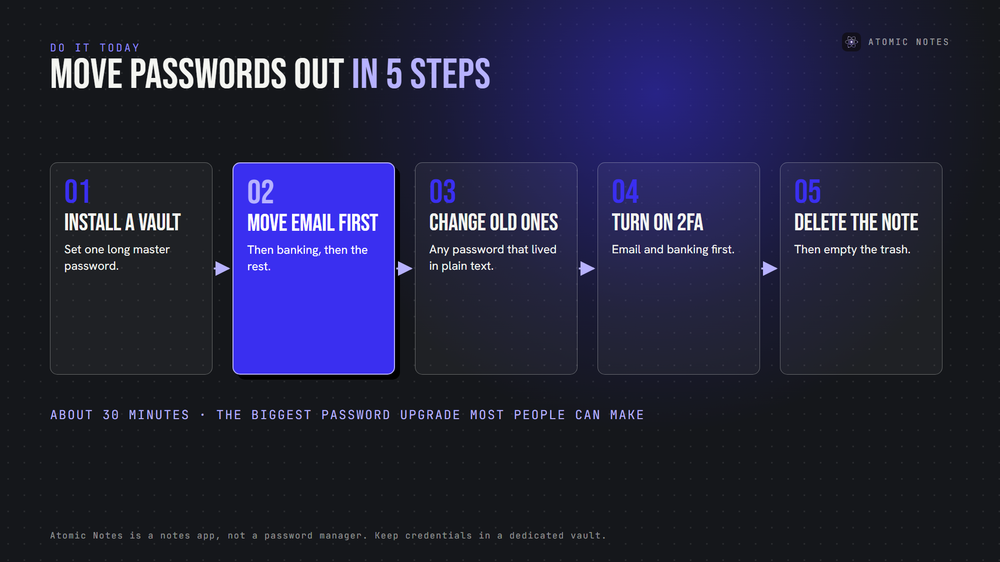

*By Ashutosh Sharma (DevBehindYou), the developer of Atomic Notes. Last updated: October 5, 2026.*

**Key Takeaway:** Storing passwords in a notes app turns one leak into many. A single exposed note can hand over your email, your bank and every account that resets through them. Use a dedicated vault for secure password storage, and keep your notes app for notes. Storing passwords in a notes app is a habit worth breaking today.

It always starts small. A Wi-Fi password. A streaming login. A code you'll "move later." Three years on, that note holds forty logins, two bank PINs and the answer to every security question you've ever set.

Storing passwords in a notes app feels harmless because the app feels private. But the note doesn't stay on your phone. It syncs, backs up, opens on other devices, and sometimes sits on a server in plain text. Storing passwords in a notes app means trusting every one of those places.

Let's look at what storing passwords in a notes app can lead to, why it snowballs, and where your passwords belong instead.

## Why do people keep storing passwords in a notes app?

Because it's fast. The app is already open, copy and paste works, and there's nothing to set up. That's what makes storing passwords in a notes app so common.

The trouble is the trade. Storing passwords in a notes app swaps five seconds of convenience for years of exposure. Most notes apps don't explain their notes app security model either, so you can't even judge the risk. Ask yourself: is it safe to store passwords in notes you'll keep for years?

## Is it safe to store passwords in notes?

Not in an ordinary notes app. Is it safe to store passwords in notes that sync in plain text, with no autofill protection and no separate lock? No. Is it safe to store passwords in notes encrypted end to end? Safer, but still not ideal, because a notes app wasn't built for credentials.

The real problem with storing passwords in a notes app isn't one note. It's what that note connects to.

Each line in that note is a key, and whoever reads the note reads every key at once. That's why storing passwords in notes app lists creates a chain reaction instead of a single problem.

## The 5 consequences of storing passwords in a notes app

### 1. Account takeover

Someone reads the note and signs in as you. It doesn't take a hacker. An open phone, a shared tablet or a synced family laptop is enough.

Account takeover means they can read your messages, change your settings and lock you out. Credential theft from notes is quiet, too. There's no failed login alert when the attacker already has the right password. That's the hidden cost of storing passwords in a notes app.

### 2. Identity theft

Logins often sit next to personal details: date of birth, address, security answers, the last digits of an ID number.

Together, they let someone impersonate you to a phone carrier, a bank or a government portal. Identity theft takes months to unwind, and storing passwords in a notes app beside personal data hands a thief the full kit in one place.

### 3. Financial account compromise

Bank PINs, card numbers and investment logins are the jackpot in any notes file. Financial account security rests on a strong password and a second factor. Storing passwords in a notes app beside your two-factor backup codes breaks both at once. Secure password storage keeps those apart.

The further down that ladder you go, the harder storing passwords in a notes app is to undo.

### 4. Credential reuse attacks

Here's the multiplier. Most people reuse passwords, so one exposed password can open several accounts.

Attackers automate this. OWASP describes credential stuffing as the automated injection of stolen username and password pairs into login forms. A credential reuse attack needs one leaked pair and a list of popular sites, and storing passwords in a notes app hands over dozens of pairs.

Typing passwords by hand from a note also keeps them short and similar.

### 5. Recovery email compromise

Your email is the master key to your digital life, because nearly every "forgot password" link goes there.

If your email password sits in a notes file, one read gives an attacker the reset button for everything else. Recovery email compromise is the worst outcome of storing passwords in a notes app, because the damage outlives your password changes.

**Protect your email first:** a unique password, two-factor sign-in, and recovery codes stored offline.

## How fast does one leaked note do damage?

Here's a realistic sequence once someone reads a logins note:

- **Minute 1:** they copy your email password.
- **Minute 5:** they sign in from a new device.
- **Minute 10:** they reset your bank and cloud passwords through your inbox.
- **Minute 30:** they try the same password on shopping and social sites.

Storing passwords in a notes app compresses all five consequences into one afternoon. If you've ever asked "is it safe to store passwords in notes?", this timeline is the answer. Secure password storage breaks the chain at minute one.

## Why is a password manager different?

A credential vault does one job, while storing passwords in a notes app forces a general tool into it. Here's what secure password storage looks like when someone designs the tool for it:

- **A dedicated encrypted vault** for credentials only
- **Password generation,** so every password is long and random
- **Autofill protection** that fills only on the matching website
- **Unique passwords** everywhere, because you never type them
- **Dedicated key management** around one master password
- **Breach alerts** in some products

None of these exist when you're storing passwords in a notes app.

CISA recommends a password manager for exactly this reason: it keeps a strong, unique password on every account while you remember only one.

Design still matters inside a vault. In 2022, LastPass disclosed that stolen vault backups held fully encrypted passwords but unencrypted website URLs. Secure password storage depends on what's encrypted and what isn't.

## Is it safe to store passwords in notes if they're encrypted?

Encryption helps. It doesn't make storing passwords in a notes app a good idea.

Atomic Notes, the app I build, offers an optional end-to-end encrypted vault. Turn it on, and AES-256-GCM seals every note on your phone before it syncs. Nobody else can read those notes, including me.

But Atomic Notes is a notes app, not a credential vault. It has no autofill, no password generator and no breach alerts. So my advice is the same for every app, mine included: avoid storing passwords in a notes app when a purpose-built tool exists.

A privacy-first notes app should protect everything else you write. Atomic Notes keeps notes on your phone first, syncs them to your own Google Drive, and never shows ads, runs trackers or feeds your writing to AI.

## How do you stop storing passwords in a notes app today?

This takes about thirty minutes, and it's the biggest password security upgrade most people can make.

1. **Install a reputable password vault** for secure password storage, and set a long master password.
2. **Move your email password first,** then banking, then everything else.
3. **Change any password that lived in plain text,** starting with reused ones.
4. **Turn on two-factor sign-in** for email and banking.
5. **Delete the old note,** then empty your notes app's trash.

Done right, plaintext passwords disappear from your life, and so does the chain reaction. That's the real fix for storing passwords in a notes app: a better place, not a better note.

## FAQ

### Is it safe to store passwords in notes on my phone?

Not in an ordinary notes app. Storing passwords in a notes app means they sync, back up and open on other devices, often without separate protection. Keep credentials in a dedicated vault.

### What is the biggest risk of storing passwords in a notes app?

Losing your email. When storing passwords in a notes app, the email password matters most, because it resets every other account. Protect it with a unique password, two-factor sign-in and offline recovery codes.

### Can I store passwords in Atomic Notes?

You can, but I don't recommend storing passwords in a notes app, even mine. The optional vault encrypts notes end to end, yet Atomic Notes has no autofill, generator or breach alerts. Keep credentials in a dedicated vault and use Atomic Notes for everything else.

### Is there a safer way of storing passwords in a notes app temporarily?

If you must, keep it short-lived. Use end-to-end encryption and an app lock, never include email or bank passwords, and move the entry into a vault within a day. Secure password storage is a habit, not a hiding spot.

## Sources

- [Use strong passwords, CISA](https://www.cisa.gov/secure-our-world/use-strong-passwords)
- [Credential stuffing, OWASP](https://community.owasp.org/attacks/Credential_stuffing)
- [Notice of recent security incident, LastPass, December 22, 2022](https://blog.lastpass.com/posts/notice-of-recent-security-incident)
- [Atomic Notes privacy policy](https://atomic-notes.devbehindyou.com/privacy)
