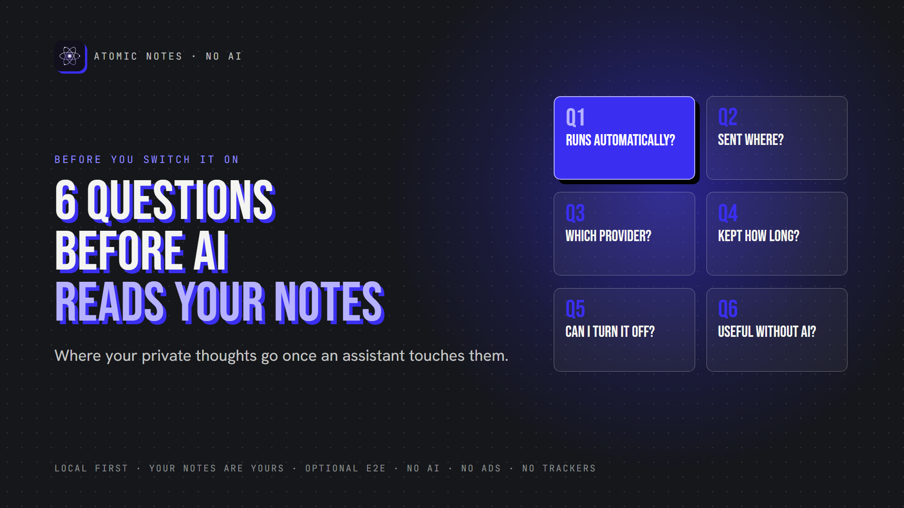
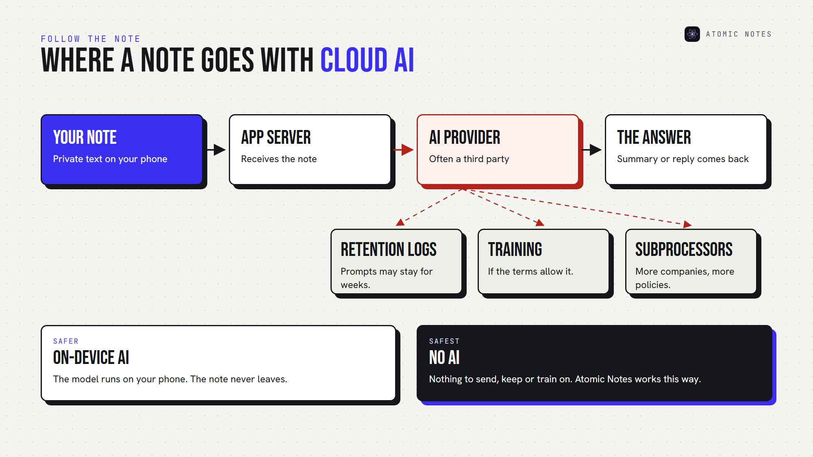
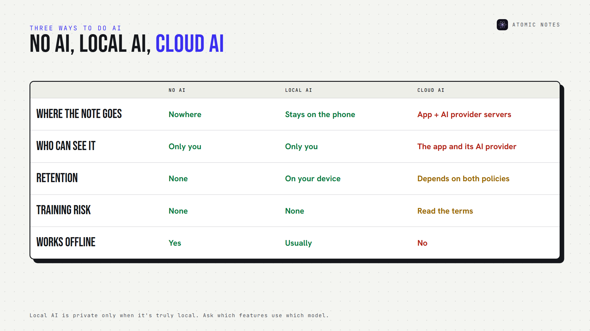
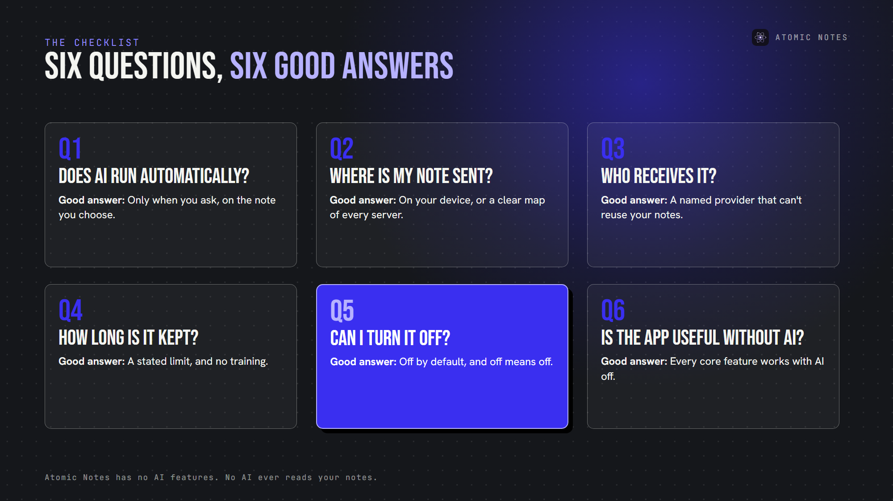
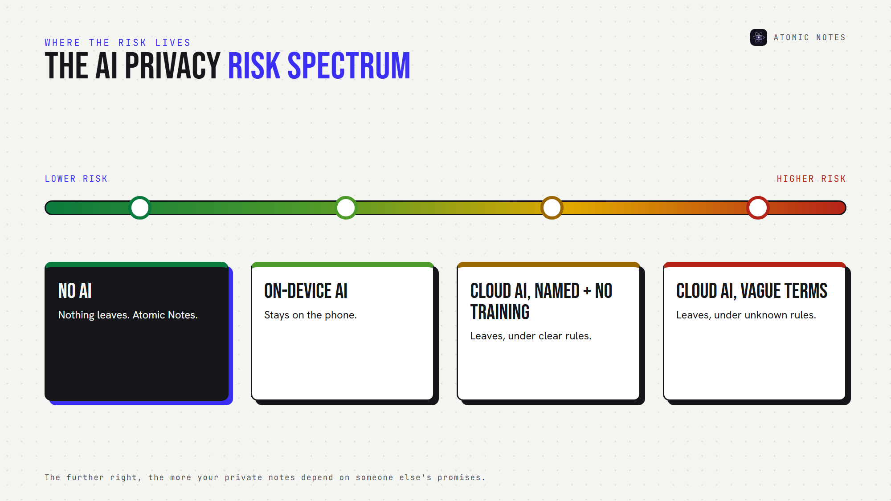

*By Ashutosh Sharma (DevBehindYou), the developer of Atomic Notes. Last updated: October 5, 2026.*

**Key Takeaway:** AI notes app privacy comes down to six answers: whether AI runs automatically, where your notes go, who receives them, how long they stay, whether you can turn AI off, and whether the app still works without it. If an app can't answer all six clearly, keep your private thoughts out of it. Good AI notes app privacy is something you can verify in five minutes.

AI is in almost every notes app now. It summarizes meetings, rewrites drafts, answers questions about your own writing, and sorts notes before you ask.

Some of that is genuinely useful. I'm not here to argue against AI. But a notes app holds your least filtered thinking, and AI notes app privacy is about one thing: what happens to that thinking once an AI touches it.

So before you switch on the assistant, test its AI notes app privacy with six questions. Apps that take privacy seriously answer them on one page. Vague apps answer none.

## Why does AI notes app privacy need its own checklist?

Because notes aren't posts. They're drafts, worries, plans and things you'd never say out loud. A chatbot prompt is something you chose to type. A summary feature may read a note you never meant to share. Generative AI privacy rules written for chat apps don't always fit notes, and AI note taking privacy deserves its own test. That's why AI notes app privacy starts with questions, not settings.

## What changes when AI joins your notes?

Most AI features need your note content to work, which is the root of every AI notes app privacy concern. Summaries read the whole note. Semantic search reads every note. Question answering reads whatever it thinks is relevant. That's note content processing at a scale a plain notes app never needs.

Each feature raises the same AI notes app privacy question: where does the text go for processing, and what stays behind? Your AI note taking privacy depends on the answer.

## Question 1: Does AI process my notes automatically?

This is the first AI notes app privacy check, and the most overlooked. Some features run only when you tap them. Others run in the background: indexing every note for "smart" search, auto-tagging, or drafting summaries you never requested.

Background AI data processing means your notes leave your control even when you're not using the feature. For AI notes app privacy, it's the biggest red flag.

**A good answer:** "AI runs only when you ask, on the note you choose."

## Question 2: Where is my note content sent?

AI notes app privacy depends on three possible destinations:

- **On your device.** A local model processes the note, and nothing leaves your phone.
- **The app's own servers.** The company runs the model, so it sees your note.
- **A third party AI provider.** Your note travels to another company entirely.

Each step outward adds another place your words exist. For AI data privacy, on-device beats cloud, and fewer hops beat more. Every hop matters for AI notes app privacy.

**A good answer:** "On your device," or a clear diagram of every server involved.

## Question 3: Which company or AI provider receives it?

For AI notes app privacy, the provider matters. Many apps don't run their own models. They send text to a third party AI provider and pass the results back.

That means your AI notes app privacy depends on two privacy policies, not one. Look for a named list of subprocessors in the privacy policy. If the app won't say who receives your notes, assume it's more than you'd like. AI note taking privacy shrinks with every company in the chain.

**A good answer:** a named provider, a link to its terms, and a promise that the provider can't use your notes for anything else. That's basic AI data privacy.

## Question 4: How long is the content retained?

AI data retention is the quiet part of AI notes app privacy. A summary takes seconds, but the request may sit in logs for weeks. Some services keep prompts for abuse monitoring, others until you delete your history. AI data privacy includes the right to delete.

Then there's training, the biggest unknown in AI notes app privacy. Your notes could become AI training data if the terms allow it, and terms change. The FTC warned in February 2024 that quietly changing terms to use people's data for AI can be unfair or deceptive.

**A good answer:** a stated retention period, zero training on your content, and a way to delete what was sent.

## Question 5: Can you disable AI functionality completely?

In AI notes app privacy, "off" should mean off. Not hidden, not paused, and not quietly re-enabled after an update.

Check the AI privacy settings for a real switch, ideally one that's off by default. Joplin is a good example: its AI chat is off by default, and it blocks remote AI providers until you allow them.

Watch for half-measures, like an AI button you can hide while background indexing keeps running. Strong AI note taking privacy means the off switch covers everything. A real off switch is the backbone of AI notes app privacy.

**A good answer:** "AI is off until you turn it on, and off really means off."

## Question 6: Does the app stay fully useful without AI?

This AI notes app privacy question reveals the business model. If search, organization or sync quietly depend on AI, you can't say no without losing the app.

A notes app should still be a notes app with AI switched off. If it isn't, AI notes app privacy stops being your choice, and AI data privacy becomes a trade you never agreed to.

**A good answer:** every core feature, from writing to search to sync, works without AI, so AI note taking privacy stays your call.

Here's the whole AI notes app privacy checklist on one card:

## Is local AI the answer to AI notes app privacy?

Usually, yes. Private notes AI that runs on your phone keeps note content on the device, which solves most AI data privacy concerns.

But "local" claims deserve checking too. Some apps run a small model locally and send harder requests to the cloud. Ask which features use which model, and whether you can force local-only. Local AI only helps AI notes app privacy when it's truly local. Good AI notes security starts with knowing exactly where processing happens.

## How does Atomic Notes handle AI?

It doesn't. Atomic Notes has no AI features, and no AI ever reads your notes.

That's a deliberate choice, not a missing feature. Atomic Notes gives you AI note taking privacy by leaving AI out entirely. I built Atomic Notes for people who want notes without AI: a fast, minimal place to write, search and sync, where your words never become anyone's prompt or training data.

- **Local first:** notes save on your phone before anything else.
- **Your storage:** sync goes to a folder in your own Google Drive.
- **Optional end-to-end encryption:** turn on the vault, and the app seals notes before they leave your phone.
- **No ads, no trackers, no subscription,** and no business model built on your writing.

The people who use Atomic Notes support it, not advertisers or data deals. That's the simplest form of AI notes app privacy: there's no AI to ask questions about.

## FAQ

### Is AI notes app privacy possible with cloud AI features?

It can be, if the app answers the six questions above clearly. On-device AI with no retention is the safest setup for AI note taking privacy. Cloud AI with vague terms is the riskiest for AI notes app privacy.

### Can AI companies train on my notes?

Only if the terms allow it, and terms change, which is why AI notes app privacy needs rechecking. Read the training section of both policies. Prefer apps that promise in writing never to use your notes as training data, and that let you delete what you sent. That's what strong AI data privacy looks like.

### Is there a notes app with no AI at all?

Yes. Atomic Notes has no AI features and no AI processing of any kind. Your notes stay on your phone first, sync to your own Google Drive, and the optional vault can encrypt them end to end. The simplest AI notes app privacy setup is no AI at all.

### What should an AI notes app privacy policy include?

Five things: when AI runs, where notes go, which providers receive them, how long they're kept, and whether they're used for training. Add a clear off switch and a deletion option, and you have AI data privacy you can actually verify.

## Sources

- [AI (and other) companies: quietly changing your terms of service could be unfair or deceptive, FTC, February 13, 2024](https://www.ftc.gov/policy/advocacy-research/tech-at-ftc/2024/02/ai-other-companies-quietly-changing-your-terms-service-could-be-unfair-or-deceptive)
- [AI chat (off by default, remote providers blocked by default), Joplin documentation](https://github.com/laurent22/joplin/blob/dev/readme/apps/ai_chat.md)
- [Atomic Notes privacy policy](https://atomic-notes-community.vercel.app/privacy)
