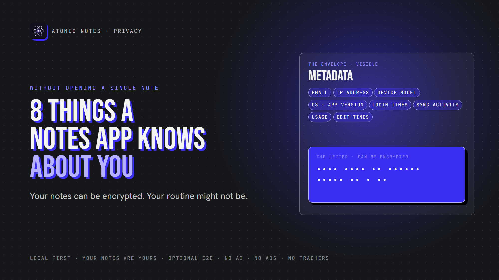
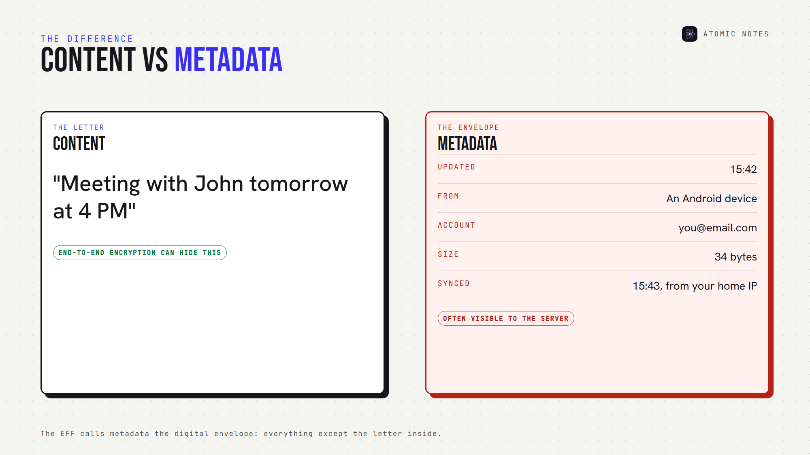
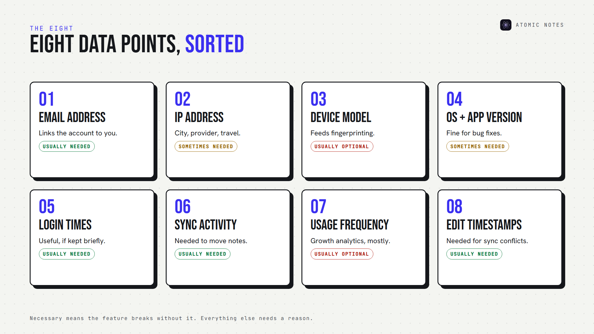
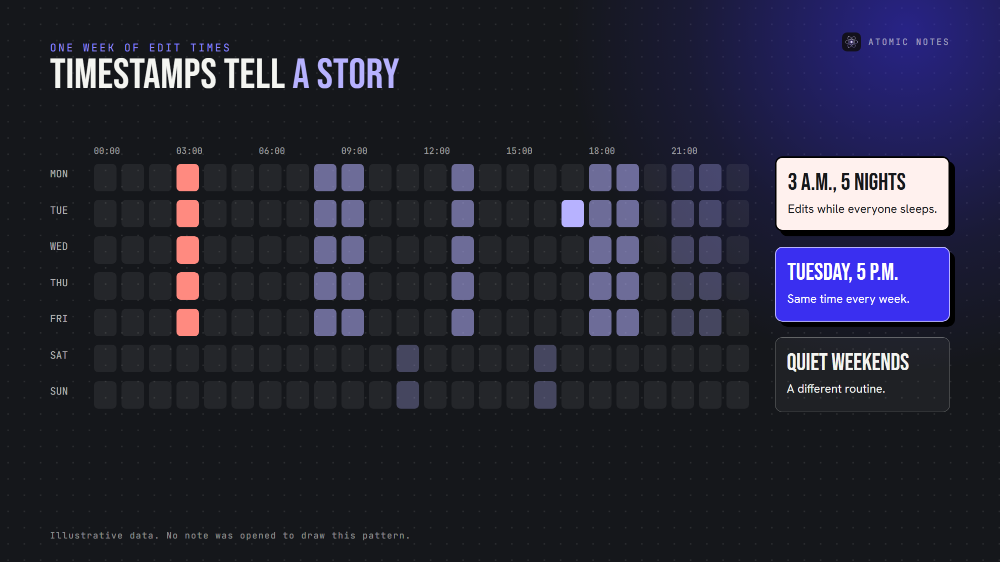
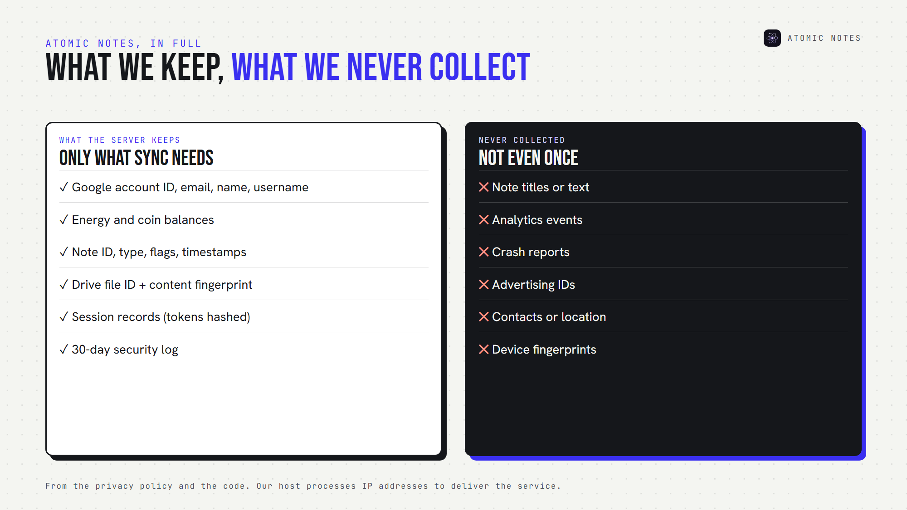

*By Ashutosh Sharma (DevBehindYou), the developer of Atomic Notes. Last updated: October 5, 2026.*

**Key Takeaway:** Notes app data collection doesn't stop at note text. Your email, IP address, device, login times, sync activity, usage and edit timestamps can sketch your routine without anyone opening a note. Some of that metadata is necessary. Much of it isn't, and the best apps collect only what sync truly needs.

"We can't read your notes." It's a good promise. It's also an incomplete one.

An app can keep every note encrypted and still know when you wake up, what phone you carry, which city you're in and how often you write. That's metadata privacy, and it's the half of notes app data collection most people never think about.

Let's break down eight pieces of notes app data collection, which ones an app actually needs, and how to tell the difference.

## What is metadata in a notes app?

Metadata is data about your data. The EFF calls it the digital equivalent of an envelope: everything except the letter inside.

Here's the difference in a single note:

- **Content:** "Meeting with John tomorrow at 4 PM"
- **Metadata:** "Note updated at 15:42 from an Android device"

Encryption protects the content. Notes app metadata usually travels in the clear, because the server needs some of it to sync your notes. Notes app data collection lives in the envelope.

## Why does notes app data collection matter if notes are encrypted?

Because encryption hides words, not behavior. Breaches prove it. In 2022, LastPass disclosed that stolen vault backups held encrypted passwords next to unencrypted website URLs. The secrets stayed locked, and the list of sites still leaked. Notes app data collection works the same way: whatever the server keeps in plain form is what a breach exposes. Less stored data means less to lose.

## The 8 pieces of notes app data collection to know about

### 1. Email address

Almost every account starts with an email. It's account metadata, and it links your notes account to your real identity. That's normal notes app data collection for sign-in, but it also means a breach exposes who you are. Look for apps that use your email only for sign-in and account messages.

### 2. IP address

Every request your app sends carries an IP address. IP address tracking can place you in a city, reveal your internet provider, and show when you travel. Servers and hosting providers process it to deliver data. The question is whether the app stores it, and for how long. Short retention keeps this notes app data collection harmless.

### 3. Device model

Phone make and model is common device information. On its own, this notes app data collection is harmless. Combined with screen size, language and installed fonts, it can feed device fingerprinting, which identifies you even without an account. Device details an app doesn't need are notes app tracking, plain and simple.

### 4. Operating system and app version

Versions help developers fix bugs and send the right updates. They're reasonable notes app data collection when used for compatibility, and unnecessary when stored long-term against your profile.

### 5. Login timestamps

Login activity shows when you sign in, from where, and on which device. It's useful for security alerts. Kept forever, it becomes a diary of your life. Login records are the notes app data collection most worth limiting in time.

Here's how all eight pieces of notes app data collection compare:

### 6. Sync activity

Sync metadata records when your notes sync and how much changed. A sync server needs some of this notes app data collection to work. Notes app tracking starts when sync events feed analytics dashboards instead of just moving your notes.

### 7. Usage frequency

How often you open the app, which screens you use, how long you stay. That's usage analytics, and it's almost never needed for the app to work. Privacy telemetry like this is optional notes app data collection, usually added for growth teams.

### 8. Note counts and edit timestamps

The last piece of notes app data collection is how many notes you keep and when each one changes. Servers often need modification times to resolve sync conflicts. But a list of edit times, kept per note, shows your writing rhythm in detail. It's notes app metadata worth keeping short.

## What can notes app metadata reveal?

More than most notes app data collection policies admit. One timestamp means nothing. A thousand timestamps form a pattern.

Consider what a year of notes app metadata could show: notes edited at 3 a.m. for months, a burst of activity every payday, a new note at the same clinic address every Tuesday. The EFF points out that metadata alone can reveal sensitive medical and personal events.

Patterns also make "anonymous" data identifiable. Researcher Latanya Sweeney found that ZIP code, birth date and sex alone could likely single out about 87% of Americans. Notes app tracking data carries far more detail than that. That's why the scale of notes app data collection matters more than any single field.

## Which notes app data collection is actually necessary?

Some notes app data collection exists for real reasons. A useful test: does the feature break without it?

**Usually necessary:**

- An account identifier, so your devices recognize each other
- Note IDs and modification times, so sync knows what changed
- A short security log, so you can spot a stolen session

**Usually optional:**

- Screen tracking and behavior analytics
- Device fingerprints and advertising IDs
- Long-term IP and location history
- Crash reports that include note context

The principle behind this is data minimization: collect what the feature needs, keep it briefly, and skip the rest. Good notes app data collection is boring by design. Ask any app to sort its data into these two lists. If it can't, that's an answer too.

## How can you check an app's notes app data collection?

You don't need to read code. Five checks cover most of it:

1. Read the "information we collect" section of the privacy policy.
2. Look for retention periods. "As long as necessary" isn't one.
3. Scan Android apps with Exodus Privacy to spot analytics and notes app tracking SDKs.
4. Review the permissions the app requests.
5. Look for an analytics opt-out, or better, no analytics at all.

If the policy lists notes app data collection in vague categories only, assume notes app tracking fills the gaps.

## What notes app data collection does Atomic Notes do?

I'd rather show you our notes app data collection than describe it. Here's everything the Atomic Notes server keeps, taken from its privacy policy and code:

- Your Google account ID, email and name, plus the username you choose
- Energy and coin balances with their history
- For each note: its ID, type, pinned and deleted flags, timestamps, Drive file ID, and a fingerprint of its latest content, so unchanged notes skip re-uploading
- Session records, with each token stored only as a hash
- A 30-day log of security events like sign-ins

What it never collects: note titles or text, analytics events, crash reports, advertising IDs, contacts, location or device fingerprints. The app asks Android for three permissions: internet, network state and fingerprint lock. Our hosting provider processes standard request data like IP addresses to deliver the service.

That's the shape of notes app data collection I think every notes app should publish: specific, short and checkable. Your notes stay on your phone first, sync to your own Google Drive, and the optional vault can seal them end to end, so even the fingerprint covers ciphertext.

## FAQ

### Can a notes app track me without reading my notes?

Yes. Notes app tracking can use metadata like login times, IP addresses, device details and behavior analytics to build a picture of your routine, even when every note is encrypted. Check the privacy policy for analytics, device fingerprinting and retention periods.

### What is the minimum notes app data collection for sync?

An account identifier, note IDs, modification times and a short security log cover most sync needs. Anything beyond that, such as behavior tracking or long-term IP history, is optional notes app data collection, and the app should explain it clearly.

### Does encryption hide notes app metadata?

Usually not. End-to-end encryption hides note content, but the server still sees when notes sync and change. That's why metadata privacy depends on data minimization: collecting less, keeping it briefly, and publishing exactly what's stored.

### Which notes app data collection should worry me most?

Anything that builds a profile over time: behavior analytics, device fingerprints, location and long-term IP logs. Those turn notes app metadata into a behavioral record, and that's where notes app tracking begins. Account and sync data is normal when it's limited and deleted on schedule.

## Sources

- [Why metadata matters, Electronic Frontier Foundation](https://ssd.eff.org/module/why-metadata-matters)
- [Simple demographics often identify people uniquely, Latanya Sweeney, Carnegie Mellon University, 2000](https://dataprivacylab.org/projects/identifiability/)
- [Atomic Notes privacy policy](https://atomic-notes-community.vercel.app/privacy)
