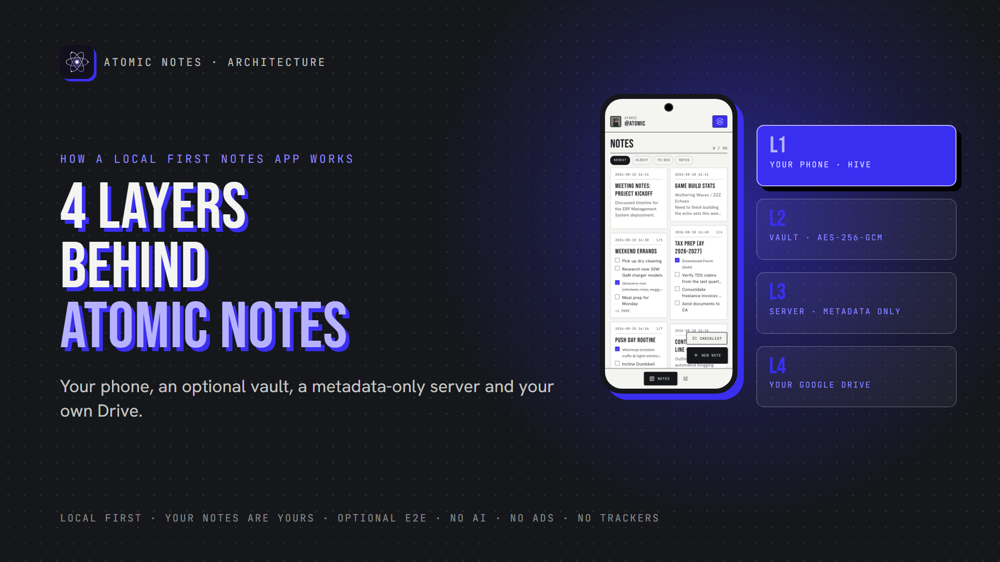
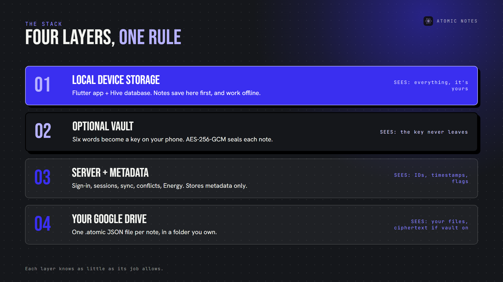
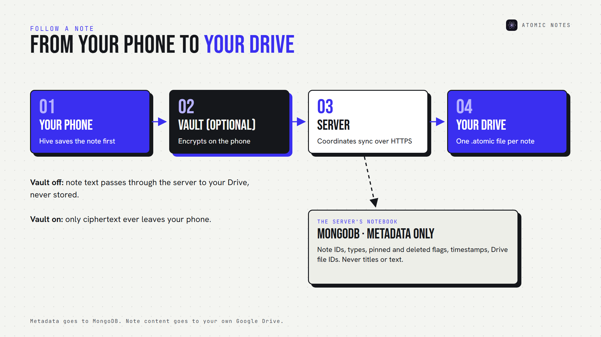
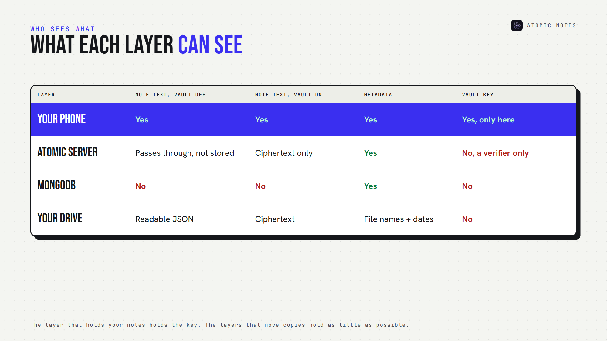
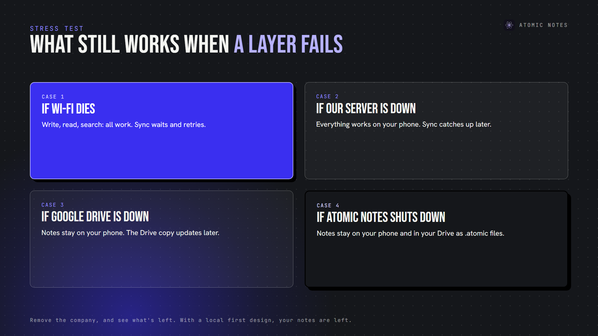

*By Ashutosh Sharma (DevBehindYou), the developer of Atomic Notes. Last updated: October 5, 2026.*

**Key Takeaway:** Atomic Notes uses a local first notes architecture with four layers: your phone stores every note first, an optional vault encrypts notes before they leave, a server coordinates sync while keeping metadata only, and your own Google Drive holds the synced files. Each layer knows as little as its job allows, which is the whole point of local first notes architecture.

Most notes apps ask you to trust a black box. I'd rather show you the box.

This is a plain-English tour of the local first notes architecture behind Atomic Notes. Think of the Atomic Notes architecture as four answers: where notes live, who can read them, who coordinates sync, and where copies end up. The app's code is public on GitHub.

Here's the local first notes architecture of Atomic Notes at a glance:

## Why does local first notes architecture matter?

Because architecture decides who's in charge of your notes. In a cloud-first app, the server holds the real copy and your phone borrows it. In a local first notes architecture, your phone holds the real copy and the cloud helps you move it.

That one choice shapes everything else: offline use, privacy, outages and what happens if the company disappears. The Atomic Notes architecture follows it at every layer. Local first notes architecture also decides what a breach can expose.

A local first app architecture changes who the app serves, too. When the phone is primary, the server can't hold your notes hostage. That's why local first notes architecture is more than a performance trick.

## Layer 1: Local device storage

Atomic Notes is a Flutter notes app for Android, and layer 1 of its local first notes architecture is Hive local storage, a small, fast database on your phone.

- **Writes happen locally first.** Your edit saves to the phone as you write, before any network call.
- **Reading, searching and editing never wait on the network.**
- **Unsynced work stays put.** The app marks a changed note as pending until a sync confirms it.
- **Sync retries on its own.** After a failure, it tries again after 5, 15 and 45 seconds, then on your next edit or reconnect.

This is the heart of local first notes architecture: the phone is the primary copy, not a viewer, and every later layer is optional. In any local first app architecture, this is the layer that must never depend on the network.

## Layer 2: Optional client side encryption

The vault is where client side encryption happens. It's off until you turn it on. In a local first notes architecture, the device that holds the notes should also hold the key.

When you do, the app shows six words from a 1,024-word list. Those words never leave your phone. From them, the app derives a key using Argon2id with 64 MiB of memory and three passes, which makes guessing slow and expensive. AES-256-GCM then seals each note before it syncs.

Two details make this local first notes architecture work across devices:

- **The same six words make the same key on every device.** There's no key file to copy or lose.
- **The server stores only a verifier,** a known value sealed with your key, so the app rejects a wrong phrase immediately.

With the vault on, Atomic Notes becomes an app of end to end encrypted notes: the server and Google Drive only ever hold ciphertext. With it off, HTTPS protects notes on the way, and your Google account protects them in Drive. A local first app architecture should say that difference out loud.

## Layer 3: The Atomic Notes server and metadata

In the Atomic Notes architecture, sync runs through a small server on Vercel with a MongoDB database for metadata. In a local first notes architecture, the server is a coordinator, not an owner, and that split defines a local first app architecture.

The server's jobs in this local first notes architecture:

- **Sign-in and sessions.** The server stores session tokens only as hashes, and you can revoke them.
- **Sync coordination.** Each push carries a request ID, so an interrupted sync replays once instead of duplicating notes.
- **Version tracking and conflicts.** If two devices edit the same note, the later edit becomes a separate "conflict copy", never an overwrite.
- **Atomic Energy and quotas.** The free daily sync allowance and the note limit live here.
- **Metadata.** Note IDs, types, pinned and deleted flags, timestamps and Drive file IDs.

What MongoDB metadata never includes: note titles, text or checklist items. With the vault off, note text passes through the server on its way to your Drive, and the server doesn't store it. With the vault on, only ciphertext passes through. That's how local first notes architecture keeps the server small.

Here's how a note travels through this local first notes architecture:

## Layer 4: Your own Google Drive

The last layer of this local first notes architecture is user owned cloud storage. When you sync, the server writes each note into a folder called "My-Atomic-Notes" in your own Google Drive, one `.atomic` file per note.

Each file is plain JSON. With the vault off, you can open it and read your note. With the vault on, the content field holds ciphertext. Google Drive notes sync also puts your copies behind your Google account's own protections. It's the part of the Atomic Notes architecture people notice most: open Drive, and your notes are there.

Atomic Notes asks Google for the `drive.file` scope, which lets an app see only the files it created. That narrow permission is part of the local first notes architecture too: the app gets exactly the access its job needs.

## What can each layer actually see?

Read this grid row by row, and the local first notes architecture becomes obvious:

That's a local first app architecture in one grid. The layer that holds your notes (your phone) holds the key. The layers that move or store copies (server and Drive) hold as little as possible. That's the core rule of local first software, applied to sync.

## What does this local first notes architecture mean for you?

Here's where this local first notes architecture changes your day:

- **Offline resilience.** An offline first architecture means a cloud outage becomes a sync delay, not a lockout.
- **Ownership.** Your synced notes sit in your Drive as readable files, not inside a company database.
- **Privacy.** The server never stores note text, and the vault can seal everything end to end.
- **Less dependency.** If the Atomic Notes server vanished, your notes would remain on your phone and in your Drive.

Each benefit comes straight from the local first notes architecture, not from a policy promise.

That last point is the real test of any notes synchronization architecture. Remove the company, and see what's left. With this local first notes architecture, your notes are left.

## What are the honest trade-offs of this local first notes architecture?

No local first app architecture is free of trade-offs, and these are mine:

- **You need Google sign-in for now,** because sync runs through Google Drive. I plan to add email sign-in.
- **Sync goes through the server.** It writes to Drive for you, using your Google tokens stored encrypted with AES-256-GCM.
- **The vault is opt-in.** If you never turn it on, notes aren't end-to-end encrypted.
- **Android only, today.**

I'd rather you choose the Atomic Notes architecture knowing all of that. A notes app should never need your blind trust: no AI reading your notes, no ads, no trackers, no subscription, and a local first notes architecture you can check.

## FAQ

### What is local first notes architecture?

A local first notes architecture keeps the primary copy of every note on your device, and the cloud only helps with sync and backup. In Atomic Notes, that means notes work offline and outlive the server.

### Does the Atomic Notes server store my notes?

No. In this local first notes architecture, the server keeps metadata only: IDs, timestamps, flags and Drive file IDs. Note text goes to your own Google Drive, passing through unstored, or as ciphertext with the vault on.

### What happens to my notes if Atomic Notes shuts down?

They stay on your phone, and your synced copies stay in your Google Drive as `.atomic` JSON files. Without the vault, you can read them in any text editor. With the vault on, you need your six-word phrase to open them. That's the point of a local first notes architecture.

### How is the Atomic Notes architecture different from a cloud notes app?

A cloud notes app keeps the primary copy on company servers. The Atomic Notes architecture keeps it on your phone, stores only metadata on the server, and syncs files into your own Drive. Remove the server, and a local first app architecture still works.

## Sources

- [Atomic Notes source code and releases](https://github.com/DevBehindYou/Atomic-Notes-App-V0.2)
- [Atomic Notes privacy policy](https://atomic-notes-community.vercel.app/privacy)
- [Choose Google Drive API scopes (drive.file), Google for Developers](https://developers.google.com/workspace/drive/api/guides/api-specific-auth)
- [Local-first software, Ink & Switch](https://www.inkandswitch.com/essay/local-first/)
