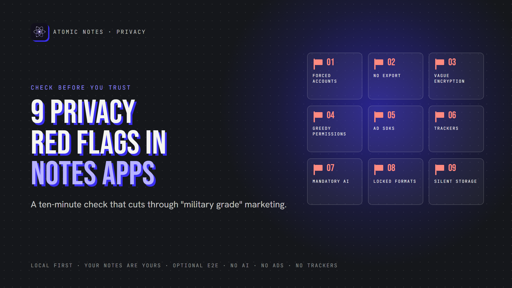
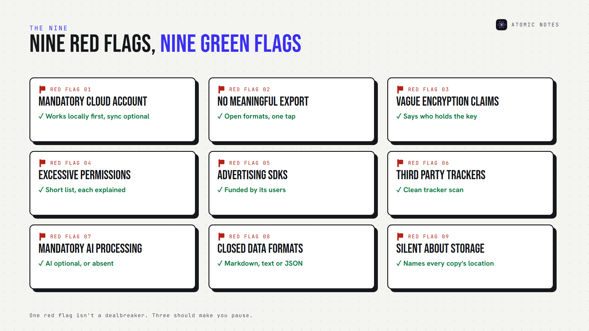
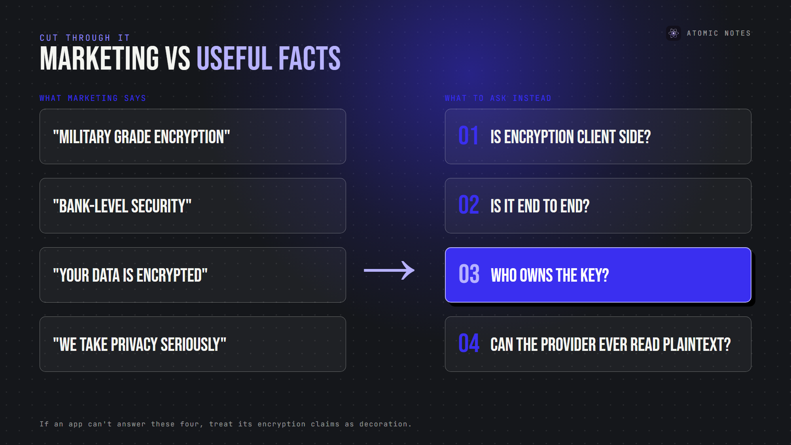
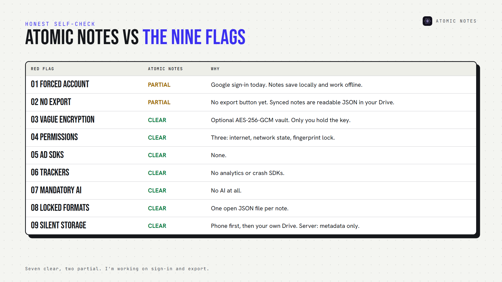
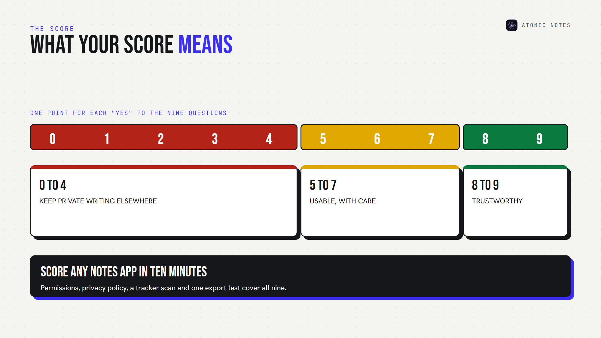

*By Ashutosh Sharma (DevBehindYou), the developer of Atomic Notes. Last updated: October 5, 2026.*

**Key Takeaway:** A private notes app explains where your notes live, who holds the key, and how to leave. Nine red flags expose the apps that don't: forced cloud accounts, no export, vague encryption, greedy permissions, ad SDKs, trackers, mandatory AI, locked formats and silence about storage.

Every notes app calls itself a private notes app. Few of them prove it.

You don't need to read code to tell the difference. A private notes app leaves clues in its settings, its permissions and its privacy policy. So do the apps that only pretend. A private notes app earns trust with specifics.

Use these nine red flags before you install a private notes app, or before you move years of notes into one. For each, I'll cover why it matters, what to look for, and what a better private notes app does instead.

Treat the list as a filter. One red flag doesn't rule out a private notes app, but three should make you pause.

## Marketing claims versus useful facts

Before the flags, one skill every private notes app shopper needs: telling marketing from information.

"Military grade encryption" is marketing. It names an algorithm, usually AES, and says nothing about who holds the key. A secure notes app answers four questions instead:

- Is encryption client side?
- Is it end to end?
- Who owns the key?
- Can the provider ever read plaintext?

If a private notes app can't answer those four, treat its encryption claims as decoration.

## Red flag 1: Mandatory cloud accounts

**Why it matters:** an account ties every note to your identity and to the company's servers. If the account locks, your notes may lock with it, which no private notes app should allow.

**Look for:** whether you can write notes before signing up, and whether sync is optional.

**Better:** a private notes app that works locally first and treats the account as a sync feature, not a gate.

## Red flag 2: No meaningful export

**Why it matters:** if you can't leave, you don't really own your notes. Data ownership starts with the exit door, and a privacy focused notes app makes leaving easy.

**Look for:** data export options in open formats like Markdown, plain text or JSON, including attachments.

**Better:** one-tap export of everything, or a private notes app that stores notes as readable files you can copy anytime.

## Red flag 3: Vague encryption claims

**Why it matters:** "encrypted" can mean HTTPS only, server-side encryption with the provider's key, or true end-to-end encryption. Only the last keeps the provider out.

**Look for:** a security page that names where encryption happens and who holds the key.

**Better:** clear notes app encryption documentation, written for normal people. Any privacy focused notes app should explain its model on one page.

## Red flag 4: Excessive device permissions

**Why it matters:** notes app permissions show what the app can reach. A notes app asking for contacts, location or call logs is collecting more than notes.

**Look for:** the permission list on the app store page or in your phone's settings, a quick test for any private notes app. A secure notes app requests what its features need, and nothing else.

**Better:** a short list with a reason for each item. A private notes app can work with very few.

## Red flag 5: Advertising SDKs

**Why it matters:** ads need targeting, and targeting needs data about you. In 2023, the FTC acted against GoodRx for sharing health information with advertising platforms through tracking code.

**Look for:** ads inside the app, or advertising SDKs in its tracker report.

**Better:** a privacy focused notes app funded by its users, not by advertisers. A private notes app has no ad slots to fill.

## Red flag 6: Third party analytics or trackers

**Why it matters:** third party tracking sends your behavior to companies you've never heard of. Notes app telemetry can reveal your routine even when your notes stay encrypted.

**Look for:** trackers listed by Exodus Privacy, a free scanner for Android apps.

**Better:** zero trackers, zero analytics SDKs, and a policy that says so plainly. A secure notes app has no reason to watch you write.

## Red flag 7: Mandatory AI processing

**Why it matters:** AI features send note content to a model, often run by a third party. If you can't turn them off, AI notes privacy isn't your decision. A privacy focused notes app treats AI as a choice.

**Look for:** an AI switch that's off by default, and a named AI provider.

**Better:** AI that's optional and clearly scoped, or a private notes app with no AI at all.

## Red flag 8: Closed or locked data formats

**Why it matters:** a proprietary format can trap years of writing in one app. Even with an export button, a format nothing else reads is a soft lock-in.

**Look for:** what an export file actually contains. Open it in a text editor.

**Better:** standard formats. An open source notes app often stores plain Markdown, which any editor can read. A private notes app should never hold your writing hostage.

## Red flag 9: No clear answer to "where are my notes stored?"

**Why it matters:** cloud notes privacy depends on whose servers hold your notes, in which country, and under whose key.

**Look for:** a plain statement of where notes live: device, company cloud, or your own storage. A secure notes app answers this in one sentence.

**Better:** a private notes app that names every place a copy exists.

## Why do so many notes apps raise these flags?

Follow the money. Ads need tracking, growth teams want analytics, and AI features need your text. A private notes app needs a business model that doesn't depend on your data, or the flags creep back in. That's why I built Atomic Notes so its users support it: no ads, no subscription, no data deals. A privacy focused notes app and a secure notes app start with the same question: who pays?

## How does Atomic Notes score on these nine flags?

I'd be a hypocrite to skip my own app. Here's an honest scorecard for Atomic Notes, the private notes app I build:

- **Flag 1, partial:** sign-in needs a Google account today, but notes save on your phone first and work offline. I plan to add email sign-in.
- **Flag 2, partial:** there's no export button yet, but every synced note is a readable JSON file in your own Google Drive.
- **Flags 3 to 7, clear:** an optional AES-256-GCM vault with a key only you hold, three Android permissions, no ads, no trackers, no AI.
- **Flag 8, clear:** one open JSON file per note.
- **Flag 9, clear:** your phone first, then your own Drive. The server keeps metadata only.

A private notes app should show its weak spots too. Mine are flags 1 and 2, and I'm working on both.

## A 10-minute private notes app check

Score one point for each "yes":

1. Can I write notes without an account?
2. Can I export everything in an open format?
3. Does the app say who holds the encryption key?
4. Are the permissions few and explained?
5. Is it free of ad SDKs?
6. Does a tracker scan come back clean?
7. Is AI optional, or absent?
8. Is the data format standard?
9. Does the app say exactly where notes are stored?

Eight or nine points: a trustworthy private notes app. Five to seven: usable, with care. Under five: keep your private writing elsewhere, and find a privacy focused notes app that earns it. An offline notes app that scores high here will serve you for years.

## FAQ

### What is the biggest red flag in a private notes app?

Vague encryption. If an app says "encrypted" without explaining who holds the key, assume the provider can read your notes. A private notes app names where encryption happens, says whether it's end to end, and tells you what happens if you lose your key.

### How can I check if a notes app has trackers?

For Android apps, search the app on Exodus Privacy, which lists embedded trackers and permissions. Then read the privacy policy for "analytics," "advertising" and "third parties." A privacy focused notes app should come back clean on both.

### Is a secure notes app the same as a private notes app?

Not quite. A secure notes app protects notes from attackers. A private notes app also limits what the company itself collects, shares and processes. The best ones do both: strong encryption, minimal data collection, and no trackers.

### Can a private notes app still use the cloud?

Yes. Privacy depends on who holds the key and what the server can see. A private notes app can sync safely with end-to-end encryption, or by storing files in cloud storage you own, like your own Google Drive.

## Sources

- [What Exodus Privacy does, Exodus Privacy](https://exodus-privacy.eu.org/en/page/what/)
- [FTC enforcement action against GoodRx, February 2023](https://www.ftc.gov/news-events/news/press-releases/2023/02/ftc-enforcement-action-bar-goodrx-sharing-consumers-sensitive-health-info-advertising)
- [Right to data portability, GDPR Article 20](https://gdpr-info.eu/art-20-gdpr/)
- [Atomic Notes privacy policy](https://atomic-notes-community.vercel.app/privacy)
