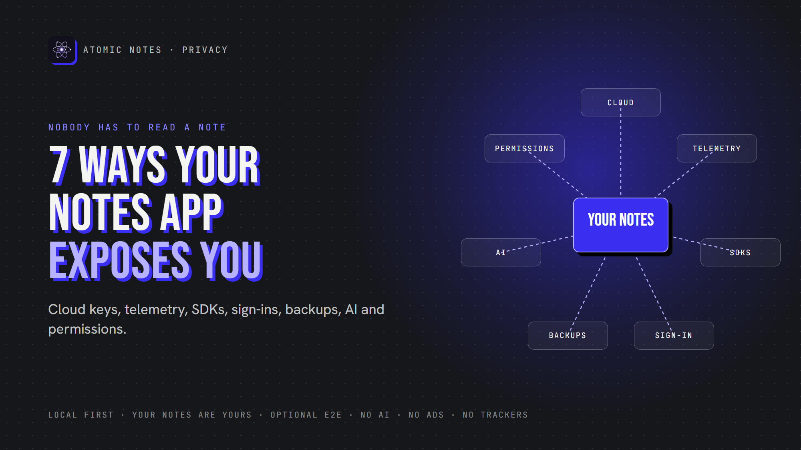
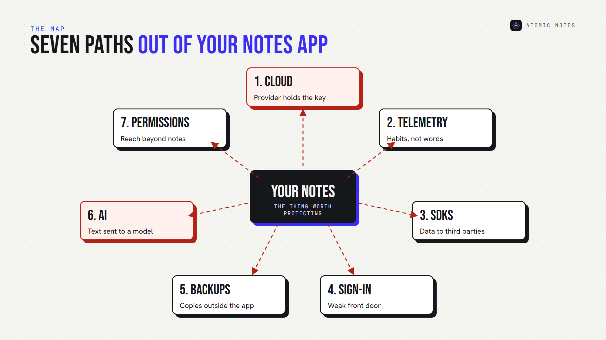
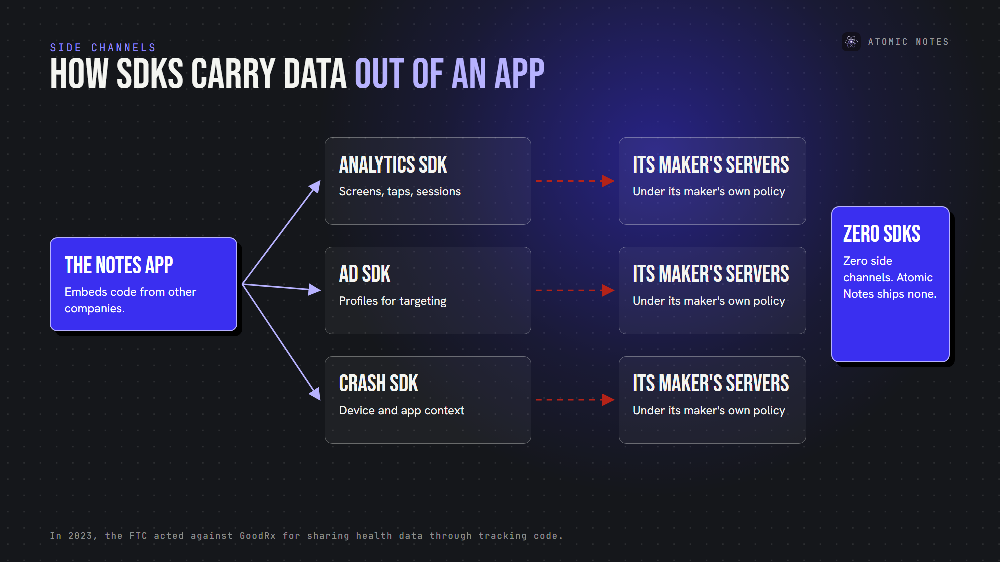
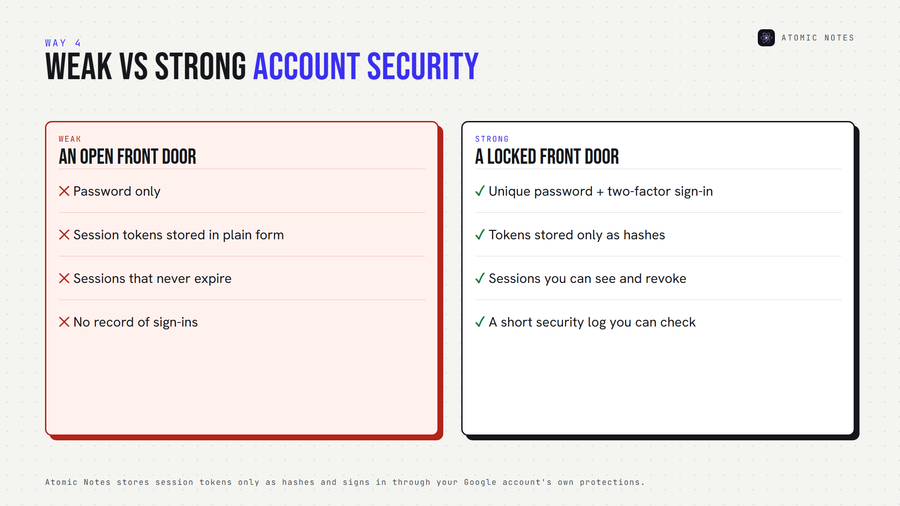
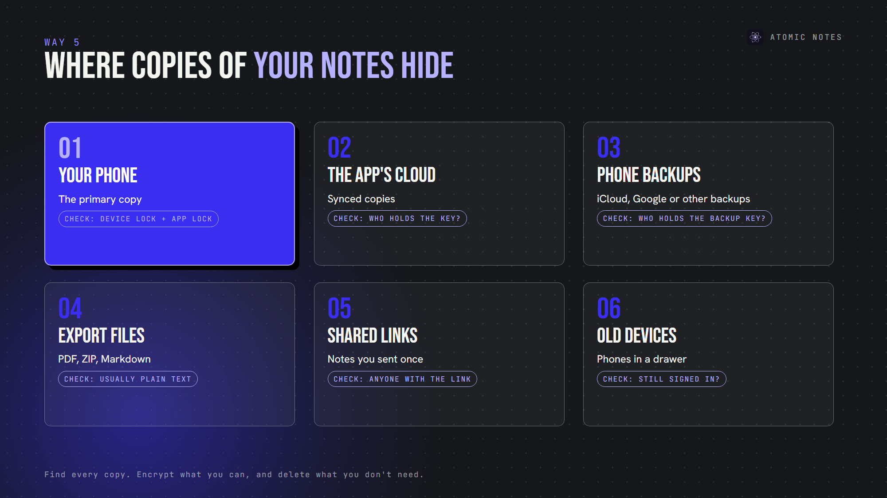

*By Ashutosh Sharma (DevBehindYou), the developer of Atomic Notes. Last updated: October 5, 2026.*

**Key Takeaway:** Notes app privacy isn't only about whether someone reads your notes. Provider-controlled cloud storage, telemetry, third party SDKs, weak sign-ins, unprotected backups, AI processing and excessive permissions can each expose you. Strong notes app privacy closes all seven, because a leak through any one of them is still a leak.

Your notes app might hold more about you than any other app on your phone. Health worries, money plans, passwords you meant to move, private conversations you wrote down to remember.

Most people judge notes app privacy by one question: can anyone read my notes? It's a good question. It's also only the first one. Exposure happens through side doors too, and none of them require opening a single note.

Here are seven ways weak notes app privacy can expose you, plus a checklist to close each door. Here's the full map:

## 1. Cloud storage the provider fully controls

When your notes live only on a company's servers, notes app privacy depends entirely on that company. If it holds the encryption keys, it can read, index or hand over your notes when required.

Cloud notes security also depends on the provider's own defenses. A breach of their servers becomes a breach of your notes. Note taking app security starts with who holds the keys.

**Close the door:** prefer end-to-end encryption, where only your devices hold the key, or storage you control. A private notes app keeps the primary copy on your device.

## 2. Analytics and telemetry

App telemetry reports how you use the app: screens, taps, session length, device details. Notes app analytics rarely needs your note text to reveal a lot. Opening a journal app at 3 a.m. every night says something on its own.

That's the quiet side of notes app privacy. Your words stay private, and your habits don't. Telemetry is a common notes app privacy gap because it often ships switched on.

**Close the door:** read the privacy policy for "analytics" and "usage data," and look for an opt-out. Better still, choose an app that ships no analytics at all, the simplest notes app privacy win.

## 3. Third party trackers and SDKs

Many apps trade notes app privacy for convenience by embedding software development kits from other companies for ads, analytics or crash reporting. Each SDK can send data to its maker, under its maker's rules.

Third party trackers are where notes app privacy meets the ad industry. In 2023, the FTC acted against GoodRx for passing health information to advertising platforms through tracking code. Nobody hacked GoodRx. The tracking itself did the damage.

**Close the door:** scan Android apps with Exodus Privacy, which lists embedded trackers. Zero trackers is the right number for notes app privacy.

## 4. Weak note taking app security at sign-in

For notes app privacy, your account is the front door, and note taking app security often fails right there. A password-only account, a reused password, or sessions that never expire can hand your notes to anyone with an old login.

Session handling matters for notes app privacy too. If an app stores session tokens in plain form, a database leak hands out live logins. If it can't sign out other devices, a lost phone stays signed in.

**Close the door:** use a unique password and two-factor sign-in. Look for apps that let you see and revoke active sessions. Atomic Notes, for example, stores session tokens only as hashes, so a database leak doesn't hand out working logins.

## 5. Unencrypted backups

Your notes may be safe in the app and exposed in a backup. Phone backups, app exports and old sync copies all hold your notes, often outside the app's protection.

Apple's own documentation is a clear example. With iCloud's default Standard Data Protection, Apple holds the keys for iCloud Backup. Only Advanced Data Protection makes those backups end-to-end encrypted.

Unencrypted backups are one of the most overlooked digital privacy risks, because nobody checks them until something goes wrong. Backups are the notes app privacy blind spot.

**Close the door:** find every copy of your notes: device, cloud, phone backup and exports. Encrypt what you can, and delete what you don't need. Every extra copy is a notes app privacy risk.

## 6. AI systems processing your notes

AI is the newest notes app privacy risk. AI features summarize, search and rewrite by sending note content to a model. AI data processing can involve the app's own servers, a third party AI provider, retention logs and sometimes model training.

For notes app privacy, the questions are simple: does AI run automatically, who receives the text, how long is it kept, and can you turn it off?

**Close the door:** keep AI off for private notes, or pick an app that has no AI reading your notes at all. A private notes app shouldn't need AI to be useful. I built Atomic Notes that way on purpose.

## 7. Excessive permissions and metadata

A notes app with access to contacts, location or your photo library can collect far more than notes. Even with modest permissions, metadata like IP addresses, login times and sync activity can map your routine.

This is personal data exposure without a single note being read. Strong notes app privacy keeps permissions few and metadata short, and permissions are part of note taking app security too.

**Close the door:** remove permissions without a clear reason, and favor notes app privacy policies that list exactly what metadata the app keeps.

## Which of these risks matters most?

It depends on what you store. For journals and health notes, telemetry, trackers and AI processing matter most, because they reveal patterns. For credentials and documents, sign-in security and backups matter most, because they hand over content.

There's no single notes app privacy priority for everyone, so fix the top two notes app privacy gaps first. The safest approach to notes app data privacy is boring: fewer copies, fewer companies, fewer permissions. A private notes app makes those choices for you.

## How does Atomic Notes approach notes app privacy?

I built Atomic Notes as a private notes app that closes these doors by design:

- **Your phone first:** notes save locally, and sync goes to your own Google Drive.
- **Optional end-to-end vault:** turn it on, and the app seals notes before they leave your phone.
- **No analytics, crash reporting or ad SDKs:** three Android permissions, nothing more.
- **No AI:** your notes never go to a model.
- **No ads, no subscription,** and a server that keeps metadata only.

It's secure note taking without the side doors, and the people who use it support it, not data deals. That's notes app privacy you don't have to configure, and note taking app security by subtraction.

## A notes app privacy checklist

Run this notes app privacy check before you trust any app:

1. Who holds the encryption key?
2. Does the app ship analytics or tracker SDKs?
3. Can you see and revoke active sessions?
4. Where do backups and exports go, and are they encrypted?
5. Does AI run automatically, and can you turn it off?
6. Are permissions few and explained?
7. Does the app publish what metadata it keeps?

Seven good answers mean strong notes app privacy, the kind a private notes app should offer by default. Anything less tells you which door to close first.

## FAQ

### Can a notes app expose my data without reading my notes?

Yes. Telemetry, trackers, metadata, weak sign-ins and unprotected backups can all expose personal details without anyone opening a note. Good notes app privacy and note taking app security cover every path data can take, not just the note text.

### What is the safest way to store private notes?

Keep the primary copy on your device, encrypt anything that syncs end to end, and choose a private notes app with no trackers, no AI processing and few permissions. Then check where backups go, since they often sit outside the app's protection.

### How do I check a notes app for trackers?

For Android apps, search the app on Exodus Privacy, which lists embedded trackers and requested permissions. Then read the privacy policy for "analytics," "advertising" and "third parties." A notes app that values note taking app security should come back clean.

### Does encryption solve notes app privacy?

Only part of it. End-to-end encryption protects note content, but telemetry, trackers, metadata and backups can still expose you. Notes app privacy needs encryption plus fewer collectors, and a private notes app combines both.

## Sources

- [FTC enforcement action against GoodRx, February 2023](https://www.ftc.gov/news-events/news/press-releases/2023/02/ftc-enforcement-action-bar-goodrx-sharing-consumers-sensitive-health-info-advertising)
- [What Exodus Privacy does, Exodus Privacy](https://exodus-privacy.eu.org/en/page/what/)
- [iCloud data security overview, Apple Support](https://support.apple.com/en-us/102651)
- [Why metadata matters, Electronic Frontier Foundation](https://ssd.eff.org/module/why-metadata-matters)
- [Atomic Notes privacy policy](https://atomic-notes-community.vercel.app/privacy)
