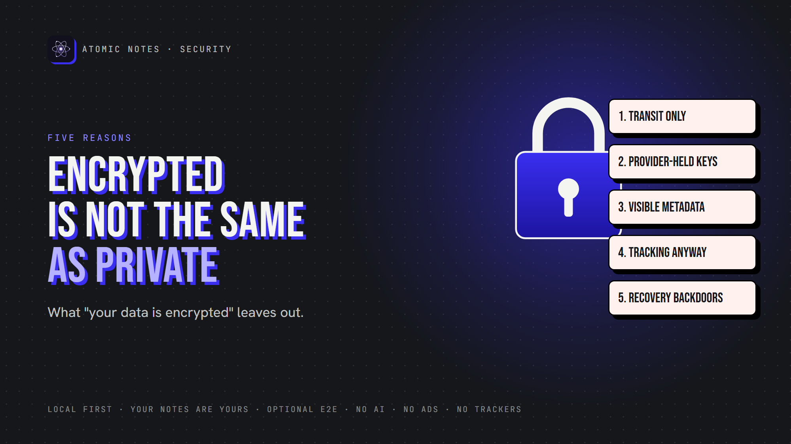
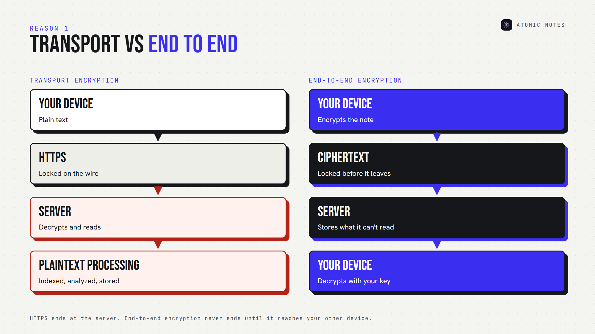
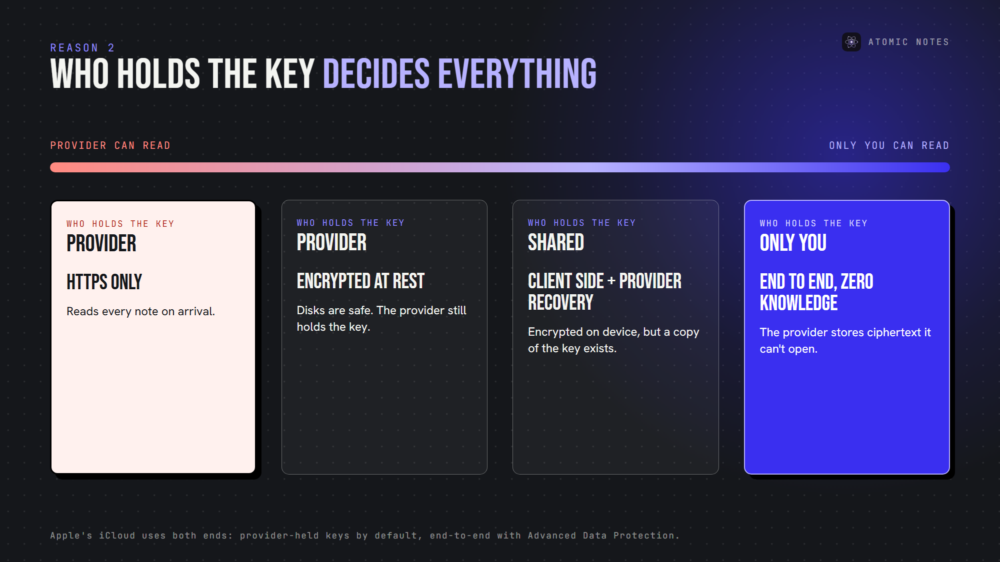
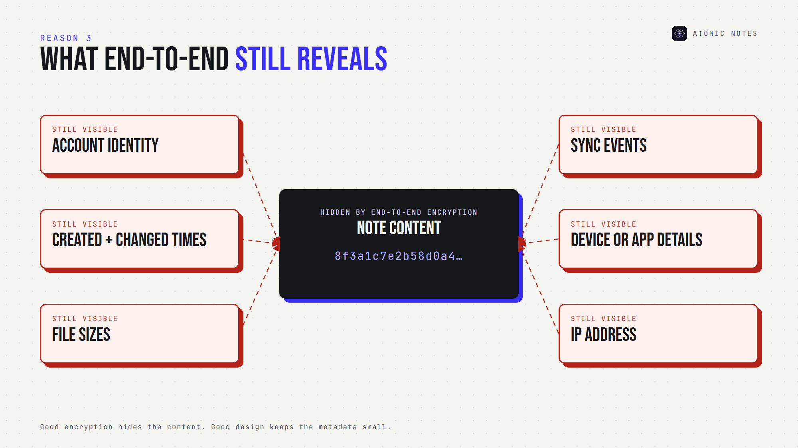
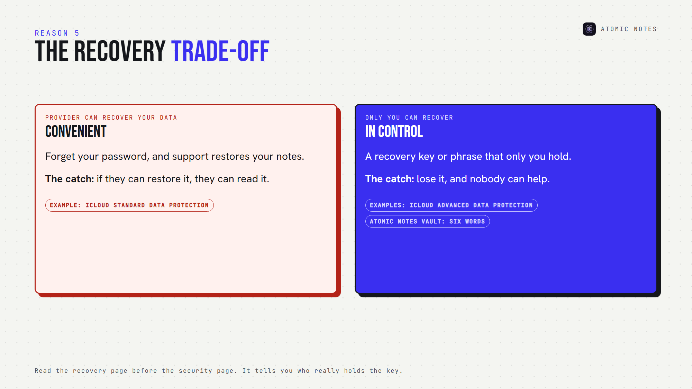

*By Ashutosh Sharma (DevBehindYou), the developer of Atomic Notes. Last updated: October 5, 2026.*

**Key Takeaway:** "Your data is encrypted" can mean almost anything. Encrypted notes privacy depends on where encryption happens, who holds the key, what metadata stays visible, whether the app tracks you anyway, and how account recovery works. Only end to end encrypted notes keep the provider out, and even they leave a trail. Encrypted notes privacy is a set of answers, not a label.

"Your data is encrypted." It's on every landing page, usually next to a padlock icon, and it says less about encrypted notes privacy than you'd think.

It sounds like a promise of encrypted notes privacy. It's really a category. Encryption can protect your notes on the wire, on a server's disk, or on your device, and only one of those keeps the company itself from reading them.

Here are five reasons an encrypted notes app may still fall short on privacy, and the questions that reveal what any encryption claim really means. Let's look at encrypted notes privacy the way an attacker, or a curious provider, would.

## Why is encrypted notes privacy so often oversold?

Because "encrypted" is easy to say and hard to check. Nearly every service encrypts traffic with HTTPS and protects its disks, so nearly every service can truthfully print the word. Padlock icons and phrases like "military grade" fill the gap. An encrypted notes app that explains its key model is rare, which is exactly why encrypted notes privacy deserves a closer look. The word tells you a feature exists. It doesn't tell you who's locked out.

## 1. Encryption in transit is not end-to-end encryption

HTTPS encryption protects your note while it travels between your phone and the server. That's transport encryption, and every serious app uses it. It's also where most encrypted notes privacy claims quietly stop.

But it ends at the server. Once your note arrives, the server decrypts it and can read, index or process it.

Here's how encrypted notes privacy changes between the two flows:

- **Transport encryption:** Device, HTTPS, Server, plaintext processing
- **End-to-end encryption:** Device encrypts, ciphertext, Server, ciphertext, Device decrypts

Only the second gives you encrypted notes privacy against the provider. With E2EE notes, the server stores ciphertext it can't open. That's the difference between an app that's secure on the wire and one that's private by design.

## 2. The provider may hold the encryption keys

Encryption at rest sounds strong, and it does protect against stolen disks. But with server side encryption, the provider usually manages the encryption keys. If they hold the key, they can decrypt your notes. Disk encryption protects the provider's hardware, while encrypted notes privacy protects you from the provider.

Apple's iCloud shows the difference clearly. With its default Standard Data Protection, Apple holds the keys for many categories, including notes, and can help you recover data. With Advanced Data Protection, those categories become end to end encrypted, and only your trusted devices hold the keys. Same company, very different encrypted notes privacy.

For encrypted notes privacy, the key question is literal: who holds the key? Client side encryption, where your device encrypts before upload, is the only setup where the answer is "just you." Some providers call this zero knowledge encryption.

## 3. Metadata may remain visible

Even end to end encrypted notes leave a trail. The server still needs to know some things to sync:

- Your account identity
- When you create and change notes
- File sizes
- Synchronization events
- Device or app details

That's metadata privacy, and encryption doesn't cover it. Metadata is where encrypted notes privacy quietly ends. In 2022, LastPass disclosed that stolen vault backups held encrypted passwords alongside unencrypted website URLs. The secrets stayed locked, and the list of sites leaked anyway.

Good encrypted notes privacy means encrypting the content and keeping the metadata small.

## 4. Analytics and tracking are separate from encryption

An app can encrypt every note and still watch how you use it. Analytics SDKs record screens, taps and session times. Ad SDKs build profiles. None of that touches your encrypted content, and all of it describes you. Tracking is the encrypted notes privacy gap most marketing pages skip.

So an encrypted notes app with three analytics SDKs is encrypted, and it's still tracking you. Encrypted notes privacy has to include the question: what else does this app send?

**Check it:** for Android apps, Exodus Privacy lists embedded trackers. An app that's serious about private note taking should come back clean.

## 5. Account recovery changes the security model

Here's the uncomfortable truth: if a provider can restore your encrypted notes after you forget your password, the provider can decrypt them.

Recovery isn't bad. It's an encrypted notes privacy trade-off. Some apps keep a copy of your key to make recovery easy. Others give you a recovery code or phrase and can't help if you lose it. An encrypted notes app with effortless recovery deserves extra questions.

Apple makes this explicit. Before you turn on Advanced Data Protection, you must set up a recovery contact or a recovery key, because Apple can no longer recover that data for you.

For encrypted notes privacy, read the recovery page before the security page. It tells you who really holds the key.

## A quick encryption decoder

When you see these phrases, translate them into encrypted notes privacy terms:

- **"Encrypted in transit":** HTTPS only. The provider can read your notes.
- **"Encrypted at rest":** the provider protects its disks and holds the key.
- **"Military grade encryption":** names an algorithm and says nothing about keys.
- **"Zero knowledge":** the provider says it can't decrypt. Check the recovery page.
- **"End to end encrypted notes":** only your devices hold the key. This is the claim that matters for encrypted notes privacy.

## How do you check an app's encrypted notes privacy?

Ask five questions, and the marketing falls away:

1. Is the encryption end to end, or only in transit and at rest?
2. Who holds the keys?
3. What metadata can the server see?
4. Does the app run analytics or ad SDKs?
5. What happens if I lose my password?

If an encrypted notes app answers all five clearly, you can judge its encrypted notes privacy. If it answers with a padlock icon, you can't.

I covered the vault side of this in my earlier article, Encrypted Notes Explained: T2T vs End-to-End.

## Where does Atomic Notes fit?

I'll answer my own five questions, because encrypted notes privacy claims should be checkable.

- **End to end?** Optionally. The vault is off by default. Turn it on, and you get end to end encrypted notes, each sealed on your phone with AES-256-GCM before it syncs.
- **Who holds the key?** You. Six words you write down become the key on your phone, and the server stores only a verifier.
- **Metadata?** Note IDs, timestamps, flags and Drive file IDs. Never note text.
- **Analytics?** None. No analytics, crash-reporting or ad SDKs.
- **Lost password?** Lose your six words, and vault notes stay locked. Nobody, including me, can open them.

With the vault off, HTTPS protects notes on the way, and your Google account protects the copies in your own Drive. That's weaker encrypted notes privacy, and I'd rather say so than hide behind a padlock. Atomic Notes has no ads, no AI reading your notes and no subscription, and your notes stay yours.

## FAQ

### Is an encrypted notes app automatically private?

No. "Encrypted" may mean only HTTPS or server-side encryption, where the provider holds the key. Encrypted notes privacy needs end-to-end encryption, minimal metadata, no tracking SDKs and a recovery model that doesn't hand the provider your key.

### What is the difference between encryption at rest and end-to-end encryption?

At-rest encryption protects data on the provider's disks, but the provider holds the key. End-to-end encryption happens on your device, so only your devices hold the key and the provider stores ciphertext it can't read. That gap decides your encrypted notes privacy.

### Can end to end encrypted notes still leak information?

Yes, through metadata. Even end to end encrypted notes reveal account identity, timestamps, file sizes and sync events to the server. Choose apps that keep metadata minimal and publish exactly what they store, for real encrypted notes privacy.

### Does encrypted notes privacy cover my backups?

Not automatically. Phone backups and exports often sit outside the app's encryption. Even end to end encrypted notes can leak through a plain backup, and an encrypted notes app only protects the copies it controls.

## Sources

- [iCloud data security overview, Apple Support](https://support.apple.com/en-us/102651)
- [Notice of recent security incident, LastPass, December 22, 2022](https://blog.lastpass.com/posts/notice-of-recent-security-incident)
- [What Exodus Privacy does, Exodus Privacy](https://exodus-privacy.eu.org/en/page/what/)
- [Atomic Notes privacy policy](https://atomic-notes-community.vercel.app/privacy)
