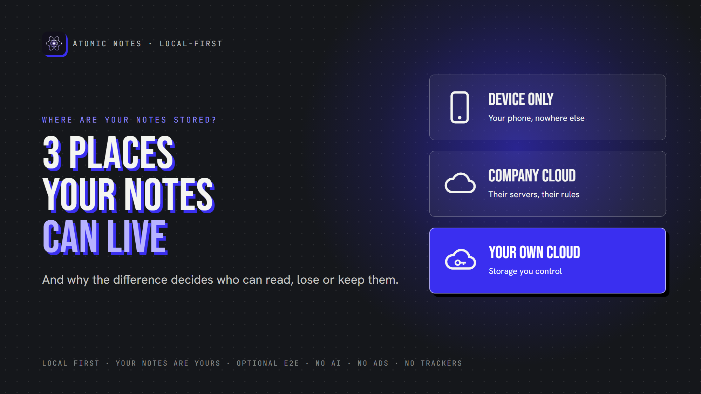
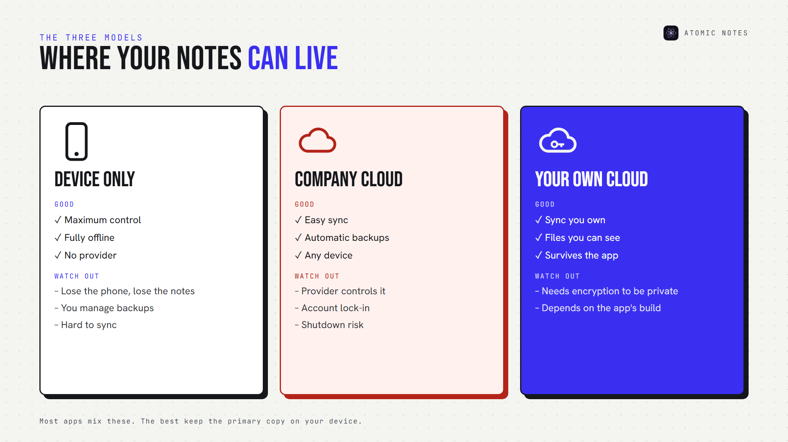
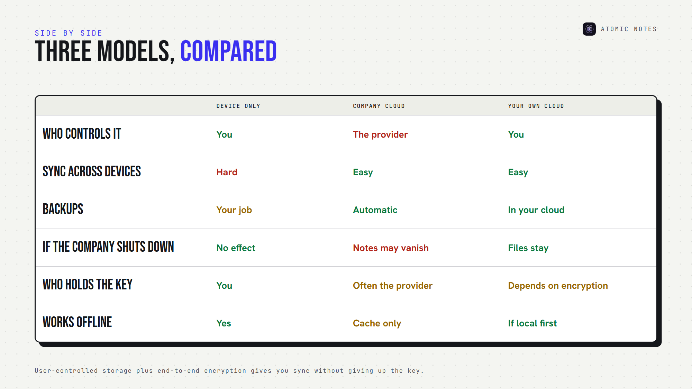
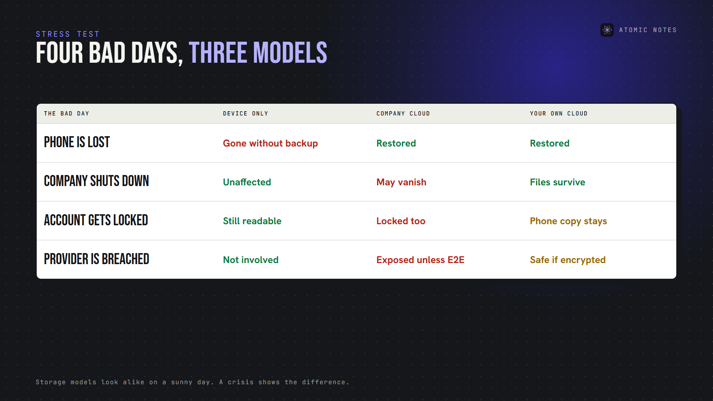
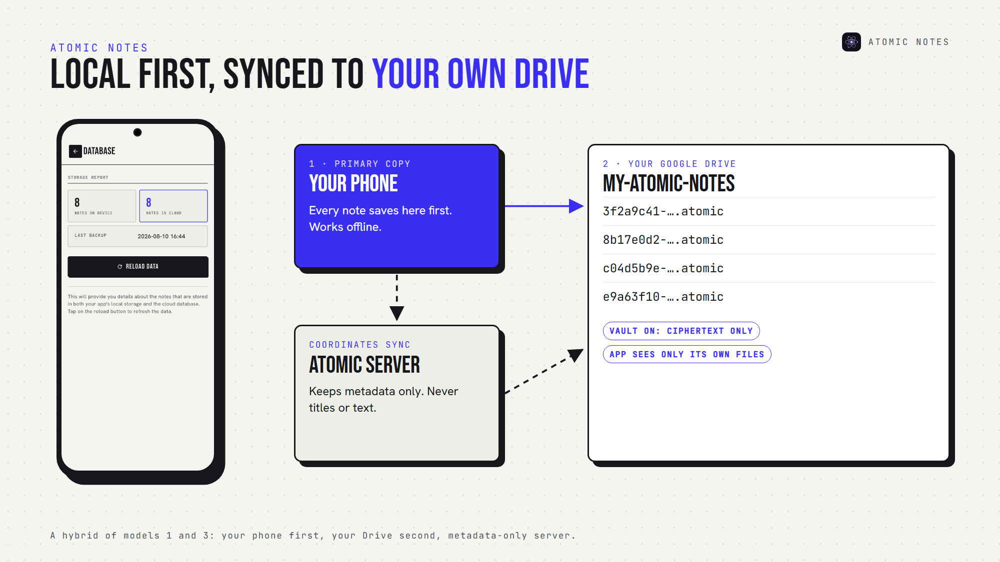

*By Ashutosh Sharma (DevBehindYou), the developer of Atomic Notes. Last updated: October 5, 2026.*

**Key Takeaway:** Where are your notes stored? In one of three places: only on your device, in the company's cloud, or in cloud storage you control. Each model trades convenience for control differently. The best setups keep the primary copy on your device and put synced copies somewhere you own, ideally encrypted. Knowing where are your notes stored is the first privacy decision you make.

Most people think about what's inside their notes. Far fewer ask where are notes stored, physically.

That second question decides a lot. Where are notes stored when you hit save? On your phone? On a server in another country? In a folder you can open yourself? The answer controls who can read your notes, what happens when something breaks, and whether you can ever leave.

Let's compare the three answers to where are notes stored, and how each one shapes notes storage privacy.

## Why don't apps tell you where your notes are stored?

Because "it just syncs" sounds simpler than the truth. Behind one notes app, you may find a main database, server backups, caches and a search index, sometimes in several countries. Cloud privacy depends on all of them. Few apps explain where are notes stored across that whole chain, and notes storage privacy suffers when nobody asks. Even fewer explain where do notes apps store data after you delete it. Asking "where are my notes stored?" is how you make them say it.

## Where are notes stored, and why does it matter?

Every answer to where are notes stored combines three places. The mix decides four things:

- **Who can read them:** you, the company, or anyone who breaches it
- **What survives a failure:** a lost phone, a dead server, a locked account
- **How sync works:** across devices, or not at all
- **Whether you can leave:** with your notes intact, or not

So where are your notes stored right now? If you can't answer in one sentence, keep reading.

## 1. Device only

Where are notes stored in this model? On your phone or computer, and nowhere else.

**Advantages:**

- Maximum local control
- Works completely offline
- No cloud provider required
- A smaller remote attack surface

**Limitations:**

- Losing the device can mean losing every note
- You must manage your own notes backup
- Syncing across devices is hard or impossible

Device-only local notes storage is the most private option on paper. It's also the most fragile. Ask where are your notes stored in a device-only app, and the honest answer is "in one place that can break." Pair it with a regular notes backup, or accept the risk.

## 2. The company's cloud

Your notes live on the app maker's servers, and your devices show copies.

**Advantages:**

- Easy notes synchronization across devices
- Automatic backups
- Simple multi-device access

**Potential concerns:**

- The provider controls the infrastructure
- Your account becomes a single point of failure
- The service could shut down
- The provider may hold the encryption keys
- Moving your data out may be difficult

Most mainstream apps use this model. Cloud notes storage is convenient, but notes data ownership quietly shifts to the provider. Even big companies differ here. Apple holds the keys for iCloud notes under its default protection, and only its optional Advanced Data Protection changes that.

If you're asking where do notes apps store data in this model, the answer is "on their servers, under their rules." Where are notes stored here? On someone else's computer, by definition.

## 3. Cloud storage you control

Your notes sync into storage you own or choose, such as:

- Google Drive
- WebDAV
- Nextcloud
- Self-hosted infrastructure
- A network drive at home

This model combines sync with greater ownership. You can see your files, back them up your way, and often keep using them if the app disappears. User owned cloud storage still depends on encryption and on how well the developer built the app, though. Your own Drive is only as private as the files inside it. Where are your notes stored in this model? In a place you can open yourself, which is why many people ask where do notes apps store data before they pick one.

Here's where are notes stored in each model, side by side:

## How many copies of your notes exist?

Usually more than you think. A single note can live on your phone, on a sync server, in that server's backups, in your phone's own cloud backup, and in any export you made. When you ask where are notes stored, count every copy, not just the main one. Each copy follows its own rules, and each one affects notes storage privacy. That's the real answer to where do notes apps store data: in more places than one. Ask where are your notes stored in backups, too.

## What happens when something goes wrong?

Storage models look similar on a sunny day. The difference shows up in a crisis. Here's where are notes stored, tested against four bad days:

- **Your phone is lost:** device-only notes are gone without a backup. Cloud models restore them.
- **The company shuts down:** company-cloud notes may vanish with it. Device and user-owned copies survive.
- **Your account gets locked:** company-cloud notes lock too. Device copies stay readable.
- **Someone breaches the provider:** attackers can read company-cloud notes unless end-to-end encryption protected them. Encrypted cloud notes stay unreadable.

Where are notes stored isn't a trivia question. It's how your notes survive the worst day.

## Where are your notes stored? Check in five minutes

You don't need to guess where are your notes stored. Five quick checks answer "where are my notes stored?" for almost any app:

1. Read the storage section of the privacy policy.
2. Open the app's sync settings and see where sync points.
3. Turn on airplane mode and check whether notes still open.
4. Export a few notes and see what format you get.
5. Look for your notes in your own cloud storage.

These checks answer where do notes apps store data, no code required. If the app can't tell you where are notes stored in plain words, treat that as the answer. Notes storage privacy starts with knowing the address.

## Where are notes stored in Atomic Notes?

Atomic Notes uses a hybrid of models 1 and 3, a local first storage design:

- **Your phone first.** Every note saves to local storage before anything else, so offline notes always work.
- **Your own Google Drive second.** When you sync, each note becomes a file in a folder called "My-Atomic-Notes" in your Drive.
- **Our server keeps metadata only.** It coordinates sync, but never stores note titles or text.
- **Optional end-to-end encryption.** Turn on the vault, and your Drive holds only ciphertext.

So where are your notes stored with Atomic Notes? On your phone, and in your own Drive, in files you can see. The app asks Google only for access to files it creates, so it can't browse the rest of your Drive.

That's notes storage privacy without giving up sync. It also means no ads, no AI reading your notes, and no subscription standing between you and your own files. If the Atomic Notes server disappeared, your notes would still be on your phone and in your Drive.

## FAQ

### Where are notes stored in most notes apps?

Most mainstream apps keep notes on the company's servers and show copies on your devices. That makes sync easy, but the provider controls the storage and often the encryption keys. Check the privacy policy's storage section to see where are notes stored in your app.

### Which storage model is the most private?

Device-only storage is the most private, but the most fragile. User-controlled cloud storage with end-to-end encryption is the best balance: you get sync and backups, and nobody else can read the files. Notes storage privacy depends on both location and encryption. Where are notes stored matters as much as how they're encrypted.

### Where do notes apps store data when you're offline?

Local first apps store data on your device and sync later. Cloud-first apps often keep only a temporary cache, so new notes may fail to save offline. Turn on airplane mode and test: where do notes apps store data when the network disappears? The answer tells you a lot.

### Does it matter which country my notes are stored in?

It can, because data laws differ by country. Where are notes stored geographically depends on the provider's servers. Atomic Notes keeps account metadata on a server in Vercel's Mumbai region, while your note files sit in your own Google Drive. Good notes storage privacy names both places.

## Sources

- [iCloud data security overview, Apple Support](https://support.apple.com/en-us/102651)
- [Choose Google Drive API scopes (drive.file), Google for Developers](https://developers.google.com/workspace/drive/api/guides/api-specific-auth)
- [Local-first software, Ink & Switch](https://www.inkandswitch.com/essay/local-first/)
- [Atomic Notes privacy policy](https://atomic-notes.devbehindyou.com/privacy)
