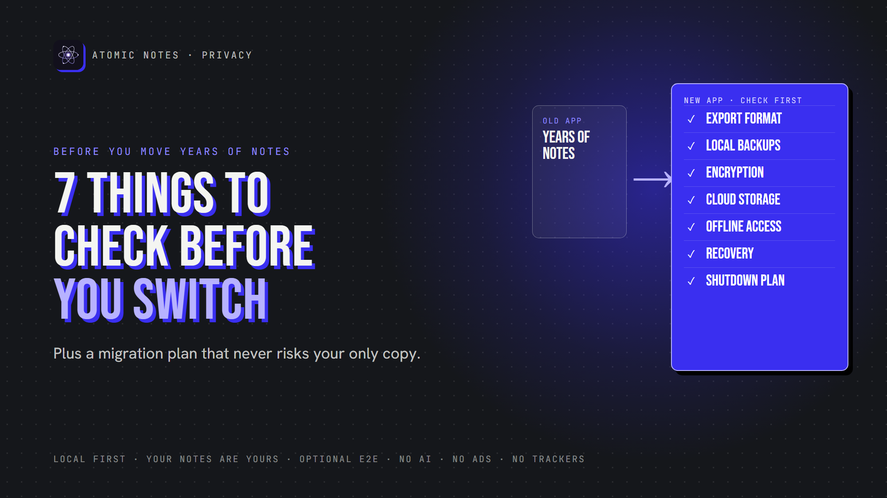
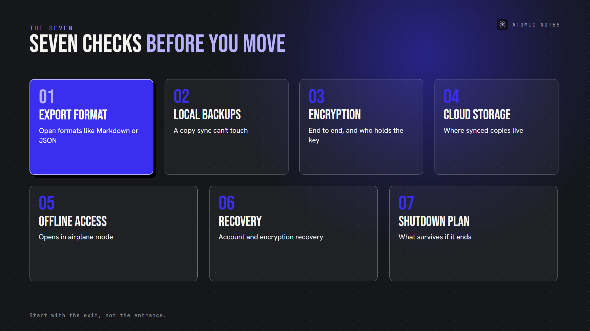
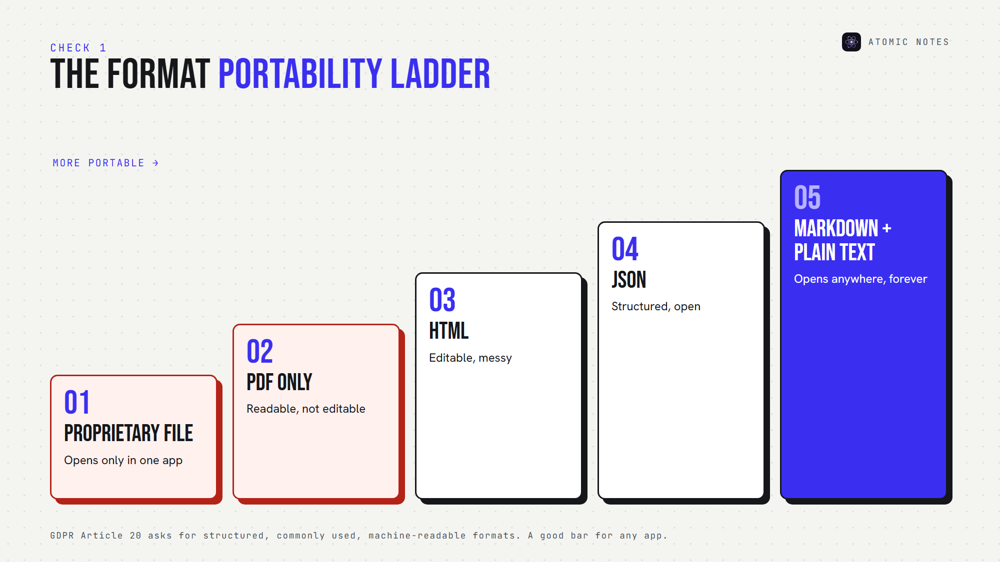
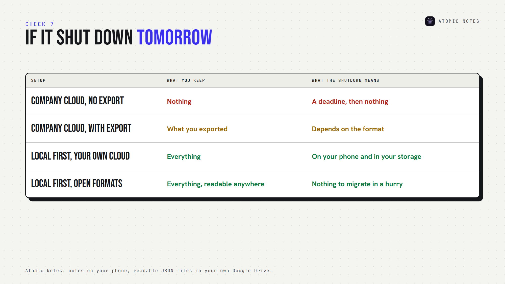
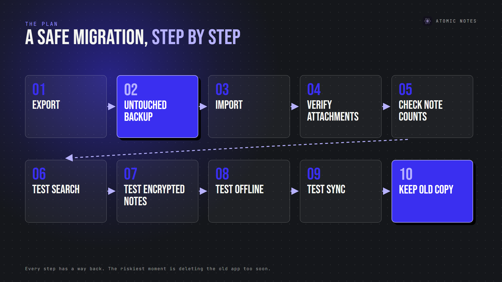

*By Ashutosh Sharma (DevBehindYou), the developer of Atomic Notes. Last updated: October 5, 2026.*

**Key Takeaway:** Before you move to a new secure notes app, check seven things: export format, local backups, encryption, cloud storage, offline access, recovery and shutdown risk. Then migrate with a plan: export first, keep an untouched backup, verify everything, and keep the old copy until you're sure. A secure notes app makes leaving as easy as arriving.

Switching notes apps sounds like a weekend chore. Then you remember what's inside: years of plans, journals, recipes, work ideas and things you can't recreate.

A good notes migration protects two things at once. Privacy, because the new private note taking app will hold everything you write. And continuity, because a botched move can lose notes you didn't know you needed.

Here are seven things to check before you trust a secure notes app with your notes, plus a migration checklist to switch notes app securely.

## Why does moving to a secure notes app need a plan?

Because migration is when notes are most exposed. A data export often lands in your downloads folder as plain text. Importers differ, too: checklists can flatten into text, tags can vanish, and dates can reset to the import day. Encrypted notes usually can't move at all until you decrypt them. Moving into a private note taking app shouldn't mean weeks of exposed files. A plan lets you switch notes app securely, and a secure notes app should make that plan easy.

Here's what a secure notes app should pass:

## 1. Export format

Start with the exit, not the entrance, because you judge a secure notes app by how easily you can leave. Before you move in, find out how you'd move out.

A secure notes app should export everything in a portable format:

- **Markdown or plain text** for writing
- **JSON** for structured notes and checklists
- **Standard files** for images and attachments

Proprietary formats raise lock-in. If your export only opens in the same app, your notes ownership depends on that company staying around. Data portability laws like GDPR Article 20 call for data in a structured, commonly used, machine-readable format, which is a good standard for any app.

Pick a secure notes app that sits at the portable end of that ladder.

## 2. Local backup support

A private note taking app should let you keep a notes backup you control: a file on your device, a folder on your computer, or a copy in your own cloud.

Cloud sync isn't a backup, even in a secure notes app. If a sync bug deletes a note, it deletes it everywhere. A real backup is a separate copy that sync can't touch.

**Check:** can you create a backup without the company's servers? Can you restore it? A secure notes app should say yes to both.

## 3. Encryption architecture

Ask where encryption happens and who holds the key. "Encrypted" alone can mean HTTPS only.

A secure notes app with end to end encryption encrypts notes on your device, so the provider stores ciphertext. That matters during migration too: an encrypted export protects your notes while they sit in a downloads folder.

**Check:** is encryption end to end? Is it on by default or optional? What does the export contain, plaintext or ciphertext? A secure notes app answers all three in its docs.

## 4. Cloud storage provider

Find out exactly where a secure notes app keeps synced notes. The company's servers? A cloud storage provider you choose? Your own server?

This decides who can access your notes, which country's laws apply, and what happens if the service changes its terms. A secure notes app should name every place a copy exists.

**Check:** can you see your synced files yourself, outside the app? If a secure notes app can't say where your notes sit, it isn't ready for your notes.

## 5. Offline availability

Your notes should open without a connection. Test it: turn on airplane mode, close the app, open it, and edit a note.

A secure notes app keeps the primary copy on your device, so offline notes behave exactly like online ones. If the app spins or blocks editing, your notes depend on someone else's server. Offline access is the minimum a secure notes app owes you.

## 6. Account and encryption recovery

Recovery decides what happens on your worst day. Two cases matter:

- **Account recovery:** if you lose access to your login, how do you get back in?
- **Encryption recovery:** if you lose your password or recovery phrase, can anyone restore your notes?

There's a trade-off. If the provider can restore encrypted notes without your secret, the provider can read them. If it can't, losing your secret means losing your notes.

**Check:** read the recovery page before you migrate anything sensitive. A private note taking app should explain recovery in plain words, and a secure notes app should never hide the trade-off.

## 7. What happens if the service shuts down?

Every service ends eventually. The question is whether your notes end with it.

A secure notes app answers this in advance. Look for local copies, portable formats and storage you control. If the only copy lives on the company's servers, a shutdown notice becomes a deadline. A secure notes app turns it into a non-event.

## How do you switch notes app securely?

Once an app passes the seven checks, migrate in this order. It's how to switch notes app securely without ever risking your only copy, and a secure notes app makes every step reversible.

1. **Export your old notes first.**
2. **Keep an untouched backup** of that export, somewhere separate.
3. **Import into the new app.**
4. **Verify attachments** open correctly.
5. **Check note counts** match.
6. **Test search** with a few known phrases.
7. **Test encrypted notes,** if you use encryption.
8. **Test offline access** in airplane mode.
9. **Test cloud sync** across your devices.
10. **Keep the old copy** for at least a few weeks.

Secure data migration is mostly patience, and patience is how you switch notes app securely. The riskiest moment is deleting the old app too soon.

## Why do people lose notes during a switch?

Usually because they treat migration as a single step. An import that fails silently, an attachment that doesn't carry over, or a checklist that turns into plain text can go unnoticed for weeks, even in a secure notes app.

That's why the order matters. When you switch notes app securely, every step has a way back. Skip the untouched backup, and a bad import becomes permanent. Even the most secure notes app can't fix an import after you've deleted the source.

## Where does Atomic Notes fit?

I build Atomic Notes, so here's how it measures up as a secure notes app, honestly:

- **Local copies:** every note saves to your phone first and works offline.
- **Your storage:** synced notes become readable JSON files in your own Google Drive.
- **Optional end-to-end encryption:** turn on the vault, and those files hold only ciphertext.
- **No destructive upgrades:** updates install over earlier versions and keep your notes. Conflicting edits become a separate conflict copy, never a silent overwrite.
- **One honest gap:** there's no export button yet. Your synced Drive files are the portable copy for now.

It's a private note taking app with no AI, no ads, no trackers and no subscription. If you ever leave, your notes are already in files you own. I want Atomic Notes to be a secure notes app you never feel trapped in.

## FAQ

### What should I check before switching to a new notes app?

Check seven things: export format, local backups, encryption architecture, cloud storage location, offline access, account and encryption recovery, and what happens if the service shuts down. A secure notes app answers all seven clearly before you move anything.

### How do I switch notes app securely without losing notes?

Export your old notes first, keep an untouched backup, import into the new secure notes app, then verify note counts, attachments, search, encryption, offline access and sync. Keep the old copy for a few weeks before deleting anything.

### What is the best format for notes migration?

Open, portable formats: Markdown or plain text for writing, JSON for structured notes, and standard files for attachments. They open in many apps, which keeps your notes ownership independent of any single company, and any secure notes app can read them.

### Is a private note taking app hard to leave?

It shouldn't be. A private note taking app should export in open formats and keep copies you control. If leaving needs the company's help, the app owns more of your notes than you do. Check the export before the import.

## Sources

- [Right to data portability, GDPR Article 20](https://gdpr-info.eu/art-20-gdpr/)
- [Atomic Notes 2.03.5 release notes](https://github.com/DevBehindYou/Atomic-Notes-App-V0.2/releases/tag/v2.03.5)
- [Atomic Notes privacy policy](https://atomic-notes.devbehindyou.com/privacy)
