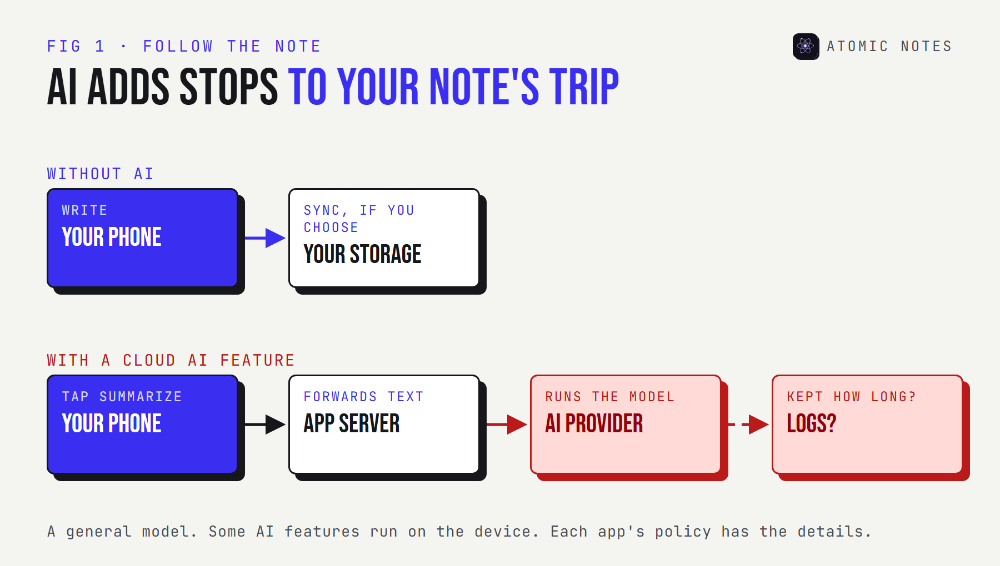
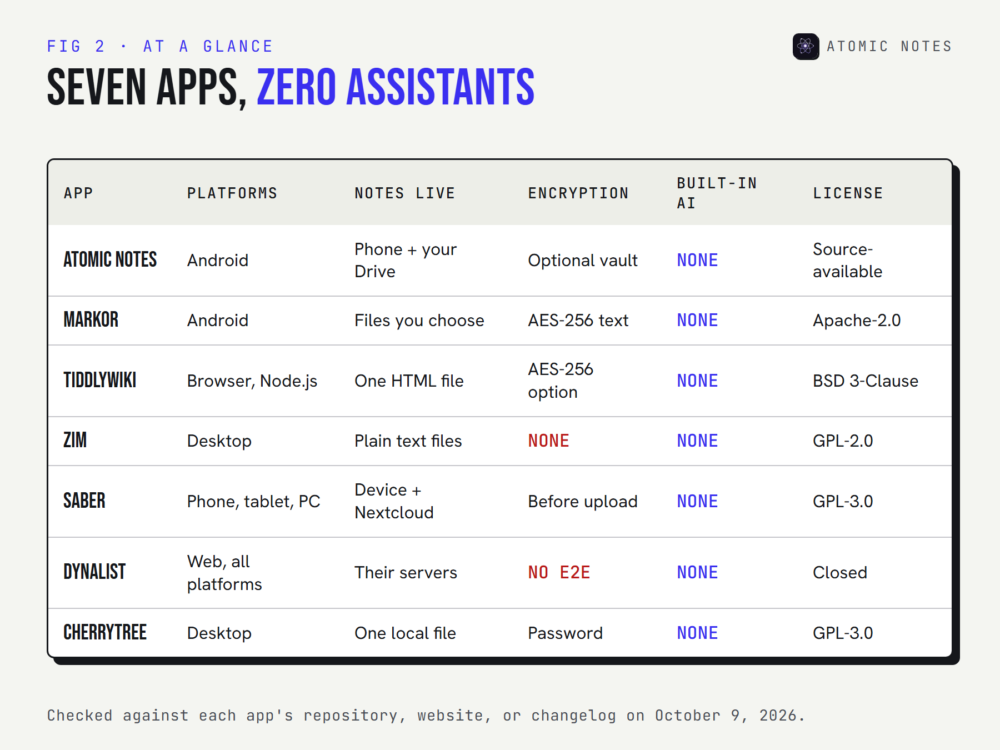
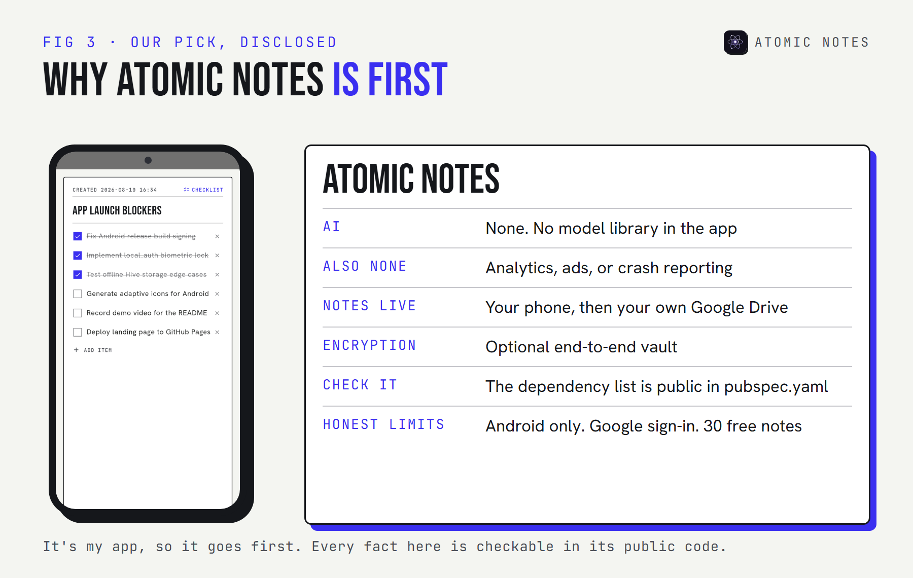
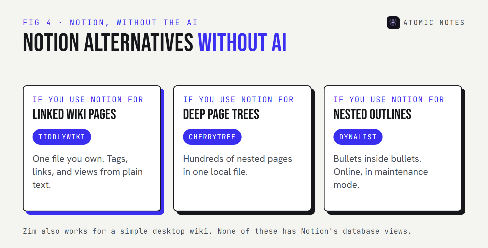
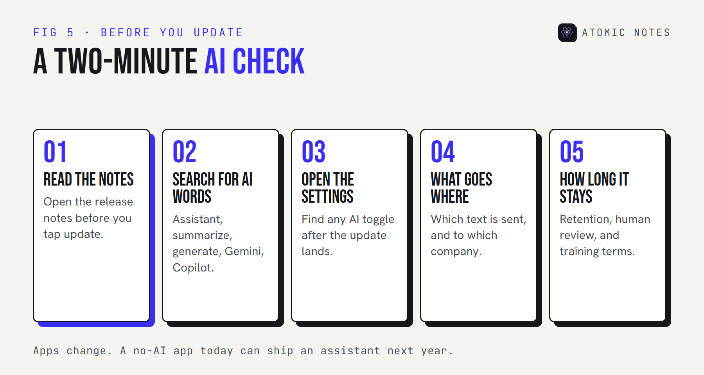

<div class="callout">
<p class="callout-label">Quick answer</p>
<p>Pick a note taking app without AI by the way you think. For private Android notes, Atomic Notes. For Markdown files, Markor. For a wiki, TiddlyWiki or Zim. For a stylus, Saber. For bullet outlines, Dynalist, and for big trees of pages, CherryTree. Not one of the seven has an assistant reading your pages.</p>
</div>

Open almost any big notes app in 2026 and something offers to help. A sparkle icon. A "summarize" button. A prompt box at the bottom of an empty page.

Some people love that. Others want a notebook that stays a notebook: you write, it saves, and nothing reads along. If that's you, you're looking for a **note taking app without AI**, and the choice has quietly gotten smaller.

I checked each app below against its repository, website, or changelog on October 9, 2026. I build Atomic Notes, so it's listed first, with its limits written out like everyone else's.

## Why look for a notes app without AI?

**Because an AI feature is a new path for your notes to travel.** Text you summarize or rewrite usually goes to a model, often on someone else's server, under terms that can change.



There are three honest reasons people want a notes app without AI:

- **Privacy.** Fewer places your writing goes, fewer policies to read, and no chance of becoming AI training data under a future terms change.
- **Focus.** Distraction free writing is easier when nothing interrupts with suggestions.
- **Ownership of thought.** A rough note is half-formed on purpose. Some people don't want it rewritten before they've finished thinking.

This isn't an anti-AI list. It's a list for people who want the choice. If you'd like a structured way to judge whether a note taking app without AI really is one, my [notes app privacy checklist](/blog/notes-app-privacy-red-flags) covers the AI question alongside eight others.

## What counts as a note taking app without AI?

**An app qualifies when the version you download has no assistant of its own that can see your notes.** That rules out built-in summaries, rewrites, and chat. Plugins you add later don't count against an app, because adding them was your call.

Here's how three of the biggest notes apps handle AI today, for contrast:

| App | Built-in AI | How it reaches your notes |
|---|---|---|
| Notion | Notion AI | Built into the editor. Full access comes with the Business and Enterprise plans |
| Apple Notes | Apple Intelligence Writing Tools | Proofread, rewrite, and summarize on supported devices |
| Google Keep | Gemini | "Help me create a list" on Android for eligible accounts |

None of these is hidden, and each has an AI features toggle or a plan that leaves it out. But if you'd rather not manage switches at all, the seven apps below don't have the feature to switch.



## The 7 best note taking apps without AI

To help you choose a note taking app without AI that fits, each entry covers its platforms, where notes live, any encryption, its AI status as shipped, and the trade-off.

### 1. Atomic Notes

**Pick it for:** private notes and checklists on Android, with nothing in the app that reads them.

- **Platforms:** Android 9 and newer
- **Storage:** your phone first, then a folder in your own Google Drive when you sync
- **Encryption:** an optional end-to-end vault (AES-256-GCM)
- **AI:** none. No analytics, ad, or crash-reporting SDKs either.
- **Code:** source-available on GitHub, so you can confirm there's no AI library in it
- **Latest:** 2.03.5, September 28, 2026
- **Trade-off:** Android only, a Google account to sign in, and 30 notes on the free plan



"No AI" is a standing rule for Atomic Notes, next to no ads and no subscription. You don't have to take my word for it. The app's dependency list is in `pubspec.yaml`, and it's short:

<p class="code-label">pubspec.yaml · Atomic Notes 2.03.5 (trimmed)</p>

```yaml
dependencies:
  http: ^1.2.2
  google_sign_in: ^6.2.2
  hive_ce: ^2.11.0
  flutter_bloc: ^9.1.0
  connectivity_plus: ^6.1.5
  local_auth: ^2.3.0
  cryptography: ^2.7.0
  flutter_secure_storage: ^9.2.2
  qr_flutter: ^4.1.0
  url_launcher: ^6.3.2
```

No model SDK, no analytics package, no ad network. That makes it a plain notes app in the most literal sense.

### 2. Markor

**Pick it for:** plain text and Markdown on Android, saved as files you can open anywhere.

- **Platforms:** Android
- **Storage:** ordinary `.md` and `.txt` files, in whichever folder you point it at
- **Encryption:** an optional AES-256 password on text files. Images and attachments aren't covered.
- **AI:** none
- **Code:** open source under Apache-2.0
- **Latest:** 2.16.1, March 19, 2026, with code updates through October 2026
- **Trade-off:** no sync of its own, so you pair it with a folder sync app

Markor is a text editor first and a notes app second, which is exactly its appeal. Pair it with any folder sync tool and your notes go where you send them, and nowhere else.

### 3. TiddlyWiki

**Pick it for:** a personal wiki that lives in one file you own.

- **Platforms:** any modern browser, or Node.js as a server
- **Storage:** a single HTML file, or a folder of small files on a server
- **Encryption:** optional AES-256 for single-file wikis
- **AI:** none built in
- **Code:** open source under a BSD 3-Clause license
- **Latest:** 5.4.1, July 10, 2026
- **Trade-off:** saving a single-file wiki needs a little setup in some browsers

TiddlyWiki has worked the same basic way since 2004: your whole notebook is one file. It's also one of the most flexible Notion alternatives without AI, since you can build tables, tags, and views out of plain text.

### 4. Zim

**Pick it for:** a calm desktop wiki made of plain text pages.

- **Platforms:** Linux, Windows, and macOS
- **Storage:** plain text files with wiki formatting, in ordinary folders
- **Encryption:** none built in
- **AI:** none
- **Code:** open source under GPL-2.0
- **Latest:** 0.77.2, July 2026
- **Trade-off:** desktop only, with no mobile app

Zim is what offline writing on a laptop should feel like, and it's a notes app without AI by design: no account, no cloud, and every page readable in any text editor. Its plugins add calendars, task lists, and diagrams.

### 5. Saber

**Pick it for:** handwritten notes with a stylus.

- **Platforms:** Android, iOS, Windows, and Linux
- **Storage:** your device, with optional sync through a Nextcloud server
- **Encryption:** notes are encrypted before they're sent to the cloud
- **AI:** none
- **Code:** open source under GPL-3.0
- **Latest:** 1.36.1, August 30, 2026
- **Trade-off:** built for handwriting, so typing comes second

If your notes start with a pen, Saber is the AI free note taking app to try. Its privacy policy is short and readable, which tells you something.

### 6. Dynalist

**Pick it for:** outlining everything as nested bullet points.

- **Platforms:** web, Windows, macOS, Linux, Android, and iOS
- **Storage:** Dynalist's servers
- **Encryption:** no end-to-end encryption
- **AI:** none
- **Code:** closed source
- **Status:** in maintenance mode since 2024. The team fixes critical bugs but isn't adding features, because it's focused on its sister product, Obsidian.
- **Trade-off:** your outlines live on someone else's server

Dynalist is here because it's a fine outliner and a note taking app without AI by history, not by promise, and it's a real Notion alternative without AI for list-heavy work. It's not a privacy tool, though, and its future is maintenance, not growth.

### 7. CherryTree

**Pick it for:** deep, nested notes with code blocks and tables.

- **Platforms:** Windows, Linux, and macOS
- **Storage:** one local file (SQLite or XML), or a folder of files
- **Encryption:** password protection for single-file documents
- **AI:** none
- **Code:** open source under GPL-3.0
- **Latest:** 1.7.2, August 22, 2026
- **Trade-off:** while a protected file is open, an unprotected copy sits in a temporary folder until you close it

CherryTree suits technical notes that grow into a tree of hundreds of pages, and it's the most structured note taking app without AI on this list. Treat its password protection as a lock on the door, not a vault.

## What are the best Notion alternatives without AI?

**TiddlyWiki, CherryTree, and Dynalist cover most of what people use Notion for: linked pages, nested structure, and lists.** None of them has a database view as rich as Notion's, but none of them has an assistant either.



If you're leaving Notion for privacy as well as AI, favor the local options. TiddlyWiki and CherryTree keep everything in files on your disk, and Zim does the same if a simple desktop wiki is enough. Dynalist keeps your outlines online.

## How do you check an app for AI before you update?

**Read the release notes, look for a few telltale words, and check the settings after every big update.** Apps add AI features fast, and a no AI notes app today can ship an assistant next year.

Paste any app's release notes below. The scanner runs in your browser and flags words that usually mean an AI feature:

:::widget ai-scanner

Then check where the feature sends your text. Try the switches below to see how the path changes:

:::widget ai-path



Open source helps here. With public code, anyone can spot a new AI library in a pull request long before it ships. With closed apps, you're reading release notes and hoping they're complete.

| If you want | Pick |
|---|---|
| Private notes and checklists on Android | Atomic Notes |
| Plain text and Markdown files on Android | Markor |
| A whole wiki in one file | TiddlyWiki |
| A plain text wiki on the desktop | Zim |
| Handwriting with encrypted sync | Saber |
| Nested outlines, online | Dynalist |
| A deep tree of technical notes | CherryTree |

My take: a note taking app without AI isn't a step backward. It's a smaller, quieter tool that does one job and keeps your rough thinking yours until you decide otherwise.

## FAQ

<div class="faq-list">
<details>
<summary>Is there a note taking app without AI for Android?</summary>
<p>Yes. Atomic Notes and Markor are both Android notes apps with no AI features, and Saber covers handwriting. Dynalist has an Android app too, though your outlines live on its servers. Atomic Notes also has no analytics or advertising SDKs.</p>
</details>
<details>
<summary>What are good Notion alternatives without AI?</summary>
<p>TiddlyWiki for linked pages in one file, CherryTree for deep page trees, and Dynalist for nested outlines. Zim works well for a simple desktop wiki. None has a built-in assistant, and the first three cover most everyday Notion habits.</p>
</details>
<details>
<summary>Can I turn off AI in Notion, Apple Notes, or Google Keep?</summary>
<p>Mostly, yes. Notion gives full AI to its Business plan, Apple Intelligence can be switched off in Settings, and Keep's Gemini features depend on your account and device. Settings change over time, so check after each update.</p>
</details>
<details>
<summary>Why would anyone want a notes app without AI?</summary>
<p>Fewer places your writing travels, no chance of it becoming AI training data, and fewer interruptions while you think. Some people simply want their unfinished notes left alone until they're ready to share or rewrite them.</p>
</details>
<details>
<summary>Will these apps stay AI free?</summary>
<p>Nobody can promise that. Read release notes before you update, and favor apps with public code, where a new AI feature is visible long before it ships. I'll update this list if any of these apps adds one.</p>
</details>
<details>
<summary>Does Atomic Notes use AI anywhere?</summary>
<p>No. There's no AI feature, no model library, and no analytics or advertising SDK in the app. Notes stay on your phone and in your own Google Drive. The dependency list is public in the app's source code, so you can check it yourself.</p>
</details>
</div>

## Keep reading

- [Notes app privacy: 9 red flags to check](/blog/notes-app-privacy-red-flags)
- [Notes app metadata: 8 things it knows without reading notes](/blog/notes-app-data-collection)
- [8 best offline notes apps for Android](/blog/best-offline-notes-apps-android)

<div class="callout ink">
<p class="callout-label">Atomic Notes by DevBehindYou</p>
<p>A note taking app without AI, ads, or trackers. Your notes live on your phone and in your own Google Drive, and nothing in the app reads them. <a href="/">See what's inside</a>.</p>
</div>

## Sources

- [Atomic Notes source code and releases. GitHub](https://github.com/DevBehindYou/Atomic-Notes-App-V0.2)
- [Markor. GitHub](https://github.com/gsantner/markor)
- [TiddlyWiki encryption. TiddlyWiki](https://tiddlywiki.com/static/Encryption.html)
- [TiddlyWiki releases. GitHub](https://github.com/TiddlyWiki/TiddlyWiki5/releases)
- [About Zim. Zim Desktop Wiki](https://zim-wiki.org/manual/About.html)
- [Saber. GitHub](https://github.com/saber-notes/saber)
- [Saber privacy policy. GitHub](https://github.com/saber-notes/saber/blob/main/privacy_policy.md)
- [Product discontinued? Dynalist Forum](https://talk.dynalist.io/t/product-discontinued/8761)
- [CherryTree. GitHub](https://github.com/giuspen/cherrytree)
- [Notion AI. Notion](https://www.notion.com/product/ai)
- [Use Notes on your iPhone and iPad. Apple Support](https://support.apple.com/en-us/118442)
- [Use Gemini for notes in Google Keep. Google Keep Help](https://support.google.com/keep/answer/14626262?hl=en)
