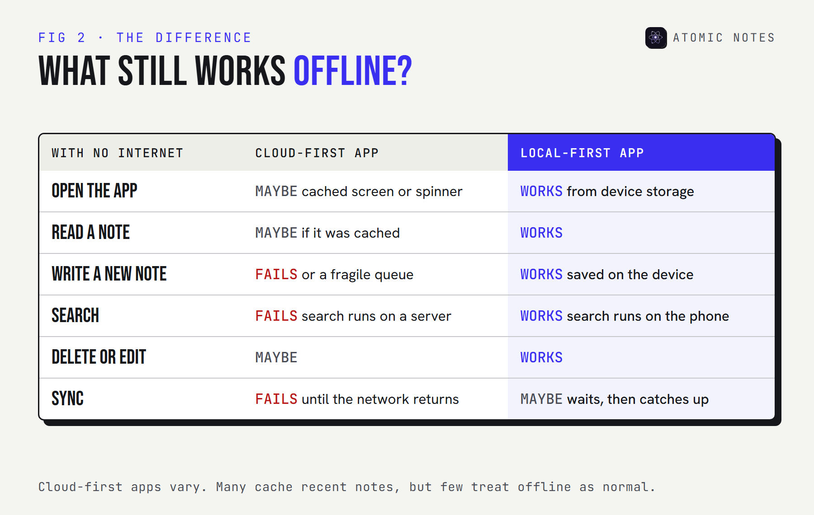
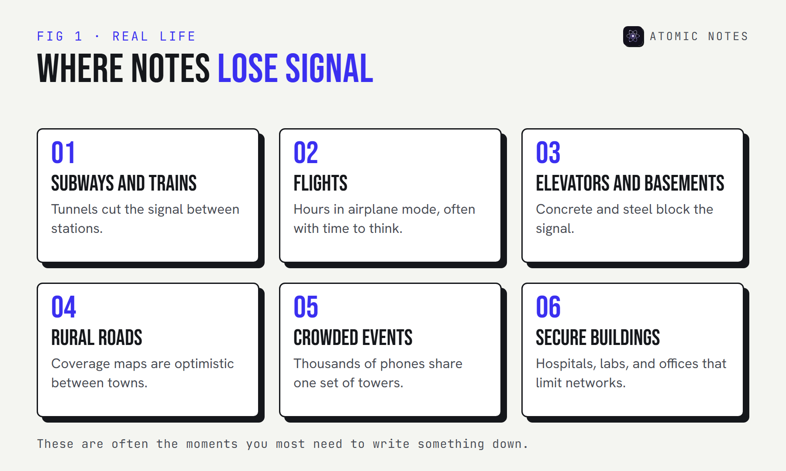
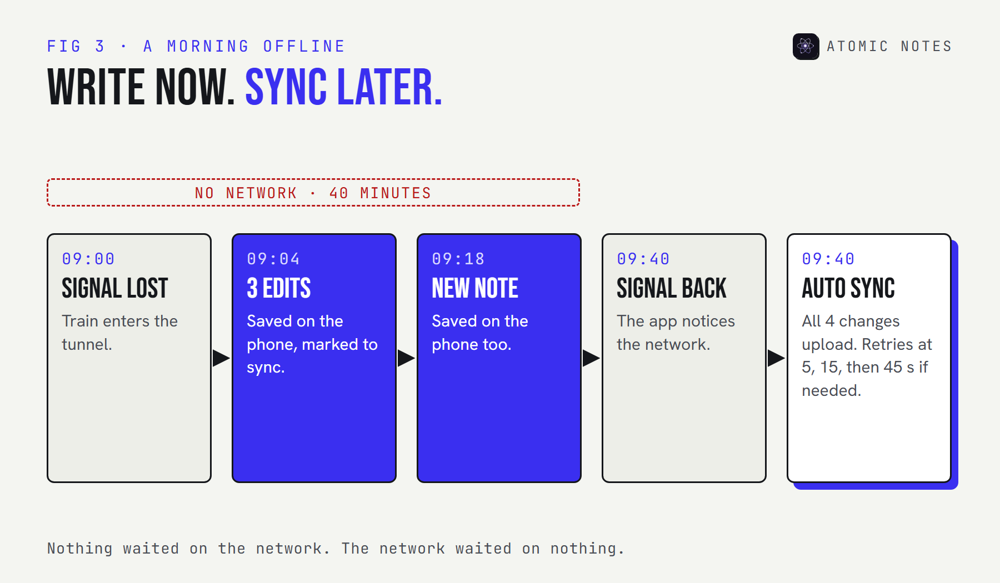
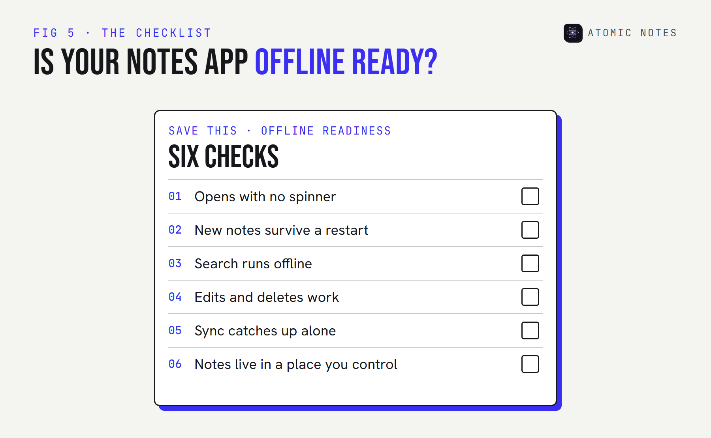

<div class="callout">
<p class="callout-label">Quick answer</p>
<p>A notes app without internet access should still open, save, search, edit, and delete, then sync on its own when the signal returns. Many apps only cache recent notes and fail on new writes. Offline should be the default because the moments you need to write something down are often the moments you have no signal.</p>
</div>

You're in a hospital waiting room with one bar of signal. The doctor has just told you three things you need to remember. You open your notes app, and it shows a spinner.

That's the worst possible time for a notes app to need the internet. It's also a surprisingly common one. Signal disappears in elevators, basements, trains, planes, and the crowded places where life actually happens.

I build Atomic Notes, an Android app that saves every note on the phone first. This guide explains why a notes app without internet should be normal rather than a special mode, what breaks when it isn't, and how to test the app you use today.

## Does your notes app work without internet?

**Probably partly.** Most apps can show notes you opened recently. Far fewer can save a new note, search everything, and sync it later without losing anything.

The difference comes from where the app keeps the real copy of your notes. A cloud-first app keeps it on a server and shows you a cached view. A local-first app keeps it on your phone and treats the server as a copy. Offline, those two designs behave very differently.



Search is the quiet giveaway. If search runs on the company's servers, it stops the moment you lose signal, even when the notes themselves are cached. A notes app without internet access needs its search index on the phone.

You don't have to guess. Run this test on your own phone right now:

:::widget airplane-test

If the test failed at step three, take note. That's the step where a new note can be lost, and it's the one that matters most.

## Where do notes lose signal?

**In exactly the places you're most likely to need them.** Coverage maps show where a network exists, not where your phone can actually reach it.



Think about when you reach for a notes app. Mid-commute, when an idea lands. On a flight, with hours to think. In a meeting room deep inside an office building. At a concert, writing down a setlist. Every one of those is a dead zone or close to it.

Search engines see this too. People type "notes app no internet" after an app has just shown them an error, which is exactly when it's too late to switch apps. Pick a notes app without internet dependence before the trip, not during it.

## Why should offline be the default?

**Because a notes app's job is to catch a thought before it's gone, and a network request is the slowest, least reliable part of that job.** Four reasons make the case.

### Speed: the waiting tax

Every cloud-first save is a round trip to a server. On good Wi-Fi, that's barely noticeable. On weak signal, it can take seconds, and some saves fail outright. A local save finishes in milliseconds, whatever the network is doing. That latency is a tax a notes app without internet dependence never charges you.

Try the numbers for your own day:

:::widget wait-calculator

The round-trip times above are assumptions for illustration, not measurements. The shape of the result holds anyway: local saves cost nothing, and cloud saves cost the most exactly when signal is worst.

### Reliability: other people's outages

Your own signal isn't the only risk. When a cloud provider has a bad day, every app built on it can stall at once. I covered a real example, the October 2025 AWS outage, in the guide to [what a local first notes app is](/blog/what-is-a-local-first-notes-app). Cloud dependency means every server between you and your notes has to be working.

### Privacy: less in transit

A notes app without internet access by default sends less, less often. Notes that live on your phone first don't need to cross a network every time you open them, and that means fewer copies and fewer logs.

### Ownership: the copy that matters is yours

If the real copy lives on your phone, the app can't hold your notes hostage behind a login screen or a server outage. Local storage is the plainest form of owning your data.

## How do you set up offline notes for travel?

**Do it before you leave, while you still have good Wi-Fi.** Travel is where dead zones stack up: airports, flights, border crossings, and roaming data you'd rather not pay for.

1. **Sync everything before you go.** Open the app on Wi-Fi and let it finish, so every device has the latest copy.
2. **Run the airplane test once.** Five minutes at home beats a failed save at 30,000 feet.
3. **Turn on the app lock.** A phone on a tray table or a hotel nightstand is easier to pick up than you think.
4. **Write freely on the way.** A notes app without internet needs nothing from the plane's Wi-Fi. Your notes queue up and sync when you land.
5. **Check sync after you land.** Open the app on a stable connection and confirm the changes went through before you rely on another device.

If you've ever stood at a gate typing "notes app no internet" into a search bar, this five-step routine is the fix. It takes less time than boarding.

## What happens when the signal comes back?

**A good app catches up on its own.** You shouldn't have to press a retry button, and you should never lose a change you made offline.



Behind the scenes, three things have to go right:

1. **The app remembers what changed.** Each edited note is marked as waiting to sync, and that mark survives a restart.
2. **It notices the network.** When the connection returns, it starts syncing without being asked.
3. **It survives a bad connection.** Weak signal often drops mid-upload, so retries must never create duplicates or overwrite newer edits.

In Atomic Notes, sync runs about eight seconds after you stop typing, when the app resumes, and when the network reconnects. Failed uploads retry after 5, 15, and then 45 seconds, and every retry carries the same request ID, so the server can't apply the same change twice. If two devices edited the same note offline, the older edit is kept as a separate conflict copy instead of being thrown away.

For developers testing their own app, Android can switch airplane mode from a computer, which makes the reconnect path easy to repeat:

<p class="code-label">Terminal · Android 11 or newer, USB debugging on</p>

```bash
# Go offline, use the app, then come back online and watch it sync
adb shell cmd connectivity airplane-mode enable
adb shell cmd connectivity airplane-mode disable
```

## What does Atomic Notes do without internet?

**Everything you do with notes every day works offline. Only the cloud parts wait.** Every note saves to on-device Hive storage as you type, and that local copy is the source of truth.


Being honest about the limits matters here. You need a connection to sign in the first time, because sign-in goes through your Google account. Sync to your Google Drive, Atomic Energy, and notifications all need a network too. And sync only runs while the app is open, since background sync while the app is closed is still on the roadmap.

What never waits is the writing, which is the whole point of a notes app without internet dependence. Open the app in airplane mode and your notes are there. Write a new one, close the app, restart the phone, and it's still there when you come back.

## How can you make any notes app more offline-friendly?

**Check its settings, keep critical notes where you can always reach them, and don't trust a cache with anything you can't lose.**

- **Look for an offline setting.** Some cloud-first apps let you mark notebooks or pages for offline use. Turn it on for anything you'd need on a trip.
- **Open what you'll need before you lose signal.** Cached apps usually keep what you viewed last.
- **Don't write important notes into a "waiting to sync" state.** If the app shows a pending or retrying banner for new notes, copy them somewhere safe until they sync.
- **Keep one source of truth on the device.** If your current app can't work offline, move the notes that matter most to a notes app without internet dependence.
- **Export now and then.** An export is a copy no outage or account problem can take away.



My opinion, after building one: a notes app that needs a network to save is really a website you carry around. Offline shouldn't be a premium feature or a hidden setting. Every notes app without internet access should still do its one job, which is keeping what you write. That's how notes apps should work.

## FAQ

<div class="faq-list">
<details>
<summary>Does a notes app work without internet?</summary>
<p>It depends on how it's built. Local-first apps save, search, and edit with no connection and sync later. Cloud-first apps often show cached notes but can fail on new writes or search. Run the airplane test above to see how yours behaves.</p>
</details>
<details>
<summary>What's the best notes app without internet for Android?</summary>
<p>Look for a local-first app: one that saves every note on the phone, searches on the device, and syncs only when it can. Atomic Notes works this way and syncs to your own Google Drive. Several open source apps never touch the internet at all.</p>
</details>
<details>
<summary>Why does my notes app say no internet connection?</summary>
<p>The app is trying to reach its server to load or save notes, and can't. Cloud-first apps need that connection for parts of their job. A local-first app saves on your phone instead and only needs the network to sync.</p>
</details>
<details>
<summary>Will notes I write offline be lost?</summary>
<p>In a local-first app, no. Each note is saved on the device first and marked to sync later, and that survives restarts. In apps that only queue changes in memory, a crash or force-close before reconnecting can lose new notes.</p>
</details>
<details>
<summary>Can Atomic Notes sync when the app is closed?</summary>
<p>Not yet. Sync runs while the app is open: after you stop typing, when the app resumes, and when the network returns. Background sync while the app is closed is on the roadmap. Your notes stay safe on the phone either way.</p>
</details>
<details>
<summary>Is an offline notes app less secure?</summary>
<p>Usually the opposite. Notes on your phone sit behind your device lock, and an app lock adds another layer. Less data crossing the network means fewer copies in transit. For the cloud copy, end-to-end encryption keeps synced notes private.</p>
</details>
</div>

## Keep reading

- [What is a local first notes app, and why does it matter?](/blog/what-is-a-local-first-notes-app)
- [Local first architecture: the 4 layers behind Atomic Notes](/blog/atomic-notes-architecture)
- [Encrypted notes explained: T2T vs end to end encryption](/blog/encrypted-notes-explained)
- [8 best offline notes apps for Android, checked](/blog/best-offline-notes-apps-android)

<div class="callout ink">
<p class="callout-label">Atomic Notes by DevBehindYou</p>
<p>Built to be a notes app without internet dependence. Every note saves on your phone first, search runs on the device, and sync to your own Google Drive catches up when the signal does. <a href="/">See how it works</a>.</p>
</div>

## Sources

- [Local-first software: you own your data, in spite of the cloud. Ink & Switch, 2019](https://www.inkandswitch.com/essay/local-first/)
- [Build an offline-first app. Android Developers](https://developer.android.com/topic/architecture/data-layer/offline-first)
- [hive_ce, the on-device database Atomic Notes uses. pub.dev](https://pub.dev/packages/hive_ce)
- [Atomic Notes source code. GitHub](https://github.com/DevBehindYou/Atomic-Notes-App-V0.2)
