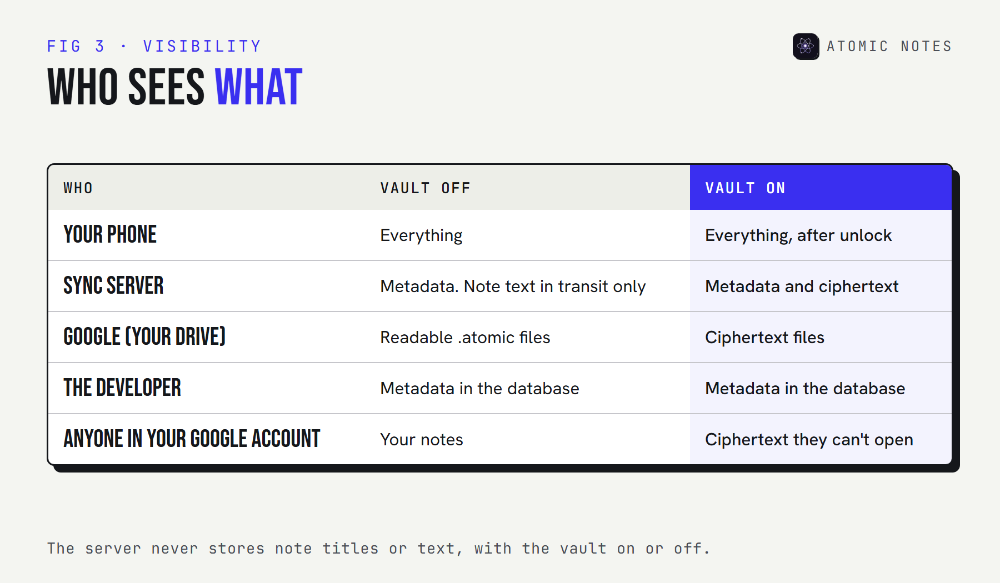
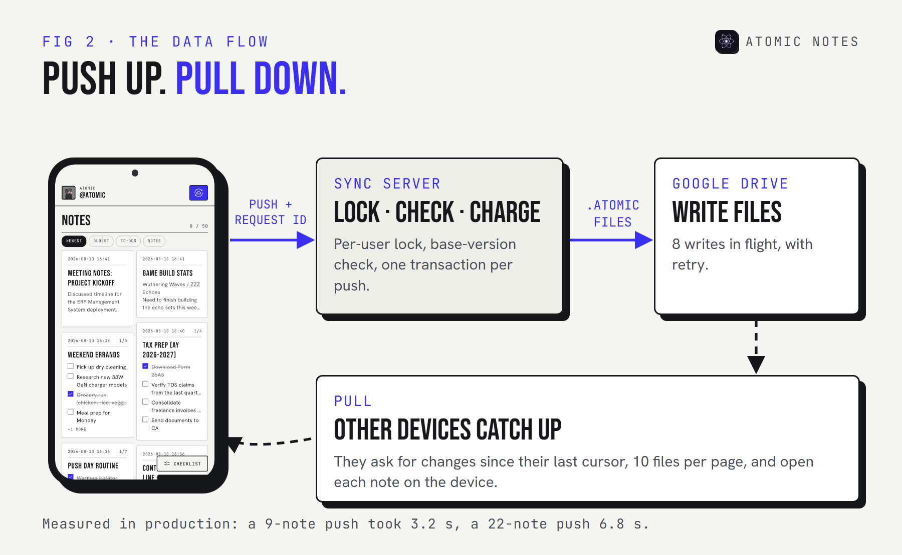
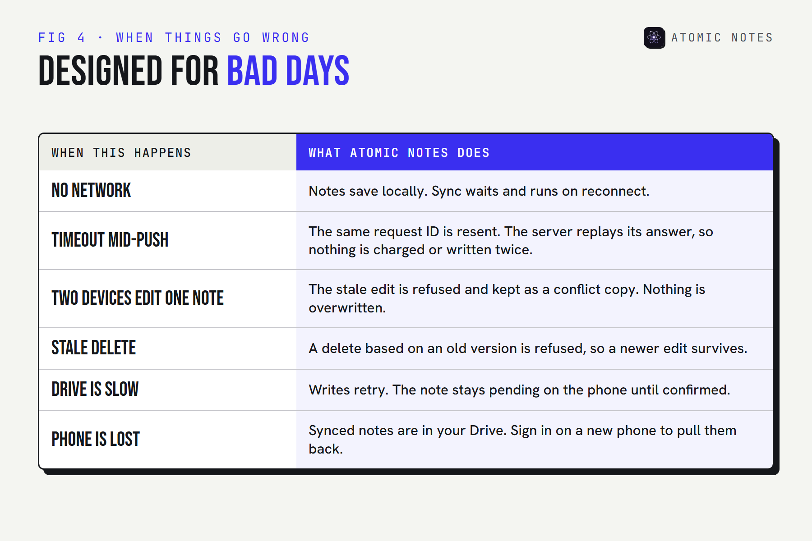
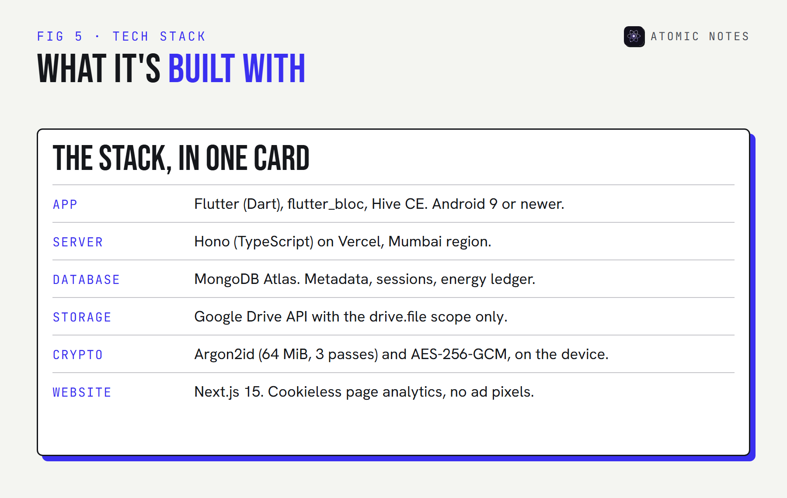

<div class="callout">
<p class="callout-label">Quick answer</p>
<p>Atomic Notes uses a local first architecture with four layers. Your phone holds the real copy in on-device storage. A sync server coordinates devices but stores only metadata. Your own Google Drive holds the cloud copy, one file per note. An optional vault encrypts notes on the phone, so the server and Drive only ever see ciphertext.</p>
</div>

Most "how it works" pages for notes apps are a diagram with three boxes and an arrow labeled "magic." This isn't one of those.

I designed and built every layer of Atomic Notes, and the code for the app is public. So this is the real local first architecture behind it: what each layer does, what each one can and can't see, what happens when things break, and where the design still falls short.

If you're new to the idea, start with [what a local first notes app is](/blog/what-is-a-local-first-notes-app). This guide is the deep dive.

## What does a local first architecture need?

**Three jobs, kept apart on purpose: store, coordinate, and copy.** Most cloud apps blend all three into one server. A local first app architecture splits them, so no single part can hold your notes hostage.

1. **Store.** The device keeps the authoritative copy and does all the reading and writing.
2. **Coordinate.** Something has to tell devices what changed, in what order, and settle disagreements.
3. **Copy.** A durable place for the cloud copy, so a lost phone isn't lost notes.

In Atomic Notes, each job has its own layer, plus a fourth that wraps the other two in encryption when you want it.

## Why not one cloud database, like most apps?

**Because a single database makes the company the owner of your notes by default.** I started there. Early versions of Atomic Notes kept note content in a hosted database, and it was simpler to build. It also meant every note lived on infrastructure I controlled, readable by anyone with database access, and gone if the service ever closed.

Moving to a local first architecture changed three things. The phone became the source of truth, so the app stopped waiting on servers. Note content moved to each user's own Google Drive, so the cloud copy stopped being ours. And the server shrank to MongoDB metadata plus coordination, which is a much smaller thing to protect.

It cost a rewrite of sync, and it's the best design decision in the project. Here's how the Atomic Notes architecture fits together now.


## Layer 1: what does the device do?

**Everything you touch.** The app is written in Flutter (Dart) with flutter_bloc for state, and every note lives in Hive CE, an on-device database. Writing, editing, search, checklists, and deletes all run against that local copy.

The key design rule: a save finishes on the phone. The note is written to Hive, marked dirty, and the screen updates. No network call sits in that path, which is why the app opens and saves the same way in airplane mode as on Wi-Fi. I cover that behavior in detail in [why notes should work without internet](/blog/why-notes-should-work-offline).

Each note also carries the bookkeeping sync needs: a version number from the server, a fingerprint of its synced content, and a dirty flag. If you edit a note and then undo the change, the fingerprint matches what the cloud already holds, so nothing is uploaded. Small detail, real savings on battery and energy.

## Layer 2: what does the sync server do?

**It coordinates, and it remembers metadata, never your writing.** The server is written in TypeScript on Hono, runs on Vercel in the Mumbai region, and keeps its records in MongoDB Atlas.

On every push, it takes a per-user lock, checks each note's base version, spends Atomic Energy, and records the result, all in one database transaction. Then it writes each note to your Drive, with up to eight writes in flight and retries for slow responses.

In this local first architecture, what the server stores is metadata: note IDs, type, pinned and deleted flags, versions, Drive file IDs, a content hash, and timestamps. The full list is in the guide to [notes app metadata](/blog/notes-app-data-collection). What it never stores is a note title or a line of text.

There's one honest catch in this local first architecture. With the vault off, note text passes through the server on its way to your Drive. It isn't stored, but it is handled. That's why the vault exists.

## Layer 3: why your own Google Drive?

**Because the cloud copy should belong to you, not to us.** Each note becomes its own `.atomic` file, readable JSON, in a My-Atomic-Notes folder in your Google Drive.

The app asks Google for the narrow `drive.file` scope. That means it can only see files it created itself. It can't read your documents, photos, or anything else in your Drive.

User-owned cloud storage changes what a shutdown means. If Atomic Notes disappeared tomorrow, your notes would still be on your phone and in your Drive, as files you can open, copy, or move. That's the part of the Atomic Notes architecture I'm most stubborn about.

The trade: Drive is slower than a database built for sync, and that's the main performance cost of this local first architecture. A single file write takes about 1.5 seconds in production. Batching and parallel writes hide most of it, but it's a real cost, paid for ownership.

## Layer 4: what does the vault change?

**It moves encryption onto the phone, so layers 2 and 3 only ever hold ciphertext.** The vault is optional and off by default.

Turn it on and you get a six-word recovery phrase. The phone stretches it into a 256-bit key with Argon2id (64 MiB, 3 passes), then seals each note's title, body, and checklist items with AES-256-GCM before upload. The key never leaves your devices. The server keeps only a verifier, so a wrong phrase fails without revealing anything.

The [encrypted notes guide](/blog/encrypted-notes-explained) explains the cryptography and has a live demo. For the architecture, the point is simple: the vault changes what the middle layers can see, without changing how sync works.



## How does one sync actually work?

**Push up, pull down.** The phone pushes its changes in a batch, and other devices pull what they missed.



Step through one sync below, then switch to a dropped connection to see why retries are safe:

:::widget sync-stepper

The safety comes from one decision: the phone saves the push to disk before sending it, with a fresh request ID. If the connection drops, the retry resends the same saved push. If the server already applied it, it recognizes the ID and returns the stored result. That's request ID replay, and it's why a retry never charges energy twice or writes a duplicate note.

Here's that step in the app's source, trimmed:

<p class="code-label">lib/database/notes_repository.dart · Atomic Notes 2.03.5</p>

```dart
// Up to 50 dirty notes per push, sealed if the vault is on.
final candidates = _notes.values.where((n) => n.dirty).take(_maxPushRows).toList();
final rows = await Future.wait(candidates.map((n) => _sealRemote(n, uid)));

final pending = {
  'requestId': newId(),   // the same ID is resent on every retry
  'rows': rows,
  // the base version of each note, so the server can refuse stale edits
  'versions': {for (final n in candidates) n.id: n.updatedAt.toIso8601String()},
  'conflictIds': {for (final n in candidates) n.id: newId()},
};
await _box.put(_pendingPushKey, pending); // saved before it's sent
```

## What happens when things go wrong?

**Each failure has a defined answer, and none of them is "lose the note."** A local first architecture is only as good as its bad days.



Two of these deserve a closer look:

- **Two devices edit the same note offline.** Whichever arrives second is based on an old version, so the server refuses it with a conflict. The phone saves that edit as a separate "conflict copy" note. You decide what to keep. Nothing is silently overwritten.
- **A stale delete.** If one device deletes a note that another device has since edited, the delete is refused. A newer edit always beats an older delete.

Retries follow a fixed schedule of 5, 15, and then 45 seconds. After that, the app waits for the next natural trigger: an edit, the app resuming, or the network coming back.

## What is Atomic Notes built with?



| Layer | Technology | Holds |
|---|---|---|
| Device | Flutter, flutter_bloc, Hive CE | The real copy of every note |
| Sync server | Hono (TypeScript) on Vercel, MongoDB Atlas | Metadata, versions, sessions, energy |
| Cloud copy | Google Drive API, `drive.file` scope | One `.atomic` file per note |
| Vault | Argon2id + AES-256-GCM, on the device | Nothing. It changes what the others hold |

## Where does this local first app architecture fall short?

**Honest limits, all on the roadmap.** A local first architecture is easier to trust when it names its own gaps.

- **Sync only runs while the app is open.** Background sync is planned, not shipped.
- **Google sign-in is required.** Email sign-in is planned. Until then, the app needs a Google account.
- **No export button yet.** Your Drive copy is readable JSON, so the way out exists, but a one-tap export is still coming.
- **No real-time collaboration.** It's a personal notes app. Shared editing would need a very different sync model.
- **Android only.** A web version and iOS are planned, and the local first architecture was chosen with them in mind.

My view after building it: this local first architecture costs more engineering than a plain cloud app, and every bit of that cost lands in the sync engine. In return, the server can go down, the network can vanish, and the company can disappear, and your notes are still yours.

## FAQ

<div class="faq-list">
<details>
<summary>What is a local first architecture?</summary>
<p>It's a design where the device holds the authoritative copy of your data and works without a network, while sync copies changes to the cloud and other devices. The server coordinates rather than owns. Atomic Notes follows this design, with your own Google Drive as the cloud copy.</p>
</details>
<details>
<summary>Does the Atomic Notes server store my notes?</summary>
<p>No. It stores metadata only: IDs, flags, versions, Drive file IDs, and timestamps. Note content goes to your own Google Drive. With the vault off, text passes through the server in transit. With the vault on, the server only handles ciphertext.</p>
</details>
<details>
<summary>Why use Google Drive instead of a database?</summary>
<p>So the cloud copy belongs to you. Your notes stay in your own Drive as readable files, even if the app shuts down. The app's narrow drive.file access means it can only see the files it created, nothing else in your Drive.</p>
</details>
<details>
<summary>What happens if two devices edit the same note?</summary>
<p>The second edit to arrive is based on an old version, so the server refuses it. The phone keeps that edit as a separate conflict copy, and you choose what to keep. Nothing is overwritten without you seeing it.</p>
</details>
<details>
<summary>Can I read the Atomic Notes code?</summary>
<p>Yes. The app is source-available on GitHub, so you can read and verify every layer described here that runs on your phone, including sync and the vault. The license allows reading and verifying, not reuse. The server is private.</p>
</details>
</div>

## Keep reading

- [What is a local first notes app, and why does it matter?](/blog/what-is-a-local-first-notes-app)
- [Encrypted notes explained: T2T vs end to end encryption](/blog/encrypted-notes-explained)
- [Notes app metadata: 8 things it knows without reading notes](/blog/notes-app-data-collection)
- [How 6 local first note taking apps compare](/blog/best-local-first-note-taking-apps)

<div class="callout ink">
<p class="callout-label">Atomic Notes by DevBehindYou</p>
<p>Every layer on your phone is public to read: the Hive storage, the sync engine, and the vault. If something in this guide sounds too good, check the code. <a href="https://github.com/DevBehindYou/Atomic-Notes-App-V0.2">Browse the source on GitHub</a>.</p>
</div>

## Sources

- [Local-first software: you own your data, in spite of the cloud. Ink & Switch, 2019](https://www.inkandswitch.com/essay/local-first/)
- [Choose Google Drive API scopes. Google for Developers](https://developers.google.com/workspace/drive/api/guides/api-specific-auth)
- [hive_ce. pub.dev](https://pub.dev/packages/hive_ce)
- [Hono web framework](https://hono.dev/)
- [Argon2 memory-hard function, RFC 9106. IETF](https://www.rfc-editor.org/rfc/rfc9106)
- [Atomic Notes source code. GitHub](https://github.com/DevBehindYou/Atomic-Notes-App-V0.2)
