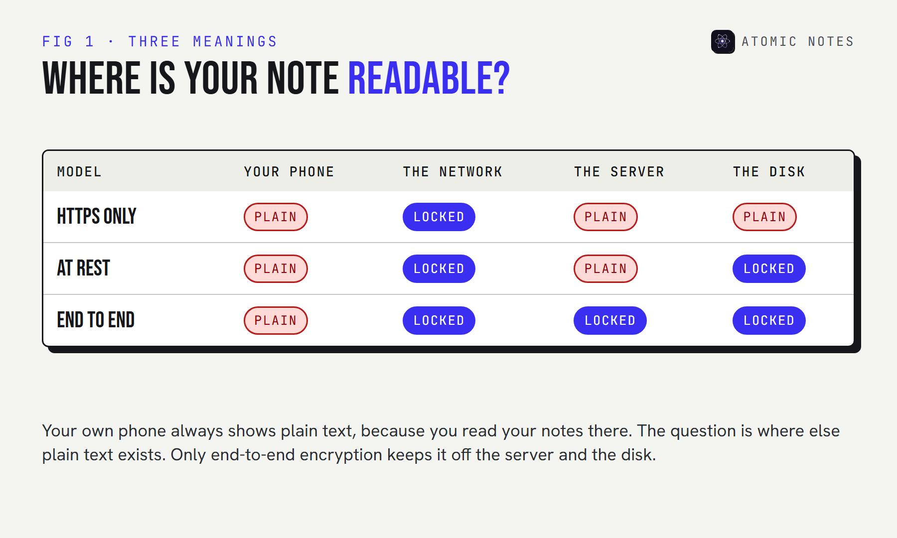
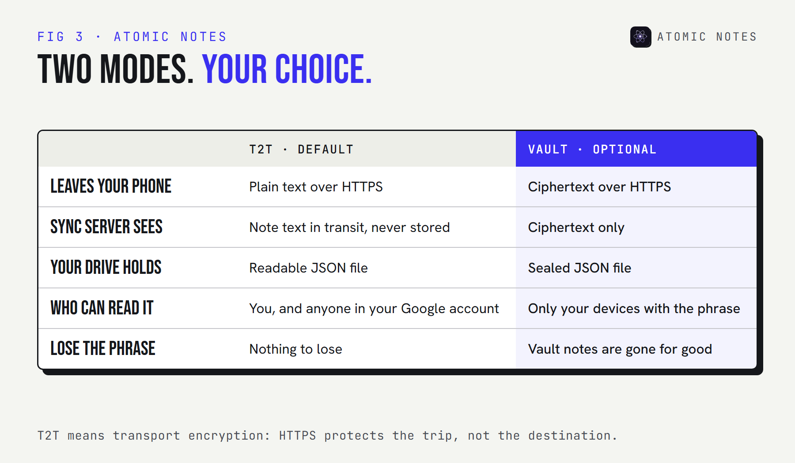
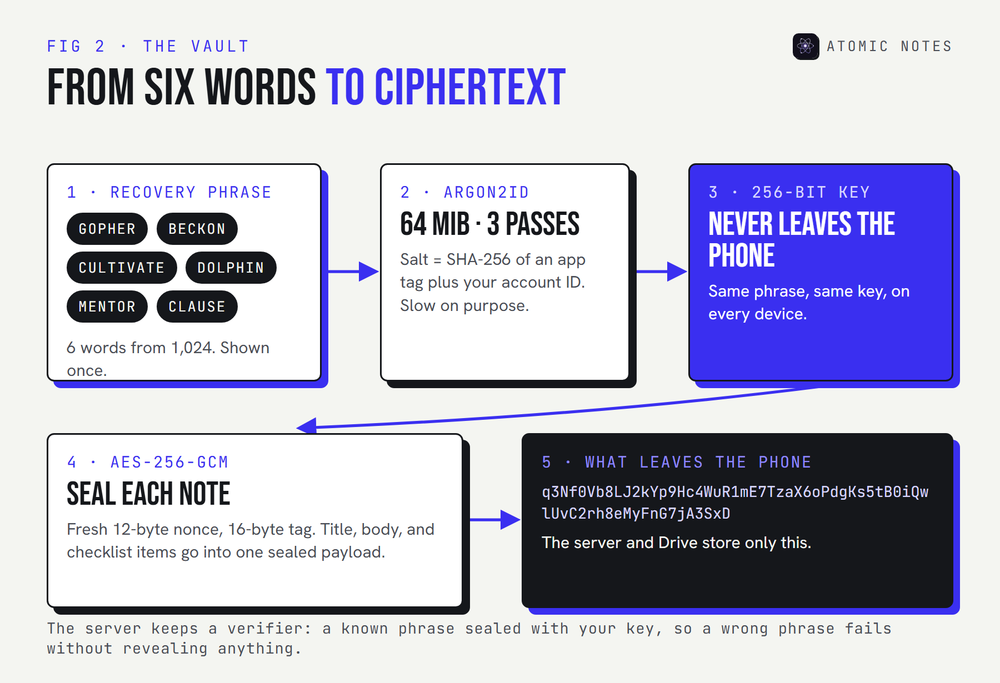
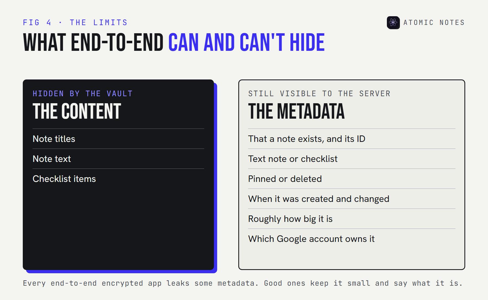
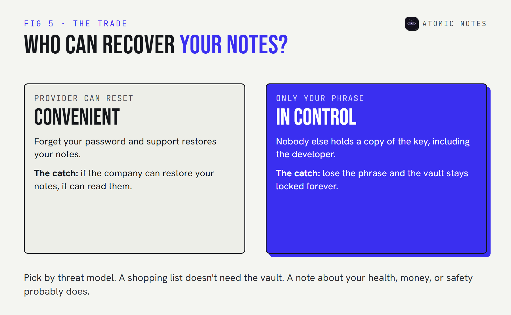

<div class="callout">
<p class="callout-label">Quick answer</p>
<p>Encrypted notes can be locked in three places: on the network (HTTPS), on the company's disks (encryption at rest), or on your own device before anything leaves it (end-to-end). Only end-to-end encryption keeps the company itself from reading your notes. The other two protect against outsiders, not against the app.</p>
</div>

Almost every notes app promises encrypted notes. Most of them are telling the truth. And most of them can still read every word you write.

That isn't a contradiction. "Encrypted" describes a lock, and a lock only matters if you know who holds the key. Apple, for example, encrypts iCloud data by default but keeps the keys for most of it, unless you turn on Advanced Data Protection.

I build Atomic Notes, which offers both kinds: plain transport encryption by default, and an optional vault for end-to-end encrypted notes. Here's what each one actually protects, with a live demo you can run in this page.

## What does "encrypted notes" really mean?

**It means a lock exists somewhere between your thumb and the server's disk.** Where that lock sits decides who can open it.

There are three common places:

1. **In transit.** HTTPS (TLS) scrambles your note while it travels. Someone on the same café Wi-Fi sees noise. The server unwraps it on arrival and reads it.
2. **At rest.** The company encrypts the disks its data sits on. A thief who steals a hard drive gets nothing. The company, which holds the disk keys, still reads everything.
3. **End-to-end.** Your device encrypts the note before it leaves, with a key only you have. The server stores ciphertext it can't open.



So when an app advertises encrypted notes, the useful follow-up is always: encrypted where, and with whose key? Pick a model below and see who can still read the note.

:::widget who-can-read

## What is end to end encryption?

**End-to-end encryption means only the "ends" of the conversation can read the data: your devices.** Everything in the middle, including the company's servers, only ever handles ciphertext.

Here's end to end encryption explained in four steps, using encrypted notes as the example:

1. **You create a secret.** Usually a password or a recovery phrase that never leaves your devices.
2. **Your device turns it into a key.** A slow key derivation function stretches the secret into a strong 256-bit key, so guessing it by brute force stays impractical.
3. **Your device seals each note.** A cipher like AES-256-GCM turns the note into ciphertext and adds a tag that detects tampering.
4. **Only ciphertext travels.** The server stores it, syncs it, and backs it up without ever being able to read it.

The defining detail is the key. If the company ever holds a copy, the system isn't end-to-end, however strong the cipher is. That's why "military-grade encryption" means nothing on its own: AES is the same lock everywhere. The question is always who holds the key.

## How do T2T and the vault differ in Atomic Notes?

**T2T is Atomic Notes' name for plain transport encryption, and it's the default.** The vault is the optional end-to-end mode. They protect very different things, so here they are side by side.



With T2T, your note travels over HTTPS to the sync server, which passes it straight into a `.atomic` file in your own Google Drive. The server never stores the text, but it does handle it in transit, and the file in your Drive is readable by you and by anyone who gets into your Google account. For a grocery list, that's fine.

With the vault on, your phone encrypts the title, body, and checklist items before anything leaves. The server and Google only ever see ciphertext. Try it below with real AES-256-GCM, running in your browser:

:::widget encryption-playground

Notice two things. The ciphertext changes every time, because each save uses a fresh random 12-byte nonce. And changing a single word of the phrase makes decryption fail outright, because the 16-byte authentication tag no longer matches.

## How does the Atomic Notes vault work?

**Six words become a key, the key never leaves your phone, and every note is sealed before upload.** These are the exact parameters in the 2.03.5 source code.



- **The phrase.** Six words drawn at random from a 1,024-word list, which gives 60 bits of entropy. It's shown once and never sent anywhere.
- **The key derivation.** Argon2id with 64 MiB of memory and 3 passes. Memory-hard on purpose: every guess costs an attacker real hardware. The salt is a SHA-256 hash of an app tag and your account ID, so the same phrase gives the same key on every device.
- **The cipher.** AES-256-GCM with a 12-byte nonce and a 16-byte tag, the standard NIST mode for authenticated encryption.
- **The verifier.** The server stores a known phrase sealed with your key. When you open the vault on a new device, a wrong phrase fails the check, and the server learns nothing about your key.

Here's the sealing code, trimmed from the public source:

<p class="code-label">lib/security/vault_crypto.dart · Atomic Notes 2.03.5</p>

```dart
static Future<SecretKey> deriveKey(String phrase, List<int> salt,
    {required int memory, required int iterations, required int parallelism}) {
  final argon = Argon2id(
    memory: memory,         // 65536 KiB, so 64 MiB per guess
    iterations: iterations, // 3 passes
    parallelism: parallelism,
    hashLength: 32,         // a 256-bit key
  );
  return argon.deriveKeyFromPassword(password: phrase, nonce: salt);
}

/// Returns base64(nonce ++ ciphertext ++ mac).
static Future<String> seal(List<int> clear, SecretKey key) async {
  final box = await aes.encrypt(clear, secretKey: key); // AES-256-GCM
  return base64Encode(box.concatenation());
}
```

Anyone can read this file and check that the key is derived on the device and never sent. That's the point of public source code for encrypted notes: you don't have to take the claim on trust.

One more practical detail. Argon2id is slow on purpose, but it only runs when you open the vault, not on every save. After that, each note is sealed as you save it, so the optional vault doesn't add a spinner to your writing.

## How can you check an app's encrypted notes claims?

**Ask five questions, and expect a plain answer to each one.** If an app's security page can't answer them, treat its encrypted notes as a marketing line.

1. **Where does encryption happen?** On your device before upload, or only on the network and the server's disks?
2. **Who holds the key?** You alone, or a copy on the company's side "for recovery"?
3. **Is it on by default?** Some apps encrypt every note. Others, like Atomic Notes, make end-to-end optional and say so.
4. **What stays visible?** Every app keeps some metadata. A good one names it.
5. **Can you check?** Public source code, an independent audit, or at least a detailed write-up of the key derivation and the cipher.

Here are the terms you'll meet while checking, in one place:

| Term | What it means |
|---|---|
| TLS or HTTPS | Encryption on the network. Protects the trip, not the destination. |
| Encryption at rest | Encrypted disks. Protects against stolen hardware. The provider keeps the keys. |
| End-to-end encryption | Your devices encrypt and decrypt. Servers only handle ciphertext. |
| Key derivation | Turning a password or phrase into a strong key. Argon2id is a modern choice. |
| Nonce | A random number used once, so the same note never encrypts the same way twice. |
| Authentication tag | A short checksum that fails loudly if the ciphertext or the key is wrong. |
| Ciphertext | The scrambled output. Useless without the key. |

## What can't encrypted notes hide?

**End-to-end encryption hides what you wrote, not the fact that you wrote it.** Every sync service needs some metadata to do its job, and that metadata stays visible.



In Atomic Notes, the vault seals the title, body, and checklist items. The server can still see that a note exists, whether it's a text note or a checklist, whether it's pinned or deleted, when it changed, and roughly how large it is. That's enough to sync without conflicts. It's also enough to show patterns, which is why metadata deserves its own guide.

Any app that claims its encrypted notes hide "everything" either syncs nothing or is overselling. The honest version is: content hidden, metadata kept small, and the remaining metadata named in public.

## What does end-to-end encryption cost you?

**Recovery.** If only you hold the key, only you can recover your notes. Lose the phrase and nobody can help, including the developer.



This is the honest trade at the heart of encrypted notes, and no clever design removes it. Services that can reset your password for you can also, by design, decrypt your data. Services that can't, can't. Some apps offer a recovery key you store yourself, which helps, but it's still a second copy of the secret that you have to protect.

So before you choose between plain and encrypted notes, start with your threat model. It's a plain question: who are you protecting these notes from?

| If you worry about | You need | Atomic Notes setting |
|---|---|---|
| Someone on public Wi-Fi | HTTPS | T2T, on by default |
| A stolen server disk | Encryption at rest | Your Drive's own encryption |
| The app company, a breach, or a legal request | End-to-end encryption | Turn on the vault |
| Someone holding your unlocked phone | A device lock | Biometric app lock |

My take after building both modes: most notes don't need the vault, and some encrypted notes really do earn their keep. Health, money, and anything about other people's safety belong behind a key only you hold. If you're unsure, turn the vault on for a week and watch for any difference in how you write. Once it's open, encrypted notes save and search like any others, so the only real cost is keeping the phrase safe.

## FAQ

<div class="faq-list">
<details>
<summary>Are encrypted notes safe from the app company?</summary>
<p>Only if they're end-to-end encrypted. HTTPS and encryption at rest stop outsiders, but the company still holds the keys and can read your notes. With end-to-end encryption, the company stores ciphertext it has no way to open.</p>
</details>
<details>
<summary>What is end to end encryption, explained simply?</summary>
<p>Your device locks the note before it leaves, with a key that never leaves your devices. Servers in the middle store and sync the locked version but can't open it. Only your own devices, with your key, can read it again.</p>
</details>
<details>
<summary>What does T2T mean in Atomic Notes?</summary>
<p>T2T is the default transport encryption mode. Notes travel over HTTPS and are saved as readable files in your own Google Drive. The sync server handles the text in transit but never stores it. Turn on the vault for end-to-end encryption.</p>
</details>
<details>
<summary>Do encrypted notes still work offline?</summary>
<p>Yes, in Atomic Notes. Notes save on the phone first, vault on or off, and sync later. Encrypted notes are sealed on the device, so encryption never needs a network. You do need a connection to sync, and to set up the vault the first time.</p>
</details>
<details>
<summary>What happens if I lose my recovery phrase?</summary>
<p>Vault notes stay encrypted forever. The phrase is the only way to rebuild the key, and nobody else holds a copy, including the developer. Write it down and keep it somewhere safe and offline, not in a notes app.</p>
</details>
<details>
<summary>Is AES-256-GCM enough to keep notes private?</summary>
<p>The cipher is strong, but it's only half the story. What matters is who holds the key and what metadata stays visible. AES-256-GCM with a company-held key protects you from thieves, not from the company itself.</p>
</details>
</div>

## Keep reading

- [Local first architecture: the 4 layers behind Atomic Notes](/blog/atomic-notes-architecture)
- [Notes app metadata: 8 things it knows without reading notes](/blog/notes-app-data-collection)
- [Notes app privacy: 9 red flags to check](/blog/notes-app-privacy-red-flags)
- [5 best end to end encrypted notes apps, compared](/blog/best-end-to-end-encrypted-notes-apps)
- [How does encryption protect privacy? 5 gaps](/blog/encrypted-notes-privacy)

<div class="callout ink">
<p class="callout-label">Atomic Notes by DevBehindYou</p>
<p>Turn on the vault and your notes are sealed with AES-256-GCM on your phone, behind a six-word phrase only you know. The sync server and Google only ever store ciphertext. <a href="https://github.com/DevBehindYou/Atomic-Notes-App-V0.2">Read the vault code</a>.</p>
</div>

## Sources

- [Advanced Encryption Standard (AES), FIPS 197. NIST](https://csrc.nist.gov/pubs/fips/197/final)
- [Galois/Counter Mode (GCM), SP 800-38D. NIST](https://csrc.nist.gov/pubs/sp/800/38/d/final)
- [Argon2 memory-hard function, RFC 9106. IETF](https://www.rfc-editor.org/rfc/rfc9106)
- [iCloud data security overview. Apple Support](https://support.apple.com/en-us/102651)
- [Atomic Notes vault source code. GitHub](https://github.com/DevBehindYou/Atomic-Notes-App-V0.2)
