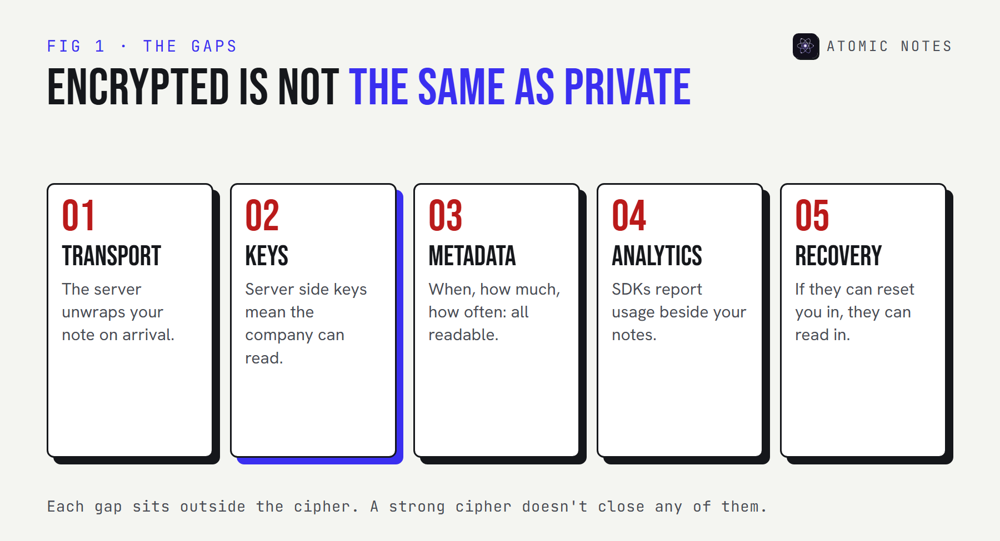
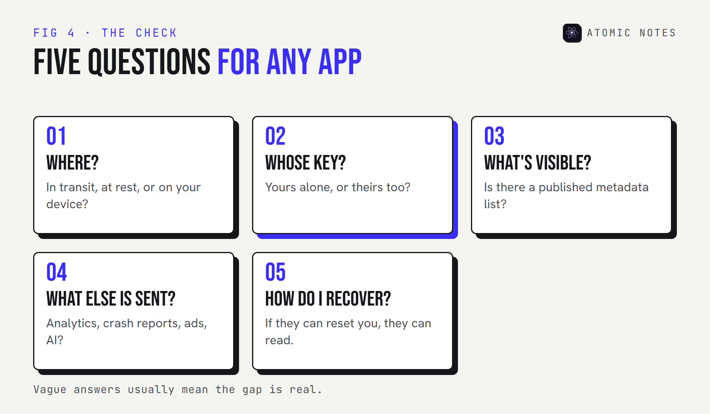

Quick answer

Encryption protects privacy by making your notes unreadable to anyone without the key. It only keeps the company out if the key never leaves your devices. Even then, metadata, analytics, account recovery, and the company's own policies can still expose you. Encrypted is one part of private, not the whole thing.

Nearly every notes app says "your data is encrypted". Most of them mean it. And many of them can still read your notes, see when you write them, and hand them over if asked.

So **how does encryption protect privacy**, exactly? It locks content against anyone who doesn't hold the key. The catch is in that last part: who holds the key, what sits outside the lock, and who can change the rules later.

I build Atomic Notes, which offers both plain transport encryption and an optional end-to-end vault. This guide is about the gaps between encryption and privacy that marketing pages skip, including the ones in my own app.

## How does encryption protect privacy?

**It turns readable data into ciphertext that only a key can reverse.** Anyone who intercepts or steals the ciphertext without the key gets nothing useful. That's the whole promise.

The protection depends on where the lock sits and who's on the other side of it. A thief on café Wi-Fi, a hacker who breaches a server, an employee, a government request, and someone holding your unlocked phone are five different threats. Each kind of encryption stops some of them and not others.

Pick a threat and an encryption setup to see where the lock helps:

:::widget threat-matrix

The pattern is clear once you try a few. Encryption is strong against outsiders. Against the company that runs the service, only end-to-end encryption helps. Against someone holding your unlocked phone, no encryption helps at all. That's your threat model in one table.

## What does encryption protect privacy from, and what not?

**It's excellent against outsiders and useless against anyone already holding a key or your unlocked phone.** Knowing which side of that line each threat sits on is the whole skill.

Here's how encryption and privacy line up against the threats people actually face with notes:

| Threat | Stopped by HTTPS | Stopped by encryption at rest | Stopped by end-to-end |
|---|---|---|---|
| Someone on the same Wi-Fi | Yes | No | Yes |
| A stolen server disk | No | Yes | Yes |
| A hacker inside the provider's systems | No | Usually not | Yes |
| The provider itself, or a legal demand to it | No | No | Yes |
| Someone holding your unlocked phone | No | No | No |
| An analytics SDK inside the app | No | No | No |

Two rows say "no" everywhere, and they matter more than people expect. Your phone's screen lock and an app lock handle the first one. Choosing an app without trackers handles the second. No cipher does either job.

So how does encryption protect privacy in practice? It shrinks the list of people who could read your notes. The rest of this guide is about the names that stay on that list even after encryption, and how to find them for any app you use.

## Why doesn't "encrypted" mean private?

**Because encryption only covers the content, and only from the people who don't hold the key.** Five common gaps sit outside that lock.

### 1. Transport encryption ends at the server

**HTTPS protects your note on the way there, then the server unwraps it.** It's the minimum every app should have, and it says nothing about what happens on arrival.

Transport encryption stops someone on the same network from reading your notes. It doesn't stop the service, its staff, or anyone who breaches it. When a privacy page leads with "encrypted in transit", read the next sentence carefully. Phrases like "bank-level" or "military-grade" encryption tell you the cipher, usually AES, which nearly everyone uses. They never tell you who holds the key, and that's the part that decides your privacy.

### 2. The provider may hold the keys

**Encryption at rest with server side keys protects against stolen disks, not against the company.** If the provider can decrypt your notes to show them in a web app or reset your password, it can decrypt them for other reasons too.

Apple's iCloud is a clear, well-documented example. Under standard data protection, iCloud Notes are encrypted in transit and on Apple's servers, but Apple holds the keys. Turn on Advanced Data Protection and Notes become end-to-end encrypted, with keys only on your trusted devices. Same app, same cipher, very different key custody.

Google Keep sits on the provider side of that line all the time. Keep notes are encrypted in transit and at rest, and Google holds the keys, so your notes are as private as Google's own policies and your account security. That's a reasonable choice for a shopping list. It's a different promise from end-to-end encryption, and the word "encrypted" covers both.

### 3. Metadata stays visible

**End-to-end encryption hides what you wrote, not when, how much, or how often.** Every sync service needs some metadata to work, and it's usually readable by the provider.

Apple publishes its list. Even with Advanced Data Protection, the dates a note was created, modified, and last viewed, whether it's pinned or deleted, and whether it contains a drawing stay under standard protection. That's honest documentation, and it's the right question to ask any app.

The LastPass breach in 2022 showed why metadata matters. Attackers copied vault backups where passwords and secure notes were encrypted, but website URLs were not, along with customer names, emails, and IP addresses. The secrets stayed locked, and the map of where people had accounts didn't. My guide to [notes app metadata](/blog/notes-app-data-collection) shows what a pattern like that can reveal.

### 4. Analytics and trackers run outside encryption

**An app can encrypt every note and still report how you use it.** Analytics, crash reporting, and advertising SDKs collect events, device details, and timing, and none of that passes through the note encryption.

This is the gap encryption marketing rarely mentions, because it's a different system. The question isn't "is it encrypted?" but "what else does the app send, and to whom?" Exodus Privacy scans Android apps for known tracker libraries, and an app's network permission list tells you whether it can send anything at all.

Atomic Notes ships no analytics, crash reporting, or advertising SDKs. That's a separate choice from the vault, and it applies whether the vault is on or off.

### 5. Account recovery and policy can reopen the lock

**If someone can reset your way back into encrypted notes, someone holds a key.** Recovery is where convenience and privacy trade places.

Truly end-to-end systems can't recover your notes without your password or recovery key. Systems that can, keep a copy of something that unlocks them. Policy can also move: in February 2025, Apple said it could no longer offer Advanced Data Protection to new users in the United Kingdom after a government demand, so UK users without it stayed on standard protection, with Apple holding the keys for Notes. Encryption and privacy both depend on who controls key custody, and that can be a legal question, not only a technical one.

## How do you check encrypted notes privacy for an app?

**Ask five questions, one per gap, and expect a plain answer to each.** Vague answers usually mean the gap is real.

1. **Where is it encrypted?** In transit only, at rest, or on your device before upload?
2. **Who holds the key?** You alone, or the provider too?
3. **What stays visible?** Look for a published metadata list.
4. **What else is sent?** Analytics, crash reports, advertising, AI features.
5. **How does recovery work?** If they can reset you back in, they can read in.

Not sure which setup an app uses? Look it up in the key custody explorer:

:::widget key-custody

## Where does Atomic Notes fit?

**It's honest about each gap, including the ones it hasn't closed.** Here's the plain version.

| Gap | Atomic Notes |
|---|---|
| Transport | HTTPS always. With the vault off (T2T), the sync server handles note text in transit and your Drive holds readable files. |
| Key custody | With the vault on, the key comes from your six words on your phone and never leaves it. |
| Metadata | Visible to the server: each note's ID, whether it's text or a checklist, pinned and deleted state, created and updated times, and approximate size. Titles and text are sealed once the vault is on. |
| Analytics | None. No analytics, crash reporting, advertising, or AI SDKs. |
| Recovery | Only your six-word phrase. Lose it and vault notes stay locked, with no reset path. |

There's no independent audit yet, and the vault is off by default. If your threat model includes the provider, turn it on. My [guide to encrypted notes and the vault](/blog/encrypted-notes-explained) walks through exactly how it works.

My take: encrypted notes privacy is five answers, not one label. An app that gives you all five in plain words has earned more trust than one that just says "military-grade".

## FAQ

How does encryption protect privacy in a notes app?

It makes note content unreadable to anyone without the key, whether they intercept it on a network or steal it from a server. It protects you from the company only when the key stays on your devices, which is what end-to-end encryption means.

What is the difference between encryption and privacy?

Encryption is a lock on content. Privacy is about who learns anything about you at all, which also covers metadata, analytics, data sharing, retention, and account recovery. Strong encryption with heavy tracking is encrypted but not private.

Can a company read my notes if they're encrypted at rest?

Usually, yes. Encryption at rest protects against stolen disks, but the company holds the keys so its servers can show and sync your notes. Only end-to-end encryption, with keys on your devices, keeps the provider itself out.

Is my metadata encrypted too?

Mostly not. Sync services need dates, sizes, and item states to work, so those usually stay readable to the provider even with end-to-end encryption. Good providers publish exactly which fields stay visible.

Does Advanced Data Protection make Apple Notes private?

It makes iCloud Notes content end-to-end encrypted, with keys on your trusted devices. Some metadata, like creation and modification dates and pinned or deleted state, stays under standard protection. Apple stopped offering it to new UK users in February 2025.

Why can't an end-to-end encrypted app recover my notes?

Because it never has the key. Recovery would need a copy of the key or a way to decrypt, and either one would let the company read your notes. That's the trade: real privacy means you hold the only way back in.

## Keep reading

- [Encrypted notes explained: T2T vs end to end encryption](/blog/encrypted-notes-explained)
- [5 best end to end encrypted notes apps](/blog/best-end-to-end-encrypted-notes-apps)
- [Notes app metadata: 8 things it knows without reading notes](/blog/notes-app-data-collection)

Atomic Notes by DevBehindYou

No analytics, no trackers, no AI, and a published list of every field the server keeps. Turn on the vault and the key stays on your phone. <a href="https://github.com/DevBehindYou/Atomic-Notes-App-V0.2">Check the code</a>.

## Sources

- [iCloud data security overview. Apple Support](https://support.apple.com/en-us/102651)
- [Apple can no longer offer Advanced Data Protection in the United Kingdom to new users. Apple Support](https://support.apple.com/en-us/122234)
- [Notice of recent security incident, December 22, 2022. LastPass](https://blog.lastpass.com/posts/notice-of-recent-security-incident)
- [What Exodus Privacy does. Exodus Privacy](https://exodus-privacy.eu.org/en/page/what/)
- [Atomic Notes privacy policy](https://atomic-notes.devbehindyou.com/privacy)
- [Atomic Notes source code. GitHub](https://github.com/DevBehindYou/Atomic-Notes-App-V0.2)
