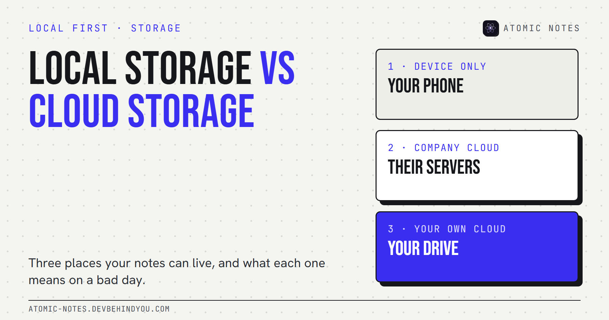
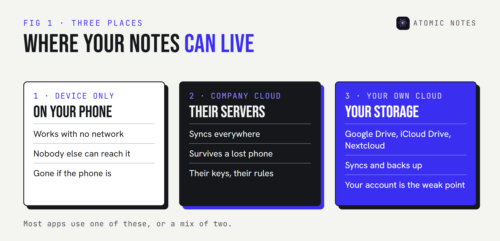
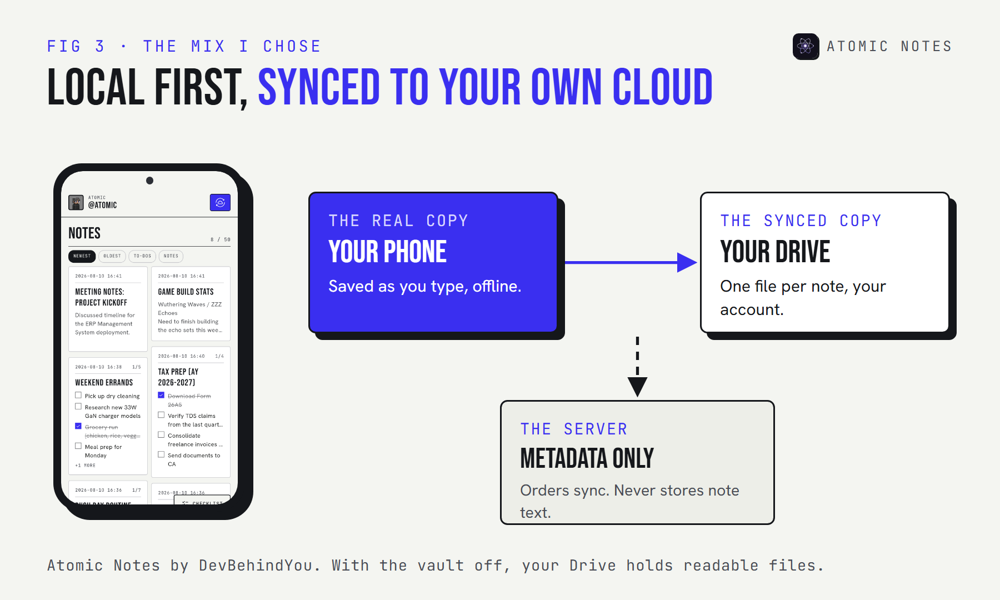

*By Ashutosh Sharma (DevBehindYou), the developer of Atomic Notes. Last updated: October 9, 2026.*

**Key Takeaway:** Local storage vs cloud storage comes down to one question: who holds the copy you can't afford to lose? Local storage keeps notes on your device and in your control. A company cloud keeps them on its servers, under its rules. Cloud storage you own sits in between. The safest setup for most people uses two of the three.

Most people never choose where their notes live. The app chooses for them on the first launch, and they find out years later, usually on the day something breaks.

That choice matters more than the app's design or its feature list. It decides who can read your notes, whether they survive a lost phone, and whether you can leave without begging for an export.

So let's make the choice on purpose. Here are the three places your notes can live, how local storage vs cloud storage plays out on a normal day and a bad one, and what I chose for my own app. The local storage vs cloud storage question has a better answer than "pick one".

## What is the difference between local storage and cloud storage?

**Local storage means your notes are saved on the device in your hand. Cloud storage means they're saved on servers somewhere else, and your device fetches a copy.** That's the core local storage and cloud storage difference.

The practical consequences follow from that one fact:

- **Local storage** works with no network, costs nothing extra, and never leaves your hands. It also disappears with the device if you have no backup.
- **Cloud storage** survives a lost phone and syncs across devices. It also depends on an account, a company, and a connection.

In the local storage vs cloud storage debate, neither side is "safe" on its own. Safety comes from knowing which copy is the real one and where the second copy lives.

## The 3 places your notes can live

**Device only, a company's cloud, or cloud storage you own.** Almost every notes app fits one of these, or a mix of two. Seeing all three side by side makes local storage vs cloud storage a much clearer choice.

**1. Device only.** The notes app saves to the phone's storage and never uploads anything. Apps with no internet permission work this way. Nobody else can reach your notes, and no company can lose them. The risk is simple: one dropped phone and they're gone, unless you export and back up yourself.

**2. A company's cloud.** The notes live on the app maker's servers, and each device keeps a working copy. This is the most convenient model and the most common one. It's also the one where someone else sets the rules: what they can read, how long they keep deleted notes, and whether your account stays open.

**3. Cloud storage you own.** The app keeps notes on your device and syncs a copy to storage you already pay for or control, such as Google Drive, iCloud Drive, or a Nextcloud server. You get backups and sync without handing the notes to the app maker. The trade is that you depend on that storage account instead.

## Where are notes stored on Android?

**On Android, a notes app's own data usually sits in app-specific internal storage, a private area other apps can't read.** Android's documentation says these files are meant for the app's own use and are removed when you uninstall it.

That second point surprises people. Uninstall a device-only notes app without exporting first, and the notes go with it. So the honest answer to "where are notes stored on Android" depends on the app:

- **Device-only apps** keep everything in that private storage, plus any export file you create.
- **Cloud apps** keep a working copy there and the real copy on their servers.
- **Apps that sync to your own cloud** keep the real copy on the phone and a synced copy in your storage account.

Your phone's own backup may also copy app data to your Google account, depending on the app and your settings. Check before you rely on it.

## Where are Google Keep notes stored?

**Google Keep notes are stored in your Google account, on Google's servers.** The Keep app keeps a copy on the phone so you can read and edit offline, then syncs changes when you reconnect.

That makes Keep a company-cloud app. It's convenient and well run, and your notes are as safe as your Google account. Google holds the keys, because Keep isn't end-to-end encrypted. You can download everything through Google Takeout, which is a real exit door many apps don't offer.

## Cloud storage vs local storage for personal use: the bad days

**On a normal day, every model works. Local storage vs cloud storage only shows its real difference on the bad days.** Here's how each one handles the five that actually happen.

A few of these deserve a sentence each:

- **Account lock.** If a company locks or deletes your account by mistake, cloud-only notes go with it until support answers. Local copies don't care.
- **Shutdown risk.** Services end. Mozilla shut down Pocket in 2025 and gave users a few months to export before deleting their data. Anything stored only there had a deadline.
- **Encryption keys.** In a company cloud, the company usually holds the keys. In your own cloud, your storage provider does, unless the app encrypts notes on your device first.

For cloud storage vs local storage for personal use, my rule is short: one copy you hold, one copy somewhere else, and you decide where the second one lives.

## Which mix should you choose?

**Keep the primary copy on your device, and sync a second copy to storage you control.** That's the local-first approach. It ends the local storage vs cloud storage argument by using both, and it handles more bad days than either pure model.

This is the model I built into **Atomic Notes by DevBehindYou**, a local-first notes app for Android. Every note saves to the phone as you type, works offline, and syncs as one small file per note into a folder in your own Google Drive. The sync server tracks metadata to keep devices in order, but never stores your note text.

It has limits, and you should know them. It needs a Google account to sign in. With the optional end-to-end vault switched off, note text passes through the sync server on its way to your Drive, and your Drive holds readable files. Switch the vault on, and only ciphertext leaves the phone.

If you want the longer reasoning behind this approach, I wrote about [what a local first notes app is and why it matters](https://atomic-notes.devbehindyou.com/blog/what-is-a-local-first-notes-app) on the Atomic Notes site.

## FAQ

### What is the main difference between local storage and cloud storage?

Local storage saves notes on your device, so they work offline and stay in your hands, but vanish with the device unless backed up. Cloud storage saves them on remote servers, so they sync and survive a lost phone, but depend on an account and a provider.

### Where are notes stored on Android phones?

Most notes apps keep their data in app-specific internal storage, a private area other apps can't read. Uninstalling the app removes it. Cloud-based apps also keep the real copy on their servers, and some apps sync a copy to your own Google Drive.

### Where are Google Keep notes stored?

In your Google account, on Google's servers, with a copy on each device for offline use. Keep notes aren't end-to-end encrypted, so they're as private as your Google account. You can export them with Google Takeout.

### Is local storage safer than cloud storage for personal notes?

Safer from companies and breaches, riskier for loss. A phone can break or disappear. The safest setup for personal notes keeps the primary copy on your device and a backup or synced copy in storage you control.

## Sources

- [Data and file storage overview. Android Developers](https://developer.android.com/training/data-storage)
- [How to download your Google data. Google Account Help](https://support.google.com/accounts/answer/3024190?hl=en)
- [iCloud data security overview. Apple Support](https://support.apple.com/en-us/102651)
- [Pocket is saying goodbye. Mozilla Support](https://support.mozilla.org/en-US/kb/future-of-pocket)
- [Local-first software. Ink & Switch](https://www.inkandswitch.com/essay/local-first/)
- [Atomic Notes privacy policy](https://atomic-notes.devbehindyou.com/privacy)
