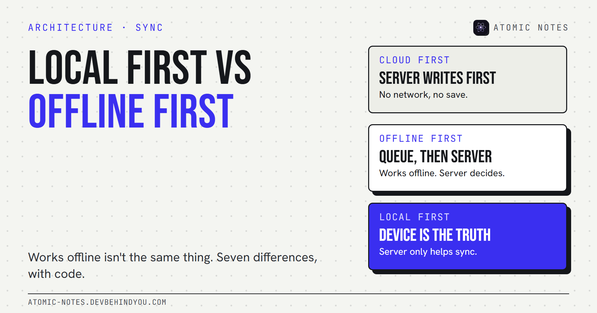
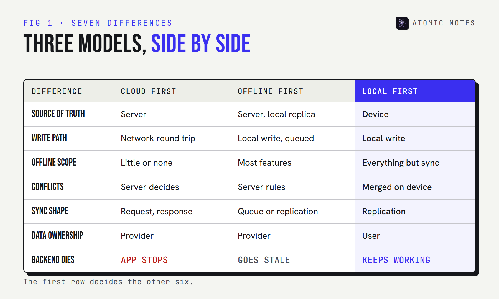

*By Ashutosh Sharma (DevBehindYou), the developer of Atomic Notes. Last updated: October 9, 2026.*

**TL;DR:** Local first vs offline first is a question about the source of truth. A cloud first app needs the server to work. An offline first app keeps working without it, then defers to it. A local first app treats the device copy as the real one and uses servers only to move data between devices. All three can look identical in a demo.

"It works offline, so it's local first." You'll hear that a lot, and it's usually wrong. The real test is to switch the server off for a week and watch what happens to the data.

The labels get used loosely, so here's a precise local first vs offline first comparison, with cloud first as the baseline. Seven differences between cloud first, offline first, and local first, where each one breaks, and a short code sketch of each write path. I'll use my own app, Atomic Notes by DevBehindYou, as the worked example, including the parts where it takes shortcuts.

## Three definitions, one question

**The question is: which copy wins when the device and the server disagree?** The answer defines the architecture.

- **Cloud first.** The server holds the truth. The client is a view. No network, no app, or at best a read-only cache.
- **Offline first.** The client keeps a local database and a sync queue, so the app works without a network. When it reconnects, it replicates changes and the server usually stays authoritative.
- **Local first.** The device copy is the primary copy. Servers are helpers for sync and backup. If the server disappears, the app and the data keep working. This is the model Ink & Switch described in their 2019 essay, with seven ideals.

An offline first app is a cloud first app that learned to wait. A local first app is one that never needed to ask. That one line is the whole local first vs offline first distinction.

## Local first vs offline first vs cloud first: 7 differences

**They differ in seven places: truth, write path, offline scope, conflicts, sync shape, ownership, and what happens when the backend dies.**



| | Cloud first | Offline first | Local first |
|---|---|---|---|
| Source of truth | Server | Server, with a local replica | Device |
| Write path | Network round trip | Local write, queued for sync | Local write, sync is optional |
| Offline scope | Little or none | Most features | Everything except sync |
| Conflict resolution | Server rejects or overwrites | Server rules, retries | Merge on device, CRDTs, or kept copies |
| Sync shape | Request and response | Sync queue or replication | Peer or server-relayed replication |
| Data ownership | Provider | Provider | User |
| Backend shuts down | App stops | Works until the cache goes stale | Keeps working |

A few rows need a sentence of context, because local first vs offline first is easy to blur.

**1. Source of truth.** This is the row that decides the rest, in local first vs cloud first and everywhere else. With server authority, the device can be overruled. With local first, the device is the authority for its own data.

**2. Write path and latency.** A cloud first save waits for a round trip, so latency is the user's problem. Offline first and local first both write locally in milliseconds. The difference is what happens next.

**3. Offline scope.** Offline first apps often cover the main screens and leave search, settings, or attachments online-only. Local first has to cover everything, because there may never be a server.

**4. Conflict resolution.** When two devices edit the same thing, someone has to decide. Cloud first lets the server decide. Local first has to merge on the device, using CRDTs, explicit merge rules, or by keeping both versions.

**5. Sync shape.** Offline first usually means a sync queue that drains to the server. Local first sync looks more like replication between equals, even when a server relays it. Both end in eventual consistency, so devices agree once they've synced.

**6. Data ownership.** If the server is the truth, the provider effectively owns the data, whatever the terms say. Local first puts the authoritative copy in the user's hands.

**7. When the backend dies.** This is the honest test. Offline first apps degrade into a cache that slowly goes stale. Local first apps don't notice.

## Three write paths in code

**The difference is easiest to see in the save function.** Here's a simplified TypeScript sketch of each model. It's illustrative, not from a specific library.

```ts
// Cloud first: the server must answer before the note exists.
async function saveCloudFirst(note: Note) {
  await api.put(`/notes/${note.id}`, note); // no network, no save
}

// Offline first: save locally, queue it, and let the server settle it later.
async function saveOfflineFirst(note: Note) {
  await localDb.put(note);
  await syncQueue.push({ op: "put", note }); // the server still has the final say
}

// Local first: the local write IS the save. Sync is a separate concern.
async function saveLocalFirst(note: Note) {
  await localDb.put({ ...note, dirty: true });
  scheduleSync(); // may never run, and that is fine
}
```

The second and third functions look almost the same, which is exactly why local first vs offline first confuses people. The difference lives in the sync code: whether a server response can overwrite the local copy, and whether the app still works if `scheduleSync` never succeeds.

## What does an offline first database do?

**It gives the client a real database plus replication, so the app reads and writes locally and syncs in the background.** That's most of what you need for local first, but not all of it.

RxDB describes offline first as storing data on the device and making "the local database, not the server, the gateway for all persistent changes". That's very close to local first in practice. CouchDB and PouchDB have done multi-master replication for years. Automerge goes further and uses CRDTs so devices can merge edits without a central authority.

The database alone doesn't make an app local first. You still need to decide who owns the data, whether the server can rewrite it, and what happens when the backend is gone. An offline first database is a tool. Local first is a set of promises to the user.

## Offline first architecture or local first architecture: which should you build?

**Build offline first when the server must stay authoritative. Build local first when the user's data should outlive your backend.** Here's how I'd decide local first vs cloud first, too.

- **Offline first architecture fits** shared business data, inventory, payments, and anything with central rules or permissions. A field app that queues orders is a good example.
- **Local first fits** personal data: notes, journals, drawings, research. Things a person writes and expects to keep.
- **Cloud first still fits** truly collaborative real-time data where everyone must see the same state now, and offline use is rare.

My take: if the data is personal, start local first. Retrofitting ownership later is far harder than adding a server later.

## How Atomic Notes does it, shortcuts included

**Atomic Notes is local first with a server that orders sync, not one that owns data.** Every save goes to on-device storage first, and the app is fully usable offline.

Sync pushes each changed note to a server, which writes it as one file in the user's own Google Drive and keeps only metadata. Each push carries the version the edit was based on. If another device changed the note in the meantime, the server refuses the stale write, and the phone keeps the edit as a separate "(conflict copy)" instead of overwriting either version.

That's not a CRDT. It's a deliberate shortcut: notes are personal and rarely edited on two devices at once, so keeping both versions is simpler and loses nothing. The longer explanation of the model is in my post on [what a local first notes app actually is](https://atomic-notes.devbehindyou.com/blog/what-is-a-local-first-notes-app).

## FAQ

### What is the difference between local first and offline first?

Offline first apps work without a network but usually keep the server as the source of truth. Local first apps treat the device copy as the primary one and use servers only to sync. If the backend disappears, a local first app keeps working indefinitely.

### Is an offline first app the same as local first?

No. Every local first app works offline, but not every offline first app is local first. The test is who wins a disagreement and what happens when the server is gone for good.

### What is an offline first database?

A client-side database with built-in replication, such as RxDB, PouchDB, or a CRDT library like Automerge. It lets the app read and write locally and sync in the background. It's a building block for both offline first and local first apps.

### When should I choose local first vs cloud first?

Choose local first for personal data the user should own, like notes and journals. Choose cloud first when everyone must see one shared, authoritative state in real time and offline use is rare.

## Sources

- [Local-first software: you own your data, in spite of the cloud. Ink & Switch](https://www.inkandswitch.com/essay/local-first/)
- [Offline First. RxDB](https://rxdb.info/offline-first.html)
- [Automerge documentation](https://automerge.org/docs/hello/)
- [Atomic Notes source code. GitHub](https://github.com/DevBehindYou/Atomic-Notes-App-V0.2)
