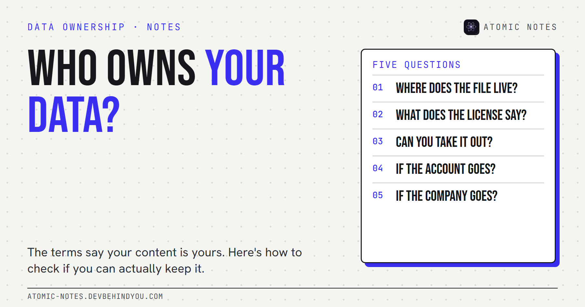
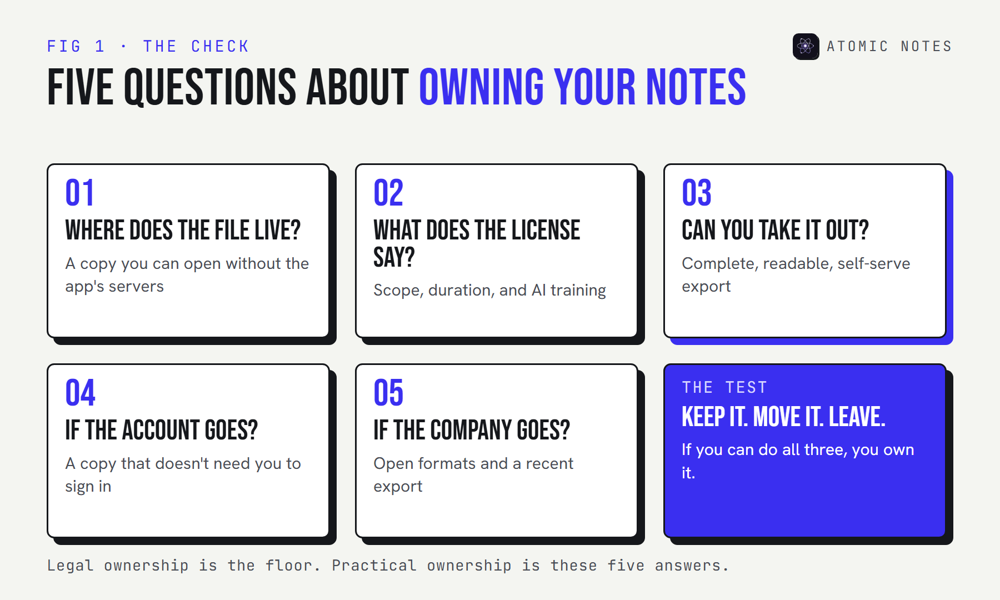

*By Ashutosh Sharma (DevBehindYou), the developer of Atomic Notes. Last updated: October 9, 2026.*

**Key Takeaway:** Who owns your data is rarely answered by the terms of service. Most terms already say your content is yours. Ownership in practice depends on five things: where the files live, what license you grant, whether you can export in a usable format, what happens to your account, and what happens if the service ends.

Read almost any big app's terms and you'll find a reassuring sentence. Google's says it plainly: "Your content remains yours." Most notes apps say something similar.

I believe them. I also think it's the least useful sentence in the whole document. Legal ownership of words you wrote was never really in doubt. The real question is whether you can do the things owners do: keep a copy, move it, and walk away without asking permission.

So here's how I think about who owns your data in a notes app. Five questions, each one more practical than the last. If you can answer all five without guessing, you know who owns your data, whatever the legal page says.

## 1. Where does the file actually live?

**Ownership starts with possession.** If the only complete copy of your notes sits on a company's servers, your ownership depends on that company staying reachable and friendly.

There's a big gap between three setups:

- **A copy on your device** that you can open without the app's servers.
- **A copy in storage you control**, such as your own Google Drive, iCloud Drive, or a server you run.
- **No copy at all**, only a view of data that lives somewhere else.

File ownership is the most physical form of user owned data, and it's the one question that matters most when people ask who owns your data. If you can point to the file and copy it to a USB drive, you own it in every way that matters day to day.

## 2. What does the license in the terms of service say?

**Ownership and license are different things, and the license is where the detail lives.** Most terms say you own your content, then grant the company a license to use it.

Google's terms, for example, say your content remains yours, then grant Google a license to host, reproduce, and use it to operate and improve its services. That's normal and often necessary: a sync service has to copy your notes to sync them.

What to look for when you read terms of service:

- **Scope.** Is the license limited to running the service, or does it include "developing new technologies"?
- **Duration.** Does it end when you delete your content or your account?
- **AI and training.** Can your notes be used to train models, and is that opt-in?

You can own your data and still have granted a broad license over it. Read that paragraph twice, because who owns your data on paper and who can use it are separate questions.

## 3. Can you take it out in a usable format?

**Data portability is ownership you can test today.** Try the export now, before you need it.

In the EU, Article 20 of the GDPR gives people a right to receive personal data they provided "in a structured, commonly used and machine-readable format" and to move it to another service. That's data portability under GDPR in one line. It's a legal floor, and it only covers some data and some processing, so a good app should go further on its own.

A usable export has three properties:

- **Complete.** Every note, with dates, tags, and attachments.
- **Readable.** Markdown, plain text, JSON, or HTML. Formats other software opens.
- **Self-serve.** A button, not an email to support. Google Takeout is a good example of this done at scale.

If the only export is a proprietary file that one app reads, you have a copy, not portability.

One caution on data portability GDPR rights: they apply to personal data you provided, processed by consent or contract, by automated means. Your own notes usually qualify. Data the service derived about you, like usage analytics or inferences, often doesn't. And if you live outside the EU and UK, the right may not apply at all. That's why the app's own export matters more than the law in day-to-day life.

## 4. What happens to your notes if your account goes away?

**Account deletion and account lockouts are the quiet ownership risks.** If your notes exist only inside an account, losing the account means losing the notes.

Accounts get locked for many reasons: a forgotten password, a payment issue, an automated flag, a lost phone with your only two-step code. Each one turns cloud control into someone else's control until support answers.

The fix is the same as question one. Keep a copy that doesn't depend on signing in. Check what the service does with your data when you delete your account, and how long backups survive afterward.

## 5. What happens if the company goes away?

**Services end, and when they do, ownership comes down to what you already exported.** Mozilla shut down Pocket in 2025, moved it to export-only mode, and deleted user data after the deadline.

Service shutdown is where lock-in shows its real cost. If your notes live in a format only one app understands, interoperability is zero, and the deadline is the company's, not yours.

Two habits protect you here. Prefer apps that store notes in open, documented formats. And keep a recent export somewhere outside the app, even if the app feels permanent. Apps that feel permanent are exactly the ones nobody plans to leave.

## So who owns your data, really?

**You do, to the degree you can keep it, move it, and leave with it.** The terms set the legal floor. Your setup decides the rest. User owned data isn't a feature an app grants you. It's a habit you keep.

I build a notes app, so I've had to answer these five questions about my own work. In **Atomic Notes by DevBehindYou**, every note is saved on your phone first, and synced notes are stored as one JSON file per note in a folder in your own Google Drive. The server keeps only metadata, never the text.

It's not perfect on question three. There's no one-tap export button yet, so leaving today means downloading that Drive folder and converting the files, and notes in the optional encrypted vault stay encrypted outside the app. I'd rather say that than pretend. If you want the bigger picture of why I built it this way, I wrote about [local first notes apps and why they matter](https://atomic-notes.devbehindyou.com/blog/what-is-a-local-first-notes-app).

My take: own your data in the boring, practical sense. Keep a copy you can open without permission, in a format other software reads.

## FAQ

### Who owns your data when you use a cloud notes app?

Usually you do, legally. Most terms say your content stays yours and grant the company a license to host and process it. In practice, ownership depends on whether you can keep a copy, export it in a usable format, and leave without losing anything.

### What is data portability?

Data portability is your ability to take your data out of one service in a usable format and move it to another. In the EU, GDPR Article 20 makes it a legal right for some personal data. Good apps offer a full, self-serve export in open formats.

### Does GDPR data portability cover my notes?

Often, for notes you provided to a service that processes them by consent or contract, if you're covered by GDPR. It requires a structured, commonly used, machine-readable format. It doesn't cover everything, so test the app's own export too.

### How can I make sure I own my notes?

Keep a copy on a device or storage you control, choose apps that export to open formats like Markdown or JSON, and make a fresh export every few months. Then deleting an account or losing an app never means losing your notes.

## Sources

- [Google Terms of Service. Google](https://policies.google.com/terms)
- [Art. 20 GDPR, Right to data portability. GDPR text](https://gdpr-info.eu/art-20-gdpr/)
- [How to download your Google data. Google Account Help](https://support.google.com/accounts/answer/3024190?hl=en)
- [Pocket is saying goodbye. Mozilla Support](https://support.mozilla.org/en-US/kb/future-of-pocket)
- [Atomic Notes privacy policy](https://atomic-notes.devbehindyou.com/privacy)
