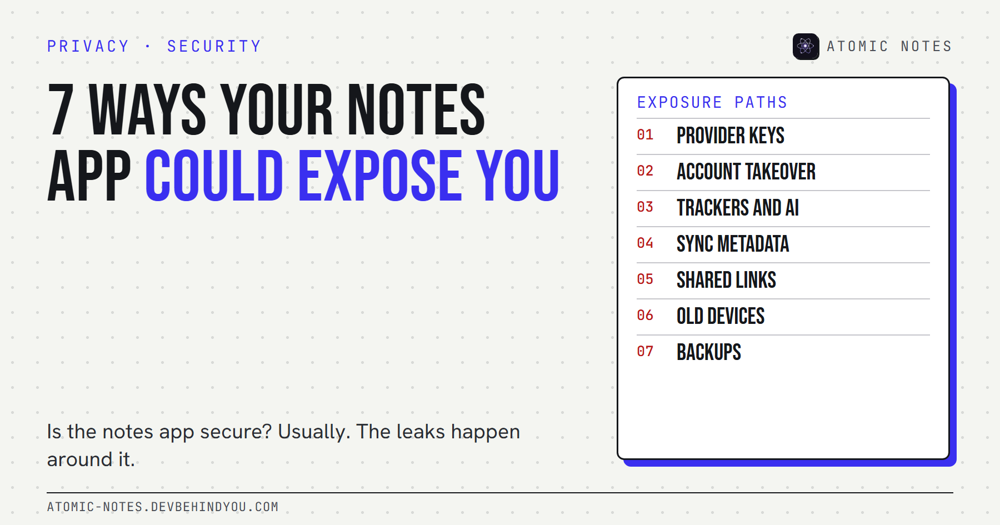
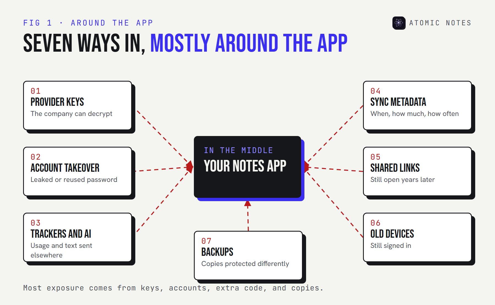
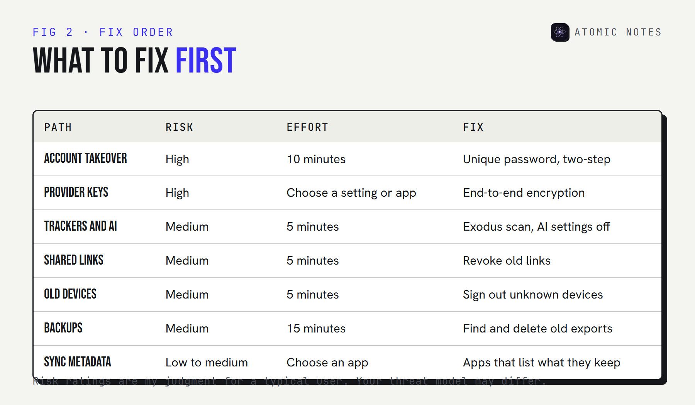

*By Ashutosh Sharma (DevBehindYou), the developer of Atomic Notes. Last updated: October 9, 2026.*

**Key Takeaway:** Is the notes app secure? Most of the time, the app itself is. The exposure happens around it: who holds the encryption keys, how well your account is protected, what trackers ride along, what metadata the server keeps, which links you shared, which old phones are still signed in, and where your backups go.

Two questions about notes come up again and again. "Can someone hack into my notes app?" and "Can Apple read my notes?" Both assume the danger is a person reading a note.

That happens. But most personal data exposure from a notes app comes from somewhere quieter: the account around it, the code bundled into it, and the copies it leaves behind. You can close almost all of these in an afternoon.

Here are the seven I'd check first when someone asks me "is the notes app secure?", in the order I'd check them.

## Is the notes app secure? Start with what "secure" covers

**A secure notes app protects three things: your note content, your account, and the data about your notes.** Most security pages only talk about the first.

Keep those three in mind as you read. Each of the seven ways below hits at least one of them, and together they're the honest answer to is the notes app secure.

## 1. The provider holds the keys

**If the company can decrypt your notes, it can read them, and so can anyone who compels or breaches it.** Encryption alone doesn't answer this. Key custody does.

So, can Apple read my notes? For iCloud Notes under standard data protection, Apple's own documentation lists Notes as encrypted in transit and on its servers with Apple holding the keys. With Advanced Data Protection turned on, Notes become end-to-end encrypted, and the keys live only on your trusted devices. Same app, very different answer.

**Check:** look for the words "end-to-end" and "only your devices hold the key". Anything vaguer means the provider can read.

## 2. Someone takes over your account

**Can my notes app be hacked? Rarely through the app. Usually through your account.** Attackers reuse leaked passwords across services and walk straight in.

Verizon's 2025 Data Breach Investigations Report found that credential abuse was the leading way attackers got in, at 22% of breaches. So is the notes app secure if the account isn't? No. A notes app is only as secure as the account behind it, and that account is often your Apple, Google, or Microsoft login.

**Check:** a unique password and two-step verification on the account your notes sync to. Passkeys are better still.

## 3. Trackers and AI processing ride along

**An analytics SDK can report how you use the app without ever touching a note.** Usage tracking captures events like opening a note, searching, or sharing, plus device details and timing.

AI processing is the newer version of the same question. A summarize or rewrite feature usually sends the note's text to a model, sometimes run by another company, under terms you may not have read.

**Check:** on Android, Exodus Privacy scans apps for known tracker libraries. Read the app's AI settings before you turn anything on.

## 4. Sync metadata tells a story

**Even with perfect encryption, the server sees when you write, how much, and how often.** Sync metadata is the price of syncing.

A note created at 2 a.m. every night for a month, a burst of edits before a medical appointment, a sudden switch to a new device. None of that needs the note's text to be revealing. Good apps keep this metadata small and say exactly what it is.

**Check:** look for a privacy page that lists the specific fields the server keeps. If you can't find one, assume it's more than you'd like.

## 5. Shared links outlive their purpose

**A shared note link usually works for anyone who has it, until you switch it off.** Links get forwarded, pasted into chats, and indexed in places you never expected.

The risk grows with time. A note shared for one dinner plan becomes the place you later keep a door code, and the old link still opens it.

**Check:** open the app's sharing list once a quarter and revoke everything you don't need today.

## 6. Old devices are still signed in

**Your old phone, an office laptop, a tablet you sold.** Any device still signed in can still sync your notes.

People wipe a phone before selling it and forget the browser session on a work computer. Old devices are the exposure nobody remembers because nothing looks wrong.

**Check:** review the signed-in devices for the account behind your notes, and sign out anything you don't recognize or no longer own.

## 7. Backups copy your notes somewhere else

**Phone backups and cloud backups can hold a full copy of your notes, protected differently from the app itself.** A locked note in the app can sit unlocked in an export or backup file.

Cloud backups are useful, so keep them. Just know where they go and who holds the keys there. An encrypted vault in the app does little if an unencrypted export sits in your downloads folder.

**Check:** search your phone and cloud storage for old exports, and confirm your backup provider's encryption settings.

## Is the notes app safe once you've checked all seven?

**Safe enough for most people, if the account is strong and the provider can't read your notes.** Here's how the seven stack up by effort.

Start with the account and the keys, because they expose everything at once. If those two are solid, is the notes app safe for everyday notes? For most people, yes. The rest are tidy-ups you can do on a quiet evening.

## Where does Atomic Notes fit?

**I build a notes app, so I hold it to the same seven checks.** Atomic Notes by DevBehindYou is a local-first notes app for Android.

- **Keys:** an optional end-to-end vault keeps the key on your phone. It's off by default, and with it off your notes are readable files in your own Google Drive.
- **Trackers and AI:** none. No analytics SDK, no ads, no AI features.
- **Metadata:** the server keeps note IDs, type, pinned and deleted flags, timestamps, and rough size, and says so publicly.
- **Links:** there's no note sharing, so there are no links to forget.

The account part is on you: it signs in with Google, so your Google account security is your notes app security. I wrote a longer [checklist of nine privacy red flags](https://atomic-notes.devbehindyou.com/blog/notes-app-privacy-red-flags) for judging any notes app.

## FAQ

### Can my notes app be hacked, or can someone hack into it?

Usually not the app itself. Most break-ins happen through the account: a reused password, a phished login, or a lost phone with no lock. A unique password, two-step verification, and a screen lock stop most attempts.

### Can Apple read my notes?

For iCloud Notes under standard data protection, Apple holds the keys, so it technically can. With Advanced Data Protection on, Notes are end-to-end encrypted and the keys stay on your trusted devices. Some metadata, like dates and pinned state, stays readable either way.

### Is the notes app secure on Android?

It depends on the app. Check its permissions, its trackers with Exodus Privacy, whether sync is end-to-end encrypted, and the account behind it. Android keeps each app's private storage separate from other apps, which helps with local notes.

### How do I know if my notes app is tracking me?

Check its privacy policy for analytics, look it up on Exodus Privacy for known tracker libraries, and read the Play Store data safety section. That section is self-declared by developers, so treat it as a starting point.

## Sources

- [iCloud data security overview. Apple Support](https://support.apple.com/en-us/102651)
- [2025 Data Breach Investigations Report. Verizon](https://www.verizon.com/about/news/2025-data-breach-investigations-report)
- [What Exodus Privacy does. Exodus Privacy](https://exodus-privacy.eu.org/en/page/what/)
- [Provide information for Google Play's data safety section. Play Console Help](https://support.google.com/googleplay/android-developer/answer/10787469?hl=en)
- [Atomic Notes privacy policy](https://atomic-notes.devbehindyou.com/privacy)
