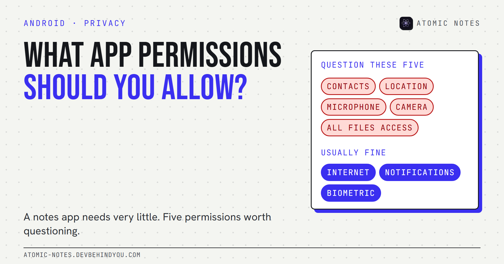
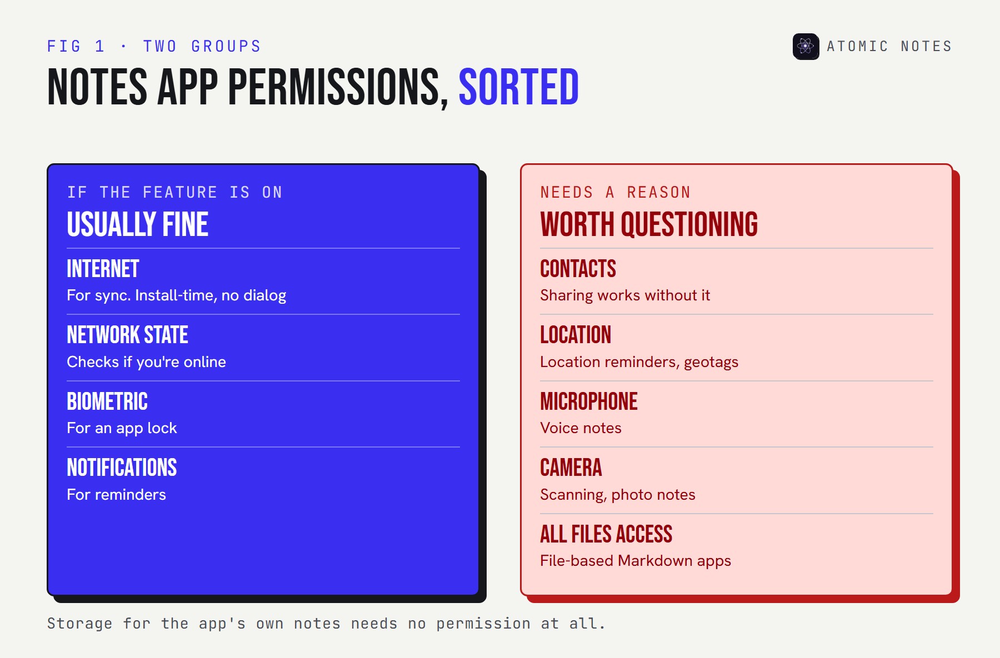
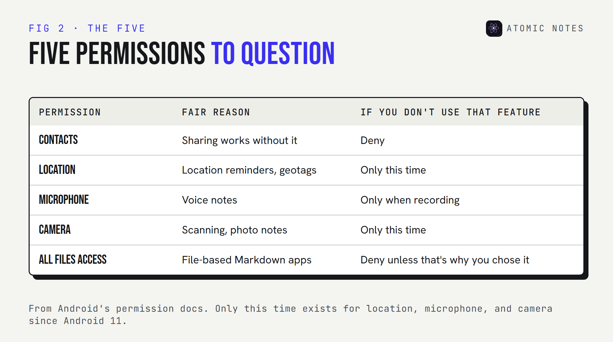

*By Ashutosh Sharma (DevBehindYou), the developer of Atomic Notes. Last updated: October 9, 2026.*

**Key Takeaway:** What app permissions should I allow a notes app? Very few. A notes app may need the network to sync, notifications for reminders, and your fingerprint for a lock. Question anything else, especially contacts, location, the microphone, the camera, and access to all your files, unless a feature you actually use explains it.

Most people tap "Allow" on autopilot. The dialog appears in the middle of a task, and saying no feels like it might break something.

For a notes app, saying no rarely breaks anything. A notes app's own notes already live in storage the app can reach without asking. So every extra permission is a question worth a second look, and some of the riskiest ones never show a dialog at all.

Here's Android app permissions explained in plain terms, the five permissions I'd question first in any notes app, and how to check an app before you install it.

## Android app permissions explained in one minute

**Android sorts permissions into two kinds: install-time permissions, granted automatically, and runtime permissions, which show you a dialog.** The risky ones are the runtime kind, which Android itself calls dangerous permissions.

- **Install-time (normal) permissions** cover low-risk things like going online, checking whether you're connected, or using the fingerprint sensor. You see them on the store listing, but you never get a dialog.
- **Runtime (dangerous) permissions** cover private data and sensors: contacts, location, the microphone, the camera, and your photos. Since Android 6, apps must ask before using them.
- **One-time permissions.** Since Android 11, location, microphone, and camera dialogs offer "Only this time".
- **Auto-reset.** Since Android 11, Android can revoke runtime permissions from apps you haven't used for a few months.

Here's the catch most people miss. The INTERNET permission is install-time. You can't deny it in a dialog, because there isn't one. An app with it can send data, and an app without it can't, which is why it matters more than any dialog.



## What app permissions should I allow a notes app?

**Allow only what a feature you use needs.** For most notes apps, that's a short list.

- **Internet,** if you want sync. An offline-only notes app shouldn't have it.
- **Notifications,** if you use reminders.
- **Biometrics,** if you use an app lock.

That's it for a typical text notes app. Storage for its own notes doesn't need a permission at all. So when someone asks what app permissions should I allow, my answer is: those three, and only when the feature is on.

## The 5 notes app permissions to question

**These five show up in notes apps more often than they should.** None is automatically wrong. Each needs a feature that explains it.

### 1. Contacts permission

**A notes app almost never needs your address book.** The usual excuse is sharing or "inviting friends", which works fine without reading every contact you have.

Contacts are other people's personal data, not just yours. Deny it, and see whether anything you use actually breaks.

### 2. Location permission

**Location makes sense only for location reminders or geotagged notes.** If you don't use those, it's just a record of where you write.

If you do use location reminders, pick "Only this time" or "While using the app", never "Allow all the time".

### 3. Microphone access

**Microphone access is fair for voice notes, and nothing else.** It's a runtime permission, so you'll see a dialog the first time.

Grant it when you record your first voice note, not at first launch. An app that asks for the microphone before you've touched a voice feature is asking too early.

### 4. Camera

**The camera is reasonable for scanning documents or attaching photos.** Without those features, it has no business in a notes app.

Like the microphone, use "Only this time" if you scan occasionally.

### 5. All files access and broad storage access

**A notes app doesn't need to read your whole phone to save its own notes.** All files access is a special permission you grant in Settings, not a normal dialog, and it opens every document and download on the device.

There's one honest exception: apps that keep notes as plain files in a folder you pick, like many Markdown editors, may need wider storage access to do that. If that's why you chose the app, it's fair. If not, deny it.



## How do you check a notes app's permissions before installing?

**Read the full Android permissions list for the app, not just the dialogs.** Three places show it:

1. **The F-Droid listing or the AndroidManifest.** Open-source apps list every permission they declare, including install-time ones like INTERNET.
2. **Exodus Privacy.** It scans Android apps and reports their permissions and known tracker libraries.
3. **Google Play's data safety section.** Useful, but self-declared. Google says developers are responsible for these declarations and that its review isn't designed to verify their accuracy.

After installing, the permission manager in your phone's settings shows what each app currently has. The path varies by brand, but it's usually under Security and privacy, then Privacy. Check it every few months, because permissions creep in with updates.

## What should you do when an update adds a permission?

**Treat a new permission like a new feature: find out what it's for before you accept it.** Notes app permissions tend to grow quietly, one update at a time.

Runtime permissions announce themselves, because you'll see a dialog the first time the app uses them. Install-time permissions don't. An update can add the internet permission to an app that used to be offline-only, and Android won't ask you.

Three habits keep this in check:

- **Read the release notes** before updating a notes app you rely on, and look for words like sync, sharing, AI, or analytics.
- **Compare the Android permissions list** on F-Droid or Exodus Privacy against the version you already have.
- **Deny first, allow later.** If a new dialog appears, say no and see what stops working. Most of the time, nothing does.

Anything on the list of dangerous permissions Android shows a dialog for is easy to revoke later, so a cautious "no" costs you very little.

## Which permissions does Atomic Notes ask for?

**Three, all install-time, and none with a dialog.** I build Atomic Notes by DevBehindYou, so here's its full list, straight from the app's manifest:

```xml
<uses-permission android:name="android.permission.INTERNET" />
<uses-permission android:name="android.permission.ACCESS_NETWORK_STATE" />
<uses-permission android:name="android.permission.USE_BIOMETRIC" />
```

INTERNET is for syncing notes to your own Google Drive. ACCESS_NETWORK_STATE lets it wait for a working connection before it tries. USE_BIOMETRIC powers the optional fingerprint lock. There's no contacts, location, microphone, camera, or storage permission, because the app doesn't have features that need them.

If you want to judge a notes app beyond its permissions, I wrote a [nine-point notes app privacy checklist](https://atomic-notes.devbehindyou.com/blog/notes-app-privacy-red-flags) covering accounts, encryption, trackers, and exports.

## FAQ

### What app permissions should I allow on Android?

Allow only what a feature you use needs, and choose "Only this time" for location, microphone, and camera when you can. For a notes app, that usually means internet for sync, notifications for reminders, and biometrics for an app lock.

### What are dangerous permissions on Android?

They're runtime permissions that cover private data or sensors, such as contacts, location, the microphone, the camera, and photos. Android shows a dialog before an app can use them, and you can revoke them later in settings.

### Can I deny the internet permission to an app?

Not through a normal dialog. INTERNET is an install-time permission, so Android grants it when you install the app. Some phones add a per-app network setting, but the reliable way to keep notes offline is to choose an app that doesn't declare it.

### Is the Google Play data safety section accurate?

It's a useful start, but developers fill it in themselves, and Google says its review doesn't verify accuracy. Cross-check it with the app's actual permission list and a tracker scan on Exodus Privacy.

## Sources

- [Permissions on Android. Android Developers](https://developer.android.com/guide/topics/permissions/overview)
- [Request runtime permissions. Android Developers](https://developer.android.com/training/permissions/requesting)
- [Manifest.permission reference. Android Developers](https://developer.android.com/reference/android/Manifest.permission)
- [Provide information for Google Play's data safety section. Play Console Help](https://support.google.com/googleplay/android-developer/answer/10787469?hl=en)
- [What Exodus Privacy does. Exodus Privacy](https://exodus-privacy.eu.org/en/page/what/)
- [Atomic Notes source code. GitHub](https://github.com/DevBehindYou/Atomic-Notes-App-V0.2)
