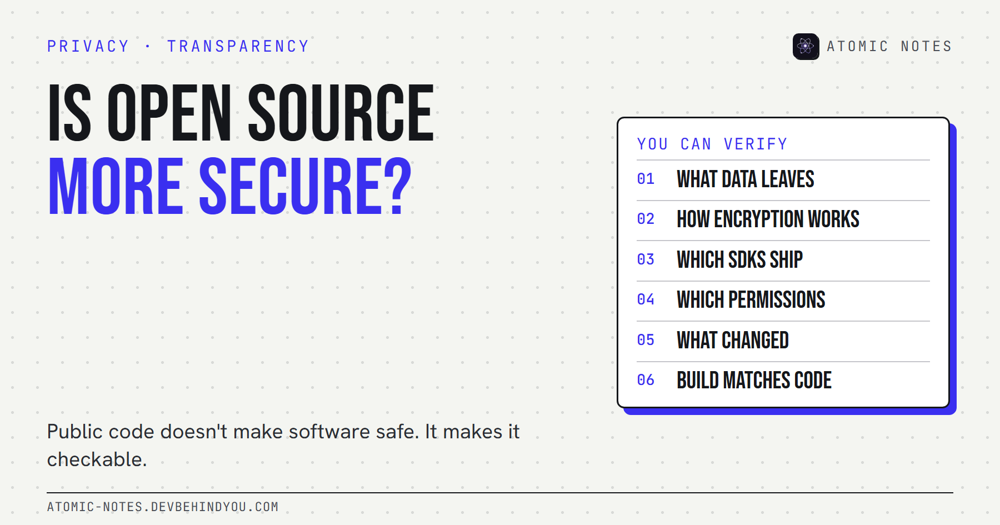
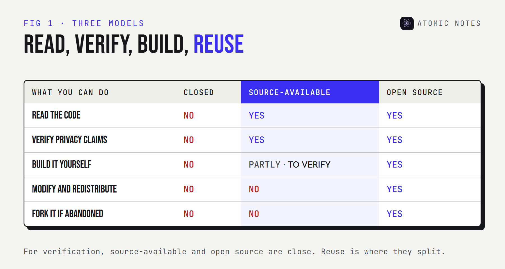
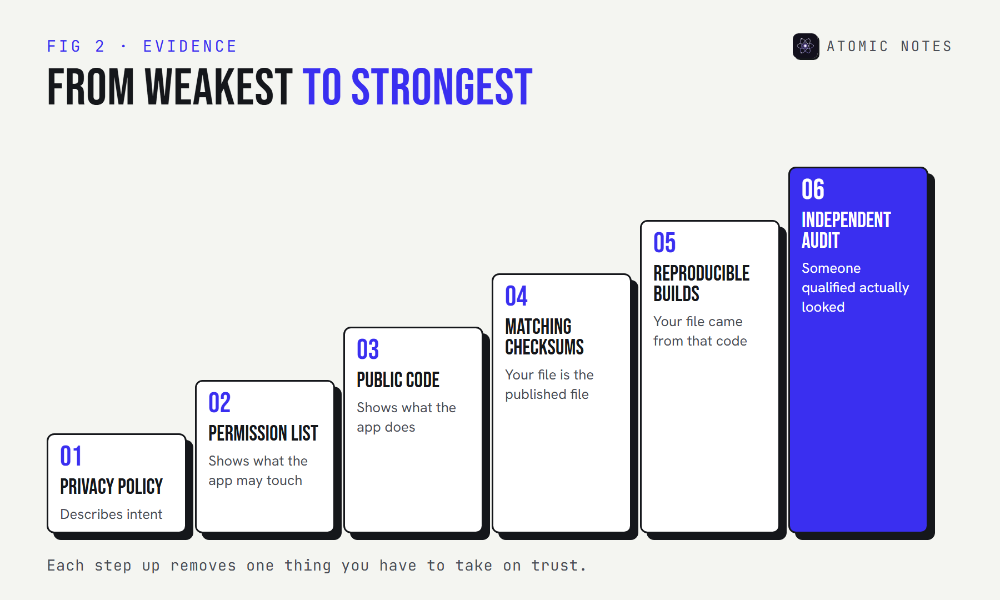

*By Ashutosh Sharma (DevBehindYou), the developer of Atomic Notes. Last updated: October 10, 2026.*

**Key Takeaway:** Is open source more secure? Not automatically. Public code makes software verifiable, not safe. It lets anyone check what data leaves an app, how encryption works, and what changed between versions. It can't prove that anyone actually checked, or that the build on your phone matches the code. Source-available software gives you the same ability to verify, without the right to reuse.

There's a sentence I see under almost every privacy app on Reddit: "It's open source, so it's secure." I understand the instinct. I also think it gets the logic backward.

Open code doesn't make bugs disappear. It makes them findable. That's a real advantage, but only if someone looks, and only if the code you can read is the code you're actually running.

So, is open source more secure? Here's my honest answer, six concrete things public code lets you check, what it can't tell you, and where source-available software fits.

## Is open source more secure, or just easier to check?

**Easier to check, which can make it more secure over time.** The idea goes back to what Eric Raymond called Linus's law: "given enough eyeballs, all bugs are shallow."

Two famous cases show both sides of that law:

- **Heartbleed.** A serious bug in OpenSSL, some of the most widely used open code on the internet, was introduced in December 2011 and only disclosed in April 2014. The code was public the whole time. Not enough eyes were on that part of it.
- **The xz backdoor.** In March 2024, an engineer named Andres Freund noticed SSH logins were slightly slow, dug in, and found a backdoor planted in the xz compression library (CVE-2024-3094). It was caught before it reached most stable Linux releases, because the code and its build steps were public enough to inspect.

So why open source is more secure, when it is, comes down to this: people can look, and sometimes they do. The opposite approach, hoping attackers won't find flaws in hidden code, has a name too: security through obscurity. It rarely holds up for long.

## 6 things public source code lets you verify

**Public code turns marketing claims into verifiable claims.** Here's what you can actually check, even without being a security expert.

### 1. What data leaves the app

**Every network call is in the code.** You or someone you trust can see which servers an app talks to and what it sends. Privacy policies describe intent. Code shows behavior.

### 2. How the encryption actually works

**"Military-grade encryption" means nothing until you see the cipher, the key derivation, and where the key is made.** Public code shows whether the key is created on your device or handed to a server.

### 3. Which trackers and SDKs are bundled

**The dependency list is a privacy document.** Analytics, crash reporting, and advertising libraries show up by name. Supply chain security starts with knowing what's in the box.

### 4. Which permissions the app asks for

**On Android, the manifest lists every permission, including the ones that never show a dialog.** If an app claims to be offline-only, you can check whether it even asks for internet access.

### 5. What changed between versions

**A public repository keeps history.** You can see when a new SDK, permission, or data flow arrived, and read the change itself rather than trusting the release notes.

### 6. Whether your build matches the code

**This is the hard one.** Reading the source proves nothing if the app on your phone was built from something else. Reproducible builds solve this: anyone can rebuild the app and get bit-for-bit identical output. Store builds from F-Droid, which compiles apps from their published source, get you part of the way there.

## What can public code not prove?

**That anyone reviewed it, that the server matches it, or that it's safe today.** Software transparency has limits, and they matter when you ask whether open source is more secure for your own data.

- **Review isn't automatic.** Public code with no readers is no safer than private code. An independent audit, published in full, is stronger evidence than "the code is public".
- **Servers are often closed.** Many apps publish their client but not their server. You can verify what the app sends, not what happens after it arrives.
- **Builds can differ.** Without reproducible builds or checksums, you're trusting the publisher's build machine.
- **Code changes.** A clean review last year says little about last week's update.

## Source available vs open source: what's the difference?

**Both let you read the code. Only open source lets you reuse it.** The Open Source Initiative's definition requires free redistribution and permission to create derived works. Source-available software publishes the code for reading, with license terms that restrict reuse.

For verification, the difference is small. You can audit source-available software the same way you'd audit open source privacy software: read the network calls, the encryption, the dependencies, and the manifest. Where open source wins is the long game. If an open source project is abandoned, the community can fork it and carry on. Source available software can't be forked that way.

I'll be specific, because I build one. **Atomic Notes by DevBehindYou** is source-available, not open source. Its license lets you read the code, build it on your own device to check it matches the published source or an official release, and research security issues. It doesn't let you copy or redistribute it. The Android app's code is public. The sync server isn't, so for the server you're trusting a published privacy policy and the app's own code, which shows exactly what it sends. With the optional vault on, that's ciphertext.

I chose source-available because I want people to verify my privacy claims without the code being repackaged by someone else. Reasonable people disagree with that trade, and that's fine. Just don't let anyone call a source-available app open source, including me.

## How to check an app's privacy claims in 30 minutes

**You don't need to read every line.** Five checks catch most problems:

1. Find the repository and confirm it's the same app and version you installed.
2. Search the code for analytics, tracking, and advertising libraries.
3. Read the Android manifest or permission list.
4. Find the encryption code and check where the key is created.
5. Compare the published checksum or signature with the file you installed.

If you want a structured way to judge the rest of a notes app, I wrote a [nine-point checklist of notes app privacy red flags](https://atomic-notes.devbehindyou.com/blog/notes-app-privacy-red-flags) that covers accounts, exports, and trackers too.

My take: is open source more secure? Only when someone uses the public code to check. Treat "it's open source" as an invitation, not a verdict.

## FAQ

### Is open source more secure than closed source software?

Not automatically. Open source makes security verifiable, so bugs and backdoors can be found by anyone who looks. Whether it's actually more secure depends on how many people review it, how fast fixes ship, and whether your build matches the published code.

### What is the difference between source available and open source?

Both publish the code for anyone to read. Open source licenses also allow redistribution and derived works, as the Open Source Initiative's definition requires. Source-available licenses restrict reuse, so you can verify the code but not copy or fork it.

### Can I trust source available software?

You can verify it the same way as open source: read its network calls, encryption, dependencies, and permissions. The trust question is the same for both. Is the code reviewed, does your build match it, and is the server side documented?

### What are reproducible builds?

Reproducible builds let anyone rebuild software from its published source and get bit-for-bit identical output. That proves the app you installed was made from the code you can read, which closes the biggest gap in "it's open source, so it's safe".

## Sources

- [The Cathedral and the Bazaar, Linus's law. Eric S. Raymond](http://www.catb.org/~esr/writings/cathedral-bazaar/cathedral-bazaar/ar01s04.html)
- [The Heartbleed Bug. heartbleed.com](https://heartbleed.com/)
- [CVE-2024-3094. National Vulnerability Database](https://nvd.nist.gov/vuln/detail/CVE-2024-3094)
- [Definition of reproducible builds. Reproducible Builds](https://reproducible-builds.org/docs/definition/)
- [The Open Source Definition. Open Source Initiative](https://opensource.org/osd)
- [Inclusion policy. F-Droid](https://f-droid.org/en/docs/Inclusion_Policy/)
- [Atomic Notes source code and license. GitHub](https://github.com/DevBehindYou/Atomic-Notes-App-V0.2)
