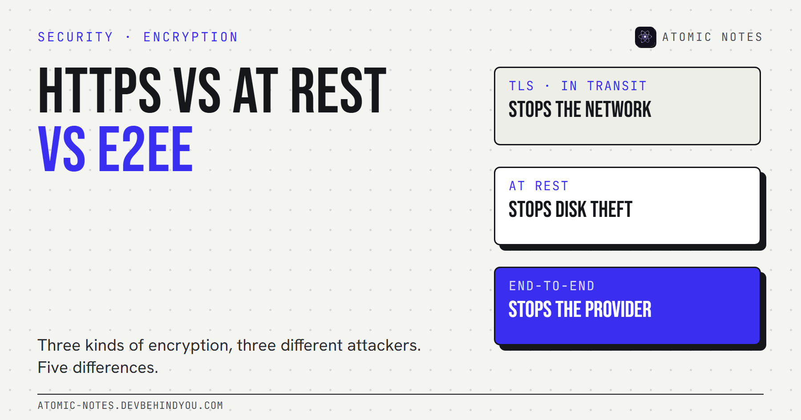
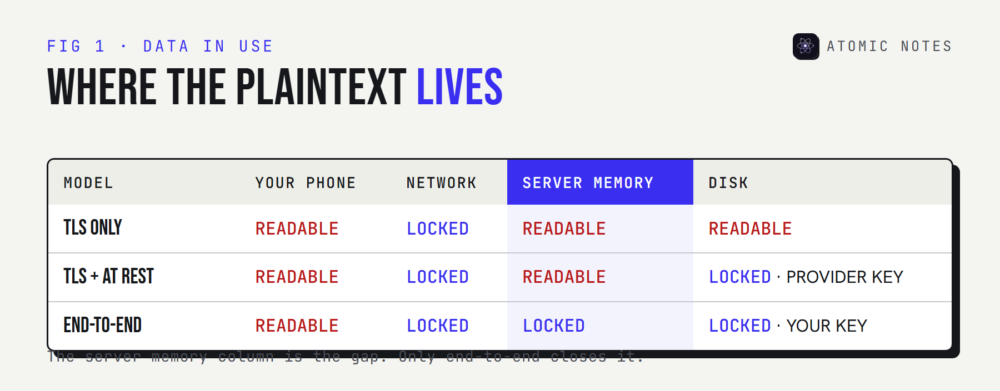
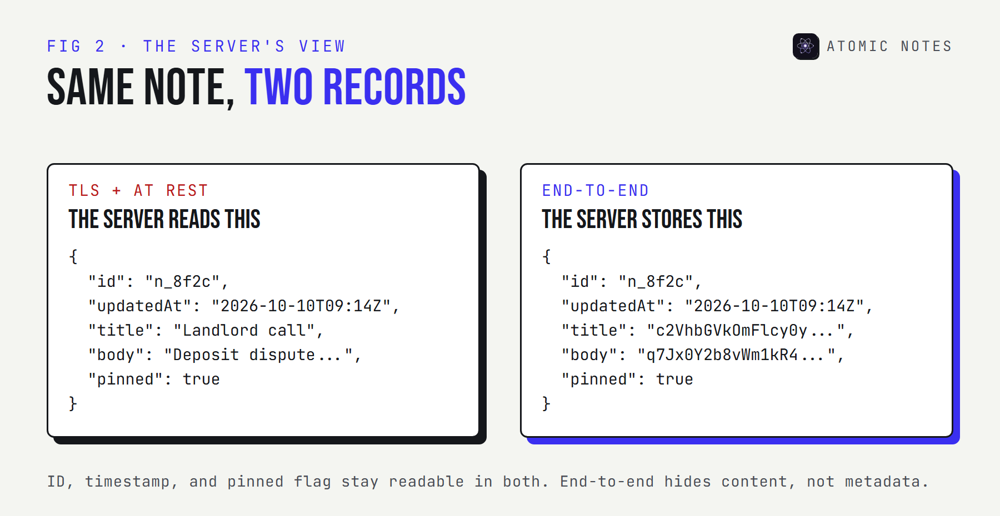

*By Ashutosh Sharma (DevBehindYou), the developer of Atomic Notes. Last updated: October 10, 2026.*

**Key Takeaway:** Encryption in transit vs at rest comes down to which attacker each one stops. TLS stops someone on the network. Encryption at rest stops someone holding a stolen disk. Neither stops the provider, because the provider decrypts both. Only end-to-end encryption keeps plaintext off the server, and it costs you server-side search and easy recovery.

A security page that says "your data is encrypted in transit and at rest" is telling the truth. It's also leaving out the most useful part: who can read the data in between.

I hit this distinction while building sync for Atomic Notes, and it's easier to see in data than in diagrams. So this post compares encryption in transit vs at rest vs end-to-end on five differences, then shows the JSON a server actually holds under each one.

## What is encryption in transit vs at rest?

**Encryption in transit protects data while it moves. Encryption at rest protects data while it's stored.** They're separate layers that cover separate moments.

- **In transit** usually means TLS, the "S" in HTTPS. Your client and the server agree on session keys, and everything on the wire is ciphertext. When the bytes arrive, the server decrypts them.
- **At rest** means the storage layer encrypts what it writes: disk encryption, database encryption, or encrypted object storage. Google Cloud, for example, says it encrypts all customer content at rest by default, using AES-256 and keys Google manages.
- **End-to-end** means the client encrypts before sending, with a key the server never receives. The server stores and moves ciphertext it can't open.

The gap between the first two is the server's memory. Data arrives over TLS, gets decrypted, gets processed, then gets re-encrypted for the disk. That middle step, data in use, is plaintext.



## 5 differences between TLS, at-rest, and end-to-end encryption

### 1. The attacker each one stops

**Each layer has one job.** TLS stops a network eavesdropper: someone on shared Wi-Fi, a compromised router, or an ISP reading traffic. At-rest encryption stops physical theft and some backup leaks. End-to-end encryption stops the provider itself, plus anyone who breaches or subpoenas the provider. Write down your threat model first, and the right layer becomes obvious.

### 2. Where plaintext exists

**This is the difference that matters most.** With TLS alone, plaintext exists on your device and on the server. With at-rest encryption added, plaintext still exists in server memory and in any process that reads the data. With end-to-end encryption, plaintext exists only on your devices.

| Layer | On the wire | In server memory | On the disk |
|---|---|---|---|
| TLS only | Ciphertext | Plaintext | Plaintext |
| TLS + at rest | Ciphertext | Plaintext | Ciphertext (provider key) |
| End-to-end | Ciphertext | Ciphertext | Ciphertext (your key) |

Read the table from top to bottom and the encryption in transit vs at rest question mostly answers itself. Both of the first two rows still have a plaintext column.

### 3. Who holds the keys

**TLS session keys live for one connection. At-rest keys belong to the provider. End-to-end keys belong to you.** That's the real answer to HTTPS vs end to end encryption. HTTPS hands your data to the server in readable form, by design. With provider keys, key management is someone else's problem, which is convenient right up until you need that someone to be unable to read your data.

### 4. What the server can still do for you

**Plaintext on the server buys features.** Server-side search, previews, spam filtering, AI summaries, and password resets all need the server to read your data. End-to-end encryption removes those, or moves them onto your device. When an app offers server search over "encrypted" content, that tells you the server can read it.

### 5. What it costs to adopt

**TLS and at-rest encryption are nearly free for users.** Certificates are automated, and cloud providers turn storage encryption on by default. That's why compliance checklists ask for both: they're cheap, standard, and they stop real attacks. End-to-end encryption costs real design work and a user-facing trade. Lose the key, and nobody can recover the data.

## When are TLS and at-rest encryption enough?

**When the provider is someone you already trust with the content.** Your bank, your employer's document system, and your email host all need to read your data to do their job. For them, TLS plus encryption at rest is the right design, and asking for more would break the product.

The TLS vs end to end encryption question only gets interesting when the provider has no reason to read the content. Personal notes, journals, and health logs are the classic examples. Nobody needs server-side access to your grocery list, and certainly not to a note about a medical appointment. That's where client-side encryption earns its cost.

## What does a server actually see?

**Here's the same note, as a sync server would store it under each model.** This is the most honest way I know to show encryption at rest vs end to end.

TLS plus encryption at rest. The disk is encrypted, but anything with database access reads this:

```json
{
  "id": "n_8f2c",
  "updatedAt": "2026-10-10T09:14:03Z",
  "title": "Landlord call",
  "body": "Deposit dispute. Reference number in the email thread.",
  "pinned": true
}
```

End-to-end encryption. The server stores this, and has no key to open it:

```json
{
  "id": "n_8f2c",
  "updatedAt": "2026-10-10T09:14:03Z",
  "title": "c2VhbGVkOmFlcy0yNTYtZ2NtOm5vbmNl...",
  "body": "q7Jx0Y2b8vWm1kR4tLz9Pd3eHf6sNa0c...",
  "pinned": true
}
```

Notice what's still readable in both: the ID, the timestamp, and the pinned flag. End-to-end encryption hides content, not metadata. Any honest app should tell you which fields stay in the clear.



## How do you check what an app uses?

**You can verify the transit layer yourself in one command.** This prints the certificate chain and the negotiated TLS version for any host:

```bash
openssl s_client -connect example.com:443 -servername example.com </dev/null | grep -E "Protocol|subject=|issuer="
```

At-rest and end-to-end claims are harder, because they happen on machines you can't inspect. For those, look for three things: public client code that shows where encryption happens, documentation that names the key holder, and a list of fields the server can read.

## Where Atomic Notes fits

**Atomic Notes by DevBehindYou** uses two of these layers by default and offers the third as an option.

- **Transit.** The app talks to its sync server over HTTPS. The server passes each note into a `.atomic` file in your own Google Drive and doesn't keep the text.
- **At rest.** Your Drive is encrypted at rest by Google, with Google's keys. That protects against stolen disks, not against Google.
- **End-to-end.** The optional vault, off by default, encrypts the title, body, and checklist items on your phone with AES-256-GCM before anything leaves. Then the server and Google only see ciphertext.

The server keeps sync metadata either way: note ID, type, pinned and deleted flags, timestamps, and a rough size. That's the same trade shown in the JSON above. I went deeper on the vault's key derivation and the default mode in [encrypted notes explained](https://atomic-notes.devbehindyou.com/blog/encrypted-notes-explained), if you want the full walkthrough.

My take: when you weigh encryption in transit vs at rest, remember both are the baseline, not a privacy feature. If the provider shouldn't read it, you need the client to encrypt it.

## FAQ

### What is the difference between encryption in transit and at rest?

Encryption in transit protects data moving across a network, usually with TLS. Encryption at rest protects stored data on disks or in databases. The server decrypts data between the two, so both together still leave plaintext readable by the provider while it's processed.

### Is HTTPS the same as end-to-end encryption?

No. HTTPS encrypts the connection between you and the server, and the server decrypts on arrival. End-to-end encryption encrypts the data itself on your device, so the server only ever receives ciphertext it can't read.

### Is encryption at rest enough for privacy?

It's enough against stolen disks and some backup leaks. It isn't enough against the provider, its staff, or anyone who breaches its systems, because the provider holds the keys and decrypts data whenever it's used.

### Does end-to-end encryption hide metadata?

Usually not. Content is encrypted, but fields the server needs to sync, such as IDs, timestamps, and sizes, often stay readable. A good app documents which fields remain in plaintext.

## Sources

- [Default encryption at rest. Google Cloud](https://docs.cloud.google.com/docs/security/encryption/default-encryption)
- [The Transport Layer Security (TLS) Protocol Version 1.3. RFC 8446, IETF](https://www.rfc-editor.org/rfc/rfc8446)
- [s_client. OpenSSL documentation](https://docs.openssl.org/master/man1/openssl-s_client/)
- [Atomic Notes source code. GitHub](https://github.com/DevBehindYou/Atomic-Notes-App-V0.2)
