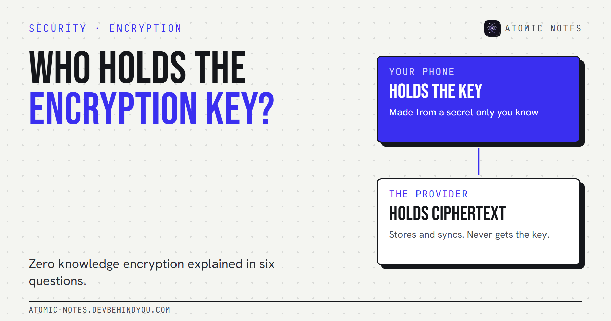
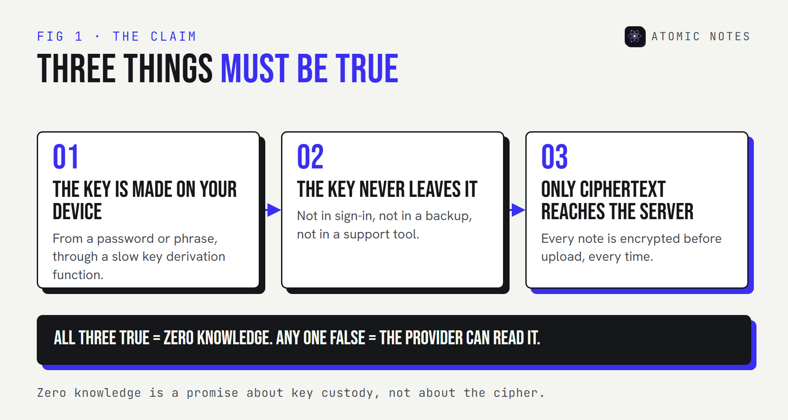
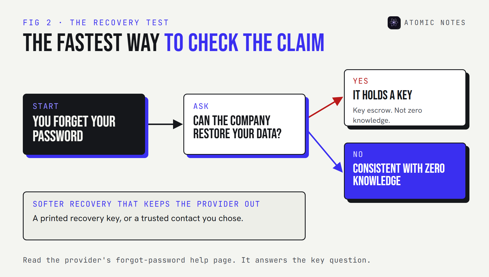

*By Ashutosh Sharma (DevBehindYou), the developer of Atomic Notes. Last updated: October 10, 2026.*

**Key Takeaway:** Zero knowledge encryption means the provider stores your data but never holds the key to read it. Your device makes the key from a secret only you know, and the server keeps ciphertext. The fastest test of the claim is recovery: if the company can restore your data after you forget your password, it holds a key, whatever the marketing says.

Every encryption claim I read eventually reduces to one question: who holds the key? AES-256 is the same cipher at a bank, a cloud drive, and a notes app. What changes is who can use it to open your data.

"Zero knowledge" is the label companies use when the answer is "only you". Here are the six questions I'd ask about any zero knowledge encryption claim, including my own.

## 1. What does zero knowledge encryption mean?

**It means the provider has zero knowledge of your content or your key.** The provider still stores and syncs your data, but only as ciphertext, and it never receives the secret that opens it.

Bitwarden, which uses the term heavily, puts it plainly: your master password "is never stored or accessed by the provider." That's the core of the zero knowledge encryption meaning. Key custody stays with you.

In practice, three things have to be true:

1. **The key is made on your device.** Usually from a password or phrase, through a key derivation function.
2. **The key never leaves your device.** Not in a sign-in request, not in a backup, not in a support tool.
3. **Only ciphertext reaches the server.** Content is encrypted before upload, every time.

## 2. Where does the term "zero knowledge" come from?

**From cryptography, where it means something narrower.** A zero-knowledge proof lets one party prove it knows a secret without revealing the secret. Researchers formalized the idea in the 1980s, and it now powers things like private identity checks and some blockchain systems.

Most products that say zero knowledge don't use zero-knowledge proofs. They use ordinary client-side encryption and borrow the name to describe the outcome: the provider learns nothing. That's a fair description of the goal, but it's marketing language, not a protocol. When you see it, read it as "we don't hold your keys" and then check whether that's true.

## 3. Zero knowledge vs end to end encryption: what's the difference?

**They overlap almost completely, and the difference is mostly about who's at the "ends".**

- **End-to-end encryption** comes from messaging. The ends are people: you and the person you're talking to. Only their devices hold the keys.
- **Zero knowledge** comes from storage. Often there's only one "end", which is you, across your own devices. The provider is the middle that never gets the key.

So zero knowledge vs end to end encryption is less a technical split than a framing one. A notes app or a password manager that encrypts on your device, with keys the provider never sees, fits both labels. The question that matters is the same for both: does any copy of the key exist on the provider's side?

## 4. How can a provider sign you in without knowing your key?

**By separating sign-in from encryption.** This is where good encryption key management shows.

A common design runs your password through a slow key derivation function on your device. The output becomes your encryption key, and a separate, one-way value goes to the server for sign-in. The server can check that value without being able to turn it back into the key.

Another design skips the password check entirely. The server stores a small "verifier", a known value sealed with your key. Your device downloads it and tries to open it. If it opens, your secret was right. The server never sees the key and never learns whether you typed it correctly.

Here's what each side holds in a zero knowledge setup:

- **Your secret (password or phrase):** on your device, in memory only. Never on the server.
- **The encryption key:** on your device. Never on the server.
- **Your content:** plaintext on your device, ciphertext only on the server.
- **A sign-in check or verifier:** created on your device, stored on the server, and impossible to reverse.

## 5. What happens if you forget your password?

**You lose the data. That's the price, and it's also the proof.**

Bitwarden's own help page says that if you forget your master password, it has "no way to access, retrieve, or reset" it. Apple says the same about the iCloud categories it end-to-end encrypts: it doesn't have the keys and can't help you recover that data.

Compare that with standard iCloud protection, where Apple keeps the keys in its data centers precisely so it can help with recovery. That's key escrow, and it's a reasonable choice for most people. It just isn't zero knowledge.

Some services soften the trade with a recovery key you print, or a trusted contact who can help. Those keep the provider out, because the backup secret lives with you or someone you chose.

## 6. How do you check a zero knowledge claim?

**Run four quick tests.** None of them needs a security background.

1. **The recovery test.** Read the "forgot password" help page. If the provider can restore your data, it holds a key.
2. **The feature test.** Server-side search, web previews, and AI summaries of your content all need plaintext on the server.
3. **The code test.** Public client code shows where the key is made and what gets uploaded. A published security audit adds a second set of eyes.
4. **The wording test.** "Encrypted" alone means nothing. Look for "end-to-end", "client-side", or an explicit statement that the provider never has your key.

These apply to zero knowledge encryption cloud storage, password managers, and notes apps alike.

## How Atomic Notes handles the key

**Atomic Notes by DevBehindYou** isn't zero knowledge by default, and I'd rather say that up front. In the default mode, notes travel over HTTPS to the sync server, which writes them into a file in your own Google Drive without keeping the text.

The optional vault is where the key custody changes. You get a six-word phrase, shown once. Your phone turns it into a 256-bit key with Argon2id and encrypts every vault note on the device with AES-256-GCM, so the upload is already ciphertext. The server stores only a verifier, and the key never leaves your phone. Lose the phrase, and the vault notes are gone. I can't recover them, which is the point.

The server still sees sync metadata, such as note IDs, timestamps, and rough sizes. Atomic Notes is a notes app, not a password manager, and the vault protects notes, not a credential store. For the full key flow, see my walkthrough of [encrypted notes and who can read them](https://atomic-notes.devbehindyou.com/blog/encrypted-notes-explained).

My take: zero knowledge encryption is a claim about key custody. Ask who holds the key, then ask what happens when you lose it.

## FAQ

### What is zero knowledge encryption in simple terms?

It's encryption where the provider stores your data but never has the key to read it. Your device creates the key from a secret only you know, encrypts your data before upload, and the provider only ever holds ciphertext.

### Is zero knowledge the same as end-to-end encryption?

Mostly. Both mean the provider never holds the key. End-to-end usually describes sharing between people, as in messaging. Zero knowledge usually describes storage, where you are the only person with access.

### Can a zero knowledge provider reset my password?

It can reset your sign-in, but it can't recover your encrypted data. If a provider can restore your content after you forget your password, it has a copy of your key somewhere.

### Do zero knowledge apps use zero-knowledge proofs?

Usually not. Most use client-side encryption and borrow the name to describe the result. Zero-knowledge proofs are a separate cryptographic technique for proving a secret without revealing it.

## Sources

- [What is zero-knowledge encryption? Bitwarden](https://bitwarden.com/resources/zero-knowledge-encryption/)
- [Forgot my master password. Bitwarden Help Center](https://bitwarden.com/help/forgot-master-password/)
- [iCloud data security overview. Apple Support](https://support.apple.com/en-us/102651)
- [Atomic Notes source code. GitHub](https://github.com/DevBehindYou/Atomic-Notes-App-V0.2)
