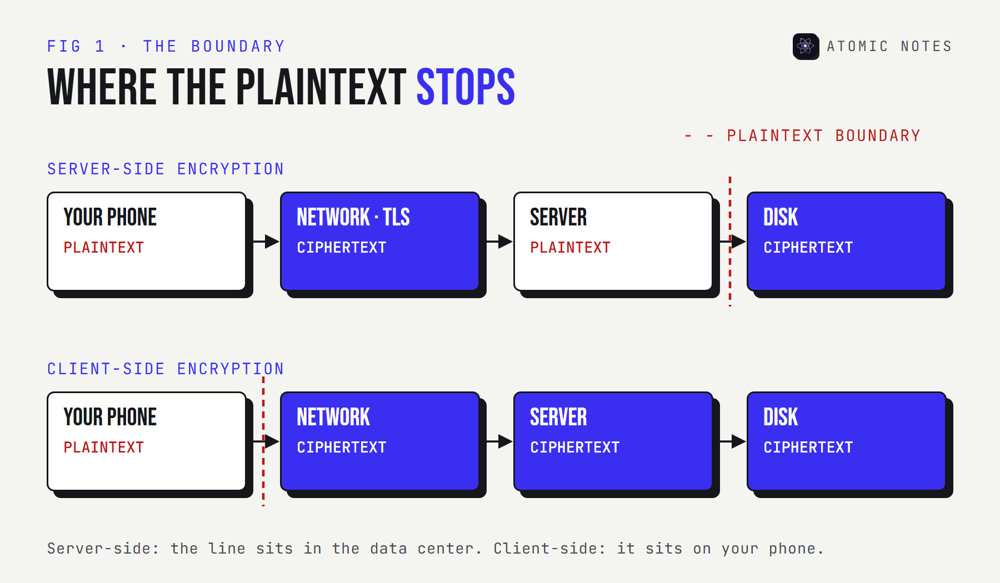
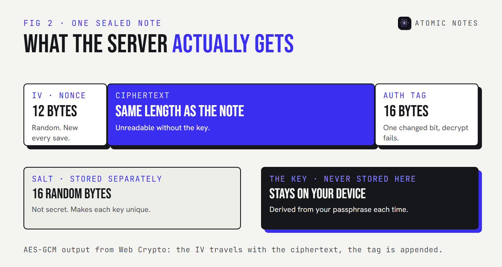

*By Ashutosh Sharma (DevBehindYou), the developer of Atomic Notes. Last updated: October 10, 2026.*

**Key Takeaway:** Client side encryption means your device encrypts data before upload, so the cloud only ever stores ciphertext. Server side encryption means the cloud encrypts data after it arrives, with keys it controls. The difference is where the plaintext boundary sits. The browser's Web Crypto API can do client-side encryption in about 40 lines, as shown below.

Every cloud service I've used encrypts my data. Very few of them encrypt it before it leaves my device. That one detail, which side of the network does the encrypting, decides whether the provider can read what I store.

This post explains client side encryption with a real example, compares it with server-side encryption on AWS and Google Workspace, and walks through what happens to a note in Atomic Notes before it reaches the cloud.

## What is client side encryption?

**It's encryption that happens on the client, your phone or browser, before data is sent anywhere.** AWS's S3 documentation describes it as encrypting your data locally, so that S3 receives objects that are already encrypted.

The server's job shrinks to storage and sync. It holds ciphertext, and it never receives the key. The client keeps both the key and the only readable copy.

## What is server side encryption?

**It's encryption the service applies after your data arrives.** Amazon S3, for example, has encrypted every new object upload by default since January 5, 2023, using keys Amazon manages. You don't have to do anything to get it.

Server-side encryption protects against stolen disks and leaked backups. It doesn't protect against the service itself, because the service decrypts your data whenever it reads it.

## Client side vs server side encryption: 5 differences

| | Server-side | Client-side |
|---|---|---|
| Where it encrypts | On the provider's servers | On your device |
| Who holds the key | The provider, or a cloud key service | You |
| What the provider can read | Everything | Ciphertext only |
| Server features (search, previews) | Work as normal | Need to run on your device |
| Lost key | The provider can recover | Nobody can recover |



The useful mental model is the plaintext boundary: the last point where your data is readable. Client side vs server side encryption is really a question of which side of the network that line falls on.

## Client-side encryption in real products

**Big platforms offer it as a separate, opt-in tier.** Two examples:

- **S3 client side encryption.** AWS provides the Amazon S3 Encryption Client, which encrypts each object in your application with its own data key before upload. S3 stores what it gets and never sees the plaintext.
- **Google Workspace CSE.** Google describes Workspace client-side encryption as encryption that Google's servers and third parties can't decrypt. It's limited to certain editions, including Enterprise Plus, Education Standard, Education Plus, and Frontline Plus, and the organization manages its own keys.

Both use envelope encryption under the hood. A random data key encrypts the content, and a separate key the customer controls wraps the data key. That makes key rotation cheap, because you only re-wrap small data keys, not the whole dataset.

## A client side encryption example with Web Crypto

**Here's a complete, runnable example.** It works in any modern browser, and in Node.js 20 or later if you save it as an `.mjs` file. The Web Crypto API only runs in secure contexts, so in a browser you need HTTPS or localhost.

```javascript
const enc = new TextEncoder();
const dec = new TextDecoder();

// 1. Turn a passphrase into an AES-GCM key, on the device.
async function deriveKey(passphrase, salt) {
  const material = await crypto.subtle.importKey(
    "raw", enc.encode(passphrase), "PBKDF2", false, ["deriveKey"]
  );
  return crypto.subtle.deriveKey(
    { name: "PBKDF2", salt, iterations: 600000, hash: "SHA-256" },
    material,
    { name: "AES-GCM", length: 256 },
    false,
    ["encrypt", "decrypt"]
  );
}

// 2. Seal a note. A fresh 12-byte IV every time, stored next to the ciphertext.
async function seal(note, key) {
  const iv = crypto.getRandomValues(new Uint8Array(12));
  const data = await crypto.subtle.encrypt({ name: "AES-GCM", iv }, key, enc.encode(note));
  const box = new Uint8Array(iv.length + data.byteLength);
  box.set(iv);
  box.set(new Uint8Array(data), iv.length);
  return btoa(String.fromCharCode(...box));
}

// 3. Open it again. A wrong key or a changed byte throws instead of returning garbage.
async function open(sealed, key) {
  const box = Uint8Array.from(atob(sealed), (c) => c.charCodeAt(0));
  const data = await crypto.subtle.decrypt(
    { name: "AES-GCM", iv: box.slice(0, 12) }, key, box.slice(12)
  );
  return dec.decode(data);
}

const salt = crypto.getRandomValues(new Uint8Array(16));
const key = await deriveKey("correct horse battery staple", salt);
const sealed = await seal("Dentist moved to Friday", key);
console.log(sealed); // this is all the server ever receives
console.log(await open(sealed, key));
```

Run it and you'll get a base64 string first, then the original note. Run it twice and the ciphertext changes, because the IV is random each time. Swap in a wrong passphrase and `decrypt` throws an `OperationError`.

### What each part does

- **Key derivation.** PBKDF2 stretches a human passphrase into a 256-bit key. The 600,000 iterations follow OWASP's current guidance for PBKDF2 with SHA-256. PBKDF2 is the password-based option Web Crypto has supported in every browser for years. Native apps often use Argon2id instead, which is harder to guess at scale on GPUs.
- **The salt.** A random value that stops two people with the same passphrase from getting the same key. Store it with the data. It isn't secret.
- **The nonce, or IV.** AES-GCM needs a unique 12-byte IV for every encryption under the same key. Reusing one breaks the security of GCM, so generate it fresh and ship it with the ciphertext.
- **The auth tag.** AES-GCM is authenticated encryption. Web Crypto appends a tag to the ciphertext, and decryption fails if a single bit changes.

This is a teaching example, not a product. A real app also needs to store the salt, handle key changes, and decide what happens when a user forgets the passphrase.



## 4 mistakes that quietly undo the encryption

**Most failures come from the code around the cipher, not the cipher itself.** These are the ones I check for first:

1. **Logging plaintext.** A debug log, crash report, or analytics event that captures the note before encryption sends it to a server anyway.
2. **Reusing the IV.** A counter that resets, or a fixed IV copied from a tutorial, breaks GCM. Always generate a random one per encryption.
3. **Uploading the key.** Syncing the derived key "for convenience" turns the design back into server-side encryption with extra steps.
4. **Leaving titles out.** Encrypting the body but not the title or tags leaks the part people read first.

## What happens to a note in Atomic Notes

**Atomic Notes by DevBehindYou** uses the same pattern in its optional vault, written in Dart instead of JavaScript.

1. You turn the vault on and get a six-word phrase. It's shown once and never sent anywhere.
2. Your phone derives a 256-bit key with Argon2id, using 64 MiB of memory and 3 passes.
3. On every save, the phone encrypts the title, body, and checklist items with AES-256-GCM and a fresh 12-byte nonce.
4. Only the sealed result goes over HTTPS to the sync server, which writes it into a file in your Google Drive.
5. The server keeps a verifier, so a new device can check your phrase without the server ever holding the key.

The vault is off by default, and notes outside it rely on HTTPS in transit plus Google's own encryption at rest. Sync metadata, such as note IDs and timestamps, stays readable either way. I covered the full key flow and the default mode in [how encrypted notes work](https://atomic-notes.devbehindyou.com/blog/encrypted-notes-explained).

My take: if you can find where the plaintext boundary sits, you can judge any encryption claim. Client-side encryption is simply the decision to put that line on your own device.

## FAQ

### What is client side encryption in simple terms?

It's encryption your device does before sending data to a server. The server stores only ciphertext and never gets the key, so it can't read what you uploaded.

### Is client side encryption better than server side encryption?

It's stronger against the provider, and weaker on convenience. Client-side encryption keeps the provider from reading your data, but you lose server-side search and the provider can't recover your data if you lose the key.

### Is HTTPS client side encryption?

No. HTTPS encrypts the connection, and the server decrypts your data when it arrives. Client-side encryption encrypts the data itself, so it stays ciphertext on the server.

### Can I do client side encryption in the browser?

Yes. The Web Crypto API supports PBKDF2 key derivation and AES-GCM encryption in all modern browsers, as long as the page runs in a secure context such as HTTPS.

## Sources

- [Protecting data by using client-side encryption. Amazon S3 User Guide](https://docs.aws.amazon.com/AmazonS3/latest/userguide/UsingClientSideEncryption.html)
- [Protecting data with server-side encryption. Amazon S3 User Guide](https://docs.aws.amazon.com/AmazonS3/latest/userguide/serv-side-encryption.html)
- [About client-side encryption. Google Workspace Admin Help](https://support.google.com/a/answer/10741897)
- [SubtleCrypto: deriveKey() method. MDN Web Docs](https://developer.mozilla.org/en-US/docs/Web/API/SubtleCrypto/deriveKey)
- [AesGcmParams. MDN Web Docs](https://developer.mozilla.org/en-US/docs/Web/API/AesGcmParams)
- [Password Storage Cheat Sheet. OWASP](https://cheatsheetseries.owasp.org/cheatsheets/Password_Storage_Cheat_Sheet.html)
- [Atomic Notes source code. GitHub](https://github.com/DevBehindYou/Atomic-Notes-App-V0.2)
