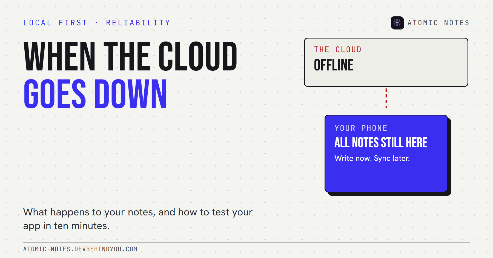
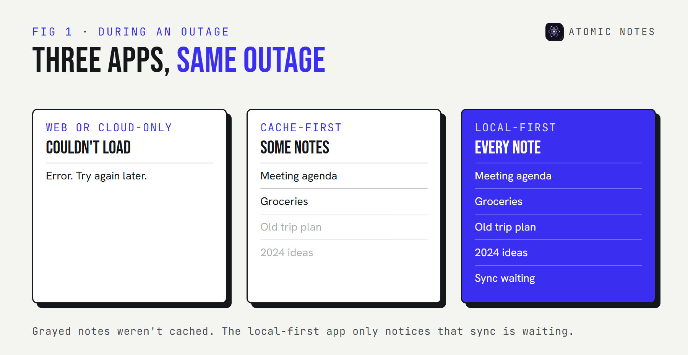
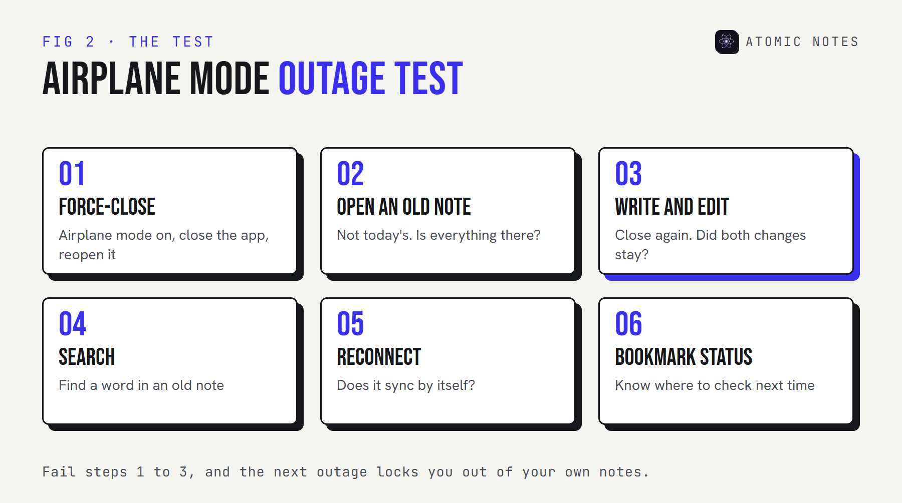

*By Ashutosh Sharma (DevBehindYou), the developer of Atomic Notes. Last updated: October 10, 2026.*

**Key Takeaway:** During a cloud outage, what happens to your notes depends on where the app keeps its main copy. Web-only apps go blank. Apps with an offline cache let you read some notes, and maybe write. Local-first apps keep working and sync later. You can find out which kind you use in two minutes with airplane mode.

Most people find out how their notes app handles a cloud outage at the worst possible moment: right before a meeting, with the agenda stuck behind a spinner.

The outage usually isn't the notes company's fault. Modern apps sit on top of a few big cloud providers, and when one of those has a bad day, a long list of apps fails together. What you can do about it is choose, and test, how your own notes behave when the network side breaks.

## What actually happens during a cloud outage?

**The app loses the server it depends on, and its behavior depends on how much it keeps on your device.** There are three broad patterns:

1. **Web or cloud-only apps.** The notes live on the server. If the server or something it depends on fails, you see an error page or an endless loading state. Nothing opens.
2. **Cache-first apps.** The app keeps a copy of some notes on the device. You can read what was cached, and sometimes edit. Anything not cached stays out of reach, and some apps switch to a read-only mode.
3. **Local-first apps.** The device holds the main copy of every note. Reading, writing, and search all work. Changes wait in a queue and sync when the service returns.

## Two real outages from 2025

**Both were caused by small faults deep inside huge providers.** I'm not claiming which notes apps were affected. These incident reports show how a single point of failure spreads.

- **The AWS outage of October 2025.** According to Amazon's own summary, the event in the Northern Virginia (us-east-1) Region started at 11:48 PM PDT on October 19 and ended at 2:20 PM PDT on October 20. The root cause was a race condition in DynamoDB's DNS management that left an empty DNS record for a regional endpoint. Services built on DynamoDB couldn't find it.
- **The Google Cloud outage of June 2025.** Google's incident report describes about three hours of failing API requests on June 12, across many Google Cloud and Workspace products. A new policy check crashed on a null pointer because the change had no error handling and no feature flag. One region, us-central1, took longest to recover.

Neither failure had anything to do with notes. That's the point. Your notes app can be well built and still go down because something three layers below it did.

## Which apps keep working when the servers fail?

**The ones that keep a complete local copy.** Here's how the three patterns compare when the server disappears:

- **Web or cloud-only:** no notes open, no writing, and no search. Edits are blocked or lost. After the outage, you reload and hope.
- **Cache-first:** cached notes open, writing sometimes works, and search works partly. Edits may queue, and sync resumes afterward.
- **Local-first:** every note opens, writing works, and search runs on the device. Edits are queued and kept, and sync resumes afterward.

### Notion outage: what offline mode covers

**Notion added offline mode in August 2025.** You can download pages for offline use in the desktop and mobile apps, and even create new pages. Recents and Favorites download automatically on the Plus, Business, and Enterprise plans. On the Free plan, you choose pages yourself. So during a Notion outage, what you can open depends on what you downloaded beforehand. The web version needs the network, and Notion's status page is the place to check what's broken.

### Evernote outage: offline notebooks

**On Evernote's mobile apps, offline notebooks are a paid feature.** On a free plan, a phone without a connection to Evernote's servers may only show what happens to be cached. If you rely on Evernote on the go, check your plan before the next Evernote outage, not during it.

### Google Keep down? Check the phone app first

**If you're searching "google keep down", try the Android app before the browser tab.** Phone apps usually keep a local cache that a web page doesn't. If the app opens your notes, write in it and let it sync later. Don't sign out or clear app data while the service is down, because that can wipe changes that haven't synced.

## How to test your notes app for outages in 10 minutes

**Airplane mode is the cheapest outage simulator you own.** Run this once on the app you rely on:

1. **Turn on airplane mode and force-close the app.** Then reopen it. Does it open at all?
2. **Open an old note.** Not one from today. Old notes show whether the app keeps everything or only a recent cache.
3. **Write a new note and edit an old one.** Close the app again and reopen it. Are both changes still there?
4. **Search for a word in an old note.** Search that needs a server will fail here.
5. **Turn airplane mode off.** Watch whether your changes sync without you doing anything.
6. **Bookmark the status page.** Most big notes services have one. During a real outage, it tells you whether the problem is yours or theirs.

If the app fails steps 1 to 3, the next outage will lock you out of your own notes. That's a reason to keep a local copy of anything you can't afford to lose for an afternoon.

## What Atomic Notes does when the cloud goes down

**Atomic Notes by DevBehindYou** is a local-first Android app, so an outage shows up as delayed sync, not as a blank screen.

- Every note is saved on the phone first. Writing, editing, checklists, search, pinning, and the biometric app lock all work without a network.
- Changes are marked to sync and stay marked across restarts. When the network or the server comes back, sync runs again by itself.
- If two devices edited the same note during the outage, the older edit is kept as a separate "(conflict copy)" rather than discarded.
- After sync, each note lives in your own Google Drive as its own `.atomic` file, inside the `My-Atomic-Notes` folder.

What doesn't work during an outage: the first sign-in, sync itself, and anything else that needs the server. There's also no export button yet, so the Drive files are your off-phone copy. I explained the full offline behavior, including retry timing, in [why your notes should work offline](https://atomic-notes.devbehindyou.com/blog/why-notes-should-work-offline).

My take: you can't prevent the next cloud outage. You can choose an app where an outage only delays sync.

## FAQ

### Will my notes open if the provider's servers fail?

That comes down to where the app stores them. Web-only apps can't open notes at all. Apps with an offline cache show what they cached. Local-first apps keep every note on the device and sync after the outage ends.

### Can I lose notes in a cloud outage?

Usually you lose access, not data. The bigger risk is edits made during the outage in an app that only holds them in memory, or signing out and clearing app data before those edits sync.

### How do I check if a notes service is down?

Check the company's official status page first. If the status page shows no incident, the problem is more likely your connection, your account, or your device.

### Which notes apps work during an outage?

Local-first apps work fully, because the main copy lives on your device. Apps with offline modes, such as Notion with downloaded pages, work for whatever you saved for offline use in advance.

## Sources

- [Summary of the Amazon DynamoDB service disruption in the Northern Virginia (US-EAST-1) Region. AWS](https://aws.amazon.com/message/101925/)
- [Google Cloud incident report, June 12, 2025. Google Cloud Service Health](https://status.cloud.google.com/incidents/ow5i3PPK96RduMcb1SsW)
- [Notion 2.53: Offline mode. Notion releases](https://www.notion.com/releases/2025-08-19)
- [Notion status page](https://www.notion-status.com/)
- [Offline notebooks. Evernote Help and Learning](https://help.evernote.com/hc/en-us/articles/209005177)
- [Atomic Notes source code. GitHub](https://github.com/DevBehindYou/Atomic-Notes-App-V0.2)
